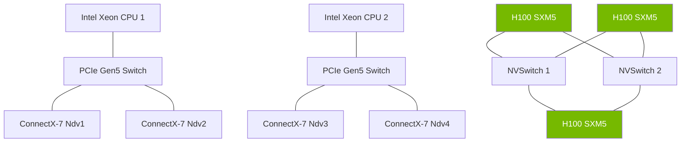

# Masterclass 1: NVIDIA DGX Systems Architecture and Superchips

## The Genesis of DGX

NVIDIA DGX systems represent a radical departure from traditional "white-box" OEM server designs. The primary motivation behind DGX is minimizing **GPU starvation**. In deep learning, computational capability typically outpaces data delivery. 

### Why DGX Exists
- **Symmetric Architecture**: Guaranteeing uniform latency between any two GPUs.
- **Data Path Optimization**: Eliminating PCIe bottlenecks via NVLink and NVSwitch.
- **Hardware-Software Co-design**: Firmware, drivers, and the OS (DGX OS) are tightly coupled with the Baseboard Management Controller (BMC) and hardware topology.

## DGX H100 Deep Dive

The DGX H100 system is designed around the Hopper architecture, optimizing for Large Language Models (LLMs) and mixture-of-experts (MoE) workloads.

### Specifications
* **GPUs:** 8x NVIDIA H100 Tensor Core GPUs (SXM5)
* **GPU Memory:** 640GB total (80GB HBM3 per GPU)
* **NVSwitch:** 4x 3rd Gen NVSwitches delivering 900 GB/s bidirectional bandwidth per GPU.
* **CPUs:** Dual 56-Core Intel Xeon Platinum 8480C (Sapphire Rapids)
* **System Memory:** 2TB DDR5
* **Networking:** 4x OSFP ports serving 8x single-port NVIDIA ConnectX-7 (400 Gb/s each)

### Mermaid Diagram: DGX H100 Internal Topology

## GH200 and GB200 Superchips

Moving beyond the traditional CPU-PCIe-GPU paradigm, NVIDIA introduced the Grace Hopper (GH200) and Grace Blackwell (GB200) architectures. 

### NVLink-C2C
The core innovation is NVLink-C2C (Chip-to-Chip), providing 900 GB/s of bidirectional bandwidth between the ARM-based Grace CPU and the Hopper/Blackwell GPU. This eliminates the PCIe Gen5 bottleneck (128 GB/s) and enables coherent memory access between CPU and GPU, presenting a single unified memory space to the application.

## Production Bottlenecks
- **Thermal Throttling**: SXM5 H100 modules draw up to 700W each. Inadequate chilled water supply (for liquid-cooled racks) or insufficient CFM (for air-cooled) will cause the SMC to throttle GPU clocks, destroying cluster performance determinism.
- **PCIe Switch Contention**: In multi-tenant environments, unpinned memory transfers going across the PCIe switch can starve ConnectX-7 adapters leading to RDMA timeouts.

## Senior Interview Scenarios
**Scenario 1:** A training job using `NCCL_ALGO=Tree` across 4 DGX H100 nodes is running at 30% expected performance. `nvidia-smi topo -m` shows NVLink is active inside the node. Where do you look next?
*Expected Answer:* The bottleneck is likely inter-node. I would check the ConnectX-7 interfaces via `ibv_devinfo`, look for FLR (Function Level Resets) in `dmesg`, check the OSFP optics DOM (Digital Optical Monitoring) for dBm light levels, and use `nccl-tests` (all_reduce_perf) while monitoring IB switch port counters for drops or PAUSE frames.

