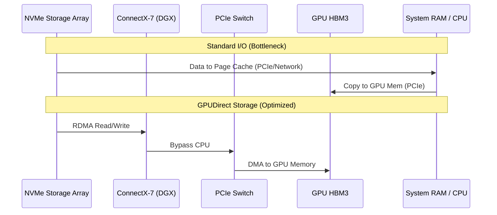

# Masterclass 2: DGX Infrastructure - Power, Cooling, Storage, and Fabric

Deploying a single DGX is IT; deploying a DGX SuperPOD is datacenter engineering.

## Power and Cooling Realities

A single DGX H100 requires roughly 10.2kW of power. A standard 42U rack can hold at most three DGX H100s in an air-cooled configuration before exceeding the structural limits of traditional raised-floor datacenter cooling (approx. 30kW-35kW per rack).

### Advanced Cooling (DLC)
Direct Liquid Cooling (DLC) is mandatory for dense racks (e.g., GB200 NVL72). 
- **CDU (Coolant Distribution Unit)**: Regulates flow and temperature from the facility water to the IT loop.
- **Blind Mate Manifolds**: Leak-free connectors at the rear of the rack to distribute coolant directly to cold plates on the GPUs and CPUs.

## Storage Architecture and Data Paths

GPU starvation often starts at the storage tier. If you cannot stream data at 200+ GB/s into the GPUs, your multi-million dollar compute fabric is idling.

### GPUDirect Storage (GDS)
GDS bypasses the CPU bounce buffer. Data flows directly from the NVMe storage subsystem over the network, into the ConnectX-7 NIC, through the PCIe switch, and into GPU HBM memory via DMA.

### Diagram: GPUDirect Storage Flow

## Fabric Integration

DGX relies on two separate network fabrics:
1. **Compute Fabric (Backend)**: InfiniBand or RoCEv2 (Ethernet) dedicated entirely to GPU-to-GPU communications (e.g., MPI/NCCL traffic).
2. **Storage/Management Fabric (Frontend)**: Standard Ethernet for NFS, user SSH, Kubernetes control plane, and out-of-band management.

### Rail-Optimized Designs
A strict one-to-one mapping between a GPU and a specific ConnectX-7 adapter. GPU 0 only talks to CX7 0. This ensures NCCL traffic stays strictly within the shortest physical path, minimizing hops across the PCIe topology.

## Production Bottlenecks
- **Microbursts in Storage**: Many deep learning checkpoints occur simultaneously across thousands of ranks, causing TCP incast/microbursts on the storage fabric, leading to massive packet drops and job timeouts.
- **Thermal Runaway in Air-Cooled Racks**: Blanking panels missing in a 35kW rack can cause hot air recirculation. The DGX will heavily throttle GPUs to prevent hardware failure.

## Senior Interview Scenarios
**Scenario 2:** You are architecting the storage for a 32-node DGX H100 cluster. The data scientists have 500TB of tiny 10KB images. How do you design the storage tier?
*Expected Answer:* Standard POSIX file systems and NFS will fail horribly due to metadata overhead on small files. I would propose converting the datasets to WebDataset (tar files) or TFRecord formats for sequential reads, maximizing large block I/O throughput. We must deploy a parallel file system (Lustre, Weka, Spectrum Scale) or high-performance object store, and ensure GDS is enabled.
