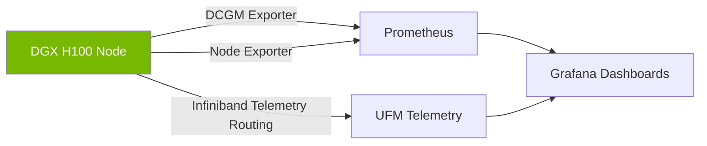

# Masterclass 3: DGX Management Plane and Operations

Operating AI infrastructure at scale requires treating the hardware as a highly instrumented, distributed system. 

## The DGX OS and Software Stack

DGX systems ship with DGX OS, an optimized Ubuntu-based Linux distribution containing the complete NVIDIA stack:
- MOFED (Mellanox OFED)
- NVIDIA Display Drivers and CUDA Toolkit
- DCGM (Data Center GPU Manager)
- NVIDIA Container Toolkit

### Baseboard Management Controller (BMC)
The BMC provides Out-of-Band (OOB) management. It runs OpenBMC in modern DGX systems, offering a Redfish API for declarative hardware provisioning, telemetry, and power control.

## Observability with DCGM

DCGM is the source of truth for GPU telemetry. It exposes hundreds of metrics, running continuously with low overhead.
- **XID Errors**: Crucial hardware/driver error codes. (e.g., XID 79: Fallen off the bus, XID 43: Page fault).
- **NVLink Errors**: CRC errors on NVLink lanes can silently degrade throughput.

### Diagram: Observability Architecture

## Workload Scheduling and Multi-Tenancy

You cannot manage a DGX cluster manually. 
- **Slurm**: The standard HPC scheduler, excellent for MPI/NCCL topology-aware scheduling.
- **Kubernetes (K8s)**: Using the NVIDIA GPU Operator to expose GPUs as allocatable resources (`nvidia.com/gpu`).
- **MIG (Multi-Instance GPU)**: Hardware-level partitioning of a single GPU (e.g., partitioning an H100 into up to 7 distinct instances) for inference or lightweight development, isolating memory and compute.

## Production Bottlenecks
- **Driver/CUDA Mismatches**: A user's container requires CUDA 12.4, but the host driver only supports up to CUDA 11.8 (Forward compatibility not configured). The job crashes immediately.
- **Zombie Processes**: A failed NCCL job leaves zombie Python processes holding onto GPU memory. Subsequent jobs fail with OOM errors. Automated DCGM-based health checks (prolog/epilog scripts) must kill these or drain the node.

## Senior Interview Scenarios
**Scenario 3:** A Slurm job fails instantly with an "XID 44" error in `dmesg`. Explain what this is and your operational response.
*Expected Answer:* XID 44 indicates an uncorrectable ECC (Error-Correcting Code) memory error in the GPU's HBM. The hardware has detected data corruption that it cannot recover from. My response:
1. Drain/Cordon the node in Slurm/Kubernetes to prevent new jobs.
2. Run `dcgmi diag` (Level 3 or 4) to force hardware validation.
3. Check if the page can be retired (Row Remapping). If errors persist, generate a field diagnostic report (nvidia-bug-report.sh) and trigger an RMA for the SXM board.
