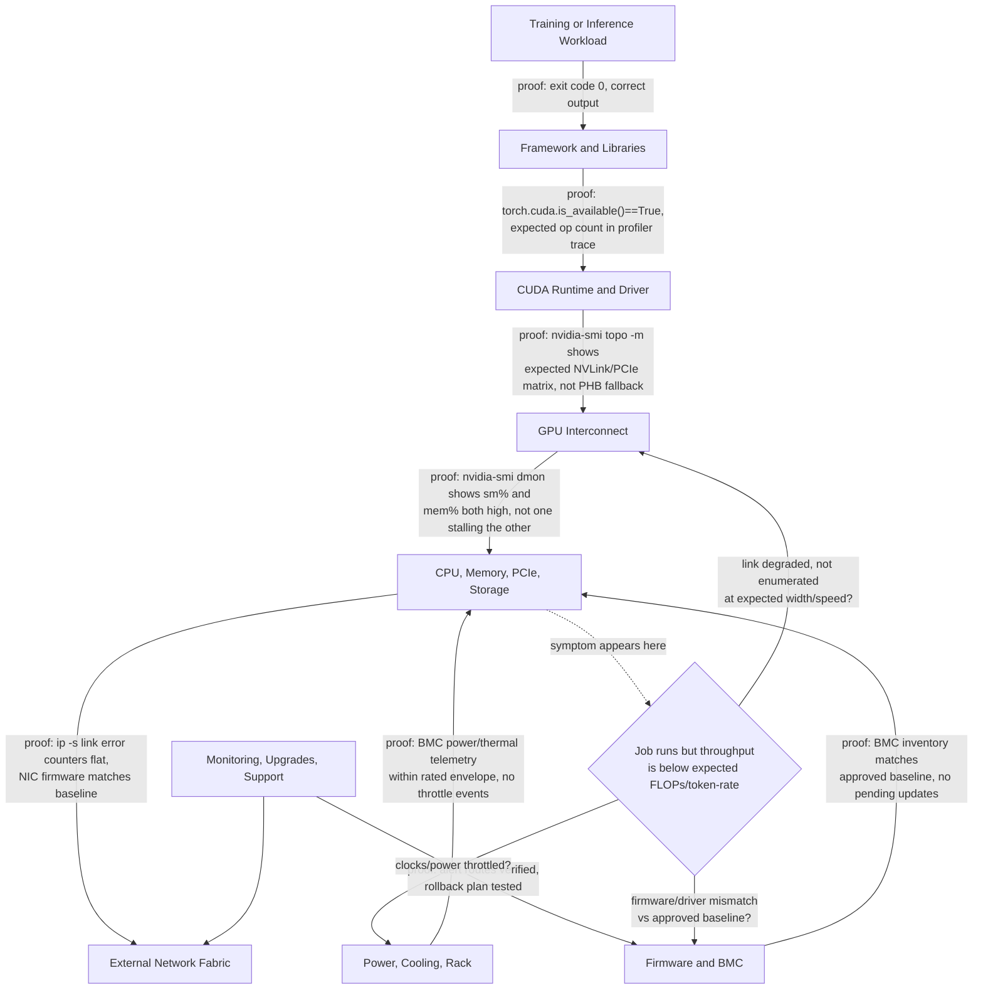

# Why DGX Exists

A research team proves that a model can train on a handful of accelerator cards. The enterprise then asks infrastructure engineering to reproduce the result across multiple nodes with predictable performance, supportable upgrades, secure firmware, validated networking, and a clear escalation path. The original proof of concept answered whether the model could run. It did not answer whether the environment could become a production service.

DGX exists to reduce that systems-integration gap. It packages a high-density GPU complex, scale-up fabric, host compute, networking, storage, firmware, system software, telemetry, validation, and support into a defined platform boundary.

## Learning Objectives

After completing this chapter, you will be able to:

- explain the integration problem DGX addresses;
- distinguish a GPU server from an engineered AI system;
- identify which risks DGX reduces and which remain with the customer;
- compare integrated and build-your-own approaches;
- frame DGX value without using marketing claims.

## The Problem Before DGX

Installing accelerator cards into a server can produce a functional node. Production AI, however, depends on interactions across many layers.



**Figure 5.1.1 — AI performance and reliability span the whole system.** Each edge names the evidence that proves that hop is healthy — a job that merely "runs" only proves the top edge, not the chain beneath it. The branch at the bottom is the actual diagnostic habit this chapter argues for: when throughput is low despite a running job, the next question is never "which GPU is broken," it is "which of these three layers is unproven."

Before integrated platforms, customers or system builders had to make and validate many independent choices: GPU placement, PCIe topology, peer-to-peer paths, network adapter locality, firmware combinations, cooling behavior, driver versions, storage layout, and failure procedures. Each choice could be locally reasonable yet collectively poor.

➕ **Why this matters in numbers, not just narrative:** an 8-GPU H100 node retailing in the ballpark of $250,000–$300,000 (illustrative figure — actual pricing varies by configuration and contract) that runs distributed training at 60% of expected scaling efficiency because of one uninvestigated PCIe topology mismatch is not a $0 problem sitting quietly — it is roughly 40% of that capital sitting idle every hour the job runs, for the entire life of the cluster, until someone runs `nvidia-smi topo -m` and compares it against the validated design. Multiply by eight nodes and the annualized waste (at an illustrative $28.00/hr cloud-equivalent GPU rate, 8 GPUs, 24/7) is on the order of tens of thousands of dollars per node, per year — which is why "did anyone validate topology before workloads started" is a legitimate first question in a production incident, not pedantry.

## What DGX Integrates

### A validated GPU complex

The GPUs are not treated as independent cards. Their topology, scale-up communication, power delivery, thermals, and software behavior are designed as one subsystem.

### A host platform

The CPU, system memory, PCIe tree, local storage, and network interfaces are selected and arranged to support the accelerator complex. Host resources still matter because data preparation, orchestration, checkpointing, and communication frequently pass through or depend on them.

### A software baseline

A production node needs a known combination of firmware, operating system, drivers, CUDA components, management tools, and diagnostics. Integration narrows the compatibility space and provides a repeatable starting point.

### Lifecycle and support boundaries

When a multi-vendor custom system fails, responsibility can become ambiguous. DGX creates a stronger platform-level support boundary for the integrated system. This does not eliminate external dependencies such as switches, storage, schedulers, or facility infrastructure, but it reduces uncertainty inside the node.

## What DGX Does Not Solve Automatically

DGX is not a complete AI platform by itself.

| Responsibility | DGX contribution | Customer responsibility remains |
|---|---|---|
| GPU compute | Integrated accelerator subsystem | Capacity planning and workload placement |
| Scale-up fabric | Validated internal topology | Application parallelism and communication efficiency |
| External networking | High-speed interfaces | Fabric design, cabling, congestion control, operations |
| Storage | Local storage and interfaces | Dataset, checkpoint, and shared-storage architecture |
| Software | Validated system baseline | Platform integration, images, frameworks, lifecycle policy |
| Monitoring | Hardware and GPU telemetry | Alerting, retention, dashboards, incident response |
| Support | Integrated system escalation | Clear evidence, runbooks, maintenance windows |

The recurring customer mistake is to equate hardware delivery with platform readiness. The systems may be installed while identity, scheduling, storage, observability, tenant isolation, and upgrade procedures remain undefined.

## Integrated System Versus Custom Build

| Dimension | Integrated DGX approach | Custom server approach |
|---|---|---|
| Design freedom | Lower | Higher |
| Validation burden | Lower inside the node | Higher across components |
| Time to a known baseline | Usually shorter | Depends on engineering maturity |
| Vendor standardization | Stronger | Can match existing enterprise standards |
| Lifecycle ownership | More consolidated | Shared across OEMs and component vendors |
| Cost structure | Includes integration and support value | May optimize acquisition cost |
| Operational fit | Requires adoption of platform conventions | Can align closely to existing fleet tooling |

Neither model is universally correct. DGX becomes attractive when the cost of integration risk, engineering delay, performance uncertainty, and fragmented support is high. A custom system can be appropriate when the organization has strong qualification capability, specific integration requirements, and a mature lifecycle process.

## Production Story

A pharmaceutical company purchases eight systems for model training. The first architecture proposal focuses only on rack positions and network ports. During review, the team discovers that the facility power budget was based on average draw rather than peak operating conditions, the storage system cannot sustain checkpoint bursts, and the management network cannot reach the BMC interfaces from the operations domain.

The lesson is not that the hardware choice was wrong. The lesson is that DGX must be deployed as part of a complete production system. Facility, network, storage, security, and operations teams must participate before delivery.

## Troubleshooting the “Installed but Not Ready” State

**Symptoms**

- systems pass basic power-on checks but workloads cannot scale;
- no agreed firmware or driver baseline exists;
- teams cannot distinguish node, fabric, or storage bottlenecks;
- support cases lack inventory and diagnostic evidence;
- upgrades are delayed because rollback criteria are undefined.

**Diagnosis**

1. Inventory hardware, firmware, driver, and operating-system versions.
2. Validate internal topology and external adapter placement.
3. Measure compute, collective, network, and storage paths separately.
4. Review monitoring coverage and alert ownership.
5. Confirm maintenance, escalation, and rollback procedures.

➕ **Step 1 and Step 2, with real evidence — not every "installed but not ready" node fails loudly:**

```text
$ nvidia-smi --query-gpu=index,name,driver_version,pci.bus_id --format=csv
index, name, driver_version, pci.bus_id
0, NVIDIA H100 80GB HBM3, 550.90.07, 00000000:1B:00.0
1, NVIDIA H100 80GB HBM3, 550.90.07, 00000000:1C:00.0
2, NVIDIA H100 80GB HBM3, 550.54.15, 00000000:3D:00.0   ← driver drift
3, NVIDIA H100 80GB HBM3, 550.90.07, 00000000:3E:00.0
```
Seven of eight GPUs on `550.90.07`, one on `550.54.15` — a driver that installed successfully and passes `nvidia-smi -L` on every GPU individually, yet is not the same *binary version* the other seven are running. This is invisible to "GPU count is correct, no errors" checks and only shows up when you diff the fleet, which is exactly why Step 1 is inventory *before* anything else — a single-node health check cannot catch fleet drift by definition.

```text
$ nvidia-smi topo -m
       GPU0  GPU1  GPU2  GPU3  NIC0  NIC1  CPU Affinity
GPU0    X    NV18  NV18  NV18  PXB   SYS   0-31
GPU1   NV18   X    NV18  NV18  PXB   SYS   0-31
GPU2   NV18  NV18   X    PHB   SYS   PXB   32-63   ← expected NV18, degraded to PHB
GPU3   NV18  NV18  PHB    X    SYS   PXB   32-63
```
`NV18` means an NVLink path is negotiated at its expected width; `PHB` (PCIe Host Bridge) between GPU2 and GPU3 means that link fell back to routing through the CPU's PCIe root complex instead of NVSwitch — a real fabric degradation, not a display quirk. Every other pair still shows `NV18`, so this is localized, not systemic — consistent with one bad NVSwitch port or a reseated card that didn't re-train to full width, and it directly explains why a collective spanning GPU2/GPU3 would be slower than one spanning GPU0/GPU1 even though `nvidia-smi -L` reports all four GPUs as healthy.

**Root cause**

The deployment treated DGX as delivered equipment rather than an operational platform component.

**Resolution**

Create an acceptance gate covering facility readiness, inventory, baseline versions, diagnostics, network and storage benchmarks, telemetry, security, and support procedures.

## Customer Perspective

A principal architect should explain DGX value in engineering terms:

- reduced node-level integration uncertainty;
- known topology and validated component relationships;
- faster establishment of a supportable baseline;
- consolidated diagnostics and lifecycle guidance;
- repeatability across systems and sites.

The explanation should also state the boundaries honestly. DGX does not design the customer’s network, size shared storage, operate Kubernetes or Slurm, or guarantee application scaling.

## Interview Preparation

### Architecture question

**Why would an enterprise buy DGX instead of assembling equivalent components?**

"I'd frame it as buying down integration risk, not buying performance — the raw FLOPs on the spec sheet are roughly the same whether you assemble it yourself or buy it integrated. What you're actually paying for is that NVIDIA has already validated the GPU-to-GPU topology, the firmware-driver-CUDA compatibility matrix, and the thermal design as one tested unit, and stands behind that combination as a single support boundary. If I build it myself, I own qualifying every one of those combinations — and if something misbehaves at 2am, I'm the one deciding whether it's the GPU, the NIC firmware, or a driver mismatch, with no vendor to hand a single ticket to. So the real trade is: DGX trades design freedom and acquisition-cost optimization for a shorter, more predictable path to a supportable baseline. That's worth it when integration risk and time-to-production matter more than shaving acquisition cost — and worth less if the organization already has mature hardware qualification capability and wants to match an existing fleet standard."

### Scenario question

**Eight DGX systems arrive next month. What work must happen before delivery?**

"Nothing about the compute itself should be the long pole — the long pole is always facility and network readiness. Concretely, I'd walk it as: confirm the rack has the power and cooling headroom for eight nodes at sustained draw, not just idle draw; get management and data networks — including a genuinely out-of-band BMC network — cabled and IP-planned before the hardware shows up; agree on a firmware and driver baseline with the vendor so we're not qualifying versions live in production; write an acceptance test plan that includes a sustained-load run, not just a power-on check, because thermal and power problems only show up under load; and get monitoring, security review, and support registration done so day one isn't the first time anyone's looked at the telemetry. If any of those are still open the week the hardware lands, I'd rather delay racking than install into an environment that isn't provably ready — an installed-but-unready node just moves the risk downstream into someone's first production job."

## Key Takeaways

- DGX exists to reduce the systems-integration burden around high-density GPU computing.
- It is an engineered system, not simply a server with multiple GPUs.
- Integration narrows compatibility and support uncertainty inside the node.
- Network, storage, scheduling, security, and operations still require customer architecture.
- Production readiness must be proven through an explicit acceptance process.

## Cross References

- [Volume 05 Introduction](./index)
- [Volume 04 — NVIDIA Hardware Portfolio](../volume-04/index)
- [Volume 02 — GPU Topology](../volume-02/chapter-10-gpu-topology-peer-access-and-data-paths)
