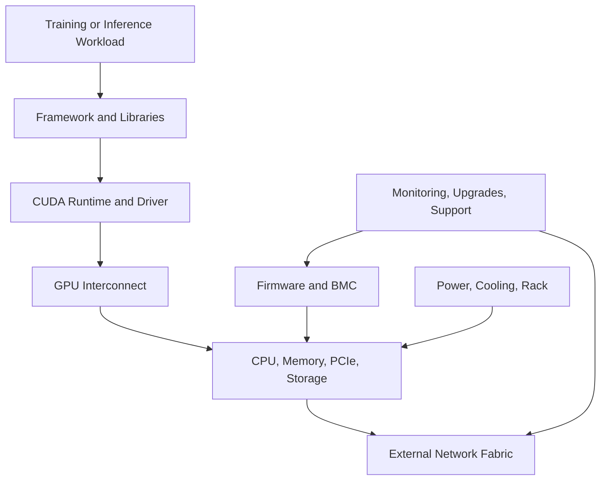

# Why DGX Exists

A research team proves that a model can train on a handful of accelerator cards. The enterprise then asks infrastructure engineering to reproduce the result across multiple nodes with predictable performance, supportable upgrades, secure firmware, validated networking, and a clear escalation path. The original proof of concept answered whether the model could run. It did not answer whether the environment could become a production service.

DGX exists to reduce that systems-integration gap. It packages a high-density GPU complex, scale-up fabric, host compute, networking, storage, firmware, system software, telemetry, validation, and support into a defined platform boundary.

## Learning Objectives

After completing this chapter, you will be able to:

- explain the integration problem DGX addresses;
- distinguish a GPU server from an engineered AI system;
- identify which risks DGX reduces and which remain with the customer;
- compare integrated and build-your-own approaches;
- frame DGX value without using marketing claims.

## The Problem Before DGX

Installing accelerator cards into a server can produce a functional node. Production AI, however, depends on interactions across many layers.

**Figure 5.1.1 — AI performance and reliability span the whole system.** A weak link anywhere in the chain can reduce the value of the GPUs.

Before integrated platforms, customers or system builders had to make and validate many independent choices: GPU placement, PCIe topology, peer-to-peer paths, network adapter locality, firmware combinations, cooling behavior, driver versions, storage layout, and failure procedures. Each choice could be locally reasonable yet collectively poor.

## What DGX Integrates

### A validated GPU complex

The GPUs are not treated as independent cards. Their topology, scale-up communication, power delivery, thermals, and software behavior are designed as one subsystem.

### A host platform

The CPU, system memory, PCIe tree, local storage, and network interfaces are selected and arranged to support the accelerator complex. Host resources still matter because data preparation, orchestration, checkpointing, and communication frequently pass through or depend on them.

### A software baseline

A production node needs a known combination of firmware, operating system, drivers, CUDA components, management tools, and diagnostics. Integration narrows the compatibility space and provides a repeatable starting point.

### Lifecycle and support boundaries

When a multi-vendor custom system fails, responsibility can become ambiguous. DGX creates a stronger platform-level support boundary for the integrated system. This does not eliminate external dependencies such as switches, storage, schedulers, or facility infrastructure, but it reduces uncertainty inside the node.

## What DGX Does Not Solve Automatically

DGX is not a complete AI platform by itself.

| Responsibility | DGX contribution | Customer responsibility remains |
|---|---|---|
| GPU compute | Integrated accelerator subsystem | Capacity planning and workload placement |
| Scale-up fabric | Validated internal topology | Application parallelism and communication efficiency |
| External networking | High-speed interfaces | Fabric design, cabling, congestion control, operations |
| Storage | Local storage and interfaces | Dataset, checkpoint, and shared-storage architecture |
| Software | Validated system baseline | Platform integration, images, frameworks, lifecycle policy |
| Monitoring | Hardware and GPU telemetry | Alerting, retention, dashboards, incident response |
| Support | Integrated system escalation | Clear evidence, runbooks, maintenance windows |

The recurring customer mistake is to equate hardware delivery with platform readiness. The systems may be installed while identity, scheduling, storage, observability, tenant isolation, and upgrade procedures remain undefined.

## Integrated System Versus Custom Build

| Dimension | Integrated DGX approach | Custom server approach |
|---|---|---|
| Design freedom | Lower | Higher |
| Validation burden | Lower inside the node | Higher across components |
| Time to a known baseline | Usually shorter | Depends on engineering maturity |
| Vendor standardization | Stronger | Can match existing enterprise standards |
| Lifecycle ownership | More consolidated | Shared across OEMs and component vendors |
| Cost structure | Includes integration and support value | May optimize acquisition cost |
| Operational fit | Requires adoption of platform conventions | Can align closely to existing fleet tooling |

Neither model is universally correct. DGX becomes attractive when the cost of integration risk, engineering delay, performance uncertainty, and fragmented support is high. A custom system can be appropriate when the organization has strong qualification capability, specific integration requirements, and a mature lifecycle process.

## Production Story

A pharmaceutical company purchases eight systems for model training. The first architecture proposal focuses only on rack positions and network ports. During review, the team discovers that the facility power budget was based on average draw rather than peak operating conditions, the storage system cannot sustain checkpoint bursts, and the management network cannot reach the BMC interfaces from the operations domain.

The lesson is not that the hardware choice was wrong. The lesson is that DGX must be deployed as part of a complete production system. Facility, network, storage, security, and operations teams must participate before delivery.

## Troubleshooting the “Installed but Not Ready” State

**Symptoms**

- systems pass basic power-on checks but workloads cannot scale;
- no agreed firmware or driver baseline exists;
- teams cannot distinguish node, fabric, or storage bottlenecks;
- support cases lack inventory and diagnostic evidence;
- upgrades are delayed because rollback criteria are undefined.

**Diagnosis**

1. Inventory hardware, firmware, driver, and operating-system versions.
2. Validate internal topology and external adapter placement.
3. Measure compute, collective, network, and storage paths separately.
4. Review monitoring coverage and alert ownership.
5. Confirm maintenance, escalation, and rollback procedures.

**Root cause**

The deployment treated DGX as delivered equipment rather than an operational platform component.

**Resolution**

Create an acceptance gate covering facility readiness, inventory, baseline versions, diagnostics, network and storage benchmarks, telemetry, security, and support procedures.

## Customer Perspective

A principal architect should explain DGX value in engineering terms:

- reduced node-level integration uncertainty;
- known topology and validated component relationships;
- faster establishment of a supportable baseline;
- consolidated diagnostics and lifecycle guidance;
- repeatability across systems and sites.

The explanation should also state the boundaries honestly. DGX does not design the customer’s network, size shared storage, operate Kubernetes or Slurm, or guarantee application scaling.

## Interview Preparation

### Architecture question

Why would an enterprise buy DGX instead of assembling equivalent components?

A strong answer discusses integration risk, validated topology, software and firmware compatibility, support ownership, deployment speed, repeatability, and lifecycle operations—not merely performance.

### Scenario question

Eight DGX systems arrive next month. What work must happen before delivery?

Cover facility power and cooling, rack layout, management and data networks, cabling, storage, IP and identity planning, firmware baseline, provisioning, acceptance tests, monitoring, security review, support registration, workload onboarding, and maintenance procedures.

## Key Takeaways

- DGX exists to reduce the systems-integration burden around high-density GPU computing.
- It is an engineered system, not simply a server with multiple GPUs.
- Integration narrows compatibility and support uncertainty inside the node.
- Network, storage, scheduling, security, and operations still require customer architecture.
- Production readiness must be proven through an explicit acceptance process.

## Cross References

- [Volume 05 Introduction](./index)
- [Volume 04 — NVIDIA Hardware Portfolio](../volume-04/index)
- [Volume 02 — GPU Topology](../volume-02/chapter-10-gpu-topology-peer-access-and-data-paths)
