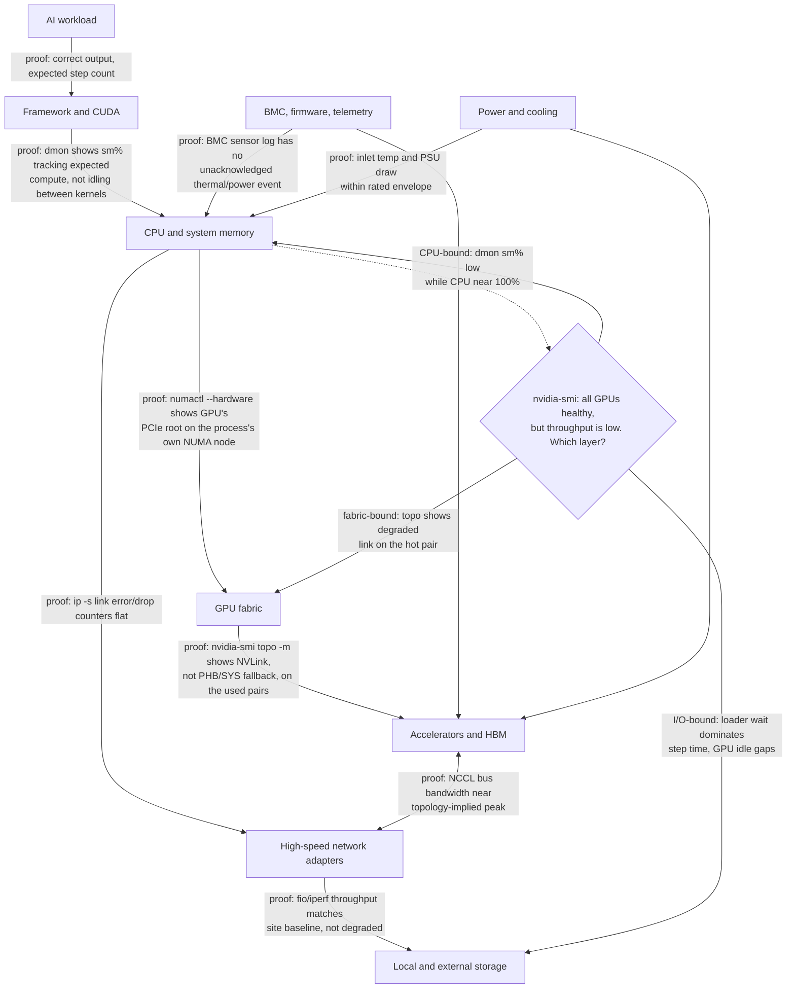
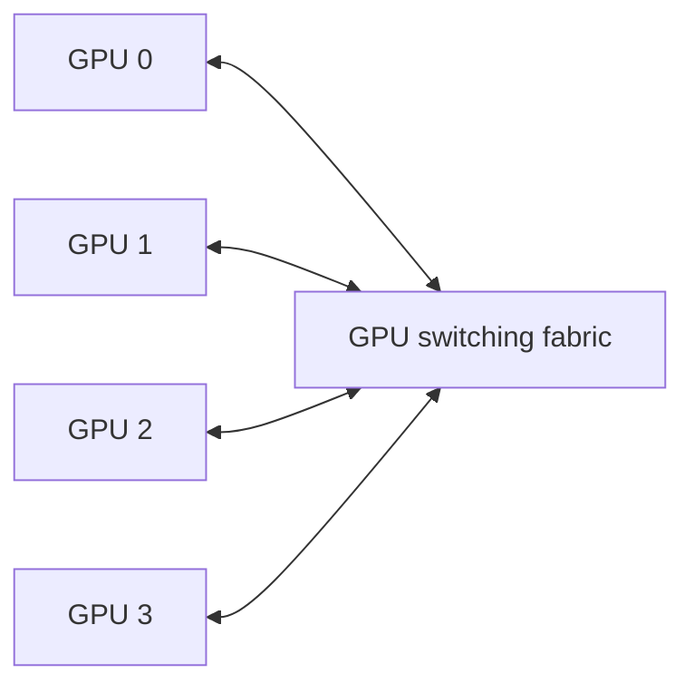
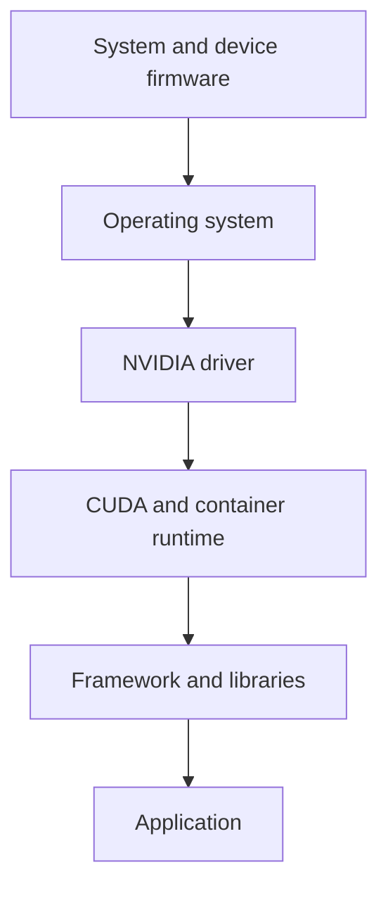
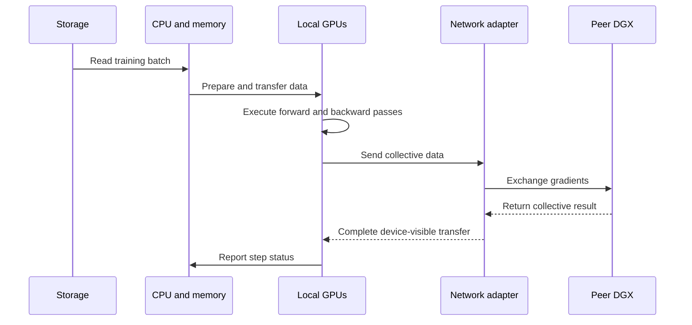

# Inside a DGX System

A DGX system is often described as a server with multiple GPUs. That description is technically incomplete and operationally dangerous.

The value of DGX is not the presence of accelerators alone. It is the integration of compute, memory, high-speed GPU communication, host I/O, network paths, local storage, firmware, management, power delivery, cooling, and a validated software lifecycle into one platform boundary.

When an engineer treats DGX as a collection of independent parts, troubleshooting becomes fragmented. When the engineer treats it as a system, symptoms can be traced across layers.

## Learning objectives

After completing this chapter, you will be able to:

- identify the major architectural domains inside a DGX system;
- explain the difference between GPU fabric, host I/O, and cluster networking;
- trace a workload from application to accelerator and external services;
- describe how management, power, cooling, and firmware affect availability;
- build a component-level health model for DGX operations;
- explain why a healthy GPU does not prove that the DGX system is healthy.

## The system boundary



**Figure 5.2.1 — DGX is an integrated system, not an isolated GPU tray.** Every edge names the command or counter that proves that hop is not the bottleneck. The decision diamond is the chapter's actual thesis in diagram form: "all GPUs visible and error-free" only clears one node in this graph — a slow job with healthy GPUs means the fault is provably somewhere else, and the branch shows the three next places to look, each with its own falsifiable evidence.

The exact component implementation varies by DGX generation, but the architectural responsibilities remain consistent.

## Compute domain

The compute domain contains the host processors, system memory, accelerators, and the paths that connect them.

### Host processors

The CPU is responsible for control-plane work such as process orchestration, framework execution, data preparation, network handling, storage interaction, and kernel launch. A GPU-heavy workload can still be limited by CPU scheduling, memory locality, or preprocessing.

### System memory

Host memory stages data, stores application state, supports operating-system services, and may participate in transfers to and from GPU memory. NUMA placement matters because a process can be physically closer to one I/O path than another.

➕ **Worked example — why NUMA locality is not a rounding error:** cross-socket memory access on a typical dual-socket server adds on the order of 50-80% latency versus local-node access (illustrative figures — actual numbers depend on platform and interconnect generation), and a data-loader pinned to the wrong NUMA node pays that penalty on every single batch, not once. At a modest 500 microseconds of added per-batch staging latency and a data loader preparing 200 batches/second across an 8-GPU node, that is roughly 100 milliseconds of added latency accumulated per second of wall-clock training time — enough to visibly widen the idle gaps between GPU kernel launches in a `dmon` trace, without any single number in `nvidia-smi` ever showing an error.

### Accelerators and HBM

Each accelerator combines compute engines with local high-bandwidth memory. The application sees individual devices, but the system architecture determines how efficiently those devices exchange data and reach host resources.

## GPU fabric domain

Multi-GPU systems need a path for device-to-device communication. The GPU fabric provides that path within the system.



The fabric is distinct from cluster networking. It addresses communication among accelerators inside a system boundary, while network adapters connect the system to other nodes, storage, and services.

A topology-aware application can use the fabric efficiently. A topology-unaware application may introduce unnecessary host staging or choose communication paths that reduce effective throughput.

## Host I/O domain

Host I/O includes PCIe root complexes, switches, network adapters, storage devices, and other peripherals.

The architecture must answer:

- Which CPU or memory domain is nearest each device?
- Which GPUs share an I/O path?
- Which network adapter should a distributed process use?
- Can data move directly between GPU memory and a network or storage device?
- What contention occurs when several devices use the same upstream path?

These questions explain why two apparently identical workload placements can perform differently.

## Networking domain

A DGX system commonly participates in more than one network.

| Network role | Purpose | Typical traffic |
|---|---|---|
| Management | Administrative access and platform control | BMC, SSH, provisioning, monitoring |
| Application or service | Client and application communication | API requests, user traffic, control services |
| Compute fabric | Distributed training or inference communication | Collectives, tensor exchange, RDMA |
| Storage | Dataset and checkpoint access | Reads, writes, metadata |

Some deployments combine roles; others isolate them. The decision depends on scale, security, performance, and operational complexity.

A single physical link can become a shared failure domain when management, storage, and compute traffic are not separated or prioritized correctly.

## Storage domain

Local storage supports operating-system files, containers, caches, temporary datasets, logs, and sometimes checkpoints. External storage provides shared datasets, model repositories, and durable checkpoint capacity.

Storage design must distinguish capacity from performance. A filesystem may have enough space while failing to deliver the required metadata rate, sequential bandwidth, or parallel access behavior.

A DGX workload can show low GPU utilization when the data pipeline cannot keep accelerator memory supplied.

## Management domain

The management plane exists even when no AI workload is running.

It includes:

- baseboard management controller access;
- sensor telemetry;
- firmware inventory;
- power state control;
- event logs;
- operating-system health;
- driver and GPU diagnostics;
- hardware lifecycle tooling.

The management plane should remain reachable during many host-level failures. If it shares the same access path and identity assumptions as the production workload, recovery becomes harder.

## Firmware and software lifecycle

DGX reliability depends on compatibility across multiple layers:



Upgrading one layer without checking the others can create a system that boots successfully but cannot run production workloads reliably.

A safe lifecycle therefore includes compatibility review, canary validation, workload tests, rollback planning, and post-change health checks.

## Power and cooling domain

Accelerator systems convert substantial electrical power into heat. Power and cooling are therefore runtime dependencies, not facility details outside the architecture.

A system may remain online while operating below expected performance because of:

- power capping;
- thermal throttling;
- reduced fan performance;
- blocked airflow;
- incorrect rack placement;
- facility inlet-temperature problems;
- redundant power-path failure.

Monitoring only application metrics can hide these conditions.

## Data flow through the platform

Consider a distributed training step:



Every arrow is a potential bottleneck or failure point. The GPU may be healthy while storage, CPU preparation, network routing, or peer communication limits the step.

## Availability and failure domains

A DGX system contains several failure domains.

| Failure domain | Example failure | Workload effect |
|---|---|---|
| Individual GPU | Device error or memory fault | Job abort, degraded capacity |
| GPU fabric | Link degradation | Poor scaling or communication failure |
| Host | Kernel panic or CPU failure | Complete node outage |
| Network adapter | Link or firmware issue | Distributed job failure |
| Local storage | Device or filesystem failure | Boot, cache, or logging impact |
| Power path | Supply or feed loss | Reduced redundancy or outage |
| Cooling | Fan or airflow issue | Throttling or shutdown |
| Management | BMC access failure | Reduced recovery capability |

High availability is not achieved by assuming each DGX is internally redundant. It is achieved by designing the cluster and workload to tolerate node and component failures.

## Production troubleshooting: healthy GPUs, slow node

### Symptoms

- all accelerators appear in `nvidia-smi`;
- no obvious GPU fault is reported;
- one node is consistently slower than peers;
- distributed jobs spend longer in communication or input phases;
- application throughput drops after maintenance.

### Diagnostic sequence

1. Compare GPU clocks, power, temperature, and error counters with healthy peers.
2. Inspect accelerator topology and link health.
3. Verify CPU NUMA placement and host-memory pressure.
4. Check network link state, error counters, routing, and adapter affinity.
5. Measure local and external storage throughput.
6. Compare firmware, driver, operating-system, and library versions.
7. Review management-controller sensor and event logs.

➕ **Step 1, real paired evidence — the slow node against a healthy peer, same job, same instant:**

```text
# slow-node01
$ nvidia-smi --query-gpu=index,clocks.sm,power.draw,power.limit,temperature.gpu --format=csv
index, clocks.sm [MHz], power.draw [W], power.limit [W], temperature.gpu [C]
0, 1305, 412, 700, 58
1, 1298, 405, 700, 59

# healthy-node02 (same job, same rank count)
$ nvidia-smi --query-gpu=index,clocks.sm,power.draw,power.limit,temperature.gpu --format=csv
index, clocks.sm [MHz], power.draw [W], power.limit [W], temperature.gpu [C]
0, 1980, 690, 700, 61
1, 1975, 685, 700, 60
```
The slow node's SM clock (`1305MHz`) is running well below the healthy peer's (`1980MHz`) while power draw is also proportionally lower (`412W` vs `690W`, both under the same `700W` cap) and temperature is *not* elevated (`58C` vs `61C` — cooler, not hotter). That combination — low clock, low power, low temp, no thermal event — rules out thermal throttling (which would show high temp) and rules out a hard power cap (which would show power pinned at the limit). It points instead at the GPU being launch-bound: it simply isn't being fed enough queued work to justify boosting clocks, which shifts the investigation toward Step 3 (CPU/NUMA) and Step 5 (storage) rather than anything GPU-internal.

➕ **Step 3, real evidence — the NUMA placement that Step 1's finding predicts should be checked next:**

```text
$ numactl --hardware
available: 2 nodes (0-1)
node 0 cpus: 0-31
node 0 size: 515000 MB
node 1 cpus: 32-63
node 1 size: 515000 MB

$ nvidia-smi topo -m | grep -E "GPU0|CPU Affinity"
       GPU0 ... CPU Affinity  NUMA Affinity
GPU0     X  ...   32-63           1
```
GPU0 is wired to NUMA node 1 (CPUs 32-63). If the data-loader process for that GPU was launched without CPU affinity and landed on NUMA node 0 instead — checkable with `taskset -pc &lt;pid&gt;` — every batch it prepares crosses the cross-socket interconnect before ever reaching PCIe, adding latency per batch that compounds into exactly the "GPU idles between kernels" signature Step 1 found. This is a common root cause for "one node is slower, nothing is technically broken."

### Root causes

Common causes include thermal throttling, a degraded network path, incorrect process affinity, a fabric link issue, storage contention, version drift, or a post-maintenance configuration change.

### Resolution

Restore the node to the validated platform baseline. Do not replace GPUs solely because the workload is GPU-based. The slowest layer may exist elsewhere in the system.

## Customer scenario

A customer purchases several DGX systems and asks whether they can be placed into existing racks and connected to the current data-center network.

The correct answer requires a platform review covering:

- rack power and cooling;
- floor loading and airflow strategy;
- management-network isolation;
- compute-fabric design;
- storage bandwidth;
- software and firmware lifecycle;
- monitoring and incident ownership;
- workload placement and failure recovery.

The systems are only one component of the production architecture.

## Interview preparation

### Knowledge questions

**1. Why is the GPU fabric different from the cluster network?**

"They solve different distances at different speeds. The GPU fabric — NVLink and NVSwitch — connects accelerators that live inside the same chassis, and it's built for the bandwidth a collective operation needs between GPUs that might exchange gradients dozens of times a second. The cluster network connects that node to every other node, and it has to deal with switch hops, cable runs, and sharing capacity with storage and management traffic. If I collapse that distinction and assume 'the network' is one thing, I'll misdiagnose a scale-out NCCL hang as a local topology problem, or vice versa — they have different failure signatures and different tools: `nvidia-smi topo -m` for the fabric, `ip -s link` and switch counters for the cluster network."

**2. How can a CPU or storage bottleneck appear as low GPU utilization?**

"Because the GPU can only report on the work it's actually been handed — it has no visibility into why the queue is empty. If the CPU is stuck tokenizing input, or the data loader is blocked waiting on a slow filesystem, the GPU finishes its current batch, checks the queue, finds nothing, and sits idle. `nvidia-smi` will faithfully report low utilization during that gap, and it's tempting to read that as 'the GPU is underpowered for this job' — but the actual bottleneck is upstream. The tell is a *periodic* utilization pattern — busy, idle, busy, idle — that tracks the loader's rhythm rather than a flat low number, which is what you'd expect from genuinely undersized compute."

**3. Why must firmware be included in the software compatibility model?**

"Because the driver isn't talking to an abstract GPU — it's talking to a specific firmware revision, and the two have to agree on capabilities, register layouts, and error-reporting formats. I've seen a case where a driver upgrade shipped clean, passed `nvidia-smi -L` on every node, and still caused NVLink training failures under load, because the firmware on a subset of nodes hadn't been bumped to the paired revision. If firmware isn't in the same compatibility matrix as driver, CUDA, and OS versions, you can pass every basic health check and still have a fleet that's silently split into two populations that behave differently under load."

### Architecture questions

**1. Draw the major internal domains of a DGX system.**

"I'd draw it as Figure 5.2.1 in this chapter — compute domain at the center with host and accelerators, the GPU fabric as its own box because it's a genuinely separate communication path from external networking, then I-O, networking, storage, management, and facility layered around it. The point of drawing it this way rather than as one flat 'GPU server' box is that each of those domains fails independently and needs its own evidence — I'd narrate that as I draw each arrow, naming what command or counter proves that specific hop is healthy."

**2. Design separate management, storage, and compute traffic paths for a DGX cluster.**

"I'd start from the failure I'm trying to prevent: I never want workload traffic contention to also take down my ability to reach the BMC and recover the node. So minimum viable separation is a genuinely out-of-band management network on its own NIC and switch fabric, a storage path sized for sustained checkpoint bursts rather than average throughput, and a compute fabric — NVLink internally, RDMA-capable NICs externally — that's isolated enough that a storage burst doesn't introduce jitter into a collective operation. Whether those are physically separate NICs or logically separated with QoS depends on scale and budget, but the BMC path is the one I wouldn't compromise on, because that's my recovery path when everything else is down."

**3. Explain how you would create a validated platform baseline.**

"I'd capture, per node: firmware and BIOS versions, driver and CUDA versions, `nvidia-smi topo -m` output, NIC firmware and link speed, and a functional test result — then diff every new or post-maintenance node against that captured baseline rather than eyeballing it fresh each time. The baseline only has value if it's versioned and if drift against it is the first thing I check in any performance incident, before I start speculating about hardware."

### Troubleshooting questions

**1. One DGX is slower than identical peers, but all GPUs are visible. Where do you begin?**

"I don't touch the GPU first — 'visible' already told me the GPU passed its check. I'd pull the same telemetry from the slow node and a healthy peer side by side: clocks, power draw, temperature, and topology. If clocks are low but power and temperature are also low with no thermal event, that's not a GPU health problem, that's the GPU being starved — which sends me to NUMA placement and the data pipeline next, not to a GPU replacement ticket."

**2. A distributed job fails only when it spans nodes. Which internal and external paths must be isolated?**

"Single-node behavior working tells me the local fabric — NVLink, NVSwitch, on-node PCIe — is fine, so I don't spend time there. What's different at multi-node is the external network: NIC selection, RDMA device visibility inside any container, routing and firewall rules between hosts, and MTU consistency across the path. I'd run a plain point-to-point network test between the two hosts before touching NCCL again, because a bare TCP or RDMA bandwidth test isolates 'can these hosts talk at all' from 'can the collective library talk efficiently,' and those are different failure classes."

**3. Performance decreases after a firmware maintenance window. How do you investigate safely?**

"First move is comparing the pre- and post-maintenance baseline diff — driver, CUDA, firmware, and topology output — rather than assuming the firmware itself is defective. If the diff shows exactly what changed, I have a hypothesis I can test in isolation instead of rolling back blindly, which matters because a firmware rollback has its own risk. If the baseline shows a version combination that wasn't in the validated compatibility matrix, that's the root cause, and the fix is re-validating the pairing, not just reverting and hoping."

## Key takeaways

- DGX is an integrated system spanning compute, fabric, I/O, networking, storage, management, power, and cooling.
- GPU health is necessary but not sufficient for system health.
- Internal topology influences placement, communication, and troubleshooting.
- Firmware and software must be operated as one compatibility chain.
- Production readiness requires cluster-level failure tolerance and facility validation.

## Cross references

- [Volume 05 introduction](./index)
- [Chapter 01 — Why DGX Exists](./chapter-01-why-dgx-exists)
- [Lab 01 — Build a DGX Health Baseline](./labs/lab-01-build-a-dgx-health-baseline)
