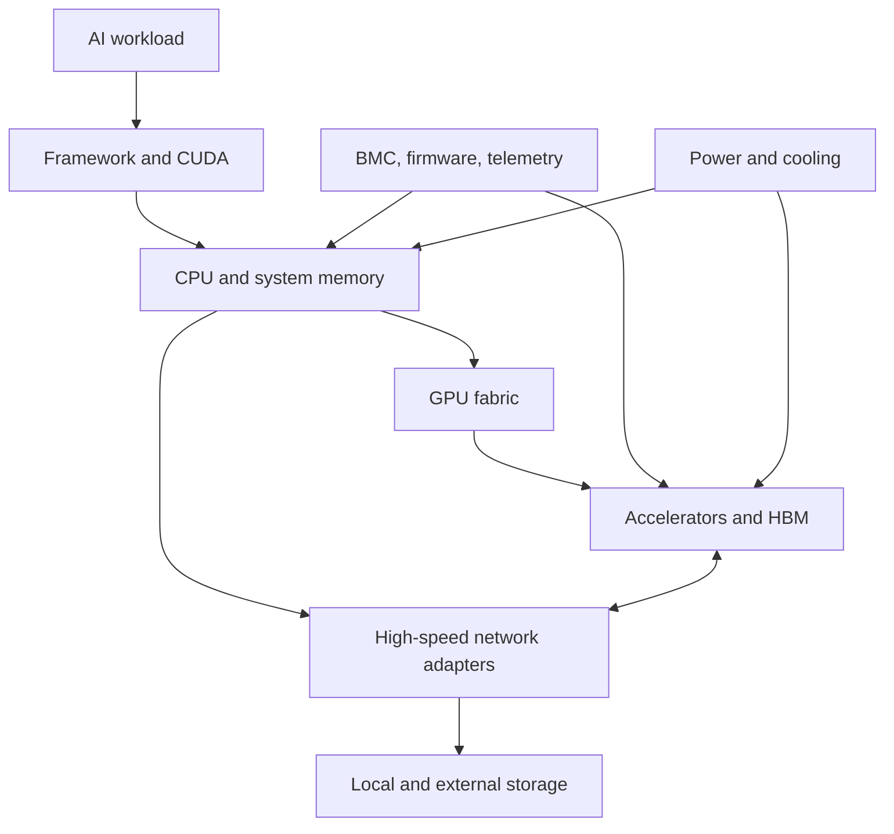
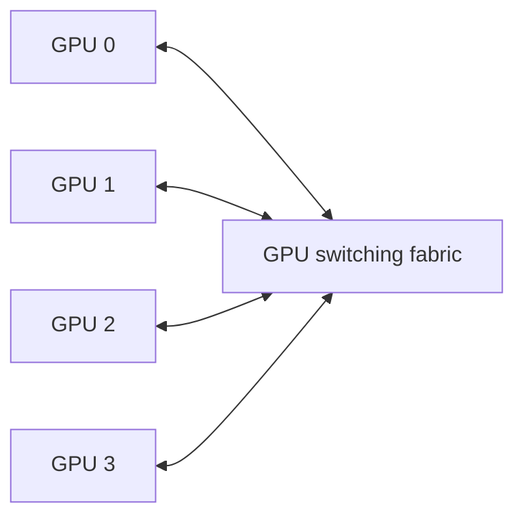
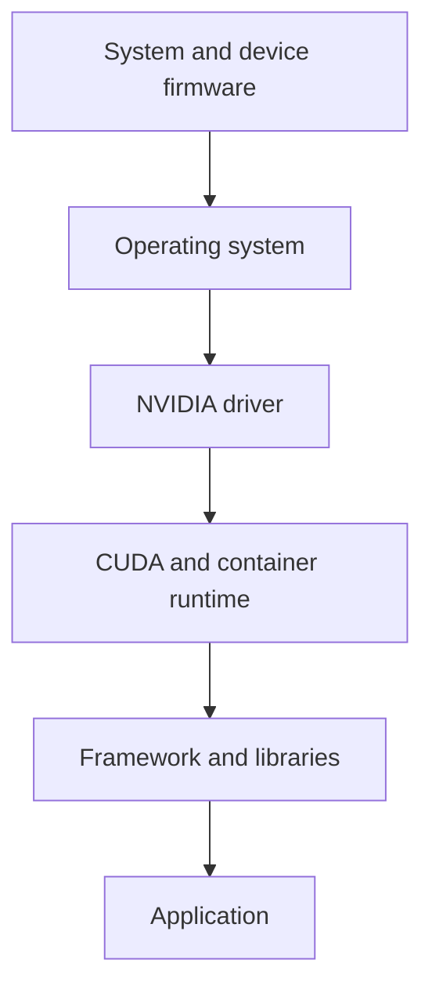
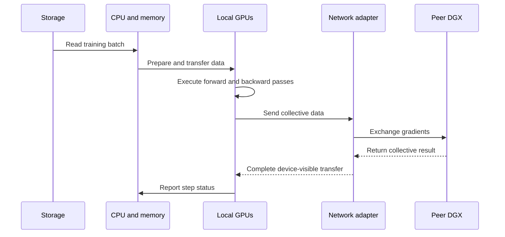

# Inside a DGX System

A DGX system is often described as a server with multiple GPUs. That description is technically incomplete and operationally dangerous.

The value of DGX is not the presence of accelerators alone. It is the integration of compute, memory, high-speed GPU communication, host I/O, network paths, local storage, firmware, management, power delivery, cooling, and a validated software lifecycle into one platform boundary.

When an engineer treats DGX as a collection of independent parts, troubleshooting becomes fragmented. When the engineer treats it as a system, symptoms can be traced across layers.

## Learning objectives

After completing this chapter, you will be able to:

- identify the major architectural domains inside a DGX system;
- explain the difference between GPU fabric, host I/O, and cluster networking;
- trace a workload from application to accelerator and external services;
- describe how management, power, cooling, and firmware affect availability;
- build a component-level health model for DGX operations;
- explain why a healthy GPU does not prove that the DGX system is healthy.

## The system boundary

**Figure 5.2.1 — DGX is an integrated system, not an isolated GPU tray.**

The exact component implementation varies by DGX generation, but the architectural responsibilities remain consistent.

## Compute domain

The compute domain contains the host processors, system memory, accelerators, and the paths that connect them.

### Host processors

The CPU is responsible for control-plane work such as process orchestration, framework execution, data preparation, network handling, storage interaction, and kernel launch. A GPU-heavy workload can still be limited by CPU scheduling, memory locality, or preprocessing.

### System memory

Host memory stages data, stores application state, supports operating-system services, and may participate in transfers to and from GPU memory. NUMA placement matters because a process can be physically closer to one I/O path than another.

### Accelerators and HBM

Each accelerator combines compute engines with local high-bandwidth memory. The application sees individual devices, but the system architecture determines how efficiently those devices exchange data and reach host resources.

## GPU fabric domain

Multi-GPU systems need a path for device-to-device communication. The GPU fabric provides that path within the system.

The fabric is distinct from cluster networking. It addresses communication among accelerators inside a system boundary, while network adapters connect the system to other nodes, storage, and services.

A topology-aware application can use the fabric efficiently. A topology-unaware application may introduce unnecessary host staging or choose communication paths that reduce effective throughput.

## Host I/O domain

Host I/O includes PCIe root complexes, switches, network adapters, storage devices, and other peripherals.

The architecture must answer:

- Which CPU or memory domain is nearest each device?
- Which GPUs share an I/O path?
- Which network adapter should a distributed process use?
- Can data move directly between GPU memory and a network or storage device?
- What contention occurs when several devices use the same upstream path?

These questions explain why two apparently identical workload placements can perform differently.

## Networking domain

A DGX system commonly participates in more than one network.

| Network role | Purpose | Typical traffic |
|---|---|---|
| Management | Administrative access and platform control | BMC, SSH, provisioning, monitoring |
| Application or service | Client and application communication | API requests, user traffic, control services |
| Compute fabric | Distributed training or inference communication | Collectives, tensor exchange, RDMA |
| Storage | Dataset and checkpoint access | Reads, writes, metadata |

Some deployments combine roles; others isolate them. The decision depends on scale, security, performance, and operational complexity.

A single physical link can become a shared failure domain when management, storage, and compute traffic are not separated or prioritized correctly.

## Storage domain

Local storage supports operating-system files, containers, caches, temporary datasets, logs, and sometimes checkpoints. External storage provides shared datasets, model repositories, and durable checkpoint capacity.

Storage design must distinguish capacity from performance. A filesystem may have enough space while failing to deliver the required metadata rate, sequential bandwidth, or parallel access behavior.

A DGX workload can show low GPU utilization when the data pipeline cannot keep accelerator memory supplied.

## Management domain

The management plane exists even when no AI workload is running.

It includes:

- baseboard management controller access;
- sensor telemetry;
- firmware inventory;
- power state control;
- event logs;
- operating-system health;
- driver and GPU diagnostics;
- hardware lifecycle tooling.

The management plane should remain reachable during many host-level failures. If it shares the same access path and identity assumptions as the production workload, recovery becomes harder.

## Firmware and software lifecycle

DGX reliability depends on compatibility across multiple layers:

Upgrading one layer without checking the others can create a system that boots successfully but cannot run production workloads reliably.

A safe lifecycle therefore includes compatibility review, canary validation, workload tests, rollback planning, and post-change health checks.

## Power and cooling domain

Accelerator systems convert substantial electrical power into heat. Power and cooling are therefore runtime dependencies, not facility details outside the architecture.

A system may remain online while operating below expected performance because of:

- power capping;
- thermal throttling;
- reduced fan performance;
- blocked airflow;
- incorrect rack placement;
- facility inlet-temperature problems;
- redundant power-path failure.

Monitoring only application metrics can hide these conditions.

## Data flow through the platform

Consider a distributed training step:

Every arrow is a potential bottleneck or failure point. The GPU may be healthy while storage, CPU preparation, network routing, or peer communication limits the step.

## Availability and failure domains

A DGX system contains several failure domains.

| Failure domain | Example failure | Workload effect |
|---|---|---|
| Individual GPU | Device error or memory fault | Job abort, degraded capacity |
| GPU fabric | Link degradation | Poor scaling or communication failure |
| Host | Kernel panic or CPU failure | Complete node outage |
| Network adapter | Link or firmware issue | Distributed job failure |
| Local storage | Device or filesystem failure | Boot, cache, or logging impact |
| Power path | Supply or feed loss | Reduced redundancy or outage |
| Cooling | Fan or airflow issue | Throttling or shutdown |
| Management | BMC access failure | Reduced recovery capability |

High availability is not achieved by assuming each DGX is internally redundant. It is achieved by designing the cluster and workload to tolerate node and component failures.

## Production troubleshooting: healthy GPUs, slow node

### Symptoms

- all accelerators appear in `nvidia-smi`;
- no obvious GPU fault is reported;
- one node is consistently slower than peers;
- distributed jobs spend longer in communication or input phases;
- application throughput drops after maintenance.

### Diagnostic sequence

1. Compare GPU clocks, power, temperature, and error counters with healthy peers.
2. Inspect accelerator topology and link health.
3. Verify CPU NUMA placement and host-memory pressure.
4. Check network link state, error counters, routing, and adapter affinity.
5. Measure local and external storage throughput.
6. Compare firmware, driver, operating-system, and library versions.
7. Review management-controller sensor and event logs.

### Root causes

Common causes include thermal throttling, a degraded network path, incorrect process affinity, a fabric link issue, storage contention, version drift, or a post-maintenance configuration change.

### Resolution

Restore the node to the validated platform baseline. Do not replace GPUs solely because the workload is GPU-based. The slowest layer may exist elsewhere in the system.

## Customer scenario

A customer purchases several DGX systems and asks whether they can be placed into existing racks and connected to the current data-center network.

The correct answer requires a platform review covering:

- rack power and cooling;
- floor loading and airflow strategy;
- management-network isolation;
- compute-fabric design;
- storage bandwidth;
- software and firmware lifecycle;
- monitoring and incident ownership;
- workload placement and failure recovery.

The systems are only one component of the production architecture.

## Interview preparation

### Knowledge questions

1. Why is the GPU fabric different from the cluster network?
2. How can a CPU or storage bottleneck appear as low GPU utilization?
3. Why must firmware be included in the software compatibility model?

### Architecture questions

1. Draw the major internal domains of a DGX system.
2. Design separate management, storage, and compute traffic paths for a DGX cluster.
3. Explain how you would create a validated platform baseline.

### Troubleshooting questions

1. One DGX is slower than identical peers, but all GPUs are visible. Where do you begin?
2. A distributed job fails only when it spans nodes. Which internal and external paths must be isolated?
3. Performance decreases after a firmware maintenance window. How do you investigate safely?

## Key takeaways

- DGX is an integrated system spanning compute, fabric, I/O, networking, storage, management, power, and cooling.
- GPU health is necessary but not sufficient for system health.
- Internal topology influences placement, communication, and troubleshooting.
- Firmware and software must be operated as one compatibility chain.
- Production readiness requires cluster-level failure tolerance and facility validation.

## Cross references

- [Volume 05 introduction](./index)
- [Chapter 01 — Why DGX Exists](./chapter-01-why-dgx-exists)
- [Lab 01 — Build a DGX Health Baseline](./labs/lab-01-build-a-dgx-health-baseline)
