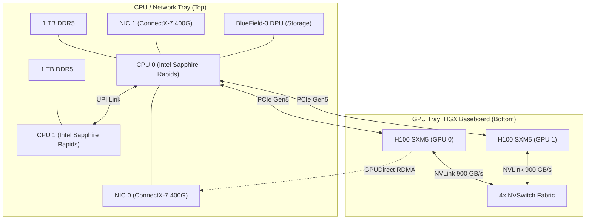

# Chapter 2 — Inside the DGX H100 System

| Chapter metadata | Value |
|---|---|
| Volume | 05 — DGX Systems & Infrastructure |
| Difficulty | Expert |
| Estimated reading time | 35 minutes |
| Primary audience | DevOps, SRE, Platform, Cloud and Infrastructure Engineers |
| Core question | If you open the lid of a DGX H100, what exactly are you looking at, and how are the components physically wired? |

## Introduction

As an Infrastructure Engineer, you cannot troubleshoot a system if you cannot picture its physical layout. 

When a monitoring dashboard screams that `GPU 3` is failing to communicate with `NIC 3`, you must know if that data path traverses CPU 0 or CPU 1. You must know if the NIC is an OSFP module or a QSFP module. 

The NVIDIA DGX H100 is an 8U (8 rack-units) behemoth weighing nearly 300 pounds. It consumes 10.2 kW of power. It is a masterpiece of electrical and thermal engineering. This chapter strips away the chassis and maps the exact internal components.

## 1. The Compute Tray (The Top Half)

The DGX is roughly divided into two trays: The CPU/Network tray on top, and the GPU tray on the bottom. 

### The CPUs and System RAM
Despite being a GPU powerhouse, the DGX H100 requires massive x86 CPU power to handle orchestration and data feeding. 
* **Processors:** Dual Intel Xeon Platinum 8480C (Sapphire Rapids) CPUs, providing 112 cores.
* **System Memory:** 2 Terabytes of DDR5 RAM. This massive footprint is required because datasets must be staged here before being pushed to the GPUs.

### The Storage (NVMe)
AI training requires massive I/O. Reading images or text files from network storage is fast, but caching them locally is faster.
* **OS Drives:** 2x 1.9TB NVMe M.2 drives (RAID 1 for redundancy).
* **Data Cache Drives:** 8x 3.8TB U.2 NVMe drives. These are blazingly fast local drives used to cache active training datasets. They are evenly distributed across the PCIe lanes of both CPUs.

### The Data Processing Units (DPUs)
Standard CPUs collapse under the weight of managing 3.2 Tbps of network traffic. The DGX H100 offloads this using **NVIDIA BlueField-3 DPUs**. 
There are 2x BlueField-3 DPUs acting as the gateway for Storage and Management networks. They handle encryption, storage virtualization (NVMe-oF), and network security entirely in hardware, saving the Intel CPUs for AI preprocessing tasks.

## 2. The GPU Tray (The Bottom Half)

The bottom half of the chassis is entirely dedicated to the **HGX Baseboard**. 

### The GPUs
* 8x NVIDIA H100 SXM5 GPUs.
* Each GPU possesses 80GB of HBM3 memory (640GB total VRAM per node).

### The NVSwitches
Connecting these 8 GPUs are **4x NVSwitch chips**. 
These chips create a fully non-blocking mesh. Every GPU has 18 NVLink connections. The NVSwitches route these connections flawlessly, allowing any GPU to talk to any other GPU at exactly 900 GB/s bidirectionally.

## 3. The Networking (The Back Panel)

If you look at the back of a DGX H100, the amount of networking ports is staggering. A single DGX contains more networking bandwidth than entire legacy enterprise data centers.

### The Compute Network (OSFP)
To train massive models, the 8 GPUs must talk to GPUs in other servers. 
* **Hardware:** 8x ConnectX-7 Network Adapters (NDR 400 Gbps). 
* **Form Factor:** NVIDIA uses **OSFP (Octal Small Form Factor Pluggable)** ports. OSFP is physically larger than standard QSFP ports, specifically designed to handle the massive heat generated by 400G and 800G optics.
* **Topology:** Every single GPU is physically hardwired via PCIe Gen5 to its own dedicated ConnectX-7 NIC. 

### The Storage/Management Network (QSFP112)
* Handled by the 2x BlueField-3 DPUs (400 Gbps total). 

### The In-Band and Out-of-Band (OOB) Management
* Standard 1GbE / 10GbE ports for SSH access, Kubernetes API traffic, and IPMI (Baseboard Management Controller) remote console access.

## Architectural Diagram: Internal Topology

*Note: In reality, there are 8 GPUs and 8 NICs perfectly mirrored across both CPUs.*

## Customer Scenario (Senior Level)

**The Situation:**
A customer's IT team installs a brand new DGX H100. They rack it, provide power, and plug a single 100GbE network cable into the Management port on the back. They boot up their distributed PyTorch training job. They complain: "The DGX H100 is taking twice as long to train our model as our old A100 server. The hardware is defective."

**The Senior Architect Response:**
"The hardware is performing exactly as cabled. You have inadvertently strangled a 3.2 Tbps supercomputer through a single 100Gbps management straw.

A DGX H100 is designed with a strictly separated network topology. The port you plugged in is the In-Band Management port. It is routed through the host CPUs and is designed purely for SSH access, fetching Docker images, and cluster orchestration traffic. 

When your PyTorch distributed training job attempts to synchronize gradients across the network, it realizes the 8 dedicated ConnectX-7 Compute NICs are unplugged. PyTorch/NCCL automatically falls back to the only available network connection: your single management cable. 

To fix this, you must cable all 8 of the OSFP ConnectX-7 compute ports into a dedicated, non-blocking InfiniBand or RoCEv2 backend fabric switch (like a Quantum-2 or Spectrum-4). Once cabled, NCCL will automatically utilize **GPUDirect RDMA** to blast the gradients out of the 8 dedicated NICs simultaneously, bypassing the host CPU entirely and unleashing the true speed of the H100."

## Interview Preparation

**Conceptual:** Why does a DGX H100 use BlueField-3 DPUs for the storage network instead of just routing storage traffic through the host Intel CPUs? *(Hint: To offload the massive CPU overhead of NVMe-over-Fabrics and network security, leaving the Intel CPUs 100% available to feed the GPUs).*

**Architecture:** What is the physical connection between GPU 0 and NIC 0 inside a DGX, and why is it important? *(Hint: They are on the exact same PCIe Gen5 switch complex. This allows GPUDirect RDMA—the GPU can talk to the NIC without the data ever crossing the CPU).*
