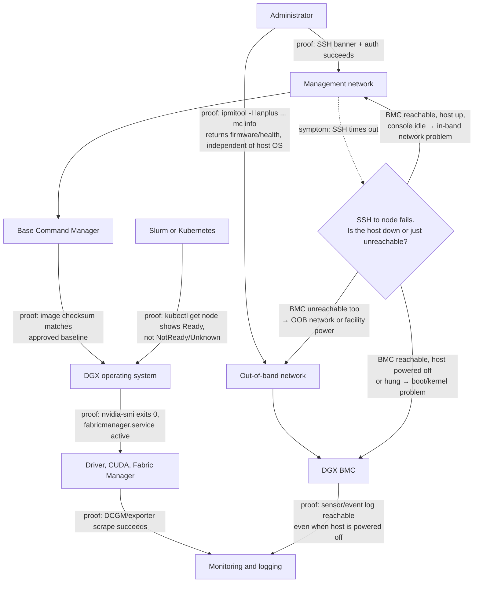
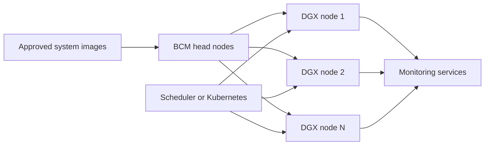
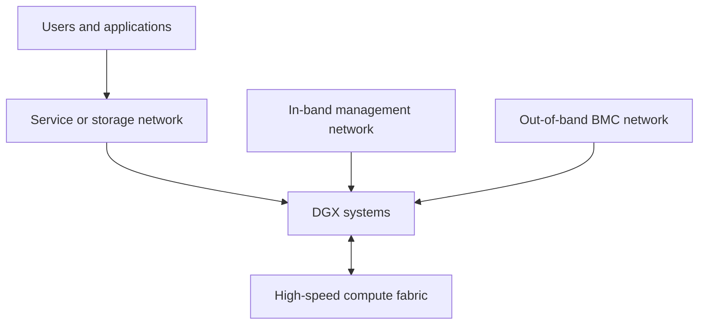
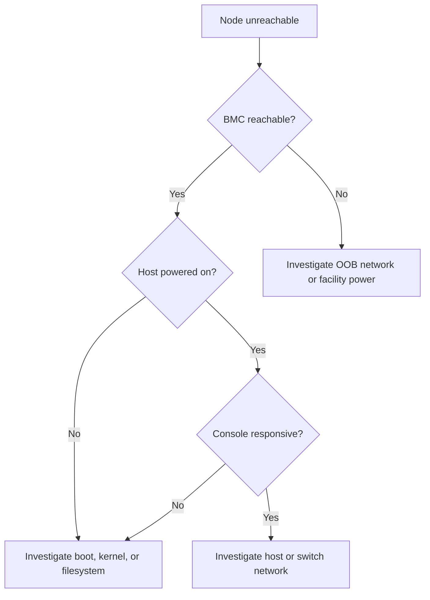

# DGX Management Plane

A DGX system is not operated through `nvidia-smi` alone. Production administration spans several control layers: out-of-band hardware management, host operating system, GPU software, cluster provisioning, orchestration, monitoring, and support data collection.

When these layers are mixed together, incident response becomes slow and risky. A reliable DGX platform assigns each control function to the correct management plane.

| Chapter field | Value |
|---|---|
| Difficulty | Intermediate |
| Estimated reading time | 40 minutes |
| Prerequisites | Chapters 01–02 |
| Primary outcome | Design and operate a layered DGX management architecture |

## 1. The Production Problem

A DGX node stops responding over the production network. The scheduler marks the node unavailable, but the operations team cannot tell whether the failure is caused by Linux, the network interface, a power event, a failed component, or an administrative mistake.

If the only management path depends on the host operating system, the team has lost its visibility at the exact moment it is needed most.

## 2. Learning Objectives

After completing this chapter, you will be able to:

- separate in-band and out-of-band DGX management;
- explain the role of the Baseboard Management Controller (BMC);
- place Base Command Manager in a multi-node architecture;
- design secure management-network boundaries;
- build an operational workflow for provisioning, monitoring, and recovery.

## 3. Management Plane Architecture



**Figure 5.3.1 — Layered DGX management plane.** Every edge names the evidence that proves that control path works right now, not just that it was configured once. The decision diamond is the chapter's central argument made concrete: a failed SSH session is ambiguous by itself, and the BMC's independence from the host OS is exactly what turns that ambiguity into a three-way, evidence-backed branch instead of a guess.

## 4. Out-of-Band Management

The BMC monitors and controls hardware independently of the primary host operating system. Depending on the DGX generation and supported functions, it can expose sensor readings, event logs, power controls, virtual console, firmware information, and hardware inventory.

The BMC is used when:

- the operating system is unavailable;
- network configuration is broken;
- the node must be power-cycled remotely;
- hardware sensors or event logs are required;
- installation media must be attached through a remote console;
- firmware state must be inspected.

➕ **Real BMC evidence, annotated (IPMI over LAN — the same reasoning applies to a Redfish `GET` against the BMC's REST API):**

```text
$ ipmitool -I lanplus -H 10.1.1.15 -U admin -P *** chassis power status
Chassis Power is on

$ ipmitool -I lanplus -H 10.1.1.15 -U admin -P *** sensor list | grep -E "Temp|Power|Fan" | head -6
Inlet Temp       | 24.000     | degrees C  | ok    | 5.00  | 10.00 | 15.00 | 42.00 | 45.00 | 48.00
CPU0 Temp        | 52.000     | degrees C  | ok    | 0.00  | 5.00  | 10.00 | 95.00 | 98.00 | 100.00
GPU0 Temp        | 61.000     | degrees C  | ok    | na    | na    | na    | 83.00 | 88.00 | 90.00
PSU1 Power In    | 850.000    | Watts      | ok    | na    | na    | na    | na    | na    | na
PSU2 Power In    | 12.000     | Watts      | ok    | na    | na    | na    | na    | na    | na
Fan1             | 8400.000   | RPM        | ok    | 1200  | 1500  | 1800  | na    | na    | na
```
This is exactly the evidence that answers the chapter's core question without touching the host at all: `Chassis Power is on` proves the node is physically powered, `Inlet Temp 24C` with all sensors reading `ok` rules out a thermal event, and — the interesting line — `PSU1 Power In 850W` against `PSU2 Power In 12W` shows one power supply carrying almost the entire load while its redundant partner is nearly idle. That is not a failure by itself (some platforms run PSUs asymmetrically under partial load), but it is exactly the kind of asymmetry worth screenshotting before power-cycling anything, because if PSU1 later fails, this reading proves the redundant path was never actually validated under real load.

```text
$ ipmitool -I lanplus -H 10.1.1.15 -U admin -P *** sel list | tail -3
1a2 | 07/29/2026 | 03:14:02 | Power Supply PSU2 | Predictive failure asserted
1a3 | 07/29/2026 | 03:14:05 | Power Supply PSU2 | Config Error
1a4 | 07/29/2026 | 03:22:11 | Power Supply PSU2 | Predictive failure deasserted
```
The System Event Log (`sel`) is BMC-persisted, so it survives a host reboot or crash — this is the record that would have explained the PSU2 asymmetry above *before* it became urgent, which is exactly why Step 6 of the diagnosis sequence ("capture evidence before power cycling") matters: a power cycle does not erase the SEL, but a habit of skipping it means this evidence is never looked at until after a second, correlated failure.

:::warning
The BMC is a privileged infrastructure endpoint. It should never share an unrestricted user or workload network.
:::

### BMC network controls

A production design should include:

- a dedicated out-of-band network;
- restricted administrative access;
- centralized authentication where supported;
- credential rotation;
- TLS certificate management;
- event logging;
- backup access procedures;
- explicit break-glass controls.

## 5. In-Band Host Management

Once the operating system is healthy, administrators use the host management plane for configuration and diagnostics.

Typical responsibilities include:

- operating-system updates;
- driver and CUDA lifecycle;
- network configuration;
- storage mounts;
- system services;
- Fabric Manager where required;
- DCGM and telemetry agents;
- container runtime;
- workload scheduler integration.

The operating system should be managed as a reproducible image or controlled configuration, not as an individually hand-tuned server.

## 6. Base Command Manager

NVIDIA Base Command Manager (BCM) provides cluster-level capabilities such as provisioning, configuration management, monitoring, and workload-management integration. It becomes relevant when the customer moves from administering one DGX system to operating a coordinated fleet.



**Figure 5.3.2 — Cluster management with BCM.** The management system establishes consistent node state and connects the fleet to orchestration and monitoring.

BCM does not eliminate the need for BMC access. The two systems solve different problems:

| Layer | Primary purpose |
|---|---|
| BMC | Hardware-level control and recovery |
| Host OS | Node configuration and local services |
| BCM | Fleet provisioning and cluster management |
| Scheduler or Kubernetes | Workload placement and lifecycle |
| Monitoring stack | Health, performance, and alerting |

## 7. Management Network Separation

A DGX cluster commonly uses multiple network domains.



**Figure 5.3.3 — Logical DGX network separation.** Workload traffic and privileged infrastructure control should not share the same trust boundary.

The exact number of physical networks depends on scale and constraints, but the security roles should remain distinct.

## 8. Provisioning Lifecycle

A controlled DGX provisioning workflow follows this sequence:

1. Register hardware inventory and BMC access.
2. Validate rack power, cooling, and network cabling.
3. Apply approved firmware and BIOS settings.
4. Provision the approved operating-system image.
5. Install or validate the GPU software stack.
6. Validate NVLink, NVSwitch, PCIe, NIC, and storage topology.
7. Enroll the node in monitoring.
8. Run burn-in and acceptance tests.
9. Add the node to the scheduler.
10. Record the final configuration baseline.

Skipping acceptance testing transfers hardware and integration risk directly into production workloads.

## 9. Observability Across Layers

A complete health view combines signals from several sources.

| Source | Example signals |
|---|---|
| BMC | Power, fans, temperatures, hardware event logs |
| Linux | Kernel events, filesystems, memory, services |
| NVIDIA driver | XID events, device state, driver errors |
| DCGM | GPU health, utilization, thermals, ECC, fabric metrics |
| Scheduler | Node state, job failures, resource allocation |
| Network | Port state, errors, congestion, link health |
| Storage | Capacity, latency, throughput, mount failures |

No single dashboard proves that a DGX system is healthy. Health is a correlated conclusion across layers.

## 10. Secure Administrative Workflow

A practical workflow uses role separation:

- platform administrators manage images, cluster services, and scheduler integration;
- hardware administrators manage BMC, firmware, and physical replacement;
- security administrators control credentials, certificates, and audit policy;
- workload owners receive scheduler-level access rather than host-level administrative access.

Shared root credentials and unrestricted BMC access create an unacceptable blast radius.

## 11. Production Troubleshooting

### Scenario: node unreachable over SSH

#### Symptoms

- scheduler reports the node down;
- SSH fails;
- application monitoring stops;
- other nodes remain healthy.

#### Diagnosis

1. Check BMC reachability.
2. Inspect power state and hardware event logs.
3. Use the remote console to observe boot or kernel state.
4. Confirm in-band switch port state.
5. Determine whether the host is running but isolated.
6. Capture evidence before power cycling.

#### Root-cause branches



**Figure 5.3.4 — DGX unreachable decision tree.** Out-of-band visibility separates hardware, boot, and network failures.

### Prevention

- monitor BMC and host paths separately;
- test remote console access before incidents;
- keep configuration backups;
- document safe power-cycle criteria;
- maintain an approved firmware baseline;
- automate post-recovery validation.

## 12. Customer Scenario

A customer purchases eight DGX systems and initially manages them as independent servers. Within months, firmware versions drift, local accounts differ, and troubleshooting depends on which engineer configured each node.

The recommended architecture introduces dedicated OOB and management networks, centralized image management, BCM head nodes, a scheduler, and consistent telemetry. The value is not merely automation. It is the replacement of undocumented server state with a controlled cluster state.

## 13. Interview Preparation

### Architecture question

**Why are both BMC and cluster-management software required?**

"They operate at different layers and neither one can substitute for the other. The BMC gives me hardware-level control that works even when the host operating system is unbootable — power state, sensor data, a remote console — because it runs on its own separate service processor with its own network path. Base Command Manager, by contrast, is entirely dependent on the host OS being up; it provisions images, manages configuration, and coordinates a fleet, but it has zero visibility the moment a node stops booting. If I only had BCM, I'd have no way to recover a node that won't boot. If I only had BMC, I'd be SSH-ing into forty nodes by hand to keep them consistent. I need both because 'can I control the hardware' and 'can I manage the fleet as software' are genuinely separate problems."

### Scenario question

**A DGX node is unreachable. Would you power-cycle it immediately?**

"No, and that's a real discipline point, not just caution for its own sake. My first move is to hit the BMC — separately from the host — and pull power state, the event log, and console output, because a power cycle can silently erase exactly the evidence that would tell me why this happened, and if it recurs next week I want to already know the cause instead of restarting the investigation from zero. If the BMC shows a predictive PSU failure or a thermal event in the System Event Log, that changes what I do next entirely — versus a clean power state with no BMC evidence at all, which points me toward an in-band network problem instead of a hardware one. Only after I've captured that evidence would I consider a power cycle, and even then I'd want to know what state I'm restoring to."

### Customer question

**Why do we need a separate management network?**

"Because the alternative is that the one moment you most need to reach a node — when it's already having a problem — is exactly when a shared network is most likely to be part of that problem. If BMC access rides the same network as application and tenant traffic, then congestion, a misconfiguration, or a compromised workload can take down your recovery path at the same time it takes down production. A dedicated out-of-band network means hardware control keeps working regardless of what's happening on the workload side — it's the same reasoning as keeping a building's fire alarm system on its own circuit rather than sharing power with the lights."

## 14. Summary

DGX operations require a layered management plane. The BMC controls hardware, the host OS controls node services, BCM manages fleet state, orchestration places workloads, and observability correlates health across the stack.

The design principle is:

> Recovery paths must not depend on the component being recovered.

## Cross References

- [Chapter 01 — Why DGX Exists](./chapter-01-why-dgx-exists)
- [Chapter 02 — Inside a DGX System](./chapter-02-inside-a-dgx-system)
- [Lab 01 — Build a DGX Health Baseline](./labs/lab-01-build-a-dgx-health-baseline)

## Further Reading

- [NVIDIA DGX B200 BMC guide](https://docs.nvidia.com/dgx/dgxb200-user-guide/bmc.html)
- [NVIDIA Base Command Manager documentation](https://docs.nvidia.com/base-command-manager/)
- [NVIDIA DGX BasePOD reference architecture](https://docs.nvidia.com/dgx-basepod/reference-architecture-infrastructure-foundation-enterprise-ai/latest/reference-architectures.html)
