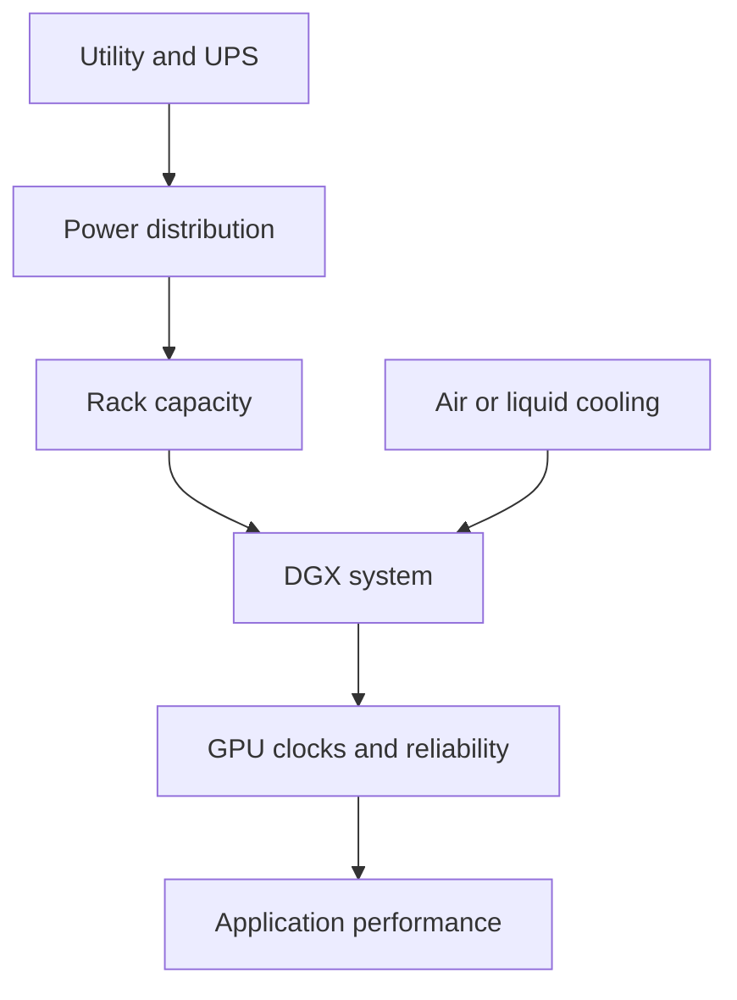
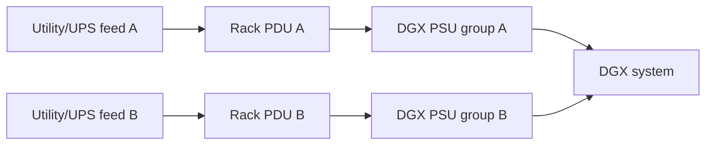
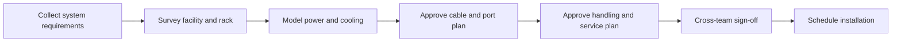

# Power, Cooling, and Rack Readiness

A DGX deployment can fail before the first workload starts. The most common reason is not CUDA, networking, or scheduling. It is an incomplete facility design.

High-density AI systems combine GPUs, CPUs, memory, network adapters, storage, fans, and redundant power supplies in a compact enclosure. The system may fit in the rack while exceeding the rack's power, cooling, cabling, service-clearance, or floor-loading assumptions.

| Chapter field | Value |
|---|---|
| Difficulty | Intermediate |
| Estimated reading time | 35–45 minutes |
| Prerequisites | Chapters 01–03 |
| Primary outcome | Produce a DGX rack-readiness and acceptance plan |

## 1. The Production Problem

A customer receives four DGX systems. The rack has enough empty units, but installation stops because the available power circuits cannot support the planned redundancy mode. In another row, the systems boot successfully but reduce clock frequency under sustained training because hot exhaust air recirculates into the inlet.

These are architecture failures, not installation inconveniences.

## 2. Learning Objectives

After completing this chapter, you will be able to:

- translate node requirements into rack-level power and cooling constraints;
- explain steady-state, peak, and redundant-power planning;
- identify airflow, liquid-cooling, and serviceability risks;
- design a pre-installation readiness review;
- troubleshoot thermal and power-related performance degradation.

## 3. Facility-to-Workload Chain

**Figure 5.4.1 — Facility constraints propagate to workload performance.** A GPU cannot sustain expected behavior when the rack cannot deliver power or remove heat.

## 4. Power Planning

Power planning should never use only the number printed on a single component data sheet. The relevant boundary is the complete system and the complete rack.

### Node-level inputs

- expected maximum system draw;
- power-supply count and redundancy mode;
- input-voltage requirements;
- connector and receptacle type;
- transient behavior;
- power cap policy;
- BMC-reported consumption and alert thresholds.

### Rack-level inputs

- number of DGX systems;
- network and storage devices in the same rack;
- PDU rating and phase balance;
- circuit redundancy;
- usable capacity after derating;
- UPS and generator behavior;
- expansion reserve.

A design that consumes all available rack capacity on day one has no safe operating margin.

## 5. Redundancy Is an Operating Mode

Redundant power supplies do not automatically create redundant service. The upstream path must also be independent.

**Figure 5.4.2 — End-to-end redundant power path.** Two power cords connected to the same upstream failure domain do not provide meaningful redundancy.

During design review, ask whether the system can continue operating after losing either feed without overloading the surviving path.

## 6. Cooling Architecture

The cooling strategy must remove the heat created by the entire rack under sustained workload.

### Air-cooled considerations

- front-to-back airflow alignment;
- containment and blanking panels;
- inlet-temperature consistency;
- fan operating range;
- cable obstruction;
- exhaust recirculation;
- row-level cooling capacity.

### Liquid-cooled considerations

- facility water compatibility;
- coolant distribution unit capacity;
- supply and return temperature;
- pressure and flow requirements;
- leak detection;
- quick-disconnect procedure;
- maintenance isolation;
- response to loss of flow.

:::caution
Liquid cooling moves part of the thermal problem into a new infrastructure layer. It does not remove operational responsibility.
:::

## 7. Density and Placement

A rack design must account for more than rack units.

| Constraint | Why it matters |
|---|---|
| Static weight | Rack and floor loading must remain within limits |
| Center of gravity | Heavy systems require safe installation position and handling |
| Service clearance | Components must be replaceable without unsafe work |
| Cable bend radius | Dense network cabling can obstruct airflow or exceed limits |
| PDU placement | Power connectors must remain accessible |
| Cooling distribution | High-density systems may need specific rack positions or row design |

Place heavy equipment using approved lifting procedures. Do not treat a DGX system as a conventional two-person server installation.

## 8. Cabling and Network Readiness

Before installation, validate:

- management-network ports;
- BMC/OOB ports;
- compute-fabric ports;
- storage/service-network ports;
- cable type and length;
- transceiver compatibility;
- switch-port allocation;
- labeling convention;
- separation of power and data paths;
- spare capacity.

A cable map should identify both ends of every connection and the logical role of the network.

## 9. Rack-Readiness Review

A formal readiness gate should occur before delivery.

**Figure 5.4.3 — DGX rack-readiness workflow.** Installation begins only after facility, network, platform, and safety teams agree that all constraints are satisfied.

### Required participants

- data-center facilities;
- electrical engineering;
- network engineering;
- platform engineering;
- storage engineering;
- security;
- vendor or deployment partner;
- health and safety.

## 10. Installation Acceptance

After physical installation, verify the platform under increasing load.

1. Inspect rack, rails, power, cooling, and cabling.
2. Confirm both power feeds and expected redundancy.
3. Validate BMC access and sensor state.
4. Boot and inspect hardware inventory.
5. Validate network links and topology.
6. Run GPU and fabric diagnostics.
7. Apply a sustained representative load.
8. Observe power, temperature, fan speed, and clocks.
9. Test alerting.
10. Capture the accepted baseline.

A short idle test cannot prove that the rack can sustain production training.

## 11. Production Troubleshooting

### Scenario: performance drops during long jobs

#### Symptoms

- throughput is normal at job start;
- GPU clocks fall after the system heats up;
- temperatures or fan speeds rise;
- shorter tests do not reproduce the issue.

#### Diagnosis

Use BMC telemetry, DCGM, and `nvidia-smi` to correlate:

- GPU temperature;
- clock frequency;
- power draw;
- fan state;
- inlet temperature;
- workload throughput.

#### Root causes

| Root cause | Evidence | Resolution |
|---|---|---|
| Hot-air recirculation | Inlet temperature rises with neighboring load | Correct containment and airflow |
| Rack cooling limit | Multiple systems degrade together | Increase row or rack cooling capacity |
| Power cap | Stable temperature but reduced power and clocks | Review approved power policy |
| Failed fan or sensor | BMC hardware alert | Repair component and revalidate |
| Liquid-flow degradation | Flow or coolant alarms | Restore cooling loop and inspect CDU |

### Prevention

- run sustained acceptance tests;
- alert on thermal margin, not only emergency thresholds;
- trend inlet and component temperatures;
- maintain rack-level power visibility;
- include facility telemetry in incident review.

## 12. Customer Scenario

A customer wants to place eight DGX systems in an existing general-purpose rack row. The row can physically hold the systems but lacks enough redundant power and cannot remove the projected heat.

The architect offers three options:

1. reduce node density per rack;
2. upgrade the row's power and cooling;
3. deploy in a purpose-built high-density area.

The decision is based on facility constraints, expansion plans, and operational risk—not on the desire to maximize rack-unit utilization.

## 13. Interview Preparation

### Architecture question

**What information do you need before approving a DGX rack?**

System power requirements, redundancy mode, PDU and circuit capacity, cooling method, rack density, weight, service clearance, network port map, cable plan, BMC access, facility margins, and growth requirements.

### Scenario question

**The system passes diagnostics but slows under sustained load. What do you investigate?**

Correlate clocks, power, temperatures, fan behavior, inlet conditions, and rack-level load. The likely cause may be facility or policy related rather than a defective GPU.

### Customer question

**Why can we not install all systems in the empty rack?**

Because rack units measure physical space only. Safe deployment also requires sufficient power, cooling, weight capacity, cabling, redundancy, and serviceability.

## 14. Summary

DGX rack readiness is a cross-disciplinary architecture activity. Power, cooling, weight, networking, serviceability, and safety must be validated before delivery and proven again under sustained load.

The operating principle is:

> Physical fit does not imply operational readiness.

## Cross References

- [Chapter 02 — Inside a DGX System](./chapter-02-inside-a-dgx-system)
- [Chapter 03 — DGX Management Plane](./chapter-03-dgx-management-plane)
- [Lab 01 — Build a DGX Health Baseline](./labs/lab-01-build-a-dgx-health-baseline)

## Further Reading

- [NVIDIA DGX systems documentation](https://docs.nvidia.com/dgx/)
- [NVIDIA DGX BasePOD reference architecture](https://docs.nvidia.com/dgx-basepod/reference-architecture-infrastructure-foundation-enterprise-ai/latest/reference-architectures.html)
