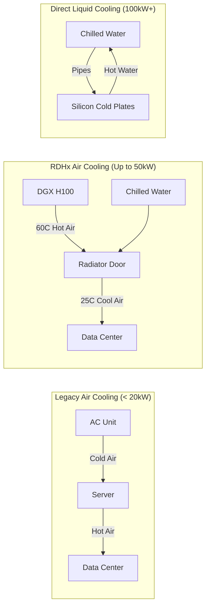

# Chapter 4 — Power, Cooling, and Facility Readiness

| Chapter metadata | Value |
|---|---|
| Volume | 05 — DGX Systems & Infrastructure |
| Difficulty | Expert |
| Estimated reading time | 35 minutes |
| Primary audience | DevOps, SRE, Platform, Cloud and Infrastructure Engineers |
| Core question | Why does a single rack of DGX servers require as much electricity as a small suburban neighborhood? |

## Introduction

In standard cloud engineering, you never think about thermodynamics. In AI infrastructure, thermodynamics is the ultimate, non-negotiable limit of your scale.

When you pack thousands of 700-watt GPUs into a confined space, the electrical and thermal density reaches levels unseen in traditional enterprise IT. If a standard web server is a space heater, a DGX H100 rack is a blast furnace. 

If you design the perfect Kubernetes architecture and the perfect InfiniBand network, but you fail to calculate the cooling requirements, your $50 Million cluster will turn on, instantly hit 95°C, thermal-throttle to 10% performance, and trigger emergency physical shutdowns to prevent the silicon from melting.

A Senior AI Infrastructure Architect must speak the language of facilities: Kilowatts (kW), three-phase power, and liquid cooling.

## 1. The Power Crisis (High Density Compute)

A traditional enterprise server rack typically consumes between **5 kW and 15 kW** of power.
A single NVIDIA DGX H100 server consumes **10.2 kW**.
If you put 4 of them in a single rack (leaving space for network switches), the rack consumes over **40 kW**.

### The End of 120V Wall Power
You cannot plug a DGX into a standard wall outlet. 
To deliver 40 kW of power to a single rack, data centers must route thick, heavy-gauge high-voltage cables under the floor. They use **3-Phase Power** (typically 208V to 415V in the US). 
Each rack is equipped with intelligent PDUs (Power Distribution Units) that carefully balance the electrical phases. If the phases become unbalanced, the power lines overheat, and the breakers trip, crashing the cluster.

## 2. The Cooling Crisis (The Limits of Air)

When a server consumes 10.2 kW of electricity, physics dictates that almost exactly 10.2 kW of waste heat is generated. You must physically remove that heat from the room.

### Standard Air Cooling (Failing)
Traditional data centers use CRAC (Computer Room Air Conditioning) units to blow cold air up through perforated floor tiles. This works up to about 15 kW per rack. Beyond that, the volume of air required is simply too massive; the air physically cannot move fast enough to capture the heat. 

### Rear Door Heat Exchangers (RDHx)
To survive a 40kW DGX H100 rack using air, you must attach an RDHx. 
This is literally a massive car radiator bolted to the back door of the server rack. Chilled water flows through the radiator door. As the 60°C (140°F) exhaust air blasts out the back of the servers, it passes through the radiator door and is instantly cooled back down to room temperature before it enters the data center aisle.

### Direct Liquid Cooling (DLC) - The B200 Era
With the Blackwell generation (B200), a single GPU consumes over 1,000 Watts. Air cooling, even with an RDHx, has reached the absolute limit of physics.
The **GB200 NVL72 rack** consumes over **100 kW**. 
It mandates **Direct Liquid Cooling (DLC)**. 
Copper cold-plates are bolted directly onto the naked GPU and CPU silicon. A Coolant Distribution Unit (CDU) pumps chilled fluid silently through the servers, capturing the heat directly at the source. There are almost no fans. 

## Architectural Diagram: The Transition to Liquid

## 3. Weight and Structural Integrity

Electricity and water are not the only physical limits. 
A single DGX H100 weighs nearly 300 lbs (130 kg). 
If you put four of them into a rack, along with heavy PDUs, massive network switches, and thick copper cables, the rack can easily exceed **2,500 lbs (1,100 kg)**.

Many traditional raised-floor data centers are only rated to support 1,500 lbs per floor tile. Rolling a DGX rack across a legacy data center floor can literally crack the concrete and cause the rack to crash through the floor.

## Customer Scenario (Senior Level)

**The Situation:**
A CTO purchased five DGX H100 servers for a new AI initiative. The facilities manager calls you in a panic. "We don't have enough power to run these 5 servers in a single row. However, we have empty racks scattered randomly across the data center. I am going to install one DGX server in Row A, one in Row F, two in Row M, and one in Row Z, spreading the power load out. Then we'll connect them over the network."

**The Senior Architect Response:**
"We cannot physically scatter the servers across the data center without destroying the cluster's ability to train models.

AI clusters are bound by the strict length limitations of high-speed interconnect cables. To connect these 5 servers, they must all plug into a central InfiniBand or Spectrum-X leaf switch to enable GPUDirect RDMA. 

If we place the servers in different rows, the distance to the central switch will likely exceed 30 meters. The high-speed Active Electrical Cables (AEC) or multi-mode fiber optics required for 400 Gbps NDR InfiniBand simply cannot reliably push signals across those distances without extreme signal degradation or requiring prohibitively expensive long-haul optical transceivers. 

The AI Factory architecture mandates **High-Density Islands**. The servers must be physically adjacent in the exact same row to keep the InfiniBand cables as short as possible (under 3 meters is ideal). We must upgrade the power delivery to a single row to create this high-density island, rather than scattering the servers and breaking the network topology."

## Interview Preparation

**Conceptual:** Why is Direct Liquid Cooling (DLC) becoming mandatory for Blackwell (B200) architectures? *(Hint: A single B200 GPU consumes 1,000+ Watts, pushing rack densities well past 100kW. Air physically cannot transfer that magnitude of heat fast enough).*

**Architecture:** What is a Rear Door Heat Exchanger (RDHx)? *(Hint: A water-chilled radiator door attached to the back of an air-cooled rack. It captures the extreme heat generated by the servers and cools the air before it exits back into the data center, preventing the room from overheating).*
