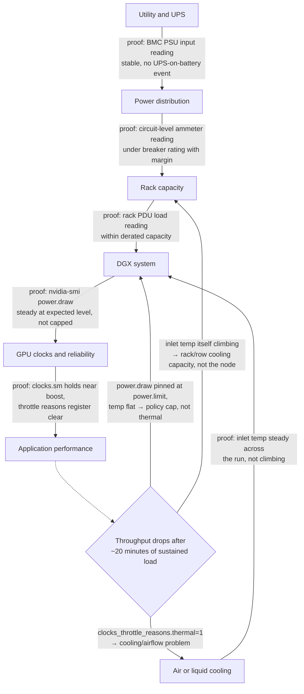
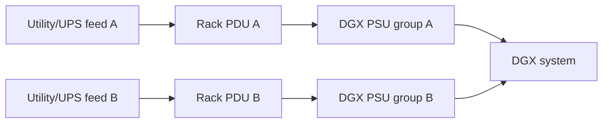
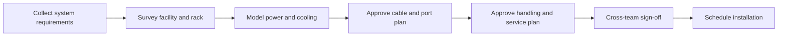

# Power, Cooling, and Rack Readiness

A DGX deployment can fail before the first workload starts. The most common reason is not CUDA, networking, or scheduling. It is an incomplete facility design.

High-density AI systems combine GPUs, CPUs, memory, network adapters, storage, fans, and redundant power supplies in a compact enclosure. The system may fit in the rack while exceeding the rack's power, cooling, cabling, service-clearance, or floor-loading assumptions.

| Chapter field | Value |
|---|---|
| Difficulty | Intermediate |
| Estimated reading time | 35–45 minutes |
| Prerequisites | Chapters 01–03 |
| Primary outcome | Produce a DGX rack-readiness and acceptance plan |

## 1. The Production Problem

A customer receives four DGX systems. The rack has enough empty units, but installation stops because the available power circuits cannot support the planned redundancy mode. In another row, the systems boot successfully but reduce clock frequency under sustained training because hot exhaust air recirculates into the inlet.

These are architecture failures, not installation inconveniences.

## 2. Learning Objectives

After completing this chapter, you will be able to:

- translate node requirements into rack-level power and cooling constraints;
- explain steady-state, peak, and redundant-power planning;
- identify airflow, liquid-cooling, and serviceability risks;
- design a pre-installation readiness review;
- troubleshoot thermal and power-related performance degradation.

## 3. Facility-to-Workload Chain



**Figure 5.4.1 — Facility constraints propagate to workload performance.** Each edge names the telemetry that proves that stage is not the limiter. The branch reflects this chapter's actual diagnostic content: a throughput drop that only appears after sustained load (not at job start) is a facility signature, and `nvidia-smi`'s throttle-reason bitmask plus inlet-temperature trend — not the GPU model number — tells you which of the three facility layers to chase.

## 4. Power Planning

Power planning should never use only the number printed on a single component data sheet. The relevant boundary is the complete system and the complete rack.

### Node-level inputs

- expected maximum system draw;
- power-supply count and redundancy mode;
- input-voltage requirements;
- connector and receptacle type;
- transient behavior;
- power cap policy;
- BMC-reported consumption and alert thresholds.

### Rack-level inputs

- number of DGX systems;
- network and storage devices in the same rack;
- PDU rating and phase balance;
- circuit redundancy;
- usable capacity after derating;
- UPS and generator behavior;
- expansion reserve.

A design that consumes all available rack capacity on day one has no safe operating margin.

➕ **Worked example — steady-state versus nameplate, with real numbers:** an 8-GPU DGX-class node with GPUs rated at 700W each has a GPU-only nameplate ceiling of 8 × 700W = 5,600W, and total system nameplate (adding CPUs, memory, NICs, storage, fans) commonly lands in the 10-11kW range for planning purposes (illustrative figure — consult the specific system's datasheet for the exact value). Sustained training draw is typically 65-80% of that nameplate figure, not 100% — so a realistic sustained draw is roughly 6.5-8.8kW per node. The planning mistake this chapter warns about is provisioning a rack's PDU capacity against the *lower*, sustained-looking number instead of the nameplate ceiling: a job that briefly hits near-peak power during an all-reduce burst on a rack provisioned only for the "typical" 7kW figure can trip a breaker that was never actually oversized, taking down every node on that circuit rather than just the one node that spiked.

## 5. Redundancy Is an Operating Mode

Redundant power supplies do not automatically create redundant service. The upstream path must also be independent.



**Figure 5.4.2 — End-to-end redundant power path.** Two power cords connected to the same upstream failure domain do not provide meaningful redundancy.

During design review, ask whether the system can continue operating after losing either feed without overloading the surviving path.

## 6. Cooling Architecture

The cooling strategy must remove the heat created by the entire rack under sustained workload.

### Air-cooled considerations

- front-to-back airflow alignment;
- containment and blanking panels;
- inlet-temperature consistency;
- fan operating range;
- cable obstruction;
- exhaust recirculation;
- row-level cooling capacity.

### Liquid-cooled considerations

- facility water compatibility;
- coolant distribution unit capacity;
- supply and return temperature;
- pressure and flow requirements;
- leak detection;
- quick-disconnect procedure;
- maintenance isolation;
- response to loss of flow.

:::caution
Liquid cooling moves part of the thermal problem into a new infrastructure layer. It does not remove operational responsibility.
:::

## 7. Density and Placement

A rack design must account for more than rack units.

| Constraint | Why it matters |
|---|---|
| Static weight | Rack and floor loading must remain within limits |
| Center of gravity | Heavy systems require safe installation position and handling |
| Service clearance | Components must be replaceable without unsafe work |
| Cable bend radius | Dense network cabling can obstruct airflow or exceed limits |
| PDU placement | Power connectors must remain accessible |
| Cooling distribution | High-density systems may need specific rack positions or row design |

Place heavy equipment using approved lifting procedures. Do not treat a DGX system as a conventional two-person server installation.

## 8. Cabling and Network Readiness

Before installation, validate:

- management-network ports;
- BMC/OOB ports;
- compute-fabric ports;
- storage/service-network ports;
- cable type and length;
- transceiver compatibility;
- switch-port allocation;
- labeling convention;
- separation of power and data paths;
- spare capacity.

A cable map should identify both ends of every connection and the logical role of the network.

## 9. Rack-Readiness Review

A formal readiness gate should occur before delivery.



**Figure 5.4.3 — DGX rack-readiness workflow.** Installation begins only after facility, network, platform, and safety teams agree that all constraints are satisfied.

### Required participants

- data-center facilities;
- electrical engineering;
- network engineering;
- platform engineering;
- storage engineering;
- security;
- vendor or deployment partner;
- health and safety.

## 10. Installation Acceptance

After physical installation, verify the platform under increasing load.

1. Inspect rack, rails, power, cooling, and cabling.
2. Confirm both power feeds and expected redundancy.
3. Validate BMC access and sensor state.
4. Boot and inspect hardware inventory.
5. Validate network links and topology.
6. Run GPU and fabric diagnostics.
7. Apply a sustained representative load.
8. Observe power, temperature, fan speed, and clocks.
9. Test alerting.
10. Capture the accepted baseline.

A short idle test cannot prove that the rack can sustain production training.

## 11. Production Troubleshooting

### Scenario: performance drops during long jobs

#### Symptoms

- throughput is normal at job start;
- GPU clocks fall after the system heats up;
- temperatures or fan speeds rise;
- shorter tests do not reproduce the issue.

#### Diagnosis

Use BMC telemetry, DCGM, and `nvidia-smi` to correlate:

- GPU temperature;
- clock frequency;
- power draw;
- fan state;
- inlet temperature;
- workload throughput.

#### Root causes

| Root cause | Evidence | Resolution |
|---|---|---|
| Hot-air recirculation | Inlet temperature rises with neighboring load | Correct containment and airflow |
| Rack cooling limit | Multiple systems degrade together | Increase row or rack cooling capacity |
| Power cap | Stable temperature but reduced power and clocks | Review approved power policy |
| Failed fan or sensor | BMC hardware alert | Repair component and revalidate |
| Liquid-flow degradation | Flow or coolant alarms | Restore cooling loop and inspect CDU |

➕ **Row 1 and Row 3, told apart with real telemetry — this is the single most common "is it thermal or is it a power policy" confusion in the field, and the two look almost identical from `nvidia-smi` alone unless you read the right field:**

```text
# Minute 2 of the job (both cases look identical here)
$ nvidia-smi --query-gpu=clocks.sm,power.draw,power.limit,temperature.gpu --format=csv
clocks.sm [MHz], power.draw [W], power.limit [W], temperature.gpu [C]
1980, 690, 700, 54

# Minute 25 — CASE A (hot-air recirculation / Row 1)
1290, 480, 700, 79   ← temp climbing toward threshold, power fell WITH temp, well under its 700W cap

# Minute 25 — CASE B (power cap / Row 3)
1450, 700, 700, 61   ← temp barely moved, power PINNED at the 700W limit, clock fell because power hit its ceiling
```
The field that disambiguates them is `power.draw` relative to `power.limit`, read alongside temperature trend. Case A shows power *falling* as temperature rises — the GPU is throttling clocks specifically because it's getting hot, a cooling/airflow problem (Row 1). Case B shows power *pinned exactly at the cap* while temperature stays low — the GPU never got hot enough to need thermal protection, it simply hit an administrative or hardware power ceiling (Row 3). Confirm the mechanism directly rather than inferring it:
```bash
$ nvidia-smi --query-gpu=clocks_throttle_reasons.active --format=csv
# Case A shows a thermal bit set (SW_THERMAL_SLOWDOWN / HW_THERMAL_SLOWDOWN)
# Case B shows a power bit set (SW_POWER_CAP) with thermal bits clear
```
Treating Case B as a cooling problem wastes a facilities dispatch; treating Case A as a policy problem leaves a genuinely overheating rack running until something trips a hardware protection limit.

### Prevention

- run sustained acceptance tests;
- alert on thermal margin, not only emergency thresholds;
- trend inlet and component temperatures;
- maintain rack-level power visibility;
- include facility telemetry in incident review.

## 12. Customer Scenario

A customer wants to place eight DGX systems in an existing general-purpose rack row. The row can physically hold the systems but lacks enough redundant power and cannot remove the projected heat.

The architect offers three options:

1. reduce node density per rack;
2. upgrade the row's power and cooling;
3. deploy in a purpose-built high-density area.

The decision is based on facility constraints, expansion plans, and operational risk—not on the desire to maximize rack-unit utilization.

## 13. Interview Preparation

### Architecture question

**What information do you need before approving a DGX rack?**

"I'd want the full chain from utility to workload, not just what fits in rack units. Concretely: the node's steady-state power draw under sustained load — not the idle number and not just the nameplate number, because those can differ by 20-30% — the redundancy mode and whether the two feeds are actually independent upstream, the PDU and circuit capacity after derating, the cooling method and whether the row has headroom for this density, the weight and service clearance, and the network port map and cable plan. If I only get the nameplate power figure and rack-unit count, I'd push back and ask for the sustained-load number specifically, because that's the number that actually determines whether the breaker trips six months from now."

### Scenario question

**The system passes diagnostics but slows under sustained load. What do you investigate?**

"The fact that it passes diagnostics but fails only under sustained load is itself the clue — it rules out a hard fault and points at something that accumulates over time, which in practice means thermal or power. I'd pull `nvidia-smi` clocks, power draw versus power limit, and temperature side by side across the run, not just at one point in time. If power draw is falling as temperature climbs, that's thermal throttling — a cooling or airflow problem. If power is pinned exactly at its limit while temperature stays flat, that's a power cap, which is a policy question, not a hardware defect. I would not default to 'replace the GPU' — the pattern of degrading only under sustained load, on a system that just passed diagnostics, points at facility conditions almost every time."

### Customer question

**Why can we not install all systems in the empty rack?**

"Because 'the rack has empty slots' only answers the space question, and space is usually the easiest constraint to satisfy. What actually gates a high-density GPU deployment is power and cooling capacity, which don't scale the same way rack units do — you can have twelve empty rack units and enough power for four systems. I'd rather tell a customer that up front than let them find out mid-install when a breaker trips or a rack starts thermal throttling under real load. The fix is usually straightforward — reduce density per rack, upgrade the row's power and cooling, or use a purpose-built high-density area — but it has to be a deliberate choice, not something discovered after the hardware is already racked."

## 14. Summary

DGX rack readiness is a cross-disciplinary architecture activity. Power, cooling, weight, networking, serviceability, and safety must be validated before delivery and proven again under sustained load.

The operating principle is:

> Physical fit does not imply operational readiness.

## Cross References

- [Chapter 02 — Inside a DGX System](./chapter-02-inside-a-dgx-system)
- [Chapter 03 — DGX Management Plane](./chapter-03-dgx-management-plane)
- [Lab 01 — Build a DGX Health Baseline](./labs/lab-01-build-a-dgx-health-baseline)

## Further Reading

- [NVIDIA DGX systems documentation](https://docs.nvidia.com/dgx/)
- [NVIDIA DGX BasePOD reference architecture](https://docs.nvidia.com/dgx-basepod/reference-architecture-infrastructure-foundation-enterprise-ai/latest/reference-architectures.html)
