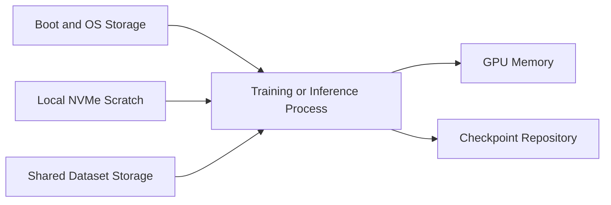
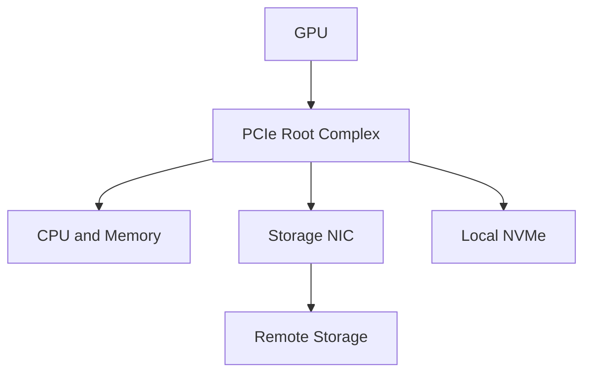

# DGX Storage and Data Paths

A customer installs a DGX system and validates that all GPUs are healthy. Training performance is still inconsistent. Some jobs start quickly, others wait minutes for data, and checkpoint operations pause the entire workload. The GPUs are not the problem. The data path is.

DGX is an accelerated system, not an isolated collection of GPUs. Data must move from persistent storage through the host and software stack into GPU memory. The slowest stage determines how effectively the system can use its accelerators.

| Chapter field | Value |
|---|---|
| Difficulty | Advanced |
| Estimated reading time | 35–45 minutes |
| Prerequisites | Chapters 01–04 |
| Primary outcome | Design and troubleshoot DGX storage paths from workload evidence |

## Learning Objectives

After completing this chapter, you will be able to:

- separate boot, local scratch, shared dataset, and checkpoint storage roles;
- trace a data path from storage to GPU memory;
- identify CPU, PCIe, network, filesystem, and application bottlenecks;
- explain when local NVMe, shared filesystems, object storage, and GPUDirect Storage are appropriate;
- design observability and failure tests for DGX storage.

## Storage Has Multiple Roles



**Figure 5.5.1 — A DGX system uses several storage classes.** Combining every role into one filesystem creates contention and unclear failure boundaries.

| Storage role | Primary objective | Typical concern |
|---|---|---|
| Boot and OS | Reliable system startup and package state | Capacity, RAID health, recoverability |
| Local scratch | High-throughput temporary data and cache | Persistence, cleanup, node affinity |
| Shared dataset | Concurrent access by many nodes | Aggregate throughput, metadata scale, network path |
| Checkpoint repository | Durable recovery state | Write bursts, consistency, retention, restart time |
| Object storage | Durable datasets and artifacts | Request overhead, staging, caching, credentials |

## The Data Path

A simplified buffered path is:

```text
storage → filesystem → kernel page cache → user process → host memory → PCIe or fabric → GPU memory
```

Depending on the platform and software stack, optimized paths can reduce CPU involvement and avoid unnecessary copies. GPUDirect Storage is one example, but it is not a universal switch. Filesystem, driver, kernel, storage target, topology, and application support must all align.

## Local NVMe

Local NVMe is useful for dataset staging, preprocessing caches, temporary shards, and high-speed scratch. It reduces dependence on the shared network during steady-state execution. Its main architectural limitation is locality: data on one node is not automatically available after rescheduling or node failure.

Use local storage when data can be reconstructed, replicated, or staged automatically. Do not treat scratch storage as the only durable copy of a checkpoint.

## Shared Filesystems

Large training clusters often require a parallel or distributed filesystem capable of feeding many workers. The design must account for both bulk throughput and metadata operations. Millions of small files can overload metadata services even when aggregate bandwidth appears sufficient.

Mitigations include dataset sharding, archive formats, preprocessing pipelines, local caching, and coordinated read patterns.

## Object Storage

Object storage is well suited to durable datasets, model artifacts, and lifecycle management. It may not provide the request latency or access semantics expected by every training framework. Many platforms therefore stage objects into local or shared high-performance storage before execution.

## Checkpoints Are a Recovery System

Checkpoint frequency balances lost work against write overhead. A checkpoint that takes longer than the intended interval creates continuous I/O pressure. A checkpoint that cannot be restored is not a backup.

Production validation must include:

- time to write;
- time to verify;
- time to restore;
- behavior when a node fails mid-write;
- retention and cleanup;
- consistency across distributed ranks.

## Topology Matters

Storage traffic shares PCIe, CPU, NIC, and memory resources with other traffic. A fast storage array can still underperform if the selected NIC is attached to a remote NUMA node or if GPU, NIC, and NVMe placement causes avoidable cross-socket movement.



**Figure 5.5.2 — Storage performance is topology-dependent.** Device placement and NUMA affinity influence the path even when every component is individually fast.

## Production Design Patterns

### Pattern A — Local staging

A workflow copies a dataset subset to local NVMe before training. Jobs use node affinity, verify the cache, and clean up after completion. Durable data remains in shared or object storage.

### Pattern B — Shared high-performance training filesystem

All nodes read directly from a parallel filesystem. The platform team validates aggregate throughput, metadata behavior, NIC affinity, and failure recovery at the intended node count.

### Pattern C — Hybrid cache

Frequently used data is cached locally, while cold datasets and checkpoints remain remote. The cache is treated as disposable and is populated through automation.

## Observability

| Layer | Signals |
|---|---|
| Application | data-loader wait, samples per second, checkpoint duration |
| Filesystem | read/write throughput, latency, metadata operations, errors |
| Block device | queue depth, utilization, latency, device health |
| Network | throughput, drops, retransmissions, RDMA counters where applicable |
| Host | CPU wait, page cache, NUMA movement, memory pressure |
| GPU | utilization gaps, PCIe traffic, stalled kernels |

## Troubleshooting Scenario

### Problem — GPUs oscillate between busy and idle

**Symptoms**

- periodic drops in GPU utilization;
- data-loader queue becomes empty;
- storage latency spikes;
- CPU I/O wait increases.

**Diagnosis**

Correlate application step time with filesystem latency, local block metrics, network counters, and data-loader behavior. Compare warm-cache and cold-cache runs. Determine whether the bottleneck is bulk bandwidth, metadata, decompression, or request serialization.

**Root cause**

The input pipeline cannot sustain the GPU consumption rate.

**Resolution**

Stage data locally, increase loader parallelism carefully, change the dataset format, improve metadata capacity, correct NUMA placement, or scale the storage path based on measured demand.

**Prevention**

Include full dataset-path tests in cluster acceptance. Synthetic GPU tests alone do not validate an AI system.

## Customer Scenario

A customer purchases eight DGX systems and connects them to an existing enterprise NAS. The NAS is reliable but was sized for office and analytics workloads. The architect should benchmark the expected aggregate training pattern, including metadata and checkpoint bursts. The likely answer may be a dedicated high-performance tier, local caching, or a parallel filesystem—not simply more NAS capacity.

## Interview Preparation

### Architecture question

Why can a DGX system with healthy GPUs still deliver poor training performance?

A strong answer traces the complete data path and discusses storage, metadata, CPU preprocessing, NUMA, network, caching, and checkpoint behavior.

### Scenario question

When should local NVMe be used for training data?

When the data is staged or reproducible, node locality is controlled, and the design does not confuse scratch capacity with durable storage.

### Troubleshooting question

What evidence distinguishes a storage bottleneck from a compute bottleneck?

Correlate GPU idle periods with loader wait, I/O latency, filesystem counters, network throughput, and CPU I/O wait.

## Key Takeaways

- DGX storage must be designed by role, not as one undifferentiated capacity pool.
- Local NVMe improves locality but does not replace durable shared storage.
- Shared storage must be validated for aggregate throughput and metadata behavior.
- Checkpoints are part of the recovery architecture.
- Topology and observability are essential to explaining GPU starvation.

## Cross References

- [Inside a DGX System](./chapter-02-inside-a-dgx-system)
- [Power, Cooling, and Rack Readiness](./chapter-04-power-cooling-and-rack-readiness)
- [DGX Networking and Fabric Integration](./chapter-06-dgx-networking-and-fabric-integration)
- [Lab 02 — Validate DGX Data and Network Paths](./labs/lab-02-validate-dgx-data-and-network-paths)
