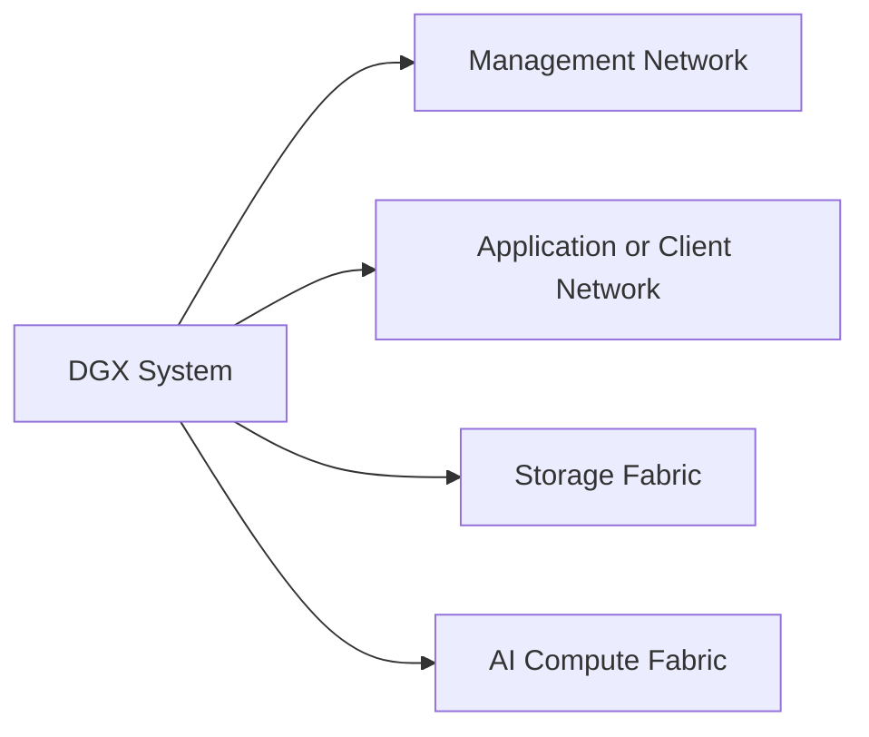
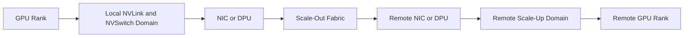

# DGX Networking and Fabric Integration

A DGX server passes every local diagnostic, yet a multi-node training job scales poorly. The application team points to the GPUs. The network team points to the framework. Both may be looking at only one part of the system.

A DGX deployment usually participates in several networks with different objectives. Management traffic requires reachability and control. Storage traffic requires sustained data movement. Scale-out AI traffic requires low-latency, high-throughput communication with predictable loss and congestion behavior. Combining these roles without an explicit design creates hidden contention and difficult incidents.

| Chapter field | Value |
|---|---|
| Difficulty | Advanced |
| Estimated reading time | 40–50 minutes |
| Prerequisites | Chapters 01–05 |
| Primary outcome | Integrate DGX systems into production fabrics with clear traffic roles and validation evidence |

## Learning Objectives

After completing this chapter, you will be able to:

- distinguish management, application, storage, and compute fabrics;
- trace a distributed GPU communication path;
- explain why NIC-to-GPU topology and process placement matter;
- compare Ethernet and InfiniBand design concerns without declaring a universal winner;
- build a fabric acceptance and troubleshooting plan.

## Multiple Networks, Different Jobs

**Figure 5.6.1 — A production DGX system commonly serves multiple traffic classes.** Separation can be physical, logical, or both, but the responsibilities must remain explicit.

| Traffic class | Typical purpose | Primary concern |
|---|---|---|
| Management | BMC, SSH, provisioning, monitoring, orchestration | Reliability, security, out-of-band access |
| Application | User access, APIs, control services | Availability, segmentation, north-south policy |
| Storage | Dataset reads and checkpoint writes | Sustained throughput, locality, burst handling |
| Compute | NCCL and distributed training communication | Latency, bandwidth, congestion, topology |

## Scale-Up versus Scale-Out

Inside a DGX system, GPUs communicate through the local high-bandwidth topology. Across DGX systems, traffic leaves through network adapters and traverses the external fabric.

**Figure 5.6.2 — A distributed collective crosses several layers.** Performance depends on rank placement, local topology, NIC affinity, transport selection, switch behavior, and application communication patterns.

## Why Topology Matters

A NIC may be closer to some GPUs than others through the PCIe and CPU topology. Communication libraries and job launchers can exploit this locality only when the platform exposes it correctly and rank placement is aligned.

Validate:

- GPU-to-NIC affinity;
- NUMA node association;
- link width and negotiated speed;
- peer-memory or RDMA support;
- selected network interface;
- process and container device visibility;
- switch port and fabric health.

A cable connected to the correct switch is not enough. The software path must use the intended adapter.

## Ethernet and InfiniBand

Both technologies can support AI infrastructure. Their production behavior depends on complete design and operations.

| Consideration | Ethernet-based AI fabric | InfiniBand fabric |
|---|---|---|
| Organizational familiarity | Often aligns with existing data-center teams | May require specialized fabric skills |
| Loss and congestion design | Requires deliberate QoS and congestion configuration for RDMA designs | Provides an integrated RDMA-oriented fabric model |
| Operations | Uses familiar Ethernet tooling plus AI-specific telemetry | Uses InfiniBand management, subnet, and fabric tooling |
| Integration | Can converge with broader network standards | Often deployed as a dedicated compute fabric |
| Decision basis | Existing standards, skills, workload scale, validated design | Scale, latency, communication pattern, support model |

The correct comparison is between validated end-to-end architectures, not protocol names in isolation.

## Container and Kubernetes Considerations

A containerized job must receive the correct GPU, network device, RDMA resources, routes, and security permissions. Common failure modes include:

- container sees GPUs but not RDMA devices;
- incorrect network interface is selected;
- host networking policy blocks expected traffic;
- MTU differs across the path;
- device plugins expose an incomplete resource set;
- rank placement ignores topology;
- a CNI path is used where direct fabric access was intended.

The platform team should validate both bare-metal and containerized paths if production uses containers.

## Acceptance Testing

A fabric acceptance plan should progress through layers:

1. link state and error counters;
2. point-to-point network bandwidth and latency;
3. GPU-aware point-to-point tests;
4. collective communication tests within one node;
5. collective tests across nodes;
6. representative distributed application;
7. failure and recovery tests.

Each stage isolates a smaller fault domain. Starting with a full training job makes diagnosis slower.

## Observability

| Layer | Signals |
|---|---|
| Physical | link state, lane errors, cable or transceiver health |
| Adapter | throughput, drops, retries, congestion, RDMA counters |
| Switch | port utilization, errors, congestion indicators, path balance |
| Host | NUMA, PCIe health, IRQ and CPU pressure |
| Collective library | selected interfaces, topology discovery, algorithm, timeout |
| Application | step time, communication fraction, scaling efficiency |

## Production Troubleshooting

### Problem — Multi-node NCCL test hangs

**Symptoms**

- local tests pass;
- remote ranks initialize but do not complete;
- timeout or transport errors appear;
- one or more interfaces show no traffic.

**Diagnosis**

Confirm name resolution, routes, interface selection, firewall policy, MTU, RDMA device visibility, fabric membership, and rank-to-node mapping. Compare the environment between hosts and inspect the communication library's debug output.

**Root cause examples**

- inconsistent interface naming;
- blocked control-plane port;
- missing RDMA device in a container;
- mismatched MTU;
- unhealthy switch path;
- incorrect transport selection.

**Resolution**

Correct the failing layer, then repeat validation from point-to-point tests upward. Do not change multiple fabric parameters simultaneously.

### Problem — Scaling efficiency declines after adding a rack

Inspect oversubscription, rail design, path balance, congestion, topology-aware placement, and whether the application communication pattern changed at the larger node count.

## Customer Scenario

A customer wants to place storage and distributed training traffic on the same high-speed fabric. The design may be valid, but it must model simultaneous dataset reads, checkpoint bursts, and collectives. The architect should define traffic classes, congestion behavior, telemetry, capacity headroom, and a failure policy. Dedicated fabrics may reduce interference, while a converged design may simplify infrastructure. The recommendation depends on measured workload overlap and operational capability.

## Interview Preparation

### Architecture question

Why can a high-bandwidth network still provide poor distributed training performance?

Discuss topology, congestion, message size, rank placement, transport selection, NUMA, application synchronization, and storage interference.

### Troubleshooting question

Local NCCL tests pass but multi-node tests fail. What is your sequence?

Validate physical and IP/RDMA connectivity, interface consistency, container device exposure, topology, point-to-point GPU communication, then collectives.

### Customer question

Should management and compute traffic share a network?

They can share physical infrastructure in some designs, but security, failure isolation, QoS, capacity, and operational risk must be evaluated explicitly.

## Key Takeaways

- DGX networking consists of multiple traffic roles.
- Distributed GPU communication crosses both local and external fabrics.
- Topology-aware rank and NIC placement influence performance.
- Ethernet and InfiniBand must be compared as complete operational architectures.
- Layered acceptance testing is the fastest route to a supportable cluster.

## Cross References

- [DGX Storage and Data Paths](./chapter-05-dgx-storage-and-data-paths)
- [Inside a DGX System](./chapter-02-inside-a-dgx-system)
- [Lab 02 — Validate DGX Data and Network Paths](./labs/lab-02-validate-dgx-data-and-network-paths)
