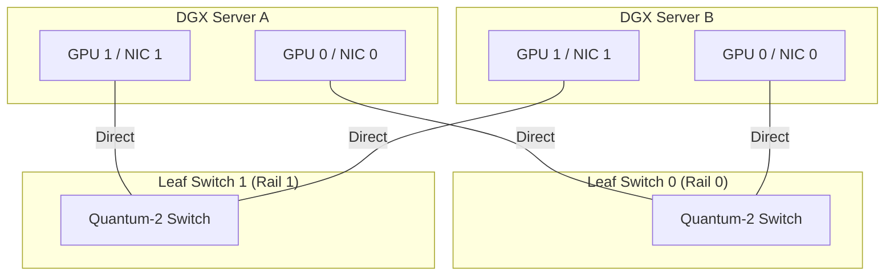

# Chapter 6 — Networking and Fabric Integration

| Chapter metadata | Value |
|---|---|
| Volume | 05 — DGX Systems & Infrastructure |
| Difficulty | Expert |
| Estimated reading time | 35 minutes |
| Primary audience | DevOps, SRE, Platform, Cloud and Infrastructure Engineers |
| Core question | Why does an AI Factory require four entirely separate physical networks? |

## Introduction

In standard enterprise IT, you have one network. You plug a server into a switch, assign an IP address, and route traffic via VLANs. 

If you attempt to use VLANs to manage traffic in an AI Factory, the cluster will fail. 

An NVIDIA DGX SuperPOD generates an apocalyptic amount of network traffic. During distributed training, the GPUs synchronize gradients (Compute traffic), read datasets (Storage traffic), and stream metrics to Prometheus (Management traffic) simultaneously. If these three traffic streams collide on the same physical switch, the massive burst of Compute traffic will instantly drop the Management packets, severing SSH connections and crashing the Kubernetes control plane.

To survive, a Senior Architect must design a **Multi-Plane Network Topology**. The networks must be physically air-gapped. 

## 1. The Four Planes of AI Networking

A modern DGX node is plugged into four completely isolated physical networks.

### 1. The Compute Fabric (The Backend)
*   **Purpose:** Exclusively for GPU-to-GPU synchronization (e.g., NCCL `AllReduce` operations during training).
*   **Hardware:** 400 Gbps or 800 Gbps InfiniBand (Quantum) or Lossless Ethernet (Spectrum-X).
*   **Connection:** ConnectX-7 NICs directly attached to the GPUs via PCIe switches for GPUDirect RDMA.
*   **Rule:** Absolutely no storage or management traffic is allowed on this fabric. 

### 2. The Storage Fabric
*   **Purpose:** Feeding datasets into the GPUs and saving multi-terabyte model checkpoints. 
*   **Hardware:** Often standard high-speed Ethernet (100G/400G) routed through the BlueField-3 DPUs.
*   **Rule:** Isolating storage from compute prevents a sudden checkpoint-save operation from causing microsecond-jitter in the GPU training synchronization.

### 3. The In-Band Management Fabric (The Frontend)
*   **Purpose:** SSH access, Kubernetes API traffic, Docker image pulls, and Prometheus telemetry scraping.
*   **Hardware:** Standard 10G/25G Enterprise Ethernet.
*   **Connection:** Plugs into the host OS (Linux).

### 4. The Out-Of-Band Management Fabric (OOB)
*   **Purpose:** Baseboard Management Controller (BMC) access, Redfish API commands, and remote console.
*   **Hardware:** Standard 1G Ethernet.
*   **Rule:** Physically isolated switch. Functions even if the server is powered off or crashed.

## 2. Rail-Optimized Topologies

How do you connect 1,000 GPUs together across the Compute Fabric without introducing latency bottlenecks? You use a **Rail-Optimized** design.

Inside a DGX, there are 8 GPUs (GPU 0 through 7). Each GPU has its own dedicated NIC (NIC 0 through 7). 
If you plug all 8 NICs into the exact same Top-of-Rack switch, you have created a standard "Fat Tree" topology. 

**NVIDIA's Rail-Optimized design does something different:**
1. NIC 0 from *Server 1* plugs into Switch 0.
2. NIC 0 from *Server 2* plugs into Switch 0. 
3. NIC 1 from *Server 1* plugs into Switch 1. 
4. NIC 1 from *Server 2* plugs into Switch 1.

By wiring the network so that "GPU 0 always talks to other GPU 0s on the exact same switch," you minimize the number of switch-hops (and therefore latency) required for the most common distributed training patterns. 

## Architectural Diagram: Rail Optimization

## Customer Scenario (Senior Level)

**The Situation:**
A Cloud Provider is building a massive GPU cluster for external tenants. To save money on cabling and switch ports, they decide to converge the Storage and Compute networks. They use 400G Ethernet switches, isolate the traffic using VLANs, and apply standard Quality of Service (QoS) to prioritize the Compute traffic.
During production, tenant jobs randomly hang and crash with NCCL timeout errors. 

**The Senior Architect Response:**
"Your converged network design has violated the latency requirements of distributed AI training. 

While VLANs and QoS provide logical isolation, they do not provide physical isolation. When a massive 100-Billion parameter model initiates a checkpoint save, it blasts terabytes of storage data into the network switches. Even with QoS prioritizing the GPU compute traffic, the physical buffer queues inside the network switches fill up with storage packets. 

When the GPU compute packets arrive, they encounter microsecond delays (jitter) waiting for the storage packets to clear the buffers. In traditional web networking, a 5-microsecond delay is invisible. In distributed training, if GPU 0 experiences a 5-microsecond delay, GPUs 1 through 10,000 must sit completely idle, halting the entire supercomputer. 

Furthermore, if a buffer overflows, packets are dropped. Dropped packets force TCP retransmissions, creating a catastrophic cascade of latency that triggers NCCL communication timeouts, crashing the training jobs. 

We must implement a **Physically Air-Gapped Network Topology**. The Storage traffic and the GPU Compute traffic must travel over entirely separate network interface cards, through separate physical cables, into separate physical leaf and spine switches. Only physical isolation guarantees the zero-jitter environment required for scale-out training."

## Interview Preparation

**Conceptual:** Why must an AI Factory have separate physical networks for Compute and Storage? *(Hint: To prevent massive storage bursts (like checkpoint saves) from overflowing switch buffers, which causes microsecond jitter and packet drops that crash sensitive GPU-to-GPU training synchronization).*

**Architecture:** Explain a Rail-Optimized network topology. *(Hint: Instead of plugging all NICs from one server into the same Top-of-Rack switch, NIC 0 from every server plugs into Switch 0, NIC 1 into Switch 1, etc. This creates direct, 1-hop paths between corresponding GPUs across the entire cluster, minimizing latency).*
