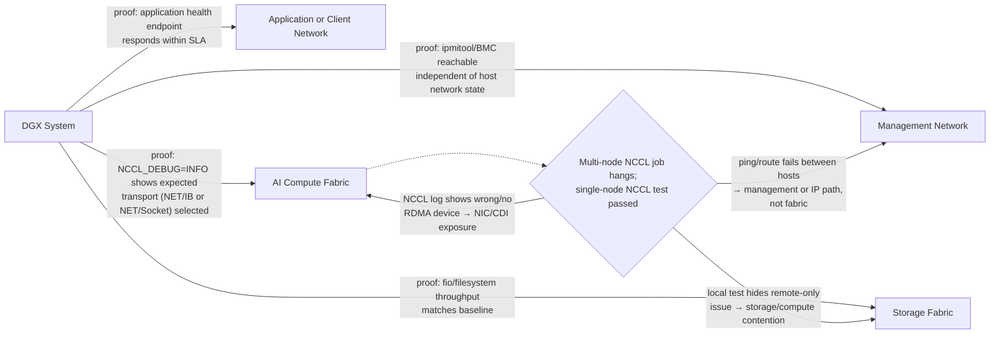
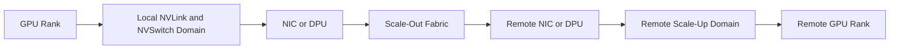

# DGX Networking and Fabric Integration

A DGX server passes every local diagnostic, yet a multi-node training job scales poorly. The application team points to the GPUs. The network team points to the framework. Both may be looking at only one part of the system.

A DGX deployment usually participates in several networks with different objectives. Management traffic requires reachability and control. Storage traffic requires sustained data movement. Scale-out AI traffic requires low-latency, high-throughput communication with predictable loss and congestion behavior. Combining these roles without an explicit design creates hidden contention and difficult incidents.

| Chapter field | Value |
|---|---|
| Difficulty | Advanced |
| Estimated reading time | 40–50 minutes |
| Prerequisites | Chapters 01–05 |
| Primary outcome | Integrate DGX systems into production fabrics with clear traffic roles and validation evidence |

## Learning Objectives

After completing this chapter, you will be able to:

- distinguish management, application, storage, and compute fabrics;
- trace a distributed GPU communication path;
- explain why NIC-to-GPU topology and process placement matter;
- compare Ethernet and InfiniBand design concerns without declaring a universal winner;
- build a fabric acceptance and troubleshooting plan.

## Multiple Networks, Different Jobs



**Figure 5.6.1 — A production DGX system commonly serves multiple traffic classes.** Each edge names the evidence that proves that traffic class is functioning, not just cabled. The decision diamond captures this chapter's most common real incident — a multi-node hang after a clean single-node pass — and routes it to the three places `NCCL_DEBUG` output and basic host-to-host connectivity checks would actually distinguish, instead of guessing at "the network."

| Traffic class | Typical purpose | Primary concern |
|---|---|---|
| Management | BMC, SSH, provisioning, monitoring, orchestration | Reliability, security, out-of-band access |
| Application | User access, APIs, control services | Availability, segmentation, north-south policy |
| Storage | Dataset reads and checkpoint writes | Sustained throughput, locality, burst handling |
| Compute | NCCL and distributed training communication | Latency, bandwidth, congestion, topology |

## Scale-Up versus Scale-Out

Inside a DGX system, GPUs communicate through the local high-bandwidth topology. Across DGX systems, traffic leaves through network adapters and traverses the external fabric.



**Figure 5.6.2 — A distributed collective crosses several layers.** Performance depends on rank placement, local topology, NIC affinity, transport selection, switch behavior, and application communication patterns.

## Why Topology Matters

A NIC may be closer to some GPUs than others through the PCIe and CPU topology. Communication libraries and job launchers can exploit this locality only when the platform exposes it correctly and rank placement is aligned.

➕ **Worked example — what a topology mismatch actually costs:** an 8-way all-reduce on a node where every GPU-to-NIC hop stays within its local PCIe switch (no cross-socket traversal) commonly achieves 80-90% of theoretical NVLink/NIC bus bandwidth in practice. If rank placement ignores topology and half the ranks' collective traffic is forced across the cross-socket UPI/Infinity-Fabric link to reach a NIC attached to the *other* socket, measured bus bandwidth for that collective can drop to roughly 40-60% of the topology-aware case (illustrative range — exact degradation depends on platform and collective size) — not because any single link is degraded, but because the collective is bound by its slowest participating rank, and every rank waits for the slowest one on every synchronization step. A 45% drop in effective collective bandwidth on a training job where communication is 25% of step time is roughly an 11% increase in total step time — silent, reproducible, and invisible to `nvidia-smi`, which is why `nvidia-smi topo -m` cross-referenced against launcher rank-to-GPU mapping is worth checking before any deeper NCCL debugging.

Validate:

- GPU-to-NIC affinity;
- NUMA node association;
- link width and negotiated speed;
- peer-memory or RDMA support;
- selected network interface;
- process and container device visibility;
- switch port and fabric health.

A cable connected to the correct switch is not enough. The software path must use the intended adapter.

## Ethernet and InfiniBand

Both technologies can support AI infrastructure. Their production behavior depends on complete design and operations.

| Consideration | Ethernet-based AI fabric | InfiniBand fabric |
|---|---|---|
| Organizational familiarity | Often aligns with existing data-center teams | May require specialized fabric skills |
| Loss and congestion design | Requires deliberate QoS and congestion configuration for RDMA designs | Provides an integrated RDMA-oriented fabric model |
| Operations | Uses familiar Ethernet tooling plus AI-specific telemetry | Uses InfiniBand management, subnet, and fabric tooling |
| Integration | Can converge with broader network standards | Often deployed as a dedicated compute fabric |
| Decision basis | Existing standards, skills, workload scale, validated design | Scale, latency, communication pattern, support model |

The correct comparison is between validated end-to-end architectures, not protocol names in isolation.

## Container and Kubernetes Considerations

A containerized job must receive the correct GPU, network device, RDMA resources, routes, and security permissions. Common failure modes include:

- container sees GPUs but not RDMA devices;
- incorrect network interface is selected;
- host networking policy blocks expected traffic;
- MTU differs across the path;
- device plugins expose an incomplete resource set;
- rank placement ignores topology;
- a CNI path is used where direct fabric access was intended.

The platform team should validate both bare-metal and containerized paths if production uses containers.

## Acceptance Testing

A fabric acceptance plan should progress through layers:

1. link state and error counters;
2. point-to-point network bandwidth and latency;
3. GPU-aware point-to-point tests;
4. collective communication tests within one node;
5. collective tests across nodes;
6. representative distributed application;
7. failure and recovery tests.

Each stage isolates a smaller fault domain. Starting with a full training job makes diagnosis slower.

## Observability

| Layer | Signals |
|---|---|
| Physical | link state, lane errors, cable or transceiver health |
| Adapter | throughput, drops, retries, congestion, RDMA counters |
| Switch | port utilization, errors, congestion indicators, path balance |
| Host | NUMA, PCIe health, IRQ and CPU pressure |
| Collective library | selected interfaces, topology discovery, algorithm, timeout |
| Application | step time, communication fraction, scaling efficiency |

## Production Troubleshooting

### Problem — Multi-node NCCL test hangs

**Symptoms**

- local tests pass;
- remote ranks initialize but do not complete;
- timeout or transport errors appear;
- one or more interfaces show no traffic.

**Diagnosis**

Confirm name resolution, routes, interface selection, firewall policy, MTU, RDMA device visibility, fabric membership, and rank-to-node mapping. Compare the environment between hosts and inspect the communication library's debug output.

➕ **Real `NCCL_DEBUG=INFO` output, annotated — the log that actually tells you which layer failed:**

```text
$ NCCL_DEBUG=INFO NCCL_DEBUG_SUBSYS=INIT,NET python train.py
node0:1234:1234 [0] NCCL INFO Bootstrap : Using eth0:10.1.2.10<0>
node0:1234:1234 [0] NCCL INFO NET/IB : No device found.
node0:1234:1234 [0] NCCL INFO NET/Socket : Using [0]eth0:10.1.2.10<0>
node0:1234:1234 [0] NCCL INFO Using network Socket
...
node0:1234:1289 [0] NCCL INFO Timeout waiting for recv from rank 8, node1
```
Two separate findings in one log, and both matter: `NET/IB : No device found` means NCCL looked for an RDMA-capable InfiniBand/RoCE device, found none visible to the process, and silently fell back to `NET/Socket` (plain TCP over `eth0`) — a job that "works" but runs at a fraction of expected collective bandwidth, which is a distinct failure from the eventual `Timeout waiting for recv from rank 8` that follows. In a container, the first line is the one to chase — it usually means the RDMA device wasn't exposed into the container (a CDI/device-plugin gap), not that the physical NIC is broken; check with `ibv_devices` run inside the same container the job runs in, not just on the bare host, since host and container visibility differ.

```text
$ ibv_devices    # run inside the container
    device                 node GUID
    ------              ----------------
# (empty — this is the smoking gun for the fallback above)

$ ibv_devices    # run on the bare host
    device                 node GUID
    ------              ----------------
    mlx5_0              98039b03009c1a40
```
The device exists on the host and is invisible inside the container — that gap, not a cabling or switch problem, is what produced the `NET/Socket` fallback and the eventual multi-node timeout. This is exactly the "container sees GPUs but not RDMA devices" failure mode this chapter lists, made concrete with the log line that proves it.

**Root cause examples**

- inconsistent interface naming;
- blocked control-plane port;
- missing RDMA device in a container;
- mismatched MTU;
- unhealthy switch path;
- incorrect transport selection.

**Resolution**

Correct the failing layer, then repeat validation from point-to-point tests upward. Do not change multiple fabric parameters simultaneously.

### Problem — Scaling efficiency declines after adding a rack

Inspect oversubscription, rail design, path balance, congestion, topology-aware placement, and whether the application communication pattern changed at the larger node count.

## Customer Scenario

A customer wants to place storage and distributed training traffic on the same high-speed fabric. The design may be valid, but it must model simultaneous dataset reads, checkpoint bursts, and collectives. The architect should define traffic classes, congestion behavior, telemetry, capacity headroom, and a failure policy. Dedicated fabrics may reduce interference, while a converged design may simplify infrastructure. The recommendation depends on measured workload overlap and operational capability.

## Interview Preparation

### Architecture question

**Why can a high-bandwidth network still provide poor distributed training performance?**

"Because bandwidth is a ceiling, not a guarantee — the collective only goes as fast as its slowest contributing path, and there are a lot of ways to be slow that have nothing to do with the link speed printed on the NIC. Rank placement that ignores GPU-to-NIC topology can force half a job's traffic across a cross-socket hop even on a 400Gb/s fabric. Congestion from storage or another tenant sharing the same switch can add latency that a synchronous collective can't absorb. Small message sizes can leave a fast fabric mostly idle because the job is latency-bound, not bandwidth-bound, at that message size. I've seen a nominally 400Gb/s fabric deliver training performance that looked more like a 100Gb/s one purely because rank placement wasn't topology-aware — the fabric was never the bottleneck, the mapping onto it was."

### Troubleshooting question

**Local NCCL tests pass but multi-node tests fail. What is your sequence?**

"I'd move outward in layers rather than jump straight to NCCL debug logs. First, plain connectivity — can the hosts reach each other at the IP layer, is DNS or hostname resolution consistent, is a firewall rule blocking a control port. Then interface and RDMA device consistency — same NIC naming, same driver version, and critically, is the RDMA device actually visible *inside the container* if this is containerized, because host-level visibility and container-level visibility are different questions. Only after those pass would I run `NCCL_DEBUG=INFO` and read what transport it actually selected — if it silently fell back from `NET/IB` to `NET/Socket`, that's the answer right there, and it would have looked like a generic hang without the debug log to say so."

### Customer question

**Should management and compute traffic share a network?**

"It's possible, but I wouldn't default to it without an explicit conversation about the trade-off. Sharing physical infrastructure can simplify the build and reduce cost, but it means congestion on your compute fabric can degrade your ability to manage the cluster at the exact moment something's already going wrong — and a security boundary between tenant workload traffic and administrative control becomes harder to enforce. My default recommendation is to keep them logically or physically separate unless there's a specific capacity or cost constraint that makes convergence the right call, and even then I'd want QoS guarantees on the management path so it can't be starved out."

## Key Takeaways

- DGX networking consists of multiple traffic roles.
- Distributed GPU communication crosses both local and external fabrics.
- Topology-aware rank and NIC placement influence performance.
- Ethernet and InfiniBand must be compared as complete operational architectures.
- Layered acceptance testing is the fastest route to a supportable cluster.

## Cross References

- [DGX Storage and Data Paths](./chapter-05-dgx-storage-and-data-paths)
- [Inside a DGX System](./chapter-02-inside-a-dgx-system)
- [Chapter 07 — DGX GH200 and GB200 NVL72 Systems](./chapter-07-dgx-gh200-and-gb200-systems)
- [Lab 02 — Validate DGX Data and Network Paths](./labs/lab-02-validate-dgx-data-and-network-paths)
