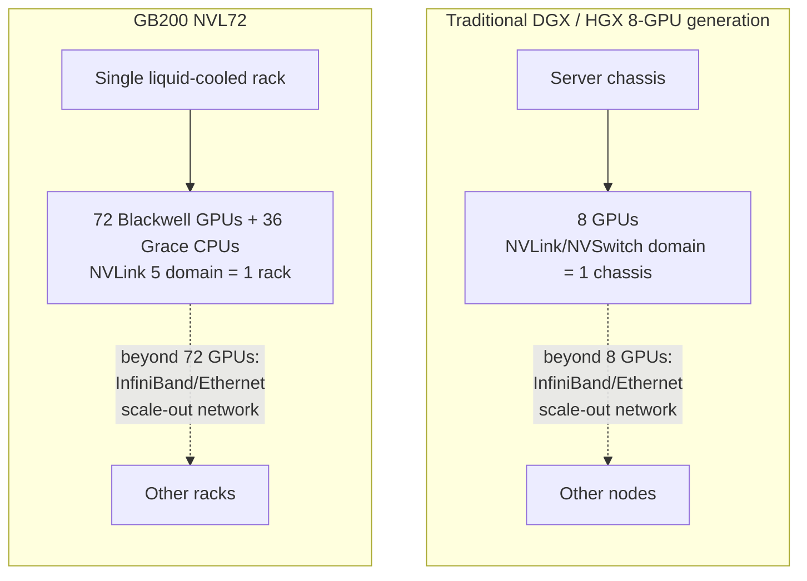

# DGX GH200 and GB200 NVL72 Systems

Every DGX system this volume has described so far shares one architectural assumption, stated explicitly in Chapter 02: the NVLink/NVSwitch fabric connects the GPUs *inside one chassis*, and anything beyond that chassis is cluster networking — InfiniBand or Ethernet, a slower and categorically different path. That assumption held from the earliest DGX systems through DGX H100. It does not hold for GB200 NVL72.

This chapter covers two things that both fall under "DGX-class Grace-based systems" but change the operating model differently: DGX GH200, which is still a single-chassis system built around Grace Hopper superchips, and GB200 NVL72, which is not a chassis at all — it is a rack, sold and deployed as one unit, with a single NVLink domain spanning every GPU in it. Volume 04, Chapter 07 covered the Grace CPU and the superchip module itself; this chapter covers what NVIDIA builds when those superchips become a DGX-class product.

| Chapter field | Value |
|---|---|
| Difficulty | Advanced |
| Estimated reading time | 30–40 minutes |
| Prerequisites | Chapters 01–06, Volume 04 Chapter 07 |
| Primary outcome | Explain precisely what changes — and does not change — when the GPU fabric boundary moves from a chassis to a rack |

## Learning Objectives

After completing this chapter, you will be able to:

- place DGX GH200 correctly in the DGX lineup as a Grace-based, still-single-chassis system;
- explain why GB200 NVL72 is sold and operated as a rack, not a server;
- describe what changes when the NVLink domain boundary moves from "8 GPUs in a chassis" to "72 GPUs in a rack";
- explain why liquid cooling is not optional at NVL72's power density;
- reason about failure domains and maintenance differently for a rack-scale NVLink unit than for a traditional DGX server;
- answer the interview-standard "what's architecturally different about NVL72 versus a traditional DGX H100 cluster" question with precision.

## DGX GH200: Still a Chassis, Different Memory Model

DGX GH200 combines multiple GH200 (Grace Hopper) superchips — NVIDIA has described configurations with 256 GH200 modules connected via NVLink into a large shared-memory system, though exact node counts and NVLink generation details vary by announcement and should be verified against current NVIDIA documentation before being quoted precisely.

The architectural point that matters more than the exact node count: DGX GH200 keeps the fabric-boundary assumption from Chapter 02 intact even at that scale — the GPUs are connected by NVLink/NVSwitch inside a defined system boundary, and Grace's coherent memory (Volume 04, Chapter 07) extends what's addressable per node. What DGX GH200 changes relative to DGX A100/H100 is the *memory model*, not the fabric topology pattern: with Grace's LPDDR5X coherently attached to each Hopper GPU via NVLink-C2C, the system presents a much larger pool of GPU-addressable memory than HBM alone would provide, which is the specific advantage for workloads whose bottleneck is memory capacity — very large embedding tables, graph workloads, and memory-bound HPC codes — rather than compute.

## GB200 NVL72: The Rack Is the Unit

GB200 NVL72 changes something Chapter 02's system-boundary diagram (Figure 5.2.1) treated as a given: that the GPU fabric domain and the "system" are the same size. NVL72 breaks that equivalence.



**Figure 5.7.1 — The unit of coherent GPU memory and fast collective communication moves from a chassis to a rack.** In the traditional generation, "leaving the fast fabric" happens at 8 GPUs. In NVL72, it happens at 72 GPUs and 36 Grace CPUs. Everything this volume has said about scale-up versus scale-out (Chapter 02, and Volume 04 Chapter 06's scale-up/scale-out discussion) still applies — the boundary between the two domains simply moved.

**What NVL72 physically is, precisely:**

- Compute trays, each pairing Grace CPUs with Blackwell GPUs via NVLink-C2C (the tray-level ratio is covered in Volume 04, Chapter 07 — verify the current published configuration before quoting an exact per-tray count).
- 18 such compute trays populate a single rack, totaling 72 Blackwell GPUs and 36 Grace CPUs — NVIDIA's published NVL72 configuration. Verify this exact figure against current documentation for any specific customer-facing statement, since NVIDIA has described the NVL72 rack at more than one level of granularity (GPU dies vs. packages) in different materials.
- All 72 GPUs are connected through NVLink Switch trays using NVLink 5 into a **single NVLink domain spanning the entire rack** — not a set of 8-GPU domains that happen to share a rack, one domain.
- The rack is liquid-cooled. This is not an efficiency option layered on top of an air-cooled design — at this GPU count and power density in one rack, air cooling cannot remove the heat, so liquid cooling (typically direct-to-chip cold plates) is a hard architectural requirement, not a customer preference.

## Why the Rack-Scale NVLink Domain Matters

The practical consequence, in the same terms Volume 04 Chapter 06 used for scale-up versus scale-out communication: **tensor-parallel and expert-parallel communication patterns that used to be forced to fall back to the scale-out network past 8 GPUs can now stay on the fast NVLink domain up to 72 GPUs.**

Recall from Volume 04, Chapter 06's whiteboard answer: tensor parallelism is latency-sensitive and chatty, and it belongs on the scale-up fabric, never crossing to the scale-out network if it can be avoided, because that communication pattern is too chatty for typical node-to-node latency. In the traditional 8-GPU-domain generation, a tensor-parallel or expert-parallel group larger than 8 GPUs had no choice — some fraction of that traffic had to cross InfiniBand or Ethernet. NVL72 removes that forced trade-off up to a much larger group size: a 72-way tensor-parallel or expert-parallel split, or a much larger data-parallel replica group communicating gradients within the domain, stays on NVLink the whole way.

This is the specific reason NVL72 matters for very large models and mixture-of-experts architectures with many experts: the parallelism strategy can be designed around a 72-GPU fast domain instead of an 8-GPU one, without redesigning the model to tolerate slower cross-domain hops at a smaller GPU count.

```text
Traditional 8-GPU domain:  tensor-parallel group > 8   → some traffic crosses InfiniBand/Ethernet
GB200 NVL72 (72-GPU domain): tensor-parallel group ≤ 72 → stays on NVLink the entire way
```

## Operational Implications: A Rack Is Now the Failure/Maintenance Unit

Chapter 02 established failure domains for a traditional DGX system: individual GPU, GPU fabric, host, network adapter, storage, power, cooling, management — each one scoped to a single chassis, with cluster-level redundancy built by combining many independent chassis. NVL72 changes the scoping of at least the fabric failure domain, and changes how you think about maintenance and redundancy generally.

| Consideration | Traditional 8-GPU DGX/HGX server | GB200 NVL72 |
|---|---|---|
| Sold/deployed as | Individual server | Single rack-scale unit |
| NVLink fabric failure domain | One chassis | Potentially the entire rack, depending on the specific link/switch that degrades |
| Cooling | Air-cooled (most generations) or hybrid | Liquid-cooled — required, not optional |
| Server-level redundancy model | N+1 servers in a cluster is a straightforward mental model | Redundancy must be reasoned about at the rack level and, within the rack, at the tray/switch level — a degraded rack is a larger unit of lost capacity than a degraded server |
| Maintenance unit | Swap or service one server without affecting the rest of the cluster in most cases | Servicing a compute tray or NVLink switch tray happens within a live rack-scale fabric; the operational procedures for this are new relative to prior DGX generations and warrant the same rigor Chapter 12's failure-domain framework applies, scaled up |
| Facility prerequisite | Standard data-center power/cooling in most cases | Facility must support liquid cooling and the rack's power density — this is a facility-readiness gate, not a detail to discover after delivery |

The general principle from this volume's Chapter 02 still holds — "GPU health is necessary but not sufficient for system health" — but the boundary of "system" for capacity-planning and failure-domain purposes is now the rack, not the server, for anyone deploying NVL72.

## Interview Preparation

### Architecture question

What's architecturally different about GB200 NVL72 versus a traditional DGX H100 cluster?

**Model answer:** "The core difference is where the NVLink fabric boundary sits. In a DGX H100 cluster, NVLink/NVSwitch connects 8 GPUs inside one chassis — that's the scale-up domain — and anything beyond that, including communication with GPUs in a different chassis, goes over the scale-out network, InfiniBand or Ethernet, which is slower and adds a real step-time cost for latency-sensitive patterns like tensor parallelism. NVL72 moves that boundary from one chassis to one rack: NVLink 5 connects 72 Blackwell GPUs and 36 Grace CPUs into a single coherent NVLink domain across the whole rack. That means a tensor-parallel or expert-parallel group can scale up to 72 GPUs and never leave the fast fabric, where in the old generation anything past 8 GPUs in that role was forced onto the slower network. The trade-off is that NVL72 is liquid-cooled by hard requirement, not choice, given the power density of 72 GPUs in one rack, and it's sold and operated as a single rack-scale unit — so failure domains, maintenance procedures, and facility readiness all have to be reasoned about at the rack level, not the server level. It's not simply 'more GPUs' — it's a different unit of coherent scale-up communication."

### Scenario question

A customer is planning a very large mixture-of-experts model and asks whether they need GB200 NVL72, or whether a cluster of traditional 8-GPU HGX H100 servers connected by InfiniBand would work.

**Model answer:** "I'd start from the communication pattern, the same way Volume 04's training-accelerator chapter frames any hardware decision — not from 'newer is better.' MoE models are expert-parallel-heavy, and expert-parallel routing traffic is exactly the chatty, latency-sensitive pattern that belongs on the fast fabric, not the scale-out network. On a cluster of 8-GPU HGX servers, any expert-parallel group larger than 8 GPUs is forced to cross InfiniBand for part of that traffic — that's a real step-time cost, and it grows with the number of experts the model needs to route across. NVL72 gives a 72-GPU NVLink domain, so the same expert-parallel group can stay on NVLink up to 72 GPUs before it needs the scale-out network at all. Whether that's worth it depends on the actual model size and expert count — if the working parallelism group comfortably fits in 8 GPUs, the traditional HGX cluster is simpler, air-cooled, and cheaper, and NVL72's rack-scale liquid-cooling requirement and different maintenance model aren't buying anything. I'd want the target expert-parallel or tensor-parallel group size from the model architecture before recommending either platform."

## Key Takeaways

- DGX GH200 keeps the chassis-scoped NVLink fabric assumption from Chapter 02 intact; its change relative to prior DGX generations is Grace's coherent memory extending GPU-addressable capacity, not a change to the fabric topology pattern.
- GB200 NVL72 breaks that assumption: 72 Blackwell GPUs and 36 Grace CPUs form a single NVLink 5 domain across an entire rack (verify exact figures against current NVIDIA documentation).
- The practical payoff is that tensor-parallel and expert-parallel communication groups can scale to 72 GPUs while staying on the fast fabric, instead of being forced onto the scale-out network past 8 GPUs.
- Liquid cooling is a hard requirement at NVL72's power density, not an optional efficiency feature.
- NVL72 is sold, deployed, and operated as a rack-scale unit — failure domains, maintenance, and facility readiness must be reasoned about at the rack level, not the traditional server level.
- A traditional 8-GPU HGX/DGX server is still the right choice when the workload's parallelism group fits comfortably within 8 GPUs; rack-scale NVLink matters specifically when it does not.

## Cross References

- [Chapter 02 — Inside a DGX System](./chapter-02-inside-a-dgx-system)
- [Chapter 06 — DGX Networking and Fabric Integration](./chapter-06-dgx-networking-and-fabric-integration)
- Volume 04, Chapter 07 — Grace CPU, GH200, and GB200 Superchips
- Volume 06 — GB200 NVL72 rack-scale architecture (baseboard and rack design detail)
