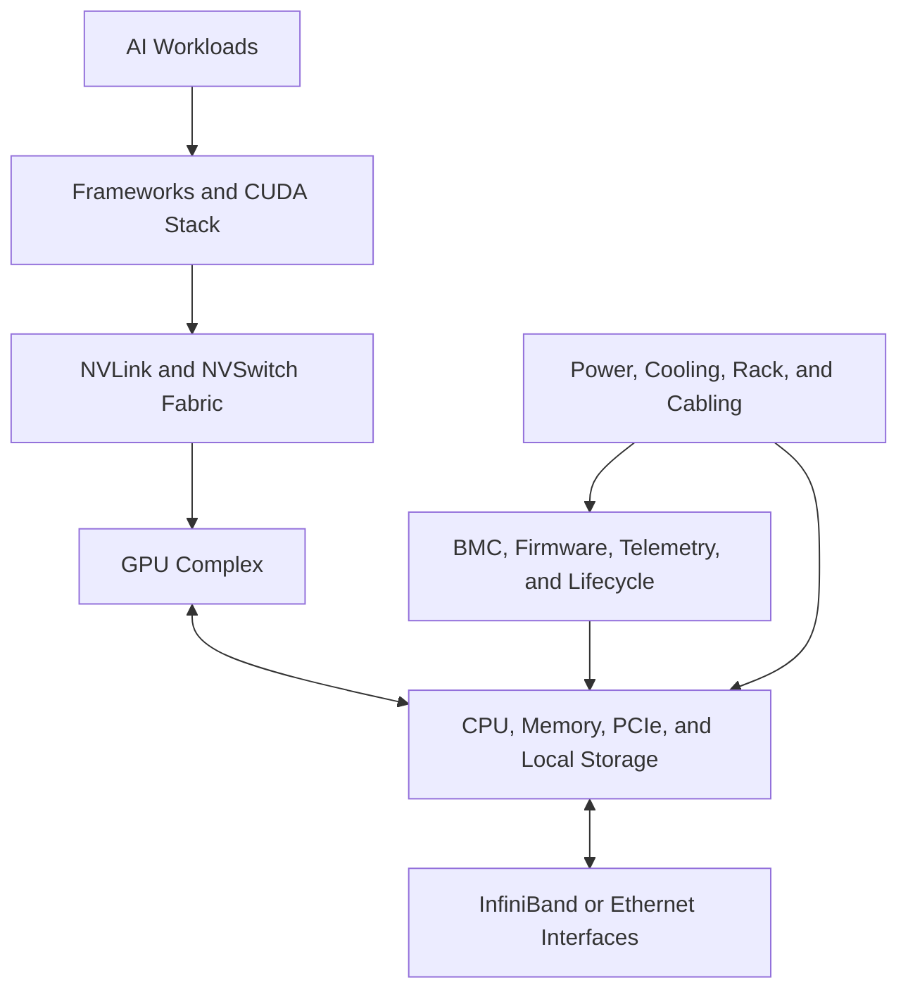

# Volume 05 — DGX Systems

A customer purchases eight DGX systems and asks a deceptively simple question: **what happens next?** The answer includes far more than racking servers. The team must validate facility readiness, connect management and data networks, establish firmware and driver baselines, integrate storage, prove collective performance, define monitoring, and create a safe lifecycle for upgrades and failures.

DGX is best understood as an engineered system rather than a server containing GPUs. NVIDIA combines accelerators, CPUs, NVLink and NVSwitch fabrics, network interfaces, storage, firmware, system software, telemetry, and support into a validated platform boundary. That integration reduces some design uncertainty, but it does not remove the need for sound architecture and operations.

| Volume field | Value |
|---|---|
| Difficulty | Advanced |
| Estimated reading time | 14–18 hours |
| Prerequisites | Volumes 01–04 |
| Primary focus | Integrated GPU system design and operations |
| Outcome | Plan, deploy, validate, and operate DGX environments |

## DGX as a System

**Figure 5.0.1 — DGX is an integrated operational boundary.** Application performance depends on the complete chain from facility infrastructure to software execution.

## Planned Chapter Sequence

1. Why DGX Exists
2. Inside a DGX System
3. GPU Fabric: NVLink and NVSwitch
4. Host CPUs, Memory, PCIe, and Local Storage
5. Network Interfaces and External Fabrics
6. BMC, Firmware, Secure Boot, and Management
7. Power, Cooling, Rack, and Cabling Design
8. DGX OS and Software Baseline
9. Installation and Acceptance Testing
10. Health Monitoring and Telemetry
11. Firmware, Driver, and System Upgrades
12. Failure Domains and Service Procedures
13. Multi-DGX Cluster Architecture
14. Customer Deployment Journey
15. Volume 05 Summary

## Labs

- Inspect a DGX-style component and topology inventory
- Build a facility-readiness checklist
- Design an acceptance-test plan
- Create a lifecycle and upgrade runbook

## Production Perspective

Owning DGX hardware does not automatically create an AI platform. Production value appears only when the systems are connected to an operating model: provisioning, identity, scheduling, storage, observability, maintenance, capacity management, incident response, and workload onboarding. This volume treats those responsibilities as part of the architecture rather than post-installation tasks.
