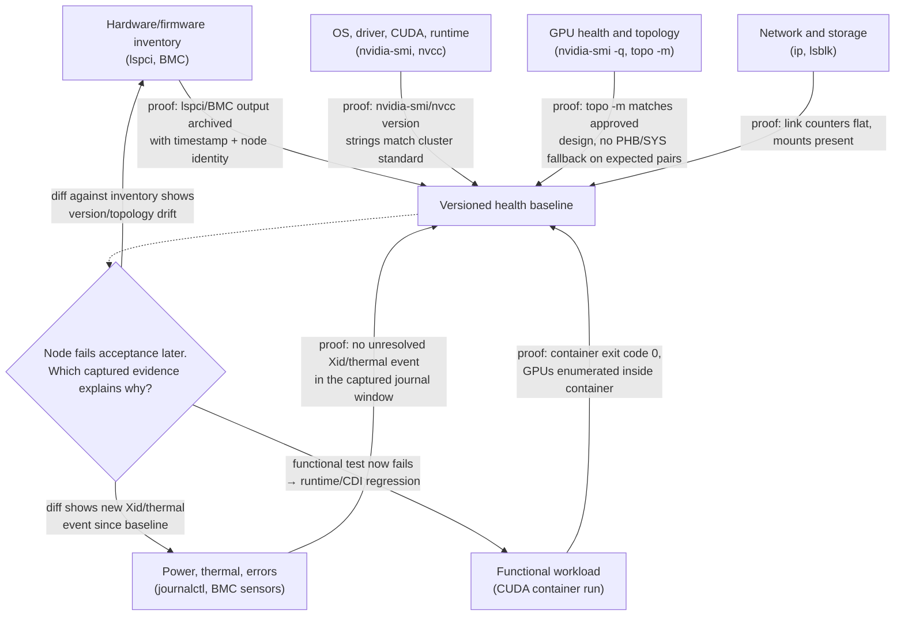

# Build a DGX Health Baseline

## Lab metadata

| Field | Value |
|---|---|
| Volume | 05 — DGX Systems |
| Difficulty | Intermediate |
| Estimated time | 75 minutes |
| Lab type | Exploration and operational validation |
| Target platform | DGX system or equivalent multi-GPU NVIDIA server |

## Objective

Create a versioned health baseline that captures hardware inventory, topology, software versions, telemetry, network state, storage state, and a minimal functional workload.

## Background

A health check performed only after an incident has no trusted reference. This lab creates the reference state used before production onboarding, after maintenance, and during node-to-node comparison.

## Learning outcomes

You will be able to:

- collect a structured system inventory;
- record GPU and topology state;
- distinguish inventory checks from functional checks;
- identify configuration drift;
- define acceptance criteria for returning a node to service.

## Architecture



**Diagram note.** Each edge names the specific artifact that becomes admissible evidence in `Baseline`, not just "data was collected." The decision diamond is why this lab insists on a *versioned* baseline rather than a one-time snapshot: when a node later fails acceptance, the fastest diagnosis is a diff against this exact baseline, routed to whichever category actually changed.

## Prerequisites

- Administrative shell access.
- NVIDIA driver installed and operational.
- Permission to read system logs and network state.
- A directory for collected evidence.
- A known-good comparison node when available.

## Environment

Create a timestamped workspace:

```bash
mkdir -p ~/dgx-baseline/$(date +%Y%m%d-%H%M)
cd ~/dgx-baseline/$(date +%Y%m%d-%H%M)
```

## Step 1 — Capture host identity

```bash
hostnamectl > host-identity.txt
uname -a > kernel.txt
cat /etc/os-release > os-release.txt
lscpu > cpu.txt
free -h > memory.txt
```

**Expected result:** files describing the operating system, kernel, CPU topology, and host memory.

➕ **Realistic, annotated content of two of those files:**

```text
$ cat host-identity.txt
 Static hostname: dgx-node07
       Icon name: computer-server
         Chassis: server
      Machine ID: 4e1f2a9b...
         Boot ID: 7c3d81ff...
Operating System: Ubuntu 22.04.4 LTS
          Kernel: Linux 5.15.0-105-generic
    Architecture: x86-64

$ cat kernel.txt
Linux dgx-node07 5.15.0-105-generic #115-Ubuntu SMP x86_64 GNU/Linux
```
`hostnamectl` and `uname -a` are checked together because they answer two different acceptance questions: `hostnamectl`'s `Operating System` line confirms the distro/version matches the cluster's approved image, while `uname -a`'s kernel string (`5.15.0-105-generic`) is what actually determines driver module compatibility — two nodes can report the same OS release and still run different kernel point-releases, and a driver built against one kernel ABI will fail `modprobe` against another. This is exactly the kind of drift a single "is the OS the right version" glance misses.

## Step 2 — Capture PCIe and storage inventory

```bash
lspci -nn > pci-inventory.txt
lsblk -o NAME,MODEL,SIZE,TYPE,FSTYPE,MOUNTPOINTS > block-devices.txt
findmnt > mounts.txt
```

Do not interpret the presence of a device as proof of performance. This step records inventory only.

## Step 3 — Capture GPU inventory and telemetry

```bash
nvidia-smi -L > gpu-list.txt
nvidia-smi -q > gpu-query.txt
nvidia-smi topo -m > gpu-topology.txt
nvidia-smi --query-gpu=index,name,uuid,pci.bus_id,temperature.gpu,power.draw,power.limit,memory.total,memory.used --format=csv > gpu-summary.csv
```

**Healthy indicators:** all expected GPUs are visible, identifiers remain stable, no unexpected memory use exists on an idle node, and topology matches the approved design.

➕ **Realistic `gpu-summary.csv` content, annotated:**

```text
index, name, uuid, pci.bus_id, temperature.gpu, power.draw, power.limit, memory.total, memory.used
0, NVIDIA H100 80GB HBM3, GPU-3a1f..., 00000000:1B:00.0, 34, 68, 700, 81559, 4
1, NVIDIA H100 80GB HBM3, GPU-9c72..., 00000000:1C:00.0, 33, 65, 700, 81559, 4
2, NVIDIA H100 80GB HBM3, GPU-0e51..., 00000000:3D:00.0, 35, 70, 700, 81559, 4
3, NVIDIA H100 80GB HBM3, GPU-77ab..., 00000000:3E:00.0, 34, 67, 700, 81559, 4
```
On a genuinely idle node, `memory.used` should be near zero (the `4MiB` here is normal driver/context overhead, not a leaked workload) and `power.draw` should sit well below `power.limit` — a value like `380` here on an idle GPU would mean *something* is already running and the node is not actually idle, which invalidates the rest of this baseline capture until investigated. `temperature.gpu` in the low-to-mid 30s (Celsius) at idle is the number to compare against later runs: if a later capture on the same node shows idle temperatures 15-20°C higher with nothing running, that is evidence of a cooling regression worth chasing before it ever shows up as a throttling incident under load.

➕ **A realistic `nvidia-smi topo -m` capture, since this is the single most consulted file when a later acceptance check fails:**

```text
$ nvidia-smi topo -m
       GPU0  GPU1  GPU2  GPU3  NIC0  NIC1  CPU Affinity  NUMA Affinity
GPU0    X    NV18  NV18  NV18  PXB   SYS   0-31          0
GPU1   NV18   X    NV18  NV18  PXB   SYS   0-31          0
GPU2   NV18  NV18   X    NV18  SYS   PXB   32-63         1
GPU3   NV18  NV18  NV18   X    SYS   PXB   32-63         1

Legend:
  X    = Self
  NV18 = 18 NVLinks between GPU pair
  PXB  = Connection traversing multiple PCIe switches
  SYS  = Connection traversing PCIe and an SMP interconnect
```
This is the healthy reference: every GPU pair shows `NV18` (full NVLink), and each NIC shows `PXB` to its local GPU pair and `SYS` (cross-socket) to the other pair — which is expected, not a fault, because each NIC is only wired close to two of the four GPUs. The acceptance criterion "topology matches approved baseline" means diffing a later capture against exactly this matrix — a later capture showing `PHB` where this shows `NV18` is the drift worth investigating, not a difference in the `SYS` entries, which are topology by design.

## Step 4 — Capture software versions

```bash
nvidia-smi > driver-summary.txt
command -v nvcc >/dev/null && nvcc --version > nvcc-version.txt || true
command -v docker >/dev/null && docker version > docker-version.txt 2>&1 || true
command -v containerd >/dev/null && containerd --version > containerd-version.txt 2>&1 || true
```

Record the versions even when a component is intentionally absent. Absence should be explicit rather than ambiguous.

## Step 5 — Capture network state

```bash
ip -brief address > ip-addresses.txt
ip route show table all > routes.txt
ip -s link > link-counters.txt
ethtool -i $(ip route show default | awk '/default/ {print $5; exit}') > default-nic-driver.txt 2>&1 || true
```

For dedicated compute and storage networks, repeat the driver and counter collection for each relevant interface.

## Step 6 — Capture error evidence

```bash
journalctl -k -b > kernel-journal.txt
journalctl -b -p warning..alert > warnings.txt
```

Search for recurring PCIe, GPU, storage, thermal, and network errors:

```bash
grep -Ei 'NVRM|Xid|PCIe|AER|thermal|nvme|timeout|reset|link.*down' kernel-journal.txt > suspected-errors.txt || true
```

A non-empty file is not automatically a failure. Each entry must be correlated with time, device, and impact.

➕ **Realistic `suspected-errors.txt` content and how to read it — the difference between noise and a real finding:**

```text
$ cat suspected-errors.txt
Jul 28 09:14:02 dgx-node07 kernel: NVRM: Xid (PCI:0000:3d:00): 79, GPU has fallen off the bus
Jul 28 09:14:03 dgx-node07 kernel: pcieport 0000:3c:00.0: AER: Corrected error received
Jul 30 02:00:11 dgx-node07 kernel: nvme nvme1: I/O 42 QID 3 timeout, aborting
```
These three lines are not equally serious and should not be triaged the same way. `Xid 79` (`GPU has fallen off the bus`) on GPU `3d:00` is a hard hardware fault — the GPU stopped responding on the PCIe bus entirely, and NVIDIA's own Xid reference classifies this as almost always requiring hardware reseat or replacement, not a driver retry. The `AER: Corrected error` line is a PCIe-layer *corrected* error — the hardware detected and fixed a transient bit error automatically; a single corrected error is normal background noise on any large fleet, but a rapidly *climbing count* of corrected errors on the same device is a leading indicator of a connector or slot going bad, worth trending rather than ignoring outright. The `nvme` timeout is a separate device entirely and should be triaged against that NVMe's own health, not conflated with the GPU line above it just because both matched the same grep.

**Interview-ready line:** "Xid 79 means the GPU disappeared from the PCIe bus — that's not something a driver reload fixes, and I wouldn't spend a maintenance window on software troubleshooting for that code. A corrected AER error, by contrast, is expected background noise unless the rate is climbing — conflating the two wastes an incident response cycle on the wrong fix."

## Step 7 — Run a minimal functional check

Use an approved CUDA validation container or local CUDA sample. The purpose is to prove that software can allocate GPU memory and execute work, not to establish a performance benchmark.

Example container pattern:

```bash
docker run --rm --gpus all <approved-cuda-image> nvidia-smi
```

Replace `<approved-cuda-image>` with an image allowed by your environment.

## Step 8 — Create acceptance criteria

Create `acceptance.md`:

```md
# DGX node acceptance criteria

- Expected GPU count present
- No unresolved critical hardware events
- Topology matches approved baseline
- Driver and firmware versions match cluster standard
- Required network interfaces are up at expected link mode
- Storage devices and mounts are present
- Thermal and power state are within operational policy
- Functional CUDA workload succeeds
- No unexplained drift from peer nodes
```

## Validation

The baseline is complete when every category has evidence and each acceptance criterion has a pass, fail, or approved exception.

## Verification

Compare with a known-good baseline:

```bash
diff -u ../known-good/gpu-topology.txt gpu-topology.txt || true
diff -u ../known-good/gpu-summary.csv gpu-summary.csv || true
diff -u ../known-good/routes.txt routes.txt || true
```

Interpret differences. Do not assume every difference is a defect.

## Observability

Retain:

- raw command output;
- collection timestamp;
- system identity;
- maintenance ticket or change reference;
- reviewer and approval status;
- exceptions with expiry dates.

## Performance measurements

Add performance tests only when representative tools and acceptance thresholds are approved. At minimum, record idle power, temperature, memory use, link counters, and functional workload completion.

## Failure injection

### Failure 1 — Version drift

Modify a copy of the baseline so one node reports a different driver version. Confirm that the review process detects and classifies the drift.

### Failure 2 — Missing interface

Remove one expected compute interface from a copied `ip-addresses.txt`. Confirm that the node fails acceptance even though all GPUs remain visible.

## Troubleshooting

### GPU count is lower than expected

Inspect `lspci`, kernel logs, driver state, power events, and management-controller logs. Do not repeatedly reboot without preserving evidence.

➕ **Real evidence, the fast triage:**
```text
$ lspci -nn | grep -i nvidia | wc -l
6        ← expected 8

$ nvidia-smi -L
GPU 0: NVIDIA H100 80GB HBM3 (UUID: GPU-3a1f...)
...
6 GPUs total, expected 8
```
If `lspci` also reports only 6 devices, the missing GPUs never enumerated on the PCIe bus at all — that points at hardware, firmware link training, or a power/seating problem, and no driver troubleshooting will fix it. If `lspci` reports all 8 but `nvidia-smi -L` reports only 6, the hardware is present and the driver/software layer is the boundary — check `dmesg` for `NVRM` initialization failures on the two missing bus IDs before assuming a hardware fault. This single comparison (`lspci` count vs. `nvidia-smi -L` count) is the fastest way to split a "missing GPU" incident into a hardware ticket versus a software ticket.

### Topology differs from peers

Verify hardware inventory, PCIe enumeration, firmware baseline, and whether a component was replaced or disabled.

➕ **Real evidence — comparing this node's topology file against the archived baseline:**
```text
$ diff -u ../known-good/gpu-topology.txt gpu-topology.txt
-GPU2   NV18  NV18   X    NV18  SYS   PXB   32-63         1
+GPU2   NV18  NV18   X    PHB   SYS   PXB   32-63         1
```
A single character's difference — `NV18` degraded to `PHB` between GPU2 and GPU3 — is the entire finding. This is why the lab archives `gpu-topology.txt` as a first-class baseline artifact rather than treating topology as something you only look at when a problem is already suspected: without the archived comparison file, this degradation would only show up as an unexplained slowdown in a collective spanning those two GPUs, with no obvious link to "topology."

### Functional container cannot access GPUs

Check driver health, container runtime configuration, NVIDIA Container Toolkit integration, permissions, and the selected image.

➕ **Real evidence — the exact failure this produces:**
```text
$ docker run --rm --gpus all nvidia/cuda:12.4.1-base-ubuntu22.04 nvidia-smi
docker: Error response from daemon: could not select device driver "" with capabilities: [[gpu]].
```
This specific error — `could not select device driver "" with capabilities: [[gpu]]` — means the container runtime has no registered NVIDIA runtime/CDI integration at all, which is different from a permissions problem (which would instead show `nvidia-smi` running but reporting `No devices found`). Confirm which case this is with `nvidia-ctk cdi list` (empty output means CDI specs were never generated — re-run `nvidia-ctk cdi generate`) before assuming a broader driver failure; the host's own `nvidia-smi` can be completely healthy while this container-level integration gap exists.

## Cleanup

Do not delete an accepted baseline. Compress and archive it according to the operations retention policy:

```bash
cd ..
tar -czf dgx-baseline-$(date +%Y%m%d-%H%M).tar.gz $(basename "$OLDPWD")
```

Review the generated archive path before removing the working directory.

## Summary

You created a repeatable system baseline that can distinguish hardware inventory, configuration drift, telemetry health, and functional readiness. This evidence becomes the reference for maintenance validation and incident comparison.

## Challenge exercises

1. Automate collection with Ansible.
2. Add DCGM diagnostics where available.
3. Compare several nodes and generate a drift report.
4. Integrate baseline acceptance into a maintenance workflow.

## Further reading

- [Chapter 02 — Inside a DGX System](../chapter-02-inside-a-dgx-system)
- [Volume 05 introduction](../index)
