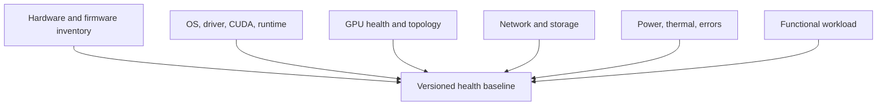

# Build a DGX Health Baseline

## Lab metadata

| Field | Value |
|---|---|
| Volume | 05 — DGX Systems |
| Difficulty | Intermediate |
| Estimated time | 75 minutes |
| Lab type | Exploration and operational validation |
| Target platform | DGX system or equivalent multi-GPU NVIDIA server |

## Objective

Create a versioned health baseline that captures hardware inventory, topology, software versions, telemetry, network state, storage state, and a minimal functional workload.

## Background

A health check performed only after an incident has no trusted reference. This lab creates the reference state used before production onboarding, after maintenance, and during node-to-node comparison.

## Learning outcomes

You will be able to:

- collect a structured system inventory;
- record GPU and topology state;
- distinguish inventory checks from functional checks;
- identify configuration drift;
- define acceptance criteria for returning a node to service.

## Architecture



## Prerequisites

- Administrative shell access.
- NVIDIA driver installed and operational.
- Permission to read system logs and network state.
- A directory for collected evidence.
- A known-good comparison node when available.

## Environment

Create a timestamped workspace:

```bash
mkdir -p ~/dgx-baseline/$(date +%Y%m%d-%H%M)
cd ~/dgx-baseline/$(date +%Y%m%d-%H%M)
```

## Step 1 — Capture host identity

```bash
hostnamectl > host-identity.txt
uname -a > kernel.txt
cat /etc/os-release > os-release.txt
lscpu > cpu.txt
free -h > memory.txt
```

**Expected result:** files describing the operating system, kernel, CPU topology, and host memory.

## Step 2 — Capture PCIe and storage inventory

```bash
lspci -nn > pci-inventory.txt
lsblk -o NAME,MODEL,SIZE,TYPE,FSTYPE,MOUNTPOINTS > block-devices.txt
findmnt > mounts.txt
```

Do not interpret the presence of a device as proof of performance. This step records inventory only.

## Step 3 — Capture GPU inventory and telemetry

```bash
nvidia-smi -L > gpu-list.txt
nvidia-smi -q > gpu-query.txt
nvidia-smi topo -m > gpu-topology.txt
nvidia-smi --query-gpu=index,name,uuid,pci.bus_id,temperature.gpu,power.draw,power.limit,memory.total,memory.used --format=csv > gpu-summary.csv
```

**Healthy indicators:** all expected GPUs are visible, identifiers remain stable, no unexpected memory use exists on an idle node, and topology matches the approved design.

## Step 4 — Capture software versions

```bash
nvidia-smi > driver-summary.txt
command -v nvcc >/dev/null && nvcc --version > nvcc-version.txt || true
command -v docker >/dev/null && docker version > docker-version.txt 2>&1 || true
command -v containerd >/dev/null && containerd --version > containerd-version.txt 2>&1 || true
```

Record the versions even when a component is intentionally absent. Absence should be explicit rather than ambiguous.

## Step 5 — Capture network state

```bash
ip -brief address > ip-addresses.txt
ip route show table all > routes.txt
ip -s link > link-counters.txt
ethtool -i $(ip route show default | awk '/default/ {print $5; exit}') > default-nic-driver.txt 2>&1 || true
```

For dedicated compute and storage networks, repeat the driver and counter collection for each relevant interface.

## Step 6 — Capture error evidence

```bash
journalctl -k -b > kernel-journal.txt
journalctl -b -p warning..alert > warnings.txt
```

Search for recurring PCIe, GPU, storage, thermal, and network errors:

```bash
grep -Ei 'NVRM|Xid|PCIe|AER|thermal|nvme|timeout|reset|link.*down' kernel-journal.txt > suspected-errors.txt || true
```

A non-empty file is not automatically a failure. Each entry must be correlated with time, device, and impact.

## Step 7 — Run a minimal functional check

Use an approved CUDA validation container or local CUDA sample. The purpose is to prove that software can allocate GPU memory and execute work, not to establish a performance benchmark.

Example container pattern:

```bash
docker run --rm --gpus all <approved-cuda-image> nvidia-smi
```

Replace `<approved-cuda-image>` with an image allowed by your environment.

## Step 8 — Create acceptance criteria

Create `acceptance.md`:

```md
# DGX node acceptance criteria

- Expected GPU count present
- No unresolved critical hardware events
- Topology matches approved baseline
- Driver and firmware versions match cluster standard
- Required network interfaces are up at expected link mode
- Storage devices and mounts are present
- Thermal and power state are within operational policy
- Functional CUDA workload succeeds
- No unexplained drift from peer nodes
```

## Validation

The baseline is complete when every category has evidence and each acceptance criterion has a pass, fail, or approved exception.

## Verification

Compare with a known-good baseline:

```bash
diff -u ../known-good/gpu-topology.txt gpu-topology.txt || true
diff -u ../known-good/gpu-summary.csv gpu-summary.csv || true
diff -u ../known-good/routes.txt routes.txt || true
```

Interpret differences. Do not assume every difference is a defect.

## Observability

Retain:

- raw command output;
- collection timestamp;
- system identity;
- maintenance ticket or change reference;
- reviewer and approval status;
- exceptions with expiry dates.

## Performance measurements

Add performance tests only when representative tools and acceptance thresholds are approved. At minimum, record idle power, temperature, memory use, link counters, and functional workload completion.

## Failure injection

### Failure 1 — Version drift

Modify a copy of the baseline so one node reports a different driver version. Confirm that the review process detects and classifies the drift.

### Failure 2 — Missing interface

Remove one expected compute interface from a copied `ip-addresses.txt`. Confirm that the node fails acceptance even though all GPUs remain visible.

## Troubleshooting

### GPU count is lower than expected

Inspect `lspci`, kernel logs, driver state, power events, and management-controller logs. Do not repeatedly reboot without preserving evidence.

### Topology differs from peers

Verify hardware inventory, PCIe enumeration, firmware baseline, and whether a component was replaced or disabled.

### Functional container cannot access GPUs

Check driver health, container runtime configuration, NVIDIA Container Toolkit integration, permissions, and the selected image.

## Cleanup

Do not delete an accepted baseline. Compress and archive it according to the operations retention policy:

```bash
cd ..
tar -czf dgx-baseline-$(date +%Y%m%d-%H%M).tar.gz $(basename "$OLDPWD")
```

Review the generated archive path before removing the working directory.

## Summary

You created a repeatable system baseline that can distinguish hardware inventory, configuration drift, telemetry health, and functional readiness. This evidence becomes the reference for maintenance validation and incident comparison.

## Challenge exercises

1. Automate collection with Ansible.
2. Add DCGM diagnostics where available.
3. Compare several nodes and generate a drift report.
4. Integrate baseline acceptance into a maintenance workflow.

## Further reading

- [Chapter 02 — Inside a DGX System](../chapter-02-inside-a-dgx-system)
- [Volume 05 introduction](../index)
