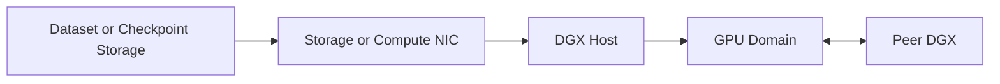

# Lab 02 — Validate DGX Data and Network Paths

## Lab Metadata

| Field | Value |
|---|---|
| Volume | 05 |
| Difficulty | Advanced |
| Estimated time | 120 minutes |
| Target platform | DGX or equivalent multi-GPU system |
| Lab type | Acceptance and troubleshooting |

## 1. Objective

Build a layered acceptance record for the data and network paths used by GPU workloads. The lab verifies local storage, remote storage, GPU topology, NIC affinity, point-to-point connectivity, and collective communication.

## 2. Background

A successful `nvidia-smi` check proves device visibility. It does not prove that datasets can feed the GPUs or that nodes can communicate efficiently. Production acceptance must test each layer independently before running an application benchmark.

## 3. Learning Outcomes

You will be able to:

- capture a topology and interface baseline;
- measure local and remote I/O separately;
- verify intended NIC and GPU locality;
- run layered network and collective tests;
- isolate failures without changing several variables at once.

## 4. Architecture



## 5. Prerequisites

- administrative access to one or more GPU nodes;
- `nvidia-smi`, `lspci`, `ip`, `ethtool`, `numactl`, and storage test tools;
- a safe test directory;
- a peer node for scale-out tests;
- NCCL tests or an equivalent collective benchmark when available.

Do not run destructive storage tests against production filesystems without approval.

## 6. Environment Record

```bash
uname -a
nvidia-smi
nvidia-smi topo -m
ip -br link
ip -br addr
lspci -tv
numactl --hardware
```

Save the output as the immutable baseline for the test run.

## 7. Components

| Component | Validation goal |
|---|---|
| Local NVMe | Confirm device health and expected local throughput |
| Shared storage | Confirm mounted path, latency, and aggregate behavior |
| NIC | Confirm link state, speed, errors, and selected interface |
| GPU topology | Confirm expected local scale-up domain |
| Collective stack | Confirm multi-GPU and multi-node communication |

## 8. Deployment Steps

### Step 1 — Inspect block devices

```bash
lsblk -o NAME,MODEL,SIZE,TYPE,FSTYPE,MOUNTPOINTS
```

Verify which devices provide OS, scratch, and data capacity.

### Step 2 — Run a safe local write/read test

Use a dedicated temporary directory and a tool approved by your organization. Example with `fio`:

```bash
fio --name=local-seq --directory=/safe/test/path --size=4G \
  --rw=readwrite --bs=1M --iodepth=16 --direct=1 --runtime=60 \
  --time_based --group_reporting
```

Record bandwidth, IOPS, and latency. Compare with the validated platform baseline, not an internet benchmark.

### Step 3 — Inspect NIC health

```bash
ip -s link
ethtool <interface>
ethtool -S <interface> | head -n 80
```

Look for negotiated speed, link state, drops, resets, and physical errors.

### Step 4 — Map devices to NUMA and PCIe topology

```bash
nvidia-smi topo -m
lspci -vv | less
numactl --hardware
```

Document which NICs are closest to each GPU group.

### Step 5 — Validate host-to-host connectivity

Use the approved fabric benchmark for your environment. Start with basic reachability, then bandwidth and latency, then RDMA-aware tests where applicable.

### Step 6 — Validate collectives

Run NCCL tests first within one node, then across nodes. Keep message range, GPU count, and environment variables in the result record.

Example pattern:

```bash
./all_reduce_perf -b 8 -e 8G -f 2 -g 8
```

For multi-node execution, use the launcher and interface configuration approved for the cluster.

## 9. Validation

The path is accepted only when:

- device topology matches the design;
- storage tests are stable and free of errors;
- NIC links operate at intended speed;
- error counters remain clean or explainable;
- local and remote collectives complete repeatedly;
- observed traffic uses the intended interfaces;
- results are archived with software and firmware versions.

## 10. Verification

Create an acceptance table:

| Test | Expected | Observed | Pass/Fail | Evidence |
|---|---|---|---|---|
| Local storage | Site baseline | | | |
| Shared storage | Workload requirement | | | |
| NIC link | Design value | | | |
| Local collective | Platform baseline | | | |
| Multi-node collective | Cluster baseline | | | |

## 11. Observability

Capture GPU, CPU, storage, NIC, and switch telemetry on the same timeline. A collective slowdown without switch and adapter counters is difficult to diagnose.

## 12. Performance Measurements

Report:

- local sequential and random I/O;
- shared-storage read and write behavior;
- point-to-point network bandwidth and latency;
- collective algorithm and bus bandwidth;
- CPU usage and NUMA placement;
- retransmissions, drops, and RDMA errors.

## 13. Failure Injection

Choose one controlled failure:

- select a nonpreferred NIC;
- run a job with deliberately poor CPU affinity;
- reduce storage concurrency;
- block access to one approved test interface;
- run with an intentionally inconsistent MTU in an isolated lab.

Observe the symptom and restore the baseline immediately.

## 14. Troubleshooting

### Collectives hang

Validate routes, interface selection, firewalls, RDMA device visibility, MTU, process mapping, and fabric membership.

### Storage throughput is unstable

Check cache effects, competing tenants, queue depth, metadata load, network congestion, and device health.

### One GPU group communicates more slowly

Check GPU-to-NIC locality, PCIe state, NUMA placement, and whether ranks use the intended adapter.

## 15. Cleanup

Remove temporary data, stop test processes, restore any modified interface or affinity settings, and archive the run manifest and logs.

## 16. Summary

You validated the complete path that feeds and connects GPU workloads. The resulting evidence is suitable for platform acceptance, capacity planning, and incident comparison.

## 17. Challenge Exercises

- Compare warm-cache and cold-cache dataset reads.
- Repeat collectives with topology-aware and topology-unaware rank placement.
- Measure checkpoint write and restore duration.
- Add switch telemetry to the result package.

## 18. Further Reading

- [DGX Storage and Data Paths](../chapter-05-dgx-storage-and-data-paths)
- [DGX Networking and Fabric Integration](../chapter-06-dgx-networking-and-fabric-integration)
