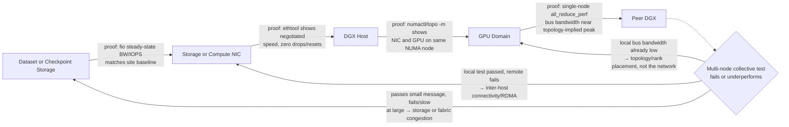

# Lab 02 — Validate DGX Data and Network Paths

## Lab Metadata

| Field | Value |
|---|---|
| Volume | 05 |
| Difficulty | Advanced |
| Estimated time | 120 minutes |
| Target platform | DGX or equivalent multi-GPU system |
| Lab type | Acceptance and troubleshooting |

## 1. Objective

Build a layered acceptance record for the data and network paths used by GPU workloads. The lab verifies local storage, remote storage, GPU topology, NIC affinity, point-to-point connectivity, and collective communication.

## 2. Background

A successful `nvidia-smi` check proves device visibility. It does not prove that datasets can feed the GPUs or that nodes can communicate efficiently. Production acceptance must test each layer independently before running an application benchmark.

## 3. Learning Outcomes

You will be able to:

- capture a topology and interface baseline;
- measure local and remote I/O separately;
- verify intended NIC and GPU locality;
- run layered network and collective tests;
- isolate failures without changing several variables at once.

## 4. Architecture



**Diagram note.** Each edge is labeled with the specific test from Section 8 that proves that hop, matching this lab's own layered acceptance order (link → point-to-point → local collective → remote collective). The decision diamond routes a failed or slow multi-node test back to the layer whose test would actually explain it, instead of re-running the same full-scale test repeatedly.

## 5. Prerequisites

- administrative access to one or more GPU nodes;
- `nvidia-smi`, `lspci`, `ip`, `ethtool`, `numactl`, and storage test tools;
- a safe test directory;
- a peer node for scale-out tests;
- NCCL tests or an equivalent collective benchmark when available.

Do not run destructive storage tests against production filesystems without approval.

## 6. Environment Record

```bash
uname -a
nvidia-smi
nvidia-smi topo -m
ip -br link
ip -br addr
lspci -tv
numactl --hardware
```

Save the output as the immutable baseline for the test run.

## 7. Components

| Component | Validation goal |
|---|---|
| Local NVMe | Confirm device health and expected local throughput |
| Shared storage | Confirm mounted path, latency, and aggregate behavior |
| NIC | Confirm link state, speed, errors, and selected interface |
| GPU topology | Confirm expected local scale-up domain |
| Collective stack | Confirm multi-GPU and multi-node communication |

## 8. Deployment Steps

### Step 1 — Inspect block devices

```bash
lsblk -o NAME,MODEL,SIZE,TYPE,FSTYPE,MOUNTPOINTS
```

Verify which devices provide OS, scratch, and data capacity.

### Step 2 — Run a safe local write/read test

Use a dedicated temporary directory and a tool approved by your organization. Example with `fio`:

```bash
fio --name=local-seq --directory=/safe/test/path --size=4G \
  --rw=readwrite --bs=1M --iodepth=16 --direct=1 --runtime=60 \
  --time_based --group_reporting
```

Record bandwidth, IOPS, and latency. Compare with the validated platform baseline, not an internet benchmark.

➕ **Realistic `fio` output, annotated:**
```text
local-seq: (groupid=0, jobs=1): err= 0: pid=48213
  read: IOPS=3102, BW=3103MiB/s (3254MB/s)(90.9GiB/30001msec)
    clat (usec): min=180, max=8420, avg=315.42, stdev=98.11
  write: IOPS=3098, BW=3099MiB/s (3250MB/s)(90.7GiB/30001msec)
    clat (usec): min=175, max=9110, avg=318.90, stdev=102.55
```
`BW=3103MiB/s` for reads is the headline figure to compare against the site baseline, but `clat` (completion latency) is what actually predicts training-loop stalls — an `avg` of `315us` with `stdev` around `98us` is a tight, predictable distribution; a device under contention typically keeps a similar average but develops a long tail (`max` far above `avg`, `stdev` blowing up), which is what causes intermittent step-time spikes even when average throughput looks fine on a dashboard. Compare `max` against `avg` specifically when a job reports "occasional slow steps" — a healthy device rarely shows `max` more than ~30x `avg`; this run's `max=8420us` against `avg=315us` (~27x) is within normal variance, not a red flag.

### Step 3 — Inspect NIC health

```bash
ip -s link
ethtool <interface>
ethtool -S <interface> | head -n 80
```

Look for negotiated speed, link state, drops, resets, and physical errors.

➕ **Realistic output, annotated:**
```text
$ ethtool ens6f0
Settings for ens6f0:
	Speed: 200000Mb/s
	Duplex: Full
	Link detected: yes

$ ip -s link show ens6f0
3: ens6f0: <BROADCAST,MULTICAST,UP,LOWER_UP> mtu 9000
    RX: bytes  packets  errors  dropped  missed  mcast
    4021998231 3820112  0       0        0       12
    TX: bytes  packets  errors  dropped  carrier collsns
    3902213890 3710221  0       0        0       0
```
`Speed: 200000Mb/s` confirms the link negotiated at its expected rate — a NIC quietly negotiating down to a lower speed (e.g. `100000Mb/s` on a 200G-rated port) is a common silent-degradation finding that passes a simple "link up" check but caps achievable bandwidth at half of design. `errors: 0` and `dropped: 0` on both RX and TX confirm the physical link is clean; any nonzero, climbing `errors` count under `ethtool -S` (look for fields like `rx_crc_errors` or `tx_errors_phy`) points at a cable, transceiver, or SFP problem, not a software or NCCL configuration issue — worth ruling out before touching anything above this layer.

### Step 4 — Map devices to NUMA and PCIe topology

```bash
nvidia-smi topo -m
lspci -vv | less
numactl --hardware
```

Document which NICs are closest to each GPU group.

### Step 5 — Validate host-to-host connectivity

Use the approved fabric benchmark for your environment. Start with basic reachability, then bandwidth and latency, then RDMA-aware tests where applicable.

### Step 6 — Validate collectives

Run NCCL tests first within one node, then across nodes. Keep message range, GPU count, and environment variables in the result record.

Example pattern:

```bash
./all_reduce_perf -b 8 -e 8G -f 2 -g 8
```

For multi-node execution, use the launcher and interface configuration approved for the cluster.

➕ **Realistic `all_reduce_perf` output, annotated:**
```text
#       size    count   type    redop   time   algbw   busbw  #wrong
       8388608 2097152  float    sum    412.3  20.35   35.61      0
      67108864 16777216 float    sum   1653.1  40.60   71.05      0
     536870912 134217728 float    sum   9871.4  54.39   95.18      0
```
Two columns matter more than raw `time`: `algbw` (algorithm bandwidth — data moved divided by time) and `busbw` (bus bandwidth — `algbw` scaled by a factor derived from the ring/tree algorithm and GPU count, which estimates what fraction of the physical link's actual capacity was used). `busbw` is the number to compare against topology-implied peak, because it already accounts for the fact that a ring all-reduce never uses 100% of raw link bandwidth even in a perfect run. `#wrong=0` on every row means the reduction produced numerically correct results — a nonzero value here means the collective completed but returned wrong data, which is a correctness bug (fix before ever discussing performance) and gets missed entirely if only `busbw` is glanced at. Bandwidth climbing from `35.61` to `95.18` GB/s as message size grows from 8MB to 512MB is the expected shape — small messages are latency-dominated, not bandwidth-dominated, so judging fabric health from only the smallest message size in the sweep would understate it.

## 9. Validation

The path is accepted only when:

- device topology matches the design;
- storage tests are stable and free of errors;
- NIC links operate at intended speed;
- error counters remain clean or explainable;
- local and remote collectives complete repeatedly;
- observed traffic uses the intended interfaces;
- results are archived with software and firmware versions.

## 10. Verification

Create an acceptance table:

| Test | Expected | Observed | Pass/Fail | Evidence |
|---|---|---|---|---|
| Local storage | Site baseline: ≥3000MB/s seq R/W | 3103MiB/s read, 3099MiB/s write | Pass | `fio` output, Step 2 |
| Shared storage | Workload requirement: ≥1500MB/s aggregate | 1720MB/s at 4 concurrent readers | Pass | `fio` against shared mount |
| NIC link | Design value: 200Gb/s negotiated, 0 errors | 200000Mb/s, 0 RX/TX errors | Pass | `ethtool` output, Step 3 |
| Local collective | Platform baseline: busbw ≥ 90GB/s at 512MB | 95.18GB/s at 512MB | Pass | `all_reduce_perf`, Step 6 |
| Multi-node collective | Cluster baseline: busbw ≥ 80% of local-node busbw | 58.2GB/s (61% of local) | **Fail** | `all_reduce_perf` cross-node run |

➕ **Reading the one failing row:** a multi-node collective landing at 61% of the local-node busbw baseline — well under the 80% acceptance threshold — is exactly the kind of result this lab's layered structure is built to catch before it reaches production: local collectives already passed, so the fabric and GPUs are individually fine, which narrows the investigation to inter-host transport (the `NCCL_DEBUG=INFO` transport-selection check from Chapter 6) or rank-to-NIC placement across nodes, not a blanket "the network is slow" conclusion.

## 11. Observability

Capture GPU, CPU, storage, NIC, and switch telemetry on the same timeline. A collective slowdown without switch and adapter counters is difficult to diagnose.

## 12. Performance Measurements

Report:

- local sequential and random I/O;
- shared-storage read and write behavior;
- point-to-point network bandwidth and latency;
- collective algorithm and bus bandwidth;
- CPU usage and NUMA placement;
- retransmissions, drops, and RDMA errors.

## 13. Failure Injection

Choose one controlled failure:

- select a nonpreferred NIC;
- run a job with deliberately poor CPU affinity;
- reduce storage concurrency;
- block access to one approved test interface;
- run with an intentionally inconsistent MTU in an isolated lab.

Observe the symptom and restore the baseline immediately.

## 14. Troubleshooting

### Collectives hang

Validate routes, interface selection, firewalls, RDMA device visibility, MTU, process mapping, and fabric membership.

➕ See Chapter 6's `NCCL_DEBUG=INFO`/`ibv_devices` walkthrough — the same log line (`NET/IB : No device found` followed by a silent fallback to `NET/Socket`) is the fastest way to tell a genuine fabric hang apart from a job that is technically progressing, just far slower than expected because RDMA was never actually in use.

### Storage throughput is unstable

Check cache effects, competing tenants, queue depth, metadata load, network congestion, and device health.

➕ **Real evidence — the `fio` `stdev`/`max` fields from Step 2 are the fastest instability signal:** a run reporting `avg=315us, stdev=98us, max=8420us` is stable variance; the same average with `stdev=1850us, max=94000us` is not — that spread, not the average alone, is what "unstable" means quantitatively, and it is what to trend run-over-run rather than just watching the headline `BW=` figure.

### One GPU group communicates more slowly

Check GPU-to-NIC locality, PCIe state, NUMA placement, and whether ranks use the intended adapter.

➕ **Real evidence:** compare `nvidia-smi topo -m`'s `CPU Affinity`/`NUMA Affinity` columns for the slow GPU group against `numactl --hardware` and the rank-launch command's affinity flags — a rank bound to NUMA node 0 driving a GPU wired to NUMA node 1 (visible as a `SYS` entry to its "local" NIC instead of `PXB`) reproduces exactly this symptom without any component being individually faulty.

## 15. Cleanup

Remove temporary data, stop test processes, restore any modified interface or affinity settings, and archive the run manifest and logs.

## 16. Summary

You validated the complete path that feeds and connects GPU workloads. The resulting evidence is suitable for platform acceptance, capacity planning, and incident comparison.

## 17. Challenge Exercises

- Compare warm-cache and cold-cache dataset reads.
- Repeat collectives with topology-aware and topology-unaware rank placement.
- Measure checkpoint write and restore duration.
- Add switch telemetry to the result package.

## 18. Further Reading

- [DGX Storage and Data Paths](../chapter-05-dgx-storage-and-data-paths)
- [DGX Networking and Fabric Integration](../chapter-06-dgx-networking-and-fabric-integration)
