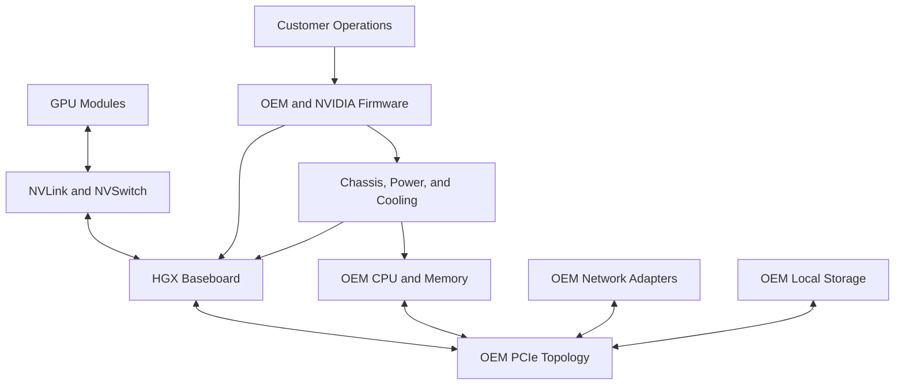

# Why HGX Exists

An enterprise wants a high-bandwidth multi-GPU system but must purchase through an approved OEM, use an existing out-of-band management standard, fit a specific rack and cooling design, and obtain on-site service through a regional support contract. A fully integrated appliance may not align with those constraints. Building the GPU subsystem independently would reintroduce difficult topology and validation risks.

HGX occupies the middle ground. NVIDIA provides a validated GPU platform—accelerator modules, baseboard design, high-bandwidth scale-up fabric, and reference integration requirements—while OEMs build the surrounding server.

## Learning Objectives

After completing this chapter, you will be able to:

- explain the architectural role of HGX;
- distinguish a platform building block from a complete system;
- identify NVIDIA, OEM, integrator, and customer ownership boundaries;
- explain why two HGX-based systems may behave differently;
- evaluate when HGX is appropriate compared with DGX or PCIe GPU servers.

## The Integration Problem

High-density GPU systems are difficult to design because many component relationships influence performance and reliability.

**Figure 6.1.1 — HGX standardizes the accelerator complex while preserving OEM integration choices.** The complete system remains a joint product of NVIDIA design, OEM engineering, and customer operations.

## What HGX Standardizes

### The scale-up GPU complex

HGX provides a known relationship among multiple GPUs and the internal high-bandwidth fabric. This is important because distributed workloads inside a node depend on topology, peer access, and collective communication behavior. Leaving those relationships to ad hoc server design would create significant performance and validation risk.

### Electrical, mechanical, and thermal requirements

A dense accelerator baseboard imposes strict requirements on power delivery, cooling, mechanical support, and signal integrity. Reference requirements allow qualified OEMs to build systems around the platform without inventing the accelerator subsystem from first principles.

### A validation boundary

HGX establishes expectations for the GPU platform, but the final server still requires qualification. CPU selection, PCIe switch layout, NIC placement, local storage, cooling implementation, firmware tooling, and chassis serviceability can differ across OEM products.

## What the OEM Adds

| Integration area | Typical OEM responsibility | Architectural consequence |
|---|---|---|
| Host processors | CPU generation, socket count, memory channels | Affects preprocessing, I/O, NUMA behavior, and host balance |
| PCIe hierarchy | Switches, root complexes, adapter slots | Affects NIC and storage locality |
| Networking | Adapter type, count, and placement | Affects scale-out communication paths |
| Storage | Boot and local data devices | Affects staging, caching, and serviceability |
| Chassis | Form factor, access, airflow or liquid cooling | Affects rack density and maintenance |
| Management | BMC, firmware tooling, telemetry integration | Affects fleet operations and support workflows |
| Support | Parts, field service, escalation path | Affects recovery time and ownership clarity |

This is why the statement “both systems use the same HGX platform” does not prove that the complete systems are operationally or architecturally equivalent.

## HGX, DGX, and PCIe Servers

| Dimension | HGX-based OEM system | DGX system | PCIe GPU server |
|---|---|---|---|
| GPU subsystem | NVIDIA HGX scale-up platform | NVIDIA-integrated system | OEM-specific card topology |
| Host integration | OEM-defined | NVIDIA-defined | OEM-defined |
| Choice | Broad OEM and chassis choice | More standardized | Broadest component choice |
| Validation burden | Shared across NVIDIA, OEM, and customer | More consolidated | Usually highest customer qualification burden |
| Support boundary | OEM-led with NVIDIA dependencies | More integrated | Component and OEM dependent |
| Best fit | Enterprise OEM standards with scale-up requirements | Standardized integrated AI systems | Flexible or smaller-scale deployments |

The right choice depends on constraints. HGX is particularly useful when customers need a high-bandwidth multi-GPU platform but also require OEM-specific host integration, regional support, chassis design, or management tooling.

## Ownership Must Be Explicit

A production HGX deployment can fail operationally even when the hardware is healthy because teams do not know which organization owns a firmware package, diagnostic, replacement procedure, or compatibility decision.

A responsibility matrix should cover at least:

- GPU and NVSwitch firmware;
- system BIOS and BMC firmware;
- operating system and kernel;
- NVIDIA driver and CUDA compatibility;
- NIC firmware and OFED or Ethernet stack;
- storage firmware;
- thermal and power alerts;
- system diagnostics;
- replacement approval and escalation.

## Production Story

A customer compares two eight-GPU HGX systems. Both appear equivalent in a high-level procurement sheet. During architecture review, one system places network adapters closer to the GPU-serving PCIe roots, while the other provides more local NVMe capacity and a different cooling model. The first may better support communication-heavy distributed training. The second may better fit data-staging or checkpoint requirements. Facility capabilities and operational preferences may decide the final choice.

The lesson is to inspect the whole server rather than purchasing by baseboard identity.

## Troubleshooting Cross-Vendor Ambiguity

**Symptoms**

- NVIDIA and OEM tools report different firmware inventories;
- a support case moves between vendors without a clear owner;
- collective performance varies across nominally identical nodes;
- adapter locality differs from the architecture document;
- an upgrade is supported by one component vendor but absent from the system matrix.

**Diagnosis**

1. Capture the complete system bill of materials and topology.
2. Record firmware and software versions by ownership domain.
3. Compare the installed state with the OEM-qualified matrix.
4. Run GPU, PCIe, network, storage, and thermal diagnostics separately.
5. Identify the first boundary where observed behavior diverges from the validated design.

**Root cause**

The deployment assumed that HGX standardized the complete server and lifecycle.

**Resolution**

Use the OEM system matrix as the primary integrated baseline, maintain a responsibility map, and establish a joint escalation procedure before production launch.

## Customer Perspective

HGX value should be explained as a balance between standardization and flexibility. It standardizes the most performance-sensitive scale-up GPU complex while allowing OEMs to adapt the surrounding system to enterprise purchasing, service, facility, and management requirements.

The trade-off is increased integration responsibility compared with a more consolidated system. Customers must qualify the complete OEM implementation and operate within its support matrix.

## Interview Preparation

### Architecture question

Why can two HGX-based servers deliver different application behavior?

A strong answer covers CPU and NUMA topology, PCIe hierarchy, NIC placement, storage design, firmware, cooling, power limits, BIOS settings, and OEM validation—not differences in the HGX GPU complex alone.

### Customer question

How would you compare an HGX OEM system with DGX?

Begin with customer constraints: procurement model, support preference, facility design, management tooling, desired standardization, integration capability, serviceability, and time to deploy. Then compare ownership boundaries and lifecycle risk.

## Key Takeaways

- HGX exists to provide a validated high-bandwidth GPU platform for OEM integration.
- It is a building block, not a complete server or operating model.
- OEM choices around CPU, PCIe, networking, storage, cooling, firmware, and service matter.
- Similar HGX baseboards do not guarantee identical system behavior.
- Clear responsibility and support boundaries are essential for production operations.

## Cross References

- [Volume 06 Introduction](./index)
- [Volume 05 — DGX Systems](../volume-05/index)
- [Volume 02 — GPU Topology](../volume-02/chapter-10-gpu-topology-peer-access-and-data-paths)
