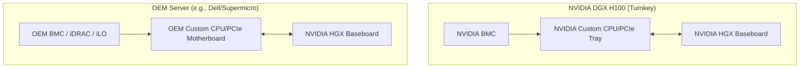

# Chapter 1 — Why HGX Exists: The Merchant Silicon Strategy

| Chapter metadata | Value |
|---|---|
| Volume | 06 — HGX Platforms & OEM Integration |
| Difficulty | Advanced |
| Estimated reading time | 30 minutes |
| Primary audience | DevOps, SRE, Platform, Cloud and Infrastructure Engineers |
| Core question | If the NVIDIA DGX is the perfect AI server, why do AWS, Azure, Dell, and HPE use HGX instead? |

## Introduction

In Volume 5, we established the NVIDIA DGX as the gold standard of AI infrastructure—a turnkey, physics-first server where NVIDIA designs every millimeter from the CPU to the chassis to the software stack.

However, if you look at the global deployment of NVIDIA GPUs, the vast majority do not live inside DGX servers. They live inside servers branded by Dell, Hewlett Packard Enterprise (HPE), Supermicro, Lenovo, and bespoke servers designed by hyperscalers like AWS, Google Cloud, and Microsoft Azure.

These companies do not buy DGX servers. They buy **NVIDIA HGX** baseboards.

As a Senior AI Infrastructure Architect, you will frequently be asked to evaluate vendor proposals. You must understand the profound difference between buying a turnkey DGX appliance and buying an OEM (Original Equipment Manufacturer) server built around an HGX tray.

## 1. What is HGX?

**HGX (Hyperscale Graphics Extension)** is a "merchant silicon" product. 

NVIDIA does not sell raw SXM GPUs (like the H100) individually. You cannot buy a single H100 SXM chip and solder it yourself. Instead, NVIDIA manufactures and sells the **HGX Baseboard**.

The HGX Baseboard is the bottom half of an AI server. It is a massive printed circuit board (PCB) that includes:
1. **The GPUs:** 4 or 8 SXM GPUs (e.g., A100, H100, B200) bolted directly to the board.
2. **The NVSwitches:** The proprietary chips that create the fully non-blocking 900+ GB/s mesh between the GPUs.
3. **Power Delivery:** Complex voltage regulation modules (VRMs) that convert data center power down to the extreme voltages required by the GPU silicon.

### What is Missing?
The HGX board has **no CPUs, no RAM, no storage, no network cards, no power supplies, and no chassis**. 
It is just a massive component.

## 2. Why Hyperscalers and OEMs Need HGX

If DGX is perfect, why does HGX exist? 

### 2.1 The Hyperscaler Reality (AWS, Azure, GCP)
Cloud providers have spent decades building highly proprietary, hyper-optimized data centers. 
*   **Custom Management:** AWS uses Nitro. Azure uses Cerberus. They have custom hardware offload chips for security and hypervisor management. A turnkey NVIDIA DGX server has its own Baseboard Management Controller (BMC) and OS, which conflicts entirely with AWS's automated control plane.
*   **Custom Power and Cooling:** Cloud providers design their own server chassis to fit their specific power racks and liquid cooling manifolds. 
*   **The Solution:** Hyperscalers buy HGX boards by the tens of thousands and integrate them into their own proprietary server chassis designs.

### 2.2 The Enterprise OEM Reality (Dell, HPE, Supermicro)
Enterprise customers have existing contracts, support agreements, and management planes.
*   An IT department might exclusively use Dell servers, managed by Dell iDRAC out-of-band controllers, utilizing Dell's global 4-hour parts replacement warranty.
*   They want NVIDIA AI performance, but they want it wrapped in a Dell chassis so it plugs seamlessly into their existing operational model.
*   **The Solution:** Dell buys the HGX board from NVIDIA, engineers the top half of the server (Intel/AMD CPUs, RAM, Dell PCIe risers, fans, and chassis), and sells it as a Dell PowerEdge XE9680.

## Architectural Diagram: DGX vs. OEM HGX

## 3. The Trade-offs of the HGX Approach

When you buy a DGX, NVIDIA guarantees the performance. When you buy an OEM HGX server, the OEM guarantees the performance. This introduces massive architectural variables.

1. **PCIe Topologies Vary:** NVIDIA dictates how the HGX board works internally. But the OEM decides how the host CPUs connect to that board. OEM A might use expensive PCIe switches to enable perfect GPUDirect RDMA. OEM B might connect the GPUs directly to the CPU to save money, creating a NUMA bottleneck. 
2. **Thermal Engineering Varies:** NVIDIA's DGX cooling is optimized for 700W GPUs. An OEM might design a chassis with inferior airflow, causing the HGX board to thermal throttle under heavy load.
3. **Support Finger-Pointing:** If a training job crashes with a CUDA error on an OEM server, the OEM might blame the NVIDIA driver, while NVIDIA blames the OEM's motherboard BIOS. (NVIDIA mitigates this heavily via the "NVIDIA-Certified Systems" program, but physical discrepancies still exist).

## Customer Scenario (Senior Level)

**The Situation:**
A manufacturing company's CTO states: "We need an 8-GPU H100 server for our internal AI workloads. Our reseller quoted us a Dell PowerEdge XE9680 (which contains an HGX H100 8-GPU board) and an NVIDIA DGX H100. The Dell server is 15% cheaper. Since they both use the exact same NVIDIA HGX board inside, there is zero difference in performance. We will buy the Dell."

**The Senior Architect Response:**
"While the bottom half of both servers is mathematically identical (the HGX baseboard), the servers as a whole are fundamentally different, and assuming identical performance is a dangerous architectural fallacy.

The performance of an AI workload is not just dictated by the GPU silicon; it is dictated by how fast we can feed that silicon. The top half of the server—the CPU, PCIe layout, and Network Interface Cards—controls the data feed. 

The NVIDIA DGX H100 is engineered with a strict 1:1 ratio of GPUs to ConnectX-7 400Gbps network cards (8 compute NICs total), allowing for 3.2 Tbps of egress bandwidth explicitly for distributed training. 

If we choose the Dell server to save 15%, we must meticulously verify the OEM's PCIe topology and network configuration. Does the Dell quote include 8x ConnectX-7 NICs? Are those NICs placed on the exact same PCIe switches as the GPUs to enable GPUDirect RDMA, or are they routed through the CPU's UPI link? If the OEM chassis relies on a generic dual-NIC configuration to save costs, our multi-node training performance will drop by up to 80% due to network starvation. 

The OEM path is highly viable and often preferable for enterprise management integration, but we must validate the *entire* server architecture, not just the HGX tray, before signing the purchase order."

## Interview Preparation

**Conceptual:** What is the fundamental difference between an NVIDIA DGX and an NVIDIA HGX? *(Hint: DGX is a fully integrated, turnkey server appliance designed entirely by NVIDIA. HGX is just the GPU baseboard (the bottom half), sold as a component to OEMs and cloud providers to integrate into their own custom servers).*

**Architecture:** Why do cloud providers (Hyperscalers) exclusively use HGX boards rather than deploying DGX servers? *(Hint: Hyperscalers have massive proprietary infrastructure ecosystems (e.g., AWS Nitro, Azure custom data center racks). DGX appliances conflict with these proprietary control planes and form factors. HGX allows them to inject NVIDIA's maximum AI performance directly into their bespoke hardware designs).*
