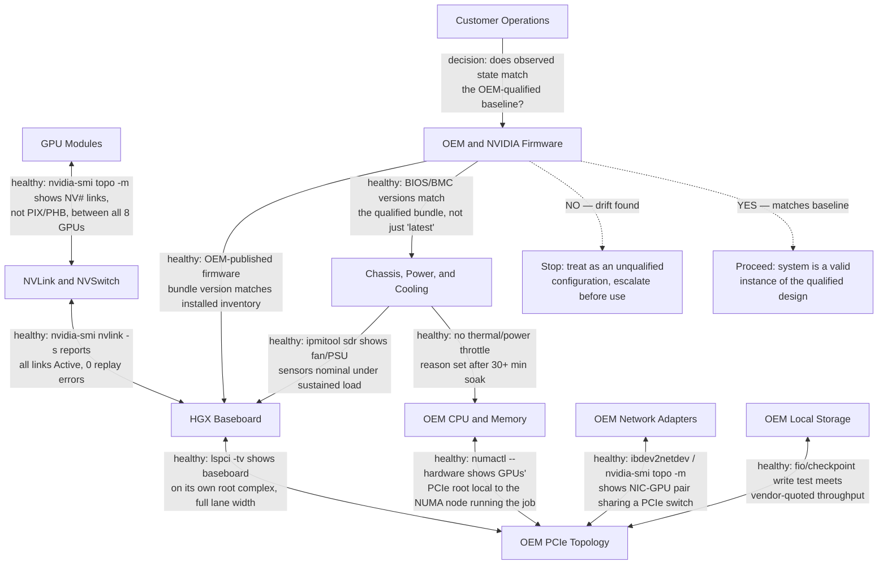

# Why HGX Exists

An enterprise wants a high-bandwidth multi-GPU system but must purchase through an approved OEM, use an existing out-of-band management standard, fit a specific rack and cooling design, and obtain on-site service through a regional support contract. A fully integrated appliance may not align with those constraints. Building the GPU subsystem independently would reintroduce difficult topology and validation risks.

HGX occupies the middle ground. NVIDIA provides a validated GPU platform—accelerator modules, baseboard design, high-bandwidth scale-up fabric, and reference integration requirements—while OEMs build the surrounding server.

## Learning Objectives

After completing this chapter, you will be able to:

- explain the architectural role of HGX;
- distinguish a platform building block from a complete system;
- identify NVIDIA, OEM, integrator, and customer ownership boundaries;
- explain why two HGX-based systems may behave differently;
- evaluate when HGX is appropriate compared with DGX or PCIe GPU servers.

## The Integration Problem

High-density GPU systems are difficult to design because many component relationships influence performance and reliability.



**Figure 6.1.1 — HGX standardizes the accelerator complex while preserving OEM integration choices.** Each edge names the command or evidence that proves that hop is healthy, not just that the box exists. The bottom decision point is the one that actually matters operationally: two systems can have an identical-looking diagram and still diverge the moment one of them fails the firmware/BIOS baseline check.

**How to read this in an incident:** start at `Operations` and walk backward. If `nvidia-smi topo -m` shows a GPU pair connected by `PIX` (single PCIe switch hop) instead of `NVx` (NVLink), the fault is in the `GPU <-> ScaleUp` hop, not further downstream — don't waste time comparing firmware bundles until the interconnect evidence itself checks out.

## What HGX Standardizes

### The scale-up GPU complex

HGX provides a known relationship among multiple GPUs and the internal high-bandwidth fabric. This is important because distributed workloads inside a node depend on topology, peer access, and collective communication behavior. Leaving those relationships to ad hoc server design would create significant performance and validation risk.

### Electrical, mechanical, and thermal requirements

A dense accelerator baseboard imposes strict requirements on power delivery, cooling, mechanical support, and signal integrity. Reference requirements allow qualified OEMs to build systems around the platform without inventing the accelerator subsystem from first principles.

### A validation boundary

HGX establishes expectations for the GPU platform, but the final server still requires qualification. CPU selection, PCIe switch layout, NIC placement, local storage, cooling implementation, firmware tooling, and chassis serviceability can differ across OEM products.

## What the OEM Adds

| Integration area | Typical OEM responsibility | Architectural consequence |
|---|---|---|
| Host processors | CPU generation, socket count, memory channels | Affects preprocessing, I/O, NUMA behavior, and host balance |
| PCIe hierarchy | Switches, root complexes, adapter slots | Affects NIC and storage locality |
| Networking | Adapter type, count, and placement | Affects scale-out communication paths |
| Storage | Boot and local data devices | Affects staging, caching, and serviceability |
| Chassis | Form factor, access, airflow or liquid cooling | Affects rack density and maintenance |
| Management | BMC, firmware tooling, telemetry integration | Affects fleet operations and support workflows |
| Support | Parts, field service, escalation path | Affects recovery time and ownership clarity |

This is why the statement “both systems use the same HGX platform” does not prove that the complete systems are operationally or architecturally equivalent.

## HGX, DGX, and PCIe Servers

| Dimension | HGX-based OEM system | DGX system | PCIe GPU server |
|---|---|---|---|
| GPU subsystem | NVIDIA HGX scale-up platform | NVIDIA-integrated system | OEM-specific card topology |
| Host integration | OEM-defined | NVIDIA-defined | OEM-defined |
| Choice | Broad OEM and chassis choice | More standardized | Broadest component choice |
| Validation burden | Shared across NVIDIA, OEM, and customer | More consolidated | Usually highest customer qualification burden |
| Support boundary | OEM-led with NVIDIA dependencies | More integrated | Component and OEM dependent |
| Best fit | Enterprise OEM standards with scale-up requirements | Standardized integrated AI systems | Flexible or smaller-scale deployments |

The right choice depends on constraints. HGX is particularly useful when customers need a high-bandwidth multi-GPU platform but also require OEM-specific host integration, regional support, chassis design, or management tooling.

## Ownership Must Be Explicit

A production HGX deployment can fail operationally even when the hardware is healthy because teams do not know which organization owns a firmware package, diagnostic, replacement procedure, or compatibility decision.

A responsibility matrix should cover at least:

- GPU and NVSwitch firmware;
- system BIOS and BMC firmware;
- operating system and kernel;
- NVIDIA driver and CUDA compatibility;
- NIC firmware and OFED or Ethernet stack;
- storage firmware;
- thermal and power alerts;
- system diagnostics;
- replacement approval and escalation.

## Production Story

A customer compares two eight-GPU HGX systems. Both appear equivalent in a high-level procurement sheet. During architecture review, one system places network adapters closer to the GPU-serving PCIe roots, while the other provides more local NVMe capacity and a different cooling model. The first may better support communication-heavy distributed training. The second may better fit data-staging or checkpoint requirements. Facility capabilities and operational preferences may decide the final choice.

The lesson is to inspect the whole server rather than purchasing by baseboard identity. "Same HGX generation" is a claim about one subsystem; it is not evidence about the rest of the machine. The way to turn that claim into evidence is to run the same topology query on both candidates and compare the output line by line:

```text
$ nvidia-smi topo -m
        GPU0  GPU1  GPU2  GPU3  NIC0  NIC1  CPU Affinity  NUMA Affinity
GPU0     X    NV18  NV18  NV18  PIX   SYS   0-31          0
GPU1    NV18   X    NV18  NV18  PIX   SYS   0-31          0
GPU2    NV18  NV18   X    NV18  SYS   PIX   32-63         1
GPU3    NV18  NV18  NV18   X    SYS   PIX   32-63         1
NIC0     PIX   PIX   SYS   SYS    X    SYS
NIC1     SYS   SYS   PIX   PIX   SYS    X

Legend:
  X    = self
  NV#  = connected via # NVLinks (scale-up fabric, fastest)
  PIX  = connected through a single PCIe switch (fast, same root)
  SYS  = crosses a CPU/NUMA boundary (slowest, avoid on the hot path)
```

Reading this output is the actual comparison, not the procurement sheet: `GPU0-GPU3` all show `NV18`, so the scale-up fabric is uniform — the HGX baseboard claim checks out. But `NIC0` reaches `GPU0`/`GPU1` over `PIX` (good — same PCIe switch) while it reaches `GPU2`/`GPU3` over `SYS` (crosses sockets — bad for any collective that expects a rank on GPU2 to use NIC0). If "System B" in the procurement sheet shows `PIX` for every GPU-NIC pair instead of two `SYS` entries, that is the concrete, checkable difference that "more balanced NIC placement" was gesturing at — and it is the kind of difference a spec sheet with matching GPU counts will never surface.

## Troubleshooting Cross-Vendor Ambiguity

**Symptoms**

- NVIDIA and OEM tools report different firmware inventories;
- a support case moves between vendors without a clear owner;
- collective performance varies across nominally identical nodes;
- adapter locality differs from the architecture document;
- an upgrade is supported by one component vendor but absent from the system matrix.

**Diagnosis**

1. Capture the complete system bill of materials and topology — the `nvidia-smi topo -m` output above is exactly this evidence for the GPU/NIC/NUMA layer; pair it with `lspci -tv` for the full PCIe tree.
2. Record firmware and software versions by ownership domain. In practice this means capturing at minimum:
   ```text
   $ nvidia-smi --query-gpu=driver_version,vbios_version --format=csv
   driver_version, vbios_version
   550.90.07, 96.00.74.00.10

   $ ipmitool mc info | grep -E 'Firmware Revision|Manufacturer'
   Firmware Revision  : 4.86
   Manufacturer Name  : <OEM BMC vendor>
   ```
   The `vbios_version` and BMC `Firmware Revision` are the two numbers most often missing from a "we're on the same driver" conversation — driver version alone says nothing about GPU VBIOS or BMC firmware, both of which are part of the qualified bundle.
3. Compare the installed state with the OEM-qualified matrix — a mismatch here (e.g., `vbios_version` newer than anything listed in the OEM's published bundle) is the single most common cause of "collective performance varies across nominally identical nodes," because an unqualified VBIOS can silently change default power/clock behavior.
4. Run GPU, PCIe, network, storage, and thermal diagnostics separately.
5. Identify the first boundary where observed behavior diverges from the validated design.

**Root cause**

The deployment assumed that HGX standardized the complete server and lifecycle.

**Resolution**

Use the OEM system matrix as the primary integrated baseline, maintain a responsibility map, and establish a joint escalation procedure before production launch.

## Customer Perspective

HGX value should be explained as a balance between standardization and flexibility. It standardizes the most performance-sensitive scale-up GPU complex while allowing OEMs to adapt the surrounding system to enterprise purchasing, service, facility, and management requirements.

The trade-off is increased integration responsibility compared with a more consolidated system. Customers must qualify the complete OEM implementation and operate within its support matrix.

## Interview Preparation

### Architecture question

**Why can two HGX-based servers deliver different application behavior?**

"I wouldn't assume they're the same system just because the baseboard is. I'd start by running `nvidia-smi topo -m` on both — if the GPU-to-GPU links both show `NV18`, the scale-up fabric matches, so the HGX complex itself is a wash. Then I'd look at what topo shows for the NICs: if one box shows `PIX` from every GPU to its nearest NIC and the other shows `SYS` on half of them, that's a real, measurable difference in how expensive it is to get a tensor off that GPU during scale-out training, and it comes entirely from OEM PCIe layout, not from HGX. On top of that I'd check VBIOS and BMC firmware versions, because an unqualified VBIOS can quietly change default clocks and power limits and produce a performance gap that has nothing to do with topology at all. The short version: the GPU complex is the one thing I'd expect to match: everything else — NUMA layout, NIC placement, firmware, cooling, power policy — is OEM-defined and has to be checked, not assumed."

### Customer question

**How would you compare an HGX OEM system with DGX?**

"I'd start with their constraints, not the hardware. Do they have an approved OEM they have to buy through? Do they need a specific out-of-band management standard for their existing fleet tooling? What's their support model — do they want one throat to choke, or are they fine coordinating across NVIDIA and an OEM when something breaks? DGX gives you a more consolidated, NVIDIA-integrated system with a tighter validation loop — less integration work, less choice. HGX gives you the same scale-up GPU complex but lets you pick the CPU generation, storage, cooling method, and management stack that fits their existing fleet standard, at the cost of having to qualify and support that full combination themselves. Once I know which of those trade-offs they actually care about, the hardware conversation is short."

## Key Takeaways

- HGX exists to provide a validated high-bandwidth GPU platform for OEM integration.
- It is a building block, not a complete server or operating model.
- OEM choices around CPU, PCIe, networking, storage, cooling, firmware, and service matter.
- Similar HGX baseboards do not guarantee identical system behavior.
- Clear responsibility and support boundaries are essential for production operations.

## Cross References

- [Volume 06 Introduction](./index)
- [Volume 05 — DGX Systems](../volume-05/index)
- [Volume 02 — GPU Topology](../volume-02/chapter-10-gpu-topology-peer-access-and-data-paths)
