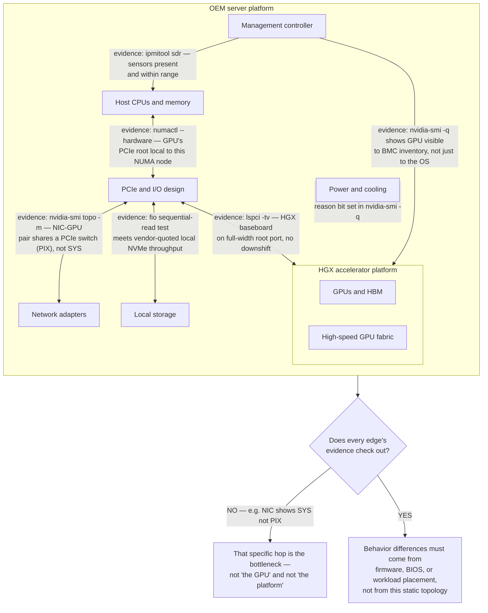
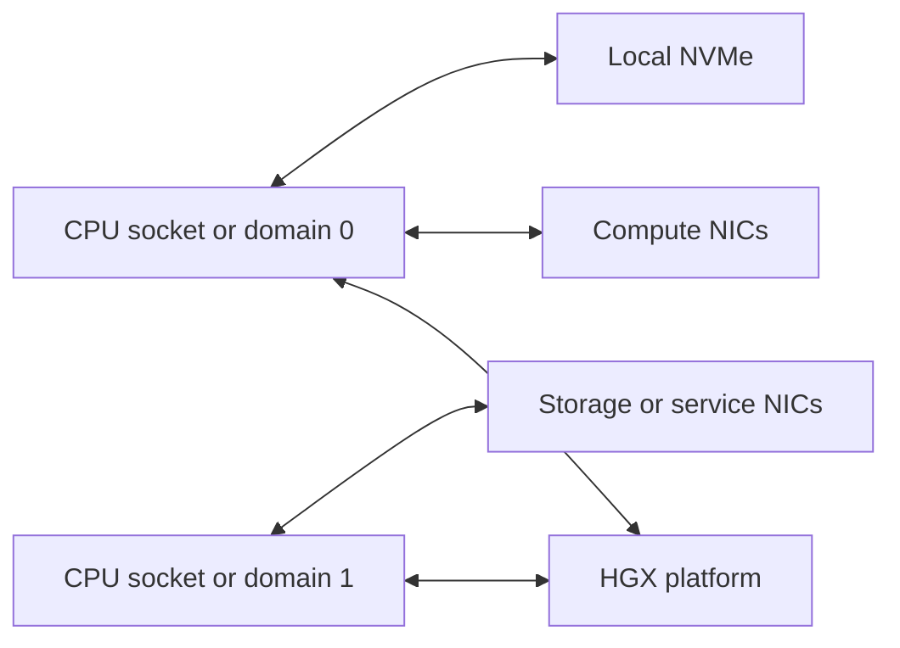
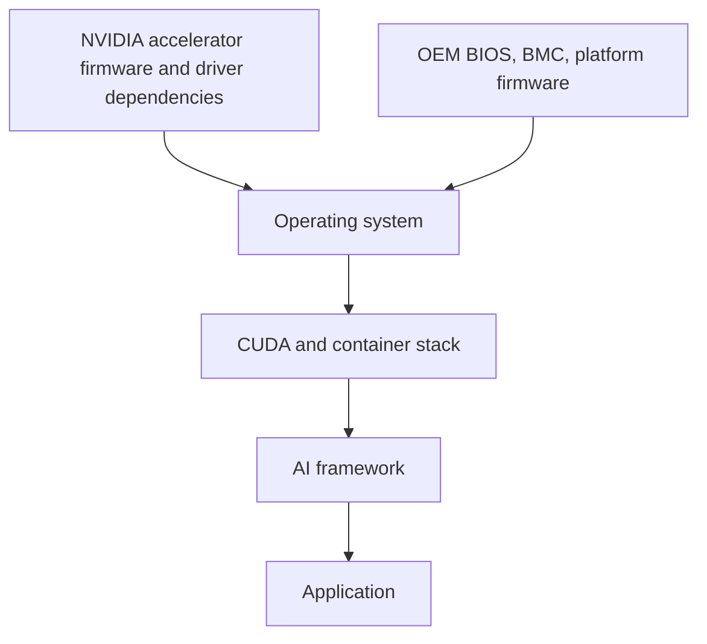
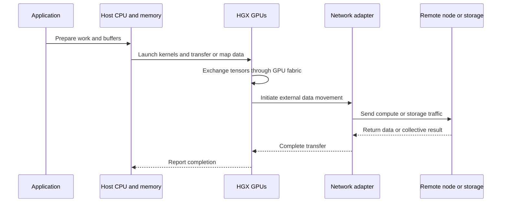

# Inside an HGX Platform

HGX is frequently misunderstood as a complete server. It is better understood as a tightly integrated accelerator platform that becomes part of a complete server designed and delivered by an OEM.

That distinction changes how architecture, support, and troubleshooting work. The accelerator fabric may be standardized, while the surrounding host processors, PCIe layout, network adapters, local storage, cooling implementation, firmware packaging, management interfaces, and service model vary by system vendor.

## Learning objectives

After completing this chapter, you will be able to:

- identify the architectural boundary of an HGX platform;
- separate NVIDIA-provided accelerator integration from OEM system integration;
- explain how host, I/O, power, cooling, firmware, and service choices affect the final platform;
- compare two HGX-based servers without relying only on GPU count;
- identify support ownership across NVIDIA, the OEM, and software vendors;
- troubleshoot an HGX-based system using layered evidence.

## The platform boundary



**Figure 6.2.1 — HGX is a major subsystem inside an OEM server.** Each arrow names the command that proves the hop is healthy. The diagram doubles as a fault-isolation checklist: when a server "underperforms," walk the arrows in order and stop at the first one whose evidence doesn't match a healthy node, rather than guessing at the GPU or the platform as a whole.

The final behavior of the server depends on both the accelerator platform and the OEM integration around it.

## Accelerator domain

The accelerator domain contains the GPUs, local high-bandwidth memory, and the high-speed fabric used for GPU-to-GPU communication.

From the workload perspective, this domain determines:

- how many accelerators can participate inside one server boundary;
- how quickly peer GPUs can exchange data;
- how much aggregate accelerator memory is available;
- which communication paths are available to frameworks and collective libraries.

The accelerator domain does not independently define the host processors, network topology, storage layout, or operational tooling of the final server.

## Host domain

The OEM selects and integrates host processors and system memory around the accelerator platform.

The host design influences:

- CPU preprocessing capacity;
- NUMA locality;
- memory capacity and bandwidth;
- PCIe root-complex placement;
- network-adapter affinity;
- storage-device affinity;
- virtualization and operating-system support.

Two servers built around the same HGX generation can therefore expose different host-level characteristics.

## I/O domain

The I/O domain connects the host and accelerator subsystem to external networks and storage.



This diagram is conceptual. The exact topology must be taken from the specific OEM platform.

An architecture review should ask:

- Which devices share upstream PCIe paths?
- Which CPU domain is closest to each network adapter?
- How are GPU-direct communication paths exposed?
- Are network adapters distributed to support the intended workload?
- Can local storage sustain staging and checkpoint requirements?

## Power and cooling domain

OEM integration is especially important for power and cooling. The server must deliver power safely to the accelerator subsystem and remove heat under sustained workload.

Different platforms may use different:

- chassis sizes;
- fan and airflow designs;
- liquid-cooling options;
- power-supply arrangements;
- rack-level facility requirements;
- service procedures.

A platform that is technically compatible with a workload may still be unsuitable for a facility that cannot support its rack density, cooling method, or redundancy model.

## Firmware and management domain

The final server includes firmware and management components from several sources.



Supportability depends on a validated combination, not an independently chosen version at each layer.

The OEM may package updates, define supported firmware bundles, provide management tools, and own first-line hardware support. NVIDIA owns important accelerator technologies and software components. The customer must understand how these responsibilities meet.

## HGX versus complete-system thinking

| Question | HGX platform view | Complete server view |
|---|---|---|
| What is standardized? | Accelerator integration and internal GPU fabric | Full BOM, host layout, management, cooling, service model |
| Who determines CPU and storage? | Not the HGX platform alone | OEM platform design |
| Who validates firmware bundles? | Shared technology dependency | Usually delivered through the OEM support model |
| Can two systems differ substantially? | Accelerator generation may match | Yes, host and operational characteristics can differ |
| What should a customer purchase? | Not an abstract baseboard alone | A validated OEM system and support lifecycle |

## Comparing HGX-based systems

A meaningful comparison should include more than accelerator specifications.

### Compute and memory

- accelerator generation and count;
- accelerator memory capacity;
- host CPU architecture and count;
- host memory capacity and topology.

**Worked example — why "accelerator memory capacity" is not an abstract line item:** an 8-GPU HGX system with 80GB HBM3 per GPU has 640GB of aggregate GPU memory. A 405B-parameter model at FP16 needs roughly `405,000,000,000 × 2 bytes ≈ 810GB` for weights alone — before optimizer state, activations, or KV cache. That single system cannot hold that model's weights, full stop, regardless of how well the CPU, PCIe, and networking are designed; it needs to be sharded across at least two such nodes at FP16, or run in a lower precision (FP8 weights would need ~405GB, which just barely fits one node with almost nothing left for KV cache or activations). This is why "compute and memory" evaluation has to happen before the I/O and facilities comparison — a platform can be architecturally excellent and still be the wrong size.

### I/O and networking

- number and placement of network adapters;
- supported link technologies;
- PCIe topology and oversubscription;
- local storage configuration;
- direct data-path support.

### Facilities

- rack units;
- maximum and typical power requirements;
- air or liquid cooling;
- inlet-temperature and facility prerequisites;
- service clearances.

### Operations

- BMC and remote-management capability;
- firmware update workflow;
- telemetry integration;
- operating-system support;
- warranty and field-service model;
- validated container and orchestration stack.

### Lifecycle

- component replacement process;
- firmware-bundle cadence;
- support duration;
- upgrade and rollback procedure;
- spare-parts strategy.

## Data flow through an HGX-based server



Every transition crosses an ownership or integration boundary that must be validated in the final system.

## Production architecture considerations

### Availability

Treat the complete server as a failure domain. Even when individual components provide redundancy, host or platform failure can remove all accelerators in the chassis from service.

### Scalability

Scale-out behavior depends on external networking, workload communication patterns, storage, and cluster scheduling. Internal GPU connectivity cannot compensate for a poorly designed external fabric.

### Security

Include BMC access, firmware provenance, secure-boot policy, host identity, network segmentation, tenant isolation, and update authorization.

### Maintainability

A maintainable design has a documented supported baseline, automated inventory, repeatable diagnostics, staged upgrades, and clear escalation paths between customer, OEM, and NVIDIA support.

### Cost

Compare complete platform cost, including facilities, networking, storage, support, and operational staffing. The accelerator subsystem is only part of total cost.

## Production troubleshooting: same HGX, different behavior

### Scenario

Two servers use the same HGX generation, but one consistently underperforms.

### Investigation

1. Compare OEM model and exact bill of materials.
2. Compare CPU and host-memory configuration.
3. Compare PCIe and network-adapter topology — this is usually where the answer is. On the healthy node:
   ```text
   $ nvidia-smi topo -m | grep NIC0
   NIC0     PIX   PIX   SYS   SYS    X    SYS
   ```
   and on the underperforming node:
   ```text
   $ nvidia-smi topo -m | grep NIC0
   NIC0     SYS   SYS   SYS   SYS    X    SYS
   ```
   Same GPU count, same HGX generation, but `NIC0` on the slow node reaches every GPU over `SYS` (crossing a NUMA boundary) instead of `PIX` for two of them on the healthy node. That's not a tuning problem — it means the OEM populated a different PCIe slot for that NIC, or a riser/root-port mapping differs between the two chassis, and every collective that uses `NIC0` on the slow node pays a cross-socket hop it shouldn't.
4. Compare firmware bundles, BIOS settings, and power profiles. Check GPU clocks and throttle reasons directly rather than trusting "no alarms":
   ```text
   $ nvidia-smi -q -d PERFORMANCE | grep -A6 "Clocks Throttle Reasons"
   Clocks Throttle Reasons
       Idle                              : Not Active
       SW Power Cap                      : Active
       HW Slowdown                       : Not Active
       HW Thermal Slowdown               : Not Active
       SW Thermal Slowdown               : Not Active
       Sync Boost                        : Not Active
   ```
   `SW Power Cap: Active` on the underperforming node (and `Not Active` on the healthy one) is a direct, specific finding — it means the BMC or BIOS power profile is capping the GPUs below their rated power budget, which silently drops sustained clocks without producing any explicit error or alarm anywhere else.
5. Compare cooling state and thermal telemetry.
6. Compare driver, CUDA, and framework versions.
7. Compare workload CPU affinity and device placement.
8. Run the same approved benchmark with identical inputs.

### Likely causes

- different host CPU or memory configuration;
- different NIC placement or link state;
- firmware or BIOS drift;
- power or cooling constraints;
- process-affinity differences;
- storage or data-pipeline variation;
- an unhealthy external network path.

### Resolution

Normalize the systems to an approved OEM platform baseline before attributing the difference to the accelerator subsystem.

## Customer scenario

A customer requests “an HGX cluster” and asks several vendors for quotes. The proposals contain the same broad accelerator generation but differ in CPU design, memory, NIC count, cooling, rack density, firmware tooling, and support.

The architect should create a compliance matrix covering:

- workload and scaling requirements;
- host and accelerator topology;
- network and storage design;
- facility compatibility;
- management and observability;
- validated software stack;
- lifecycle and support ownership;
- acceptance testing.

Without that matrix, bids that look equivalent may represent materially different production platforms.

## Interview preparation

### Knowledge questions

**1. Why is HGX not equivalent to a complete server?**

"Because HGX only standardizes the accelerator complex — the GPU modules, the baseboard, and the NVLink/NVSwitch fabric between them. Everything that turns that complex into a server you can actually rack and boot — CPUs, system memory, PCIe layout, NICs, local storage, cooling, BIOS, BMC — is OEM-defined. Two servers can be built around the identical HGX baseboard and still be materially different machines."

**2. Which parts of the final system are determined by the OEM?**

"Host CPU generation and socket count, memory capacity and channel population, PCIe topology and switch placement, NIC selection and slot placement, local storage, chassis and cooling design, BMC and firmware tooling, and the first-line support and service model. HGX hands the OEM a validated accelerator subsystem; the OEM builds and owns literally everything around it."

**3. Why can two HGX-based systems perform differently?**

"Most of the time it's not the GPUs — it's the path data takes to reach them. I'd check `nvidia-smi topo -m` first: if a NIC shows `SYS` instead of `PIX` to the GPUs it's supposed to serve, every collective that uses that NIC is paying a cross-socket hop the other system doesn't pay. After topology, I'd check power profile — `nvidia-smi -q -d PERFORMANCE` showing `SW Power Cap: Active` means the BIOS or BMC is capping GPU power below rated, which drops sustained clocks with zero visible errors anywhere else."

### Architecture questions

1. Draw the boundary between HGX and the surrounding OEM platform.
2. Create an evaluation matrix for two HGX-based servers.
3. Explain how network-adapter placement affects scale-out workloads.

**Model answer for #3:** "If a compute NIC sits behind the same PCIe switch as the GPUs it's paired with, `nvidia-smi topo -m` will show `PIX`, and a GPUDirect RDMA transfer from that GPU to the network never has to cross a CPU socket. If instead the NIC is wired to the other socket's root complex, the topology shows `SYS`, and now every outbound tensor for that GPU crosses the inter-socket link before it even reaches the wire — that's added latency and contention on every single collective step, multiplied by however many ranks are in that situation. At 128+ GPU scale, that one placement decision can be the difference between near-linear scaling and a training job that plateaus past eight nodes."

### Customer questions

1. How would you explain support ownership among the customer, OEM, and NVIDIA?
2. What evidence would you require before approving an HGX-based platform for production?
3. How would facility constraints change the server shortlist?

**Model answer for #2:** "I wouldn't approve on a spec sheet. I'd want the `nvidia-smi topo -m` output from the actual delivered unit, not a reference diagram, because that's what proves NIC and storage locality match what was proposed. I'd want a firmware and driver inventory compared against the OEM's published qualified bundle — GPU VBIOS, BMC, BIOS, NIC firmware — because a technically-newer-but-unqualified firmware version is one of the most common sources of unexplained performance drift. And I'd want a sustained thermal and power soak test, because short benchmarks pass on systems that throttle under real workload duration. Inventory plus topology plus a soak test — that's the minimum evidence bar before I'd sign off."

## Key takeaways

- HGX is an integrated accelerator platform within a complete OEM server.
- The OEM design around HGX materially affects performance, operations, facilities, and support.
- Compare complete systems, not only accelerator specifications.
- Normalize firmware, topology, software, and workload placement before diagnosing platform differences.
- Support boundaries must be designed and documented before production deployment.

## Cross references

- [Volume 06 introduction](./index)
- [Chapter 01 — Why HGX Exists](./chapter-01-why-hgx-exists)
- [Lab 01 — Compare HGX-Based Server Designs](./labs/lab-01-compare-hgx-server-designs)
