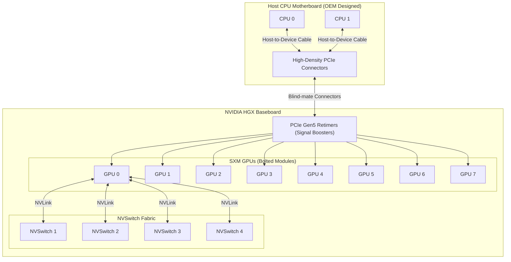

# Chapter 2 — Inside an HGX Platform

| Chapter metadata | Value |
|---|---|
| Volume | 06 — HGX Platforms & OEM Integration |
| Difficulty | Advanced |
| Estimated reading time | 35 minutes |
| Primary audience | DevOps, SRE, Platform, Cloud and Infrastructure Engineers |
| Core question | If you pull an HGX tray out of a server, what exactly are you looking at, and how does it physically connect to the host? |

## Introduction

Whether you buy a DGX from NVIDIA or a server from Supermicro, Dell, or Lenovo, the beating heart of the machine is the **NVIDIA HGX Baseboard**. 

As a Senior Infrastructure Engineer, you must understand the physical realities of this board. When an engineer says "GPU 3 is failing," you need to know if replacing GPU 3 requires unbolting a single module or replacing the entire massive tray. You need to understand how 10.2 kilowatts of power enters the board, and how the massive data payload escapes it to reach the host CPU.

## 1. The Anatomy of the HGX Tray

The HGX tray is a massive, heavy Printed Circuit Board (PCB). It does not slot in vertically like a PCIe card. It lies flat, spanning the entire width of the server chassis.

### 1.1 The SXM Modules
At the top layer of the HGX board sit the GPUs themselves. They use the **SXM (Server eXpress Module)** form factor. 
*   **Not Soldered:** SXM GPUs are *not* permanently soldered to the HGX board. They use high-density mezzanine connectors. They are bolted down with extreme precision to ensure thousands of microscopic pins make perfect contact. 
*   **Field Replaceable Unit (FRU):** If a single H100 GPU fails, an OEM field technician can unbolt the massive heatsink, unscrew the SXM module, and replace *just* the failing GPU, saving the cost of an entire HGX tray.

### 1.2 The NVSwitches
Embedded directly into the PCB of the HGX tray are the **NVSwitch chips**. 
*   In an 8-GPU Hopper HGX board, there are 4 NVSwitches. 
*   These chips act exactly like network switches, but they route NVLink signals. They are responsible for the 900 GB/s non-blocking mesh that allows GPU 0 to talk to GPU 7 without hitting the CPU.
*   **Not Replaceable:** Unlike the GPUs, the NVSwitches are permanently soldered to the baseboard. If an NVSwitch chip burns out, the entire HGX baseboard must be replaced.

### 1.3 The PCIe Retimers
Signals degrade over physical distance. To get data from the host CPU motherboard down to the HGX baseboard, the PCIe Gen 5 signals must travel through high-speed cables or riser cards.
To ensure the signal doesn't corrupt, the HGX board contains **PCIe Retimers**. These are small chips that catch the incoming PCIe signal, amplify and clean it, and retransmit it to the GPUs. 

## Architectural Diagram: The HGX Tray Topography

## 2. Power Delivery: The 54V Shift

Delivering 10,000 Watts to a single circuit board is a terrifying electrical engineering challenge. 

Traditional servers operate on 12-Volt power delivery. If you try to push 10,000 Watts at 12 Volts, the amperage exceeds 800 Amps. The copper wires would have to be incredibly thick, and the heat generated by the resistance would melt the server.

To solve this, NVIDIA HGX boards utilize **54-Volt (or 48V) power delivery**. 
By quadrupling the voltage, the amperage drops to roughly 200 Amps. The OEM chassis (Dell/Supermicro) must contain massive Power Supply Units (PSUs) that convert the data center's AC power directly to 54V DC, pushing it into the HGX baseboard through massive copper busbars. 
The HGX board then uses specialized Voltage Regulation Modules (VRMs) located right next to the SXM GPUs to step the 54V down to the ~1V required by the GPU silicon.

## 3. Form Factors: 4-GPU vs 8-GPU (Delta vs Redstone)

NVIDIA offers different HGX configurations depending on the generation and use case.
*   **8-GPU Boards:** The standard for massive LLM training. Uses NVSwitches to create a fully connected mesh.
*   **4-GPU Boards:** Often completely different physically. In earlier generations (like the A100 "Redstone" board), 4-GPU configurations frequently *did not include NVSwitches*. Instead, the GPUs were wired directly to each other using Point-to-Point NVLink traces. 

**Senior Architect Warning:** If an enterprise buys a 4-GPU HGX server, they cannot just "add 4 more GPUs later." The physical PCB traces, the absence of NVSwitches, and the chassis power delivery are entirely fixed at manufacturing. 

## Customer Scenario (Senior Level)

**The Situation:**
A system administrator is troubleshooting a Supermicro 8-GPU HGX H100 server. The `nvidia-smi` command shows all 8 GPUs are functioning perfectly. However, when the data science team runs a distributed PyTorch training job, NCCL throws an error stating that `GPU 2` cannot communicate via NVLink and is falling back to PCIe. The SysAdmin assumes the SXM module for GPU 2 is defective and opens a ticket to replace the $30,000 GPU.

**The Senior Architect Response:**
"Replacing the GPU is likely a waste of time and will not fix the issue. We must diagnose the physical topography of the HGX baseboard.

In an 8-GPU HGX H100 board, the GPUs do not connect directly to each other; they connect to the four NVSwitch chips soldered to the baseboard. If `nvidia-smi` shows that GPU 2 is healthy, computing math, and communicating with the host CPU over PCIe, the SXM module itself is functionally sound.

The failure is occurring strictly in the NVLink mesh. This means one of three things has happened:
1. The microscopic NVLink pins connecting the SXM module to the HGX baseboard are seated incorrectly or have thermal damage. (We can reseat the GPU).
2. The copper traces running through the PCB from GPU 2 to the NVSwitches are damaged.
3. One of the NVSwitch chips on the baseboard has suffered a silicon failure.

We need to run the `dcgmi diag` suite specifically targeting the NVSwitch fabric. If the diagnostic proves an NVSwitch failure, replacing the GPU will do nothing. We will have to coordinate an RMA with the OEM to replace the entire bottom-half HGX baseboard."

## Interview Preparation

**Conceptual:** What is the physical difference between an SXM GPU and an NVSwitch on an HGX baseboard? *(Hint: The SXM GPU is a bolted-on module that can be replaced in the field. The NVSwitch is permanently soldered to the baseboard's PCB).*

**Architecture:** Why did NVIDIA switch to 54-Volt power delivery for modern HGX baseboards instead of the traditional 12-Volt ATX server standard? *(Hint: Pushing 10,000 Watts at 12 Volts requires massive amperage, resulting in impossibly thick cables and extreme heat due to resistance. 54V drops the amperage to manageable levels).*
