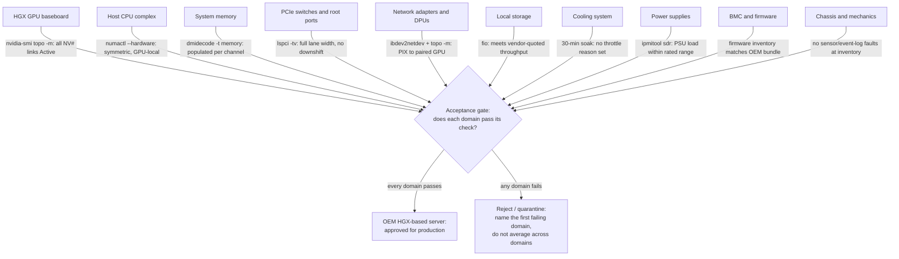
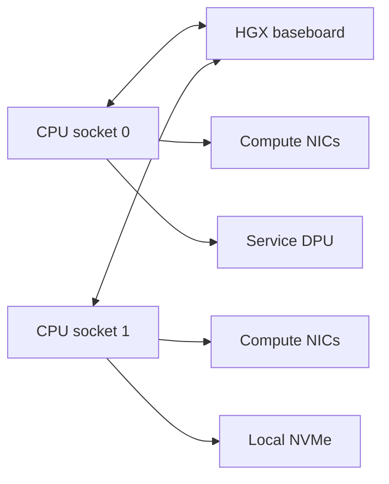
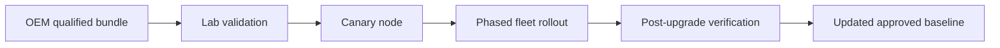

# OEM Integration and Support Boundaries

HGX is a platform building block, not a complete customer-ready server by itself. An OEM integrates the GPU baseboard with host CPUs, system memory, PCIe expansion, networking, storage, power supplies, cooling, chassis mechanics, firmware, BMC functions, and support processes.

This flexibility is the reason HGX can appear in many enterprise server designs. It is also the reason architects must evaluate the complete system rather than assuming that every HGX-based server is operationally identical.

| Chapter field | Value |
|---|---|
| Difficulty | Intermediate |
| Estimated reading time | 40 minutes |
| Prerequisites | Chapters 01–02 |
| Primary outcome | Evaluate an HGX-based server as an integrated and supported platform |

## 1. The Production Problem

A customer compares two servers that use the same HGX generation. The proposals appear equivalent because both contain the same number and type of GPUs.

One system offers a balanced CPU and PCIe layout, qualified network adapters, mature liquid-cooling service procedures, and a coordinated firmware bundle. The other uses a different host topology, fewer service-network options, and a separate escalation path for several components.

The GPU baseboard is common. The production platform is not.

## 2. Learning Objectives

After completing this chapter, you will be able to:

- explain the difference between the HGX platform and an HGX-based server;
- identify the major OEM integration decisions;
- map support ownership across NVIDIA, the OEM, and component vendors;
- evaluate firmware and software qualification boundaries;
- build an acceptance plan for an HGX server design.

## 3. From Baseboard to Server



**Figure 6.3.1 — OEM integration boundary.** The HGX baseboard becomes useful only after the surrounding server is engineered, qualified, and supported as one system. Each domain contributes one specific, checkable piece of evidence into a single acceptance gate — treat the gate as AND, not average: a server with nine passing domains and one failing PCIe check is not "90% ready," it is not ready, because the failing domain is very likely the one the workload will actually hit first.

## 4. Host CPU and Memory Integration

The host complex feeds the GPU subsystem, runs orchestration and data-processing work, handles storage and network interrupts, and provides system memory for staging and offload.

Key design questions include:

- How many CPU sockets are used?
- How are PCIe root ports distributed across sockets?
- Is system memory populated symmetrically?
- Is memory bandwidth sufficient for preprocessing and data movement?
- Are CPU cores reserved for networking, storage, and platform services?
- Are GPU and NIC paths balanced across NUMA domains?

A server with powerful GPUs can still be constrained by an under-designed host complex.

## 5. PCIe and Adapter Integration

HGX servers often require multiple high-speed adapters for scale-out networking, storage, service traffic, and security functions. Adapter count alone does not prove a balanced design.



**Figure 6.3.2 — Simplified balanced host integration.** Real designs vary, but adapters should be distributed to avoid concentrating all high-bandwidth traffic behind one CPU or PCIe root.

The architect should request a topology diagram and verify it with system tools during acceptance.

## 6. Cooling Integration

OEMs may implement air cooling, direct liquid cooling, or a hybrid design. Cooling choice affects:

- rack density;
- facility-water requirements;
- fan power;
- noise;
- service procedures;
- leak detection;
- component replacement time;
- behavior during cooling degradation.

The system must be evaluated as a thermal design, not only as a list of cooled components.

### Questions for liquid-cooled systems

- What facility-water temperatures and flow rates are required?
- Where is the coolant distribution unit located?
- Which components are on the liquid loop?
- What happens if flow is reduced?
- Can a node be isolated without draining the row?
- Who owns leak response and spare parts?

## 7. Firmware Integration

An HGX server contains several firmware domains:

- system BIOS;
- BMC;
- GPU firmware;
- NVSwitch or fabric-related firmware;
- network adapter or DPU firmware;
- storage-controller firmware;
- power and cooling controller firmware.

The supported state is usually a qualified combination. Upgrading one component independently may create an untested platform.

:::warning
A firmware version can be technically newer and operationally unsupported at the same time.
:::

### Firmware-bundle workflow



**Figure 6.3.3 — Controlled firmware lifecycle.** Qualification and rollback planning precede fleet-wide change.

## 8. Software Qualification

The complete platform includes:

- operating system;
- NVIDIA driver;
- CUDA compatibility;
- Fabric Manager where required;
- container runtime;
- orchestration software;
- DCGM and telemetry;
- networking drivers and libraries;
- storage client software.

The customer should maintain an approved compatibility matrix that names the OEM server model and firmware bundle, not merely the GPU generation.

## 9. Support Ownership

When an incident occurs, the first operational question is often:

> Who owns the case?

A support matrix should be agreed before production.

| Failure domain | Typical first owner | Possible escalation |
|---|---|---|
| Chassis, PSU, fan, cooling | OEM | Component supplier |
| BIOS and BMC | OEM | Firmware engineering |
| HGX baseboard or GPU fault | OEM support intake | NVIDIA through OEM process |
| Network adapter | OEM or adapter support | NVIDIA networking support |
| Driver or CUDA issue | Software support path | NVIDIA enterprise support |
| Scheduler or application | Platform team | Software vendor |
| Facility power or cooling | Data-center operations | OEM for impact analysis |

Exact ownership depends on the contract. The architecture team should document the actual agreement rather than relying on assumptions.

## 10. Spare Parts and Serviceability

An enterprise design must answer:

- Which units are field replaceable?
- Which repairs require full node removal?
- What spares are held onsite?
- What is the expected response time?
- Is liquid-loop service required?
- Does replacement change firmware state?
- What validation is required before returning a node to service?

Mean time to repair is shaped as much by process and spare strategy as by hardware reliability.

## 11. Acceptance Testing

An HGX server should pass acceptance at several layers.

### Hardware

- inventory matches the order;
- no sensor or event-log faults;
- power and cooling operate within expected range;
- GPUs, switches, NICs, and storage devices are visible.

### Topology

- CPU, GPU, NIC, and PCIe paths match the approved design;
- GPU scale-up links are healthy;
- network interfaces map to intended fabrics.

### Software

- approved firmware and driver versions are installed;
- Fabric Manager and telemetry services are healthy;
- representative containers launch successfully.

### Performance

- local GPU tests meet the agreed baseline;
- collective communication is consistent across nodes;
- thermal behavior remains stable under sustained load.

## 12. Production Troubleshooting

### Scenario: one OEM server underperforms the rest

#### Symptoms

- all nodes contain the same HGX generation;
- one node shows lower collective bandwidth;
- GPU diagnostics pass;
- workload configuration is identical.

#### Diagnosis

1. Compare `nvidia-smi topo -m` outputs.
2. Compare BIOS and BMC versions.
3. Compare NIC firmware and link state.
4. Inspect NUMA placement and CPU frequency policy.
5. Check cooling telemetry and power caps.
6. Verify the complete OEM firmware bundle.

#### Common root causes

| Root cause | Evidence | Resolution |
|---|---|---|
| Topology mismatch | Different PCIe or NIC path | Correct configuration or isolate nonstandard node |
| Firmware drift | Component versions differ | Reapply qualified bundle |
| NUMA imbalance | Workload and NIC on remote socket | Correct placement policy |
| Cooling limitation | Reduced clocks under sustained load | Repair cooling or adjust facility design |
| Adapter configuration drift | Different link speed or mode | Restore approved network configuration |

**Topology mismatch, with real evidence.** Compare the two nodes' output side by side:
```text
# healthy node
$ nvidia-smi topo -m | grep mlx5_0
mlx5_0   PIX   PIX   SYS   SYS    X    SYS

# underperforming node
$ nvidia-smi topo -m | grep mlx5_0
mlx5_0   SYS   SYS   SYS   SYS    X    SYS
```
On the healthy node, `mlx5_0` shares a PCIe switch (`PIX`) with two of the four GPUs. On the underperforming node it reaches all four GPUs over `SYS` — every one of them crosses a NUMA boundary to use that NIC. That is a physical slot/riser difference between the two chassis, not a software setting; it explains lower collective bandwidth without needing to inspect firmware at all.

**Firmware drift, with real evidence.** Compare VBIOS across nodes rather than trusting the driver version alone:
```text
$ nvidia-smi --query-gpu=index,vbios_version --format=csv
index, vbios_version
0, 96.00.74.00.10
1, 96.00.74.00.10
...

# underperforming node
index, vbios_version
0, 96.00.89.00.04
...
```
Same driver, same CUDA version, but a different VBIOS on the underperforming node's GPU 0. That is exactly the kind of drift a "driver matches" check misses, and an unqualified VBIOS revision can change default power/clock behavior enough to explain a collective-bandwidth gap on its own.

**Cooling limitation, with real evidence.** Pull throttle reasons directly instead of inferring from temperature alone:
```text
$ nvidia-smi -q -d PERFORMANCE | grep -A6 "Clocks Throttle Reasons"
    HW Thermal Slowdown               : Active
    SW Thermal Slowdown               : Not Active
```
`HW Thermal Slowdown: Active` is definitive — the hardware itself is cutting clocks in response to temperature, independent of any software power cap. Pair this with server inlet temperature at the same timestamp before concluding it's a facility problem rather than a fan/airflow fault local to that node.

## 13. Customer Scenario

A cloud provider wants multiple OEMs to reduce supply-chain risk. The architecture team defines a common acceptance contract rather than assuming identical servers.

The contract specifies GPU generation, memory, host CPU minimums, system-memory bandwidth, balanced PCIe topology, network interfaces, firmware policy, monitoring, benchmark thresholds, service response, and replacement procedures.

Multi-vendor sourcing becomes manageable because consistency is defined by measurable behavior and support obligations.

## 14. Interview Preparation

### Architecture question

**What does the OEM add to an HGX platform?**

"HGX gives you the accelerator complex — GPUs, baseboard, and the NVLink/NVSwitch fabric between them, already validated. Everything else in the box is the OEM's: CPU selection and socket count, memory population, PCIe switch layout, which slots the NICs and NVMe land in, the cooling implementation, the power supplies, the BMC and its firmware tooling, and ultimately who picks up the phone when something in that server breaks. I'd tell an interviewer: buying HGX doesn't buy you a server, it buys you the hardest 20% of the server, engineered once and validated — the OEM still has to do real integration work around it."

### Scenario question

**Two HGX-based servers have the same GPUs. Why might one perform better?**

"I wouldn't guess — I'd run `nvidia-smi topo -m` on both first, because NIC-to-GPU placement is the single most common cause of this. If one node shows `PIX` from its NICs to the GPUs and the other shows `SYS`, that's a real physical topology difference the GPU spec sheet can't tell you about. If topology matches, I'd check `nvidia-smi -q -d PERFORMANCE` for throttle reasons — `SW Power Cap` or `HW Thermal Slowdown` being active on one node and not the other explains a clock gap with zero application-level symptoms. Only after topology and throttle state match would I start looking at firmware versions and CPU/NUMA placement."

### Customer question

**Can we mix HGX servers from different OEMs in one cluster?**

"Technically yes, but I'd push back on doing it without proof first. My recommendation would be: treat each OEM model as its own node class initially, define a common acceptance bar — topology output, firmware inventory, a sustained thermal soak, and a collective-bandwidth benchmark — and only pool them into one scheduling class once both vendors' nodes clear that bar with matching numbers. Mixing on faith, based on 'same GPU generation,' is exactly how you end up with a cluster where job runtime varies by which rack a job landed on, and nobody can explain why."

## 15. Summary

HGX provides the accelerated-computing foundation. The OEM turns that foundation into an operable server. Production quality depends on the integration and support model surrounding the baseboard.

The governing principle is:

> Buy and validate the complete platform, not only the GPU baseboard.

## Cross References

- [Chapter 01 — Why HGX Exists](./chapter-01-why-hgx-exists)
- [Chapter 02 — Inside an HGX Platform](./chapter-02-inside-an-hgx-platform)
- [Lab 01 — Compare HGX-Based Server Designs](./labs/lab-01-compare-hgx-server-designs)

## Further Reading

- [NVIDIA HGX Platforms documentation](https://docs.nvidia.com/hgx-platforms/index.html)
- [NVIDIA-Certified Systems](https://docs.nvidia.com/certification-programs/latest/nvidia-certified-systems.html)
- [NVIDIA HGX AI Factory components](https://docs.nvidia.com/enterprise-reference-architectures/hgx-ai-factory/latest/components.html)
