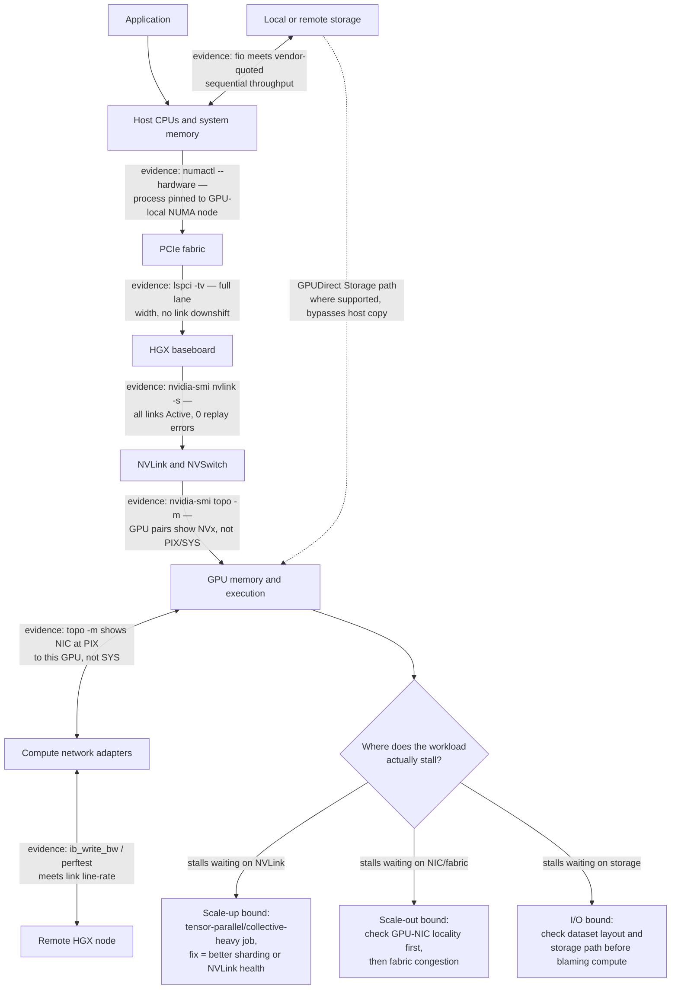
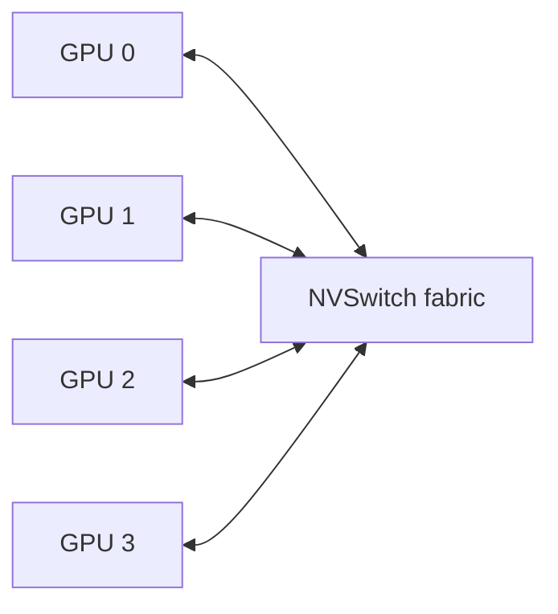
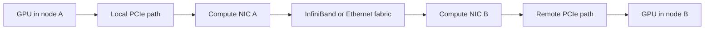
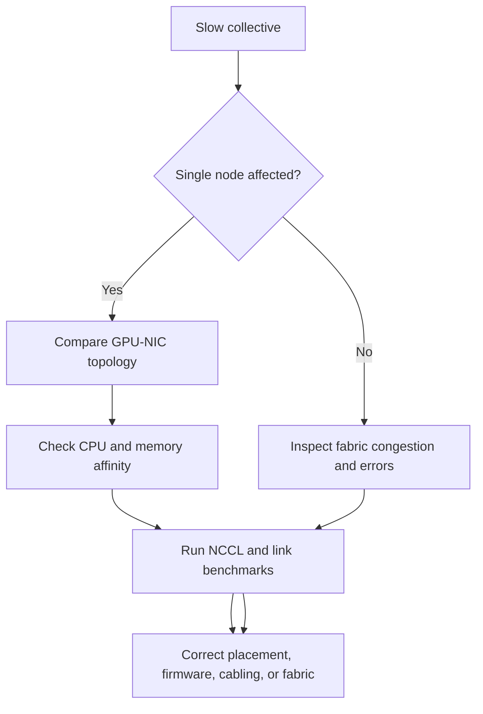

# HGX Topology and Data Paths

An HGX server is not a flat collection of accelerators. It is a topology: a set of paths with different bandwidth, latency, ownership, and failure characteristics.

The same workload can perform very differently depending on whether data remains in GPU memory, crosses NVLink, traverses PCIe, crosses a CPU socket boundary, reaches a network adapter directly, or stages through host memory. Platform engineers therefore need to reason about paths, not just components.

| Chapter field | Value |
|---|---|
| Difficulty | Advanced |
| Estimated reading time | 40–50 minutes |
| Prerequisites | Chapters 01–03 and Volume 02 Chapter 10 |
| Primary outcome | Map workload communication onto HGX data paths |

## 1. The Production Problem

A distributed training job scales well from one GPU to eight GPUs in a node, but poorly from one node to two nodes. Another job performs inconsistently depending on which CPU cores and network interfaces the scheduler assigns.

All GPUs are healthy. The problem lies in the communication path.

## 2. Learning Objectives

After completing this chapter, you will be able to:

- identify the major data paths inside an HGX-based server;
- distinguish scale-up and scale-out communication;
- explain the role of PCIe, NVLink, NVSwitch, NICs, and DPUs;
- identify NUMA and adapter-affinity penalties;
- design topology-aware validation and workload placement.

## 3. The HGX Communication Domains



**Figure 6.4.1 — HGX communication domains.** Each edge is labeled with the command that proves that hop is healthy, and the diagram ends in an explicit decision point: which domain is the workload actually stalled on. Performance work in this chapter is the discipline of walking this graph with real command output instead of assuming the bottleneck is wherever the last change happened to be.

## 4. GPU-Local Data

The fastest useful data is usually data that does not move.

GPU-local memory holds:

- model parameters;
- activations;
- optimizer state;
- workspaces;
- inference key-value cache;
- intermediate tensors.

A kernel accesses local HBM through the GPU memory hierarchy. When the working set fits and access patterns are efficient, the workload avoids inter-device communication.

The first topology optimization is therefore locality: keep data near the execution that consumes it.

## 5. Scale-Up Communication

Scale-up communication occurs among GPUs inside the server. HGX platforms use high-bandwidth GPU interconnect technology to form a coordinated multi-GPU domain.

Typical operations include:

- peer-to-peer tensor transfer;
- collective reductions;
- tensor-parallel exchange;
- pipeline-stage transfer;
- model-state synchronization.



**Figure 6.4.2 — Simplified HGX scale-up fabric.** The actual generation and topology vary, but the architectural purpose is a high-bandwidth communication domain among accelerators.

### Why scale-up matters

A model that does not fit on one GPU must be partitioned. Once partitioned, execution creates communication dependencies. The value of the scale-up fabric depends on:

- tensor size;
- communication frequency;
- collective algorithm;
- overlap between compute and communication;
- synchronization behavior;
- topology awareness of the library.

**Worked example — why NVLink versus PCIe is not a rounding error.** A single tensor-parallel all-reduce of a 1GB activation tensor across 8 GPUs, over an NVLink domain running at roughly 900GB/s aggregate bidirectional bandwidth per GPU, completes in low single-digit milliseconds. The same 1GB exchange forced over PCIe Gen5 x16 (roughly 64GB/s per direction, and now also contending with every other host-to-device transfer on that root) takes on the order of 10x longer per hop, and — critically — that cost repeats on every layer of every forward and backward pass. For a model doing hundreds of such exchanges per training step, the difference between "stays on NVLink" and "falls back to PCIe" is not a tuning detail; it is frequently the difference between a job that scales near-linearly to 8 GPUs and one that does not.

## 6. CPU-to-GPU Paths

The host CPUs remain responsible for many tasks:

- launching work;
- data preprocessing;
- orchestration;
- filesystem and network services;
- control-plane logic;
- host-device transfers.

The host path usually traverses PCIe. Its efficiency depends on:

- CPU socket locality;
- PCIe generation and lane width;
- switch placement;
- pinned versus pageable memory;
- transfer size;
- overlap with GPU execution.

A process running on the wrong NUMA node may feed the GPU through a remote CPU interconnect, creating avoidable latency and contention.

## 7. Scale-Out Communication

Scale-out communication connects GPUs in different servers.



**Figure 6.4.3 — Simplified scale-out path.** GPUDirect RDMA can reduce unnecessary host-memory staging when the platform and software stack support the direct path.

Scale-out performance depends on the entire path:

- GPU-to-NIC affinity;
- PCIe topology;
- adapter speed and firmware;
- switch fabric design;
- routing and congestion control;
- collective library configuration;
- remote-node symmetry.

A high-speed network cannot compensate for an inefficient GPU-to-NIC path inside the server.

## 8. East-West and North-South Traffic

AI platforms often separate network roles.

| Traffic class | Typical purpose | Primary concern |
|---|---|---|
| East-west compute | Collective communication among GPU nodes | Bandwidth, latency, congestion, symmetry |
| North-south service | Client, API, storage, management, or external traffic | Availability, security, routing, tenancy |
| Out-of-band | BMC and hardware administration | Isolation and recoverability |

Combining all traffic on one fabric may simplify cabling but can increase contention and expand the security blast radius. Separation may be physical or logical, depending on scale and requirements.

## 9. Storage Data Paths

Training and inference both depend on storage.

### Conventional path

```text
Storage → network or NVMe controller → host memory → GPU memory
```

### Direct path where supported

```text
Storage → peer-capable I/O path → GPU memory
```

Direct data paths can reduce CPU involvement and copies, but they do not automatically solve poor dataset layout, small I/O, metadata bottlenecks, or insufficient storage parallelism.

## 10. Topology Inspection

Useful inspection commands include:

```bash
nvidia-smi topo -m
lspci -tv
numactl --hardware
ibdev2netdev
```

### `nvidia-smi topo -m` — the primary topology map

```text
$ nvidia-smi topo -m
        GPU0  GPU1  GPU2  GPU3  GPU4  GPU5  GPU6  GPU7  NIC0  NIC1  CPU Affinity  NUMA Affinity
GPU0     X    NV18  NV18  NV18  NV18  NV18  NV18  NV18  PIX   SYS   0-63          0
GPU1    NV18   X    NV18  NV18  NV18  NV18  NV18  NV18  PIX   SYS   0-63          0
GPU2    NV18  NV18   X    NV18  NV18  NV18  NV18  NV18  SYS   PIX   64-127        1
GPU3    NV18  NV18  NV18   X    NV18  NV18  NV18  NV18  SYS   PIX   64-127        1
...
NIC0     PIX   PIX   SYS   SYS  ...    X    SYS
NIC1     SYS   SYS   PIX   PIX  ...   SYS    X

Legend:
  X    = self
  NV#  = connected via # NVLinks (scale-up fabric — fastest, stays on this row for every healthy 8-GPU HGX node)
  PIX  = connected through a single PCIe switch (fast, shares a root complex)
  PHB  = connected through a PCIe host bridge
  SYS  = crosses a CPU/NUMA boundary (slowest path — expected for the "wrong" NIC, a problem for the "right" one)
```
Reading order that matters operationally: first confirm every `GPUx`-`GPUy` cell reads `NV18` — any `PIX`/`SYS` in that block means the scale-up fabric itself is degraded (a failed NVLink, not a placement problem). Then check each NIC's row against the GPUs it's supposed to serve: `NIC0` at `PIX` to `GPU0`/`GPU1` and `SYS` to `GPU2`-`GPU7` is the *expected* pattern on a dual-socket, dual-NIC-domain design — a rank on `GPU2` should be assigned `NIC1`, not `NIC0`. If a rank-to-NIC mapping in the launcher ignores this table, that rank pays a cross-socket hop on every collective step even though the hardware itself is healthy.

### `lspci -tv` — the PCIe tree

```text
$ lspci -tv
-+-[0000:16]-+-00.0-[17]----00.0  NVIDIA Corporation GH100 [H100 SXM5 80GB]
 |           +-01.0-[18]----00.0  Mellanox Technologies MT2910 (ConnectX-7)
 +-[0000:64]-+-00.0-[65]----00.0  NVIDIA Corporation GH100 [H100 SXM5 80GB]
             +-01.0-[66]----00.0  Mellanox Technologies MT2910 (ConnectX-7)
```
This confirms the GPU and its paired NIC hang off the *same* upstream root (`0000:16` for the first pair), corroborating what `topo -m` reported as `PIX`. If the NIC instead showed up under a different root complex than its "paired" GPU, that mismatch — not the GPU itself — is the finding to escalate.

### `numactl --hardware` — NUMA nodes and CPU memory layout

```text
$ numactl --hardware
available: 2 nodes (0-1)
node 0 cpus: 0 1 2 3 ... 63
node 0 size: 515000 MB
node 0 free: 480210 MB
node 1 cpus: 64 65 66 67 ... 127
node 1 size: 515000 MB
node 1 free: 502114 MB
node distances:
node   0   1
  0:  10  21
  1:  21  10
```
`node distances` is the field most people skip: `10` is local access cost, `21` is the relative cost of crossing to the other socket — roughly 2x latency. A process pinned to node 0 but allocating GPU work on a `GPU2`/`GPU3` (node-1-local, per the topology table above) pays that 21-vs-10 penalty on every host-side touch of that data, which is exactly the kind of NUMA imbalance this chapter warns about.

### `ibdev2netdev` — InfiniBand device to network interface mapping

```text
$ ibdev2netdev
mlx5_0 port 1 ==> ibs0f0 (Up)
mlx5_1 port 1 ==> ibs0f1 (Up)
```
`(Up)` confirms link state at the OS level; cross-reference the device name (`mlx5_0`) back to the `NIC0`/`NIC1` labels in `nvidia-smi topo -m` — the mapping between NVIDIA's topology-tool naming and the kernel's InfiniBand device naming is exactly what this command exists to resolve, and getting it wrong is a common source of "I fixed NIC0 but the job still uses the wrong adapter" incidents.

### Purpose

- `nvidia-smi topo -m` shows GPU, NIC, CPU, and interconnect relationships.
- `lspci -tv` exposes the PCIe tree.
- `numactl --hardware` shows NUMA nodes and CPU memory layout.
- `ibdev2netdev` maps InfiniBand devices to network interfaces where available.

The expected output is platform-specific. The correct validation compares observed topology with the approved OEM design.

## 11. Topology-Aware Workload Placement

A scheduler should place work according to the communication pattern.

### Single-process multi-GPU workload

Prefer GPUs within the strongest shared scale-up domain.

### Distributed workload

Align ranks with GPUs and network interfaces that have efficient local paths.

### CPU-heavy preprocessing

Allocate CPU cores and memory from the NUMA domain closest to the assigned GPU.

### Multi-tenant inference

Avoid placements where unrelated tenants compete for the same PCIe root, NIC, or storage path when isolation or predictable latency matters.

## 12. Bottleneck Reasoning

| Symptom | Likely path to inspect |
|---|---|
| One GPU slower than peers | GPU-local health, power, thermal, or PCIe path |
| Good 8-GPU scaling, poor multi-node scaling | GPU-to-NIC and network fabric |
| Inconsistent host-to-device copy rate | NUMA and PCIe locality |
| High CPU use during I/O | Host staging and storage path |
| Collective timeout | Link health, fabric, rank mapping, or topology mismatch |
| Strong network counters but low job throughput | Collective algorithm or synchronization behavior |

Topology is not merely a diagram. It is a troubleshooting index.

**"Good 8-GPU scaling, poor multi-node scaling," with real evidence.** This is the single most common symptom in this table, and it separates into a mechanical check and a fabric check:
```text
# step 1 - confirm NIC-GPU locality inside the node
$ nvidia-smi topo -m | grep -E 'mlx5_[01]'
mlx5_0   PIX   PIX   SYS   SYS   SYS   SYS   SYS   SYS    X   SYS
mlx5_1   SYS   SYS   PIX   PIX   SYS   SYS   SYS   SYS  SYS    X

# step 2 - if locality is fine, measure the fabric directly
$ ib_write_bw -d mlx5_0 --report_gbits <remote-host>
#bytes   iterations   BW peak[Gb/sec]  BW average[Gb/sec]
8388608  1000         394.85           393.02
```
If step 1 shows every GPU behind `SYS` for the NIC it's assigned, fix rank-to-NIC mapping before touching the network at all — no fabric tuning fixes a software placement bug. If locality is confirmed correct and `ib_write_bw` still reports well below the adapter's rated line rate (e.g., 393Gb/s average against a 400G link is fine; something in the 200s would not be), the fabric itself — cabling, switch congestion, or a down-negotiated link — is the next thing to check, not the application code.

**"Inconsistent host-to-device copy rate," with real evidence.** This symptom is almost always solved by comparing `numactl --hardware`'s `node distances` (shown in section 10 above — `10` local vs `21` remote) against which NUMA node the process actually landed on:
```text
$ taskset -c -p $(pgrep -f train.py)
pid 84213's current affinity list: 64-127
```
If the training process is pinned to CPU range `64-127` (NUMA node 1, per section 10) but is issuing host-to-device copies for a GPU whose PCIe root is under node 0, every copy crosses the inter-socket link at roughly double the latency of a local copy — exactly the "inconsistent" pattern reported, because it depends on which GPU each thread happens to be servicing at that moment.

## 13. Production Troubleshooting

### Scenario: one rank slows the collective

#### Symptoms

- collective operations complete but show unstable latency;
- one process consistently arrives late;
- GPU health tests pass;
- the issue follows a node or rank placement.

#### Diagnosis workflow

1. Map rank to GPU, CPU, and NIC.
2. Compare topology across all participating nodes.
3. Check link speed, errors, and firmware.
4. Verify CPU affinity and NUMA memory placement.
5. inspect power and thermal state.
6. Run point-to-point and collective microbenchmarks.
7. compare healthy and affected paths.



**Figure 6.4.4 — Collective-performance troubleshooting tree.** First determine whether the bottleneck is local to a node or shared across the fabric.

### Prevention

- standardize OEM topology;
- validate every node before scheduler admission;
- store topology output as inventory;
- use topology-aware rank mapping;
- monitor link errors and fabric health;
- repeat collective baselines after firmware or cabling changes.

## 14. Customer Scenario

A customer plans a 128-GPU cluster. The initial design focuses on switch bandwidth but ignores which NICs attach to which CPU roots inside each server.

The architect adds a node-level topology requirement to the procurement specification. Each GPU group must have an efficient path to the compute fabric, CPU and memory placement must be balanced, and the accepted server design must pass both local and multi-node communication baselines.

This prevents a common failure: purchasing an expensive network while leaving the slowest path inside the server.

## 15. Interview Preparation

### Architecture question

**What is the difference between scale-up and scale-out communication?**

"Scale-up is GPU-to-GPU communication inside one server, over NVLink and NVSwitch — I'd point at `nvidia-smi topo -m` and say every cell in the GPU-to-GPU block should read `NV18` or similar, not `PIX` or `SYS`, on a healthy HGX node. Scale-out is what happens once you need more GPUs than fit in one server: traffic leaves the box over a NIC, crosses a switch fabric — InfiniBand or RDMA-capable Ethernet — and lands on another node's NIC before it ever touches that node's NVLink domain. The practical consequence is a roughly order-of-magnitude bandwidth and latency step-down the moment a collective has to leave the scale-up domain, which is exactly why sharding strategy — what stays inside a node versus what crosses nodes — is a first-class design decision, not an afterthought."

### Scenario question

**Why might a workload scale well to eight GPUs but poorly to sixteen?**

"Because the first eight GPUs are probably one HGX node's scale-up domain — all-NVLink, all fast, and `nvidia-smi topo -m` would show it. The moment you go to sixteen, half the ranks now have to cross a NIC, a switch fabric, and land on a second node's PCIe and NUMA topology before they can even start the second node's NVLink hop. I'd want to see the per-step communication time broken out — if it roughly doubles or worse going from 8 to 16 GPUs, that's the scale-out hop dominating, and the fix is usually GPU-to-NIC locality and collective algorithm choice, not 'buy a faster network,' unless the fabric itself is actually saturated."

### Troubleshooting question

**How do you investigate poor GPU-to-network performance?**

"First I map every rank to its GPU, NUMA node, and NIC — I don't trust that the scheduler did this sanely. Then `nvidia-smi topo -m` tells me whether that NIC is actually local (`PIX`) or crossing sockets (`SYS`) to the GPU it's serving. If topology is clean, I run `ib_write_bw` point-to-point between the two nodes and compare the reported bandwidth against the adapter's rated line rate — if that's healthy too, then it's a collective-algorithm or rank-mapping problem, not a hardware one. I always compare against a known-good node running the exact same test, because 'poor' is meaningless without a baseline from hardware that's provably fine."

## 16. Summary

HGX performance is determined by data paths. GPU-local memory, scale-up fabric, PCIe, CPUs, network adapters, storage, and the scale-out network form one communication system.

The central principle is:

> Optimize the path that the workload actually uses, not the component with the largest specification.

## Cross References

- [Chapter 02 — Inside an HGX Platform](./chapter-02-inside-an-hgx-platform)
- [Chapter 03 — OEM Integration and Support Boundaries](./chapter-03-oem-integration-and-support-boundaries)
- [Chapter 07 — GB200 NVL72 Rack-Scale Architecture](./chapter-07-gb200-nvl72-rack-scale-architecture)
- [Volume 02 — GPU Topology, Peer Access, and Data Paths](../volume-02/chapter-10-gpu-topology-peer-access-and-data-paths)

## Further Reading

- [NVIDIA HGX AI Factory networking logical architecture](https://docs.nvidia.com/enterprise-reference-architectures/hgx-ai-factory/latest/network-logical-architecture.html)
- [NVIDIA HGX AI Factory networking physical topologies](https://docs.nvidia.com/enterprise-reference-architectures/hgx-ai-factory/latest/networking-physical-topologies.html)
- [NVIDIA Fabric Manager documentation](https://docs.nvidia.com/hgx-platforms/fabric-manager-user-guide/index.html)
