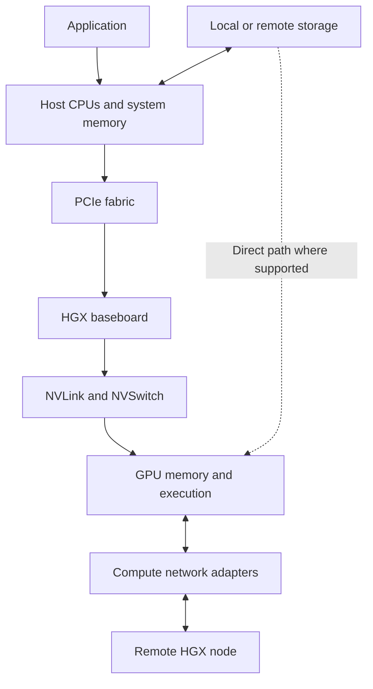
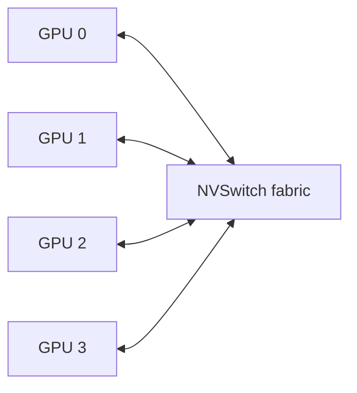
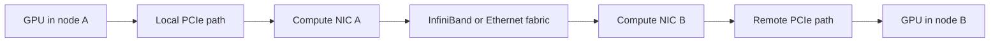
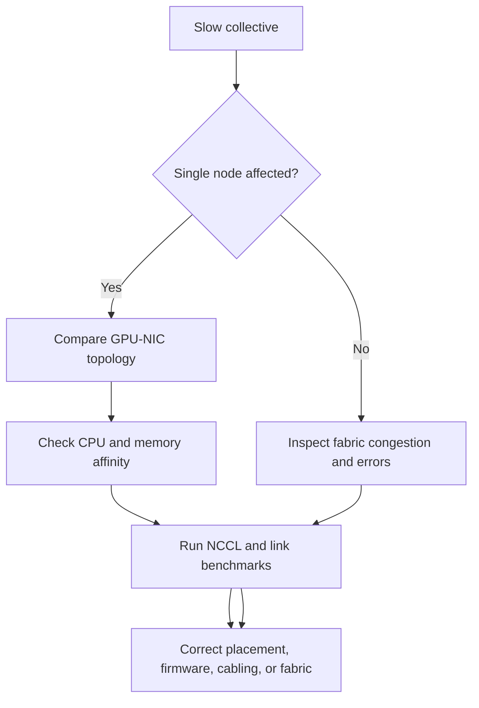

# HGX Topology and Data Paths

An HGX server is not a flat collection of accelerators. It is a topology: a set of paths with different bandwidth, latency, ownership, and failure characteristics.

The same workload can perform very differently depending on whether data remains in GPU memory, crosses NVLink, traverses PCIe, crosses a CPU socket boundary, reaches a network adapter directly, or stages through host memory. Platform engineers therefore need to reason about paths, not just components.

| Chapter field | Value |
|---|---|
| Difficulty | Advanced |
| Estimated reading time | 40–50 minutes |
| Prerequisites | Chapters 01–03 and Volume 02 Chapter 10 |
| Primary outcome | Map workload communication onto HGX data paths |

## 1. The Production Problem

A distributed training job scales well from one GPU to eight GPUs in a node, but poorly from one node to two nodes. Another job performs inconsistently depending on which CPU cores and network interfaces the scheduler assigns.

All GPUs are healthy. The problem lies in the communication path.

## 2. Learning Objectives

After completing this chapter, you will be able to:

- identify the major data paths inside an HGX-based server;
- distinguish scale-up and scale-out communication;
- explain the role of PCIe, NVLink, NVSwitch, NICs, and DPUs;
- identify NUMA and adapter-affinity penalties;
- design topology-aware validation and workload placement.

## 3. The HGX Communication Domains



**Figure 6.4.1 — HGX communication domains.** Workload performance depends on which path each transfer uses and how often it is used.

## 4. GPU-Local Data

The fastest useful data is usually data that does not move.

GPU-local memory holds:

- model parameters;
- activations;
- optimizer state;
- workspaces;
- inference key-value cache;
- intermediate tensors.

A kernel accesses local HBM through the GPU memory hierarchy. When the working set fits and access patterns are efficient, the workload avoids inter-device communication.

The first topology optimization is therefore locality: keep data near the execution that consumes it.

## 5. Scale-Up Communication

Scale-up communication occurs among GPUs inside the server. HGX platforms use high-bandwidth GPU interconnect technology to form a coordinated multi-GPU domain.

Typical operations include:

- peer-to-peer tensor transfer;
- collective reductions;
- tensor-parallel exchange;
- pipeline-stage transfer;
- model-state synchronization.



**Figure 6.4.2 — Simplified HGX scale-up fabric.** The actual generation and topology vary, but the architectural purpose is a high-bandwidth communication domain among accelerators.

### Why scale-up matters

A model that does not fit on one GPU must be partitioned. Once partitioned, execution creates communication dependencies. The value of the scale-up fabric depends on:

- tensor size;
- communication frequency;
- collective algorithm;
- overlap between compute and communication;
- synchronization behavior;
- topology awareness of the library.

## 6. CPU-to-GPU Paths

The host CPUs remain responsible for many tasks:

- launching work;
- data preprocessing;
- orchestration;
- filesystem and network services;
- control-plane logic;
- host-device transfers.

The host path usually traverses PCIe. Its efficiency depends on:

- CPU socket locality;
- PCIe generation and lane width;
- switch placement;
- pinned versus pageable memory;
- transfer size;
- overlap with GPU execution.

A process running on the wrong NUMA node may feed the GPU through a remote CPU interconnect, creating avoidable latency and contention.

## 7. Scale-Out Communication

Scale-out communication connects GPUs in different servers.



**Figure 6.4.3 — Simplified scale-out path.** GPUDirect RDMA can reduce unnecessary host-memory staging when the platform and software stack support the direct path.

Scale-out performance depends on the entire path:

- GPU-to-NIC affinity;
- PCIe topology;
- adapter speed and firmware;
- switch fabric design;
- routing and congestion control;
- collective library configuration;
- remote-node symmetry.

A high-speed network cannot compensate for an inefficient GPU-to-NIC path inside the server.

## 8. East-West and North-South Traffic

AI platforms often separate network roles.

| Traffic class | Typical purpose | Primary concern |
|---|---|---|
| East-west compute | Collective communication among GPU nodes | Bandwidth, latency, congestion, symmetry |
| North-south service | Client, API, storage, management, or external traffic | Availability, security, routing, tenancy |
| Out-of-band | BMC and hardware administration | Isolation and recoverability |

Combining all traffic on one fabric may simplify cabling but can increase contention and expand the security blast radius. Separation may be physical or logical, depending on scale and requirements.

## 9. Storage Data Paths

Training and inference both depend on storage.

### Conventional path

```text
Storage → network or NVMe controller → host memory → GPU memory
```

### Direct path where supported

```text
Storage → peer-capable I/O path → GPU memory
```

Direct data paths can reduce CPU involvement and copies, but they do not automatically solve poor dataset layout, small I/O, metadata bottlenecks, or insufficient storage parallelism.

## 10. Topology Inspection

Useful inspection commands include:

```bash
nvidia-smi topo -m
lspci -tv
numactl --hardware
ibdev2netdev
```

### Purpose

- `nvidia-smi topo -m` shows GPU, NIC, CPU, and interconnect relationships.
- `lspci -tv` exposes the PCIe tree.
- `numactl --hardware` shows NUMA nodes and CPU memory layout.
- `ibdev2netdev` maps InfiniBand devices to network interfaces where available.

The expected output is platform-specific. The correct validation compares observed topology with the approved OEM design.

## 11. Topology-Aware Workload Placement

A scheduler should place work according to the communication pattern.

### Single-process multi-GPU workload

Prefer GPUs within the strongest shared scale-up domain.

### Distributed workload

Align ranks with GPUs and network interfaces that have efficient local paths.

### CPU-heavy preprocessing

Allocate CPU cores and memory from the NUMA domain closest to the assigned GPU.

### Multi-tenant inference

Avoid placements where unrelated tenants compete for the same PCIe root, NIC, or storage path when isolation or predictable latency matters.

## 12. Bottleneck Reasoning

| Symptom | Likely path to inspect |
|---|---|
| One GPU slower than peers | GPU-local health, power, thermal, or PCIe path |
| Good 8-GPU scaling, poor multi-node scaling | GPU-to-NIC and network fabric |
| Inconsistent host-to-device copy rate | NUMA and PCIe locality |
| High CPU use during I/O | Host staging and storage path |
| Collective timeout | Link health, fabric, rank mapping, or topology mismatch |
| Strong network counters but low job throughput | Collective algorithm or synchronization behavior |

Topology is not merely a diagram. It is a troubleshooting index.

## 13. Production Troubleshooting

### Scenario: one rank slows the collective

#### Symptoms

- collective operations complete but show unstable latency;
- one process consistently arrives late;
- GPU health tests pass;
- the issue follows a node or rank placement.

#### Diagnosis workflow

1. Map rank to GPU, CPU, and NIC.
2. Compare topology across all participating nodes.
3. Check link speed, errors, and firmware.
4. Verify CPU affinity and NUMA memory placement.
5. inspect power and thermal state.
6. Run point-to-point and collective microbenchmarks.
7. compare healthy and affected paths.



**Figure 6.4.4 — Collective-performance troubleshooting tree.** First determine whether the bottleneck is local to a node or shared across the fabric.

### Prevention

- standardize OEM topology;
- validate every node before scheduler admission;
- store topology output as inventory;
- use topology-aware rank mapping;
- monitor link errors and fabric health;
- repeat collective baselines after firmware or cabling changes.

## 14. Customer Scenario

A customer plans a 128-GPU cluster. The initial design focuses on switch bandwidth but ignores which NICs attach to which CPU roots inside each server.

The architect adds a node-level topology requirement to the procurement specification. Each GPU group must have an efficient path to the compute fabric, CPU and memory placement must be balanced, and the accepted server design must pass both local and multi-node communication baselines.

This prevents a common failure: purchasing an expensive network while leaving the slowest path inside the server.

## 15. Interview Preparation

### Architecture question

**What is the difference between scale-up and scale-out communication?**

Scale-up connects accelerators inside a system through the local GPU fabric. Scale-out connects systems through network adapters and the cluster fabric.

### Scenario question

**Why might a workload scale well to eight GPUs but poorly to sixteen?**

The first eight GPUs may communicate through the local scale-up domain. Moving to sixteen introduces GPU-to-NIC, network-fabric, remote-node, and synchronization costs.

### Troubleshooting question

**How do you investigate poor GPU-to-network performance?**

Map GPU, NIC, PCIe, and NUMA topology; verify link state and firmware; inspect CPU affinity; run local link and collective benchmarks; then compare with a healthy node.

## 16. Summary

HGX performance is determined by data paths. GPU-local memory, scale-up fabric, PCIe, CPUs, network adapters, storage, and the scale-out network form one communication system.

The central principle is:

> Optimize the path that the workload actually uses, not the component with the largest specification.

## Cross References

- [Chapter 02 — Inside an HGX Platform](./chapter-02-inside-an-hgx-platform)
- [Chapter 03 — OEM Integration and Support Boundaries](./chapter-03-oem-integration-and-support-boundaries)
- [Volume 02 — GPU Topology, Peer Access, and Data Paths](../volume-02/chapter-10-gpu-topology-peer-access-and-data-paths)

## Further Reading

- [NVIDIA HGX AI Factory networking logical architecture](https://docs.nvidia.com/enterprise-reference-architectures/hgx-ai-factory/latest/network-logical-architecture.html)
- [NVIDIA HGX AI Factory networking physical topologies](https://docs.nvidia.com/enterprise-reference-architectures/hgx-ai-factory/latest/networking-physical-topologies.html)
- [NVIDIA Fabric Manager documentation](https://docs.nvidia.com/hgx-platforms/fabric-manager-user-guide/index.html)
