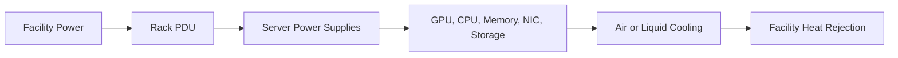
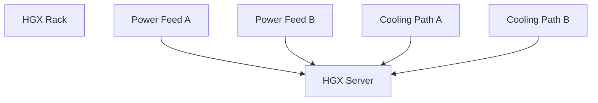

# HGX Power, Cooling, and Rack Integration

An enterprise selects an HGX-based server because its accelerator topology matches the target workload. Procurement approves the system, but the data-center team later discovers that the intended rack cannot provide the required power density and the existing cooling design cannot remove the expected heat. The compute architecture was valid. The deployment architecture was not.

HGX is a platform integrated into systems from NVIDIA partners. The final server’s power, cooling, dimensions, weight, airflow, service model, and rack requirements are determined by the complete OEM design. Architects must therefore evaluate the specific qualified system—not infer facility requirements from the HGX baseboard alone.

| Chapter field | Value |
|---|---|
| Difficulty | Advanced |
| Estimated reading time | 35–45 minutes |
| Prerequisites | Chapters 01–04 |
| Primary outcome | Translate an HGX server design into facility and rack requirements |

## Learning Objectives

After completing this chapter, you will be able to:

- separate accelerator power from complete system power;
- explain why nameplate, typical, and measured consumption differ;
- evaluate rack power, cooling, airflow, weight, and service constraints;
- identify facility risks before delivery;
- create a power and thermal acceptance plan.

## The Complete Thermal System



**Figure 6.5.1 — Power and heat form one continuous system.** Every watt consumed eventually becomes heat that the cooling system must remove.

## Power Is More Than GPU TDP

The server power envelope includes:

```text
GPU modules
+ CPUs
+ system memory
+ NICs and DPUs
+ local storage
+ fans or pumps
+ motherboard and management components
+ conversion losses
```

GPU power is a major component, but it is not the rack design value. Use the OEM’s current planning guide and validated configuration for the complete system.

## Nameplate, Design, and Measured Power

| Value | Purpose |
|---|---|
| Nameplate or maximum | Electrical safety and worst-case provisioning reference |
| Design estimate | Capacity planning for intended workload and configuration |
| Measured steady state | Operational baseline for real workloads |
| Transient behavior | Short-duration peaks and control response |

A design that provisions only average power may fail during synchronized workload peaks. A design that assumes every server always consumes nameplate maximum may waste capacity. The facility team needs both safe electrical limits and representative measurements.

## Rack-Level Questions

Before approving a rack, validate:

- voltage and phase requirements;
- redundant feed design;
- PDU outlet count and connector type;
- per-feed and per-branch limits;
- rack power density;
- airflow direction;
- inlet temperature and pressure requirements;
- liquid-cooling supply and return conditions where applicable;
- rack weight and floor loading;
- front, rear, and overhead service clearances;
- cable pathways and bend radius;
- maintenance access and replacement procedure.

## Air Cooling versus Liquid Cooling

Air-cooled systems depend on sufficient cool air volume and pressure across the chassis. High-density systems may require containment, tuned fan behavior, and careful rack placement.

Liquid-cooled systems move a significant portion of heat into a coolant loop. They introduce additional design concerns:

- coolant distribution units;
- supply temperature and flow;
- pressure and water-quality requirements;
- leak detection;
- quick disconnects;
- redundant pumps and controls;
- facility-water integration;
- operational ownership between IT and facilities.

Liquid cooling does not eliminate air cooling. CPUs, memory, power supplies, and other components may still require airflow depending on the server design.

## Failure Domains



**Figure 6.5.2 — Redundancy must be end to end.** Dual power supplies do not create resilience if both feeds terminate on one upstream breaker. Dual cooling connections do not help if one shared pump is the only active source.

## Production Acceptance

A facility readiness review should include:

1. approved OEM configuration and planning guide;
2. rack elevation and weight calculation;
3. electrical single-line diagram;
4. cooling capacity and flow calculation;
5. network and power cable plan;
6. delivery path and lifting method;
7. commissioning procedure;
8. emergency shutdown and leak response;
9. monitoring and alarm ownership;
10. capacity reserved for growth.

## Observability

| Layer | Signals |
|---|---|
| GPU | power, temperature, clocks, throttling reason |
| Server | inlet temperature, fan or pump state, PSU load, component alarms |
| Rack | PDU current, voltage, phase balance, branch alarms |
| Cooling | supply/return temperature, flow, pressure, leak alarms |
| Facility | room conditions, containment pressure, plant capacity |

Correlate these signals with workload phases. A system may remain within thermal limits while silently reducing clocks.

## Troubleshooting Scenario

### Problem — Performance drops during long jobs

**Symptoms**

- short benchmarks pass;
- sustained jobs slow after several minutes;
- power or thermal throttling appears;
- inlet temperature rises across the rack.

**Diagnosis**

Compare GPU clocks and throttling reasons with server inlet temperature, fan or coolant telemetry, PDU load, and neighboring rack activity. Verify blanking panels, containment, cable obstruction, filter condition, and coolant flow.

**Root cause**

The rack can start the workload but cannot sustain its thermal envelope.

**Resolution**

Correct airflow or liquid flow, redistribute rack load, improve containment, remove obstructions, or reduce workload power only as an interim measure approved by engineering.

**Prevention**

Run sustained thermal commissioning at the intended rack density before production acceptance.

## Customer Scenario

A customer wants eight HGX-based servers in one rack because they physically fit. The architect should calculate electrical load, thermal rejection, weight, service access, network cable volume, and redundancy. The correct answer may be fewer servers per rack, a liquid-cooled design, or a different facility zone. Rack units alone are not a density metric.

## Interview Preparation

### Architecture question

Why is GPU TDP insufficient for rack planning?

Because the complete system includes CPUs, memory, networking, storage, cooling components, conversion losses, and transient behavior.

### Scenario question

A server has redundant PSUs. Is it highly available?

Not necessarily. Trace both feeds through PDUs, breakers, switchgear, and utility paths, and include cooling dependencies.

### Customer question

What evidence is required before approving an HGX rack?

Current OEM planning data, rack elevation, power and cooling calculations, weight, cabling, service clearances, commissioning tests, and alarm ownership.

## Key Takeaways

- HGX facility requirements come from the complete OEM system.
- Every watt becomes heat and must be removed continuously.
- Redundancy must be traced through upstream power and cooling systems.
- Sustained thermal tests reveal problems that short benchmarks miss.
- Rack density is constrained by power, heat, weight, cabling, and serviceability—not only space.

## Cross References

- [OEM Integration and Support Boundaries](./chapter-03-oem-integration-and-support-boundaries)
- [HGX Topology and Data Paths](./chapter-04-hgx-topology-and-data-paths)
- [HGX Networking, Storage, and Cluster Integration](./chapter-06-hgx-networking-storage-and-cluster-integration)
- [Lab 02 — Review an HGX Rack Design](./labs/lab-02-review-an-hgx-rack-design)
