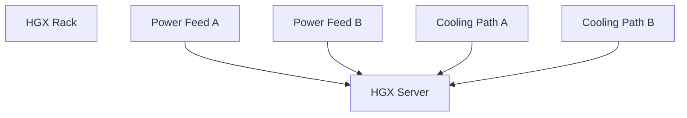

# HGX Power, Cooling, and Rack Integration

An enterprise selects an HGX-based server because its accelerator topology matches the target workload. Procurement approves the system, but the data-center team later discovers that the intended rack cannot provide the required power density and the existing cooling design cannot remove the expected heat. The compute architecture was valid. The deployment architecture was not.

HGX is a platform integrated into systems from NVIDIA partners. The final server’s power, cooling, dimensions, weight, airflow, service model, and rack requirements are determined by the complete OEM design. Architects must therefore evaluate the specific qualified system—not infer facility requirements from the HGX baseboard alone.

| Chapter field | Value |
|---|---|
| Difficulty | Advanced |
| Estimated reading time | 35–45 minutes |
| Prerequisites | Chapters 01–04 |
| Primary outcome | Translate an HGX server design into facility and rack requirements |

## Learning Objectives

After completing this chapter, you will be able to:

- separate accelerator power from complete system power;
- explain why nameplate, typical, and measured consumption differ;
- evaluate rack power, cooling, airflow, weight, and service constraints;
- identify facility risks before delivery;
- create a power and thermal acceptance plan.

## The Complete Thermal System

```mermaid
flowchart LR
    Utility[Facility Power] -->|"evidence: PDU input voltage/phase<br/>within rated range, both feeds live"| PDU[Rack PDU]
    PDU -->|"evidence: ipmitool sdr — PSU load<br/>per feed within rated continuous limit"| PSU[Server Power Supplies]
    PSU -->|"evidence: nvidia-smi -q -d POWER —<br/>draw tracks workload phase, not flat-capped"| Components[GPU, CPU, Memory, NIC, Storage]
    Components -->|"evidence: 30+ min soak, throttle<br/>reasons stay Not Active throughout"| Cooling[Air or Liquid Cooling]
    Cooling -->|"evidence: supply/return delta-T and<br/>flow within CDU spec, inlet temp stable"| Facility[Facility Heat Rejection]

    Decision{"Sustained load, not just<br/>a short benchmark: still stable?"}
    Facility --> Decision
    Decision -->|"NO — clocks/temp drift over minutes"| ThermalBound["Thermal-limited:<br/>rack cannot sustain this density —<br/>a facility problem, not a GPU problem"]
    Decision -->|"YES"| Accepted["Rack accepted for<br/>this workload's power/thermal envelope"]
```



**Figure 6.5.1 — Power and heat form one continuous system.** Every watt consumed eventually becomes heat that the cooling system must remove. Each hop names the evidence that proves it, and the diagram ends on the question that actually decides rack acceptance: does the system hold steady under a *sustained* load, not just a short benchmark that ends before thermal mass catches up.

## Power Is More Than GPU TDP

The server power envelope includes:

```text
GPU modules
+ CPUs
+ system memory
+ NICs and DPUs
+ local storage
+ fans or pumps
+ motherboard and management components
+ conversion losses
```

GPU power is a major component, but it is not the rack design value. Use the OEM's current planning guide and validated configuration for the complete system.

**Worked example — GPU TDP is not the rack number.** An 8-GPU HGX H100 baseboard at 700W per GPU is `8 × 700W = 5,600W` for the accelerators alone (illustrative rate — confirm against the specific SKU's rated TDP). A realistic complete-system budget on top of that: dual high-core-count CPUs at roughly 350W each (~700W), 2TB of system memory at roughly 10-15W per 64GB DIMM across 32 DIMMs (~350W), 8 NICs/DPUs at roughly 25-75W each (~400W), local NVMe and fans/pumps (~250W), and a power-supply conversion loss of roughly 6-8% on top of everything upstream. That pushes total system draw to somewhere around `5,600 + 700 + 350 + 400 + 250 ≈ 7,300W`, and after conversion loss, provisioned input capacity closer to **7,800-7,900W per server** (illustrative — always confirm against the OEM's current planning guide, not this arithmetic). GPU TDP alone would have under-provisioned the rack by roughly 30%.

## Nameplate, Design, and Measured Power

| Value | Purpose |
|---|---|
| Nameplate or maximum | Electrical safety and worst-case provisioning reference |
| Design estimate | Capacity planning for intended workload and configuration |
| Measured steady state | Operational baseline for real workloads |
| Transient behavior | Short-duration peaks and control response |

A design that provisions only average power may fail during synchronized workload peaks. A design that assumes every server always consumes nameplate maximum may waste capacity. The facility team needs both safe electrical limits and representative measurements.

## Rack-Level Questions

Before approving a rack, validate:

- voltage and phase requirements;
- redundant feed design;
- PDU outlet count and connector type;
- per-feed and per-branch limits;
- rack power density;
- airflow direction;
- inlet temperature and pressure requirements;
- liquid-cooling supply and return conditions where applicable;
- rack weight and floor loading;
- front, rear, and overhead service clearances;
- cable pathways and bend radius;
- maintenance access and replacement procedure.

## Air Cooling versus Liquid Cooling

Air-cooled systems depend on sufficient cool air volume and pressure across the chassis. High-density systems may require containment, tuned fan behavior, and careful rack placement.

Liquid-cooled systems move a significant portion of heat into a coolant loop. They introduce additional design concerns:

- coolant distribution units;
- supply temperature and flow;
- pressure and water-quality requirements;
- leak detection;
- quick disconnects;
- redundant pumps and controls;
- facility-water integration;
- operational ownership between IT and facilities.

Liquid cooling does not eliminate air cooling. CPUs, memory, power supplies, and other components may still require airflow depending on the server design.

## Failure Domains



**Figure 6.5.2 — Redundancy must be end to end.** Dual power supplies do not create resilience if both feeds terminate on one upstream breaker. Dual cooling connections do not help if one shared pump is the only active source.

## Production Acceptance

A facility readiness review should include:

1. approved OEM configuration and planning guide;
2. rack elevation and weight calculation;
3. electrical single-line diagram;
4. cooling capacity and flow calculation;
5. network and power cable plan;
6. delivery path and lifting method;
7. commissioning procedure;
8. emergency shutdown and leak response;
9. monitoring and alarm ownership;
10. capacity reserved for growth.

## Observability

| Layer | Signals |
|---|---|
| GPU | power, temperature, clocks, throttling reason |
| Server | inlet temperature, fan or pump state, PSU load, component alarms |
| Rack | PDU current, voltage, phase balance, branch alarms |
| Cooling | supply/return temperature, flow, pressure, leak alarms |
| Facility | room conditions, containment pressure, plant capacity |

Correlate these signals with workload phases. A system may remain within thermal limits while silently reducing clocks.

## Troubleshooting Scenario

### Problem — Performance drops during long jobs

**Symptoms**

- short benchmarks pass;
- sustained jobs slow after several minutes;
- power or thermal throttling appears;
- inlet temperature rises across the rack.

**Diagnosis**

Compare GPU clocks and throttling reasons with server inlet temperature, fan or coolant telemetry, PDU load, and neighboring rack activity. Verify blanking panels, containment, cable obstruction, filter condition, and coolant flow.

Two annotated samples, five minutes apart, make the "short benchmark passes, sustained job slows" symptom concrete:
```text
# minute 2 of the job
$ nvidia-smi -q -d PERFORMANCE,TEMPERATURE,POWER | grep -E 'SM Clock|GPU Current Temp|Power Draw|Thermal Slowdown'
    SM Clock                         : 1980 MHz
    GPU Current Temp                 : 61 C
    Power Draw                       : 690.12 W
    HW Thermal Slowdown              : Not Active

# minute 14 of the job
$ nvidia-smi -q -d PERFORMANCE,TEMPERATURE,POWER | grep -E 'SM Clock|GPU Current Temp|Power Draw|Thermal Slowdown'
    SM Clock                         : 1350 MHz
    GPU Current Temp                 : 84 C
    Power Draw                       : 512.40 W
    HW Thermal Slowdown              : Active
```
Between minute 2 and minute 14, temperature climbed from 61C to 84C, `HW Thermal Slowdown` flipped to `Active`, SM clock dropped by roughly a third (1980MHz → 1350MHz), and power draw *fell* even though the workload didn't change — the GPU is throttling itself, not idling. Cross-reference with server inlet temperature at the same two timestamps:
```text
$ ipmitool sdr | grep -i inlet
Inlet Temp      | 34 degrees C      | ok
```
An inlet temperature of 34C climbing over the same window (versus a facility spec of, say, 27C max recommended) confirms the rack's own exhaust is recirculating into its intake, or the CRAC/CDU capacity is undersized for this rack's density — not a fault local to one GPU or one server, which is why comparing against neighboring racks in the same row matters before ordering a hardware swap.

**Root cause**

The rack can start the workload but cannot sustain its thermal envelope.

**Resolution**

Correct airflow or liquid flow, redistribute rack load, improve containment, remove obstructions, or reduce workload power only as an interim measure approved by engineering.

**Prevention**

Run sustained thermal commissioning at the intended rack density before production acceptance.

## Customer Scenario

A customer wants eight HGX-based servers in one rack because they physically fit. The architect should calculate electrical load, thermal rejection, weight, service access, network cable volume, and redundancy. The correct answer may be fewer servers per rack, a liquid-cooled design, or a different facility zone. Rack units alone are not a density metric.

## Interview Preparation

### Architecture question

**Why is GPU TDP insufficient for rack planning?**

"Because GPU TDP is one line item, not the design number. For an 8-GPU H100 board at 700W each, that's 5,600W before you've counted CPUs, memory, NICs, storage, fans or pumps, and power-supply conversion loss — in my rough math that pushes a real system closer to 7,800-7,900W of provisioned input, roughly 30% above GPU TDP alone. If I sized a rack off GPU TDP I'd under-provision the feed and either trip a breaker or, worse, silently starve the system under a synchronized power peak across the rack. I always ask for the OEM's current planning guide number, not a component spec sheet."

### Scenario question

**A server has redundant PSUs. Is it highly available?**

"Not on its own — that's a common mistake. Redundant PSUs only help if the two feeds are actually independent all the way upstream. I'd trace both: which PDU, which breaker, which piece of switchgear, back to which utility feed. I've seen designs where both 'redundant' feeds terminate on the same upstream breaker, which means the redundancy is cosmetic. I'd ask the same question about cooling — if there's one shared pump or one CDU serving both loops, a cooling failure takes the node down regardless of how many power supplies it has."

### Customer question

**What evidence is required before approving an HGX rack?**

"I'd want the current OEM planning guide for the exact server model — not a generic HGX spec — plus a rack elevation with weight and airflow direction, a power and cooling calculation that assumes one feed has failed, not just nominal, and a sustained thermal soak test result, because short benchmarks pass on racks that can't hold their thermal envelope for fifteen minutes. On top of that: service clearances, cable routing, and a named owner for monitoring and alarms. If any of those is missing, my answer is conditional-go with that gap listed explicitly, not a blanket approval."

## Key Takeaways

- HGX facility requirements come from the complete OEM system.
- Every watt becomes heat and must be removed continuously.
- Redundancy must be traced through upstream power and cooling systems.
- Sustained thermal tests reveal problems that short benchmarks miss.
- Rack density is constrained by power, heat, weight, cabling, and serviceability—not only space.

## Cross References

- [OEM Integration and Support Boundaries](./chapter-03-oem-integration-and-support-boundaries)
- [HGX Topology and Data Paths](./chapter-04-hgx-topology-and-data-paths)
- [HGX Networking, Storage, and Cluster Integration](./chapter-06-hgx-networking-storage-and-cluster-integration)
- [Lab 02 — Review an HGX Rack Design](./labs/lab-02-review-an-hgx-rack-design)
