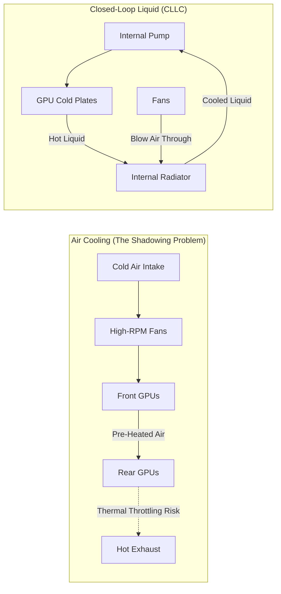

# Chapter 5 — Power, Cooling, and Rack Integration

| Chapter metadata | Value |
|---|---|
| Volume | 06 — HGX Platforms & OEM Integration |
| Difficulty | Expert |
| Estimated reading time | 35 minutes |
| Primary audience | DevOps, SRE, Platform, Cloud and Infrastructure Engineers |
| Core question | Why does an OEM HGX server require 6 massive power supplies, and how do they prevent the back row of GPUs from melting? |

## Introduction

In Volume 5, we discussed the facility-level power and cooling limits of the data center. In this chapter, we zoom in on how OEMs actually handle those limits inside the metal box of the server.

Building a chassis for an HGX baseboard is one of the hardest mechanical engineering challenges in the IT industry. You are placing 10,000 Watts of silicon inside a metal box that is 7 inches tall (4U) and 3 feet deep. 

If an OEM gets the airflow wrong by a fraction of an inch, the rear GPUs will overheat and thermal-throttle. If they get the power delivery wrong, the transient voltage spikes from 8 GPUs simultaneously jumping from idle to 100% utilization will trip the power supplies and hard-crash the server. 

## 1. Power Delivery: The 54-Volt Transition

For decades, enterprise servers ran on 12-Volt internal power. 
When NVIDIA released the HGX A100 (and subsequently H100), they forced the industry to change. 

If you try to push 10,000 Watts to the HGX tray at 12 Volts, the math ($P = I \times V$) dictates you must push **833 Amps** of current. Pushing 833 Amps through a standard PCB would vaporize the copper traces instantly. 

### The OEM 54V Power Architecture
To integrate an HGX tray, OEMs completely redesign the server's power distribution.
1.  **Massive PSUs:** A Dell or HPE HGX server typically contains six 3,000-Watt (or higher) Power Supply Units (PSUs) operating in a 3+3 or 4+2 redundant configuration. 
2.  **54V Conversion:** These PSUs take 240V AC from the wall and convert it directly to **54V DC**. 
3.  **The Busbar:** The 54V power is not delivered via standard cables. It travels across thick, solid copper bars (busbars) bolted directly into the HGX tray to minimize electrical resistance.
4.  **Point of Load (PoL):** Tiny voltage regulators sitting millimeters away from the GPU silicon step the 54V down to the ~1V required by the chips. 

## 2. Air Cooling: The Shadowing Problem

If you open an air-cooled OEM HGX server, you will see a massive wall of extremely violent, dual-rotor fans. These fans sound like jet engines and consume hundreds of watts just to spin.

They push cold air from the front of the server to the back. 

### Airflow Shadowing
The GPUs on an HGX tray are arranged in rows. The front row of GPUs receives perfectly cold air. However, as the air passes through the massive heatsinks of the front GPUs, it absorbs heat. 
By the time the air reaches the back row of GPUs, the air is already 40°C (104°F). 

If the OEM does not design the internal air baffles perfectly to route fresh air over the rear GPUs, they will suffer from **Airflow Shadowing**. The rear GPUs will run 15°C hotter than the front GPUs. 

**The Infrastructure Impact:** In distributed training, the cluster is only as fast as its slowest GPU. If the rear GPUs thermal-throttle and drop their clock speeds by 10%, the *entire 1,000-GPU training job* slows down by 10%.

## 3. Direct Liquid Cooling (DLC) at the Edge

Because Airflow Shadowing is so difficult to solve, and because the Blackwell (B200) generation pushes power to 1,000W+ per GPU, OEMs are transitioning to liquid.

### Closed-Loop Liquid Cooling (CLLC)
Some enterprises do not have chilled water pipes in their data center to support full facility liquid cooling. 
OEMs solve this using **Closed-Loop Liquid Cooling**. 
*   The OEM bolts cold plates to the GPUs.
*   They run liquid tubes to a massive radiator built inside the server chassis itself. 
*   The violent fans blow air through the internal radiator. 
*   It is completely self-contained. It requires no facility water, but it prevents the GPUs from thermal throttling. 

## Architectural Diagram: The OEM Cooling Challenge

## Customer Scenario (Senior Level)

**The Situation:**
A cloud provider buys 100 air-cooled OEM HGX H100 servers. They install them in their legacy data center. During a benchmark test, `nvidia-smi` reports that GPUs 4, 5, 6, and 7 on every single node are dropping their clock speeds from 1980 MHz to 1400 MHz. The data center manager checks the room temperature and says, "The room is freezing cold (18°C / 64°F), so it's not a cooling issue. The NVIDIA drivers must be bugged."

**The Senior Architect Response:**
"The NVIDIA drivers are functioning perfectly; they are protecting the silicon from melting. You are experiencing classic **Airflow Shadowing**.

The room temperature is irrelevant if the cold air cannot physically reach the silicon. In an 8-GPU HGX layout, GPUs 4 through 7 sit in the rear row of the chassis. Even though the air entering the front of the server is 18°C, it must pass through the massive 700-Watt heatsinks of GPUs 0 through 3. By the time that air reaches the rear GPUs, it has absorbed massive amounts of thermal energy. 

Because your legacy data center is not equipped to handle the extreme static pressure required to force air through these dense chassis, the fans are struggling. The rear GPUs are suffocating on pre-heated air, hitting their 90°C thermal limit, and automatically underclocking (HW Slowdown) to survive. 

To fix this, we must either install blanking panels in the racks to drastically increase the cold-aisle static air pressure, forcing higher cubic-feet-per-minute (CFM) through the chassis, or we must return these air-cooled servers and replace them with Direct Liquid Cooled (DLC) variants that neutralize front-to-back thermal disparities."

## Interview Preparation

**Conceptual:** Why do modern HGX baseboards require 54-Volt power delivery instead of standard 12-Volt power? *(Hint: To deliver 10,000 Watts at 12V requires catastrophic levels of current (Amperage), which would melt standard copper wiring and create immense heat. 54V reduces the amperage by nearly 5x).*

**Architecture:** What is "Airflow Shadowing" in a high-density GPU server? *(Hint: When the front row of GPUs pre-heats the air, causing the rear row of GPUs to suffocate on hot exhaust air, leading to thermal throttling on the rear components).*
