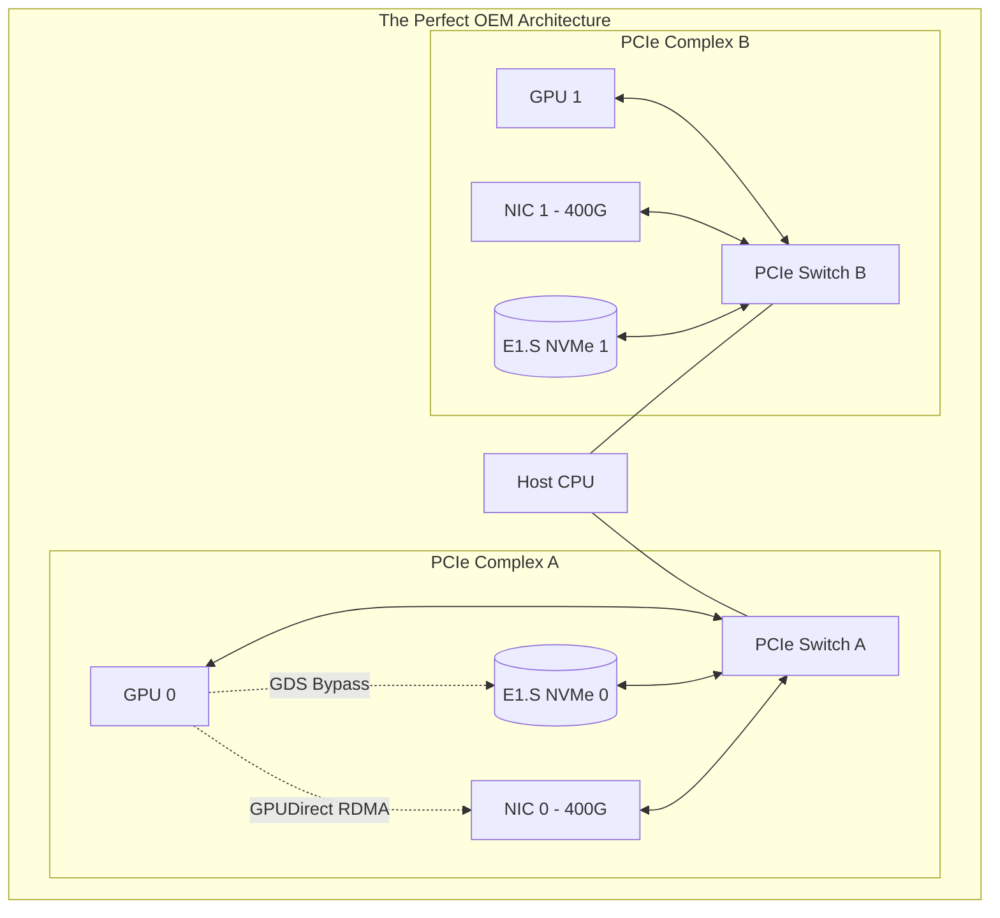

# Chapter 6 — HGX Networking, Storage, and Cluster Integration

| Chapter metadata | Value |
|---|---|
| Volume | 06 — HGX Platforms & OEM Integration |
| Difficulty | Advanced |
| Estimated reading time | 30 minutes |
| Primary audience | DevOps, SRE, Platform, Cloud and Infrastructure Engineers |
| Core question | If an OEM builds a server with 8 GPUs but puts the Network Interface Cards in the wrong physical slots, why does the entire AI cluster fail? |

## Introduction

In previous chapters, we dissected the HGX Baseboard and the power/cooling challenges of the OEM chassis. 

Now, we must connect the server to the outside world. An HGX server does not come with network cards or storage drives. The OEM (Dell, Supermicro, HPE) decides how many Network Interface Cards (NICs) to include, what speed they are, and exactly which PCIe slots they plug into. 

If the OEM engineers do not understand AI workloads, they will design a server that looks great on a spreadsheet but fails catastrophically when a PyTorch distributed training job attempts to synchronize across the InfiniBand fabric.

As a Senior AI Infrastructure Architect, you must audit the OEM's networking and storage blueprints before purchasing the hardware.

## 1. The Compute Fabric (The NIC-to-GPU Ratio)

To achieve maximum multi-node scaling, an 8-GPU server requires exactly **eight ConnectX-7 400Gbps Network Interface Cards (NICs)**. 

### The 1:1 Rule
Every single GPU must have a dedicated NIC. 
If an OEM tries to save money by installing four 400Gbps NICs and routing two GPUs to each NIC, you instantly halve the egress bandwidth of the server. 

### The PCIe Switch Proximity Rule
Having eight NICs is not enough. They must be plugged into the correct PCIe slots. 
As we learned in Chapter 4, to enable **GPUDirect RDMA**, the GPU and the NIC must be plugged into the exact same PCIe Switch. 
If the OEM chassis design places the PCIe slot for NIC 0 on a riser card attached to CPU 1, but GPU 0 is attached to CPU 0, GPUDirect RDMA breaks. The data is forced to cross the CPU's UPI link, bottlenecking the network.

## 2. Rail-Optimized Cabling in OEM Clusters

Once the OEM builds the server correctly, you must cable it correctly. 
In Volume 5, we learned about **Rail-Optimized** network topologies. This is the act of plugging NIC 0 from every server into Switch 0, and NIC 1 from every server into Switch 1. 

**The OEM Challenge:**
In an NVIDIA DGX, the 8 network ports on the back are perfectly labeled 0 through 7. 
In an OEM server, the PCIe slots are scattered across the back of the chassis. NIC 0 might be on the top-left riser. NIC 1 might be on the bottom-right riser. 

If the data center cabling technician accidentally plugs NIC 0 into Switch 1, you have crossed the rails. 
When the NCCL library attempts an `AllReduce` operation, expecting a single 1-hop jump across the InfiniBand switch, the data hits the wrong switch, forcing it to route up to the Spine switch and back down. This introduces microsecond latency jitter, which can stall the entire training job.

## 3. Storage Integration and GDS (GPUDirect Storage)

An 8-GPU H100 server consumes data at petabytes per second. The storage architecture inside the OEM chassis must be designed for **GPUDirect Storage (GDS)**.

### The NVMe Placement
To support GDS, the OEM must place the NVMe storage drives behind the exact same PCIe switches as the GPUs and the NICs. 
If the OEM wires the front-panel NVMe drive bays directly to the host CPU (which is standard practice for web servers), GDS is broken. The data will bounce through the CPU.

### E1.S and U.2 Form Factors
Modern OEM AI servers are moving away from traditional U.2 SSDs toward the **E1.S (EDSFF)** "ruler" format. These drives are long and thin, allowing OEMs to pack far more of them into the front of a 4U server, providing massive local caching capacity without blocking the massive volume of cold air required to cool the HGX baseboard behind them.

## Architectural Diagram: The Perfect OEM Integration

*Notice how the CPU is completely out of the data path for both network and storage traffic.*

## Customer Scenario (Senior Level)

**The Situation:**
An enterprise purchases 50 OEM HGX H100 servers. They verify the servers have eight 400G ConnectX-7 NICs. They cable the cluster perfectly using a rail-optimized InfiniBand topology. However, when they run their PyTorch multi-node training job, the `nvidia-smi` utilization frequently drops to 0%, and the InfiniBand network traffic charts show strange, erratic bursts rather than smooth, sustained 400Gbps throughput. 

**The Senior Architect Response:**
"Your compute and network architectures are flawless, but your storage architecture is starving the GPUs and breaking the network pipeline.

In your OEM servers, the front-panel NVMe drives are wired directly to the Intel CPUs. You are pulling your massive multi-terabyte dataset from these local drives. Because they are wired to the CPUs, you cannot utilize GPUDirect Storage (GDS). 

Every time the GPUs need the next batch of images, the data must be read from the NVMe drives, pulled into the host CPU's System RAM, and then pushed down the PCIe bus to the GPUs. This massive CPU Bounce Buffer is saturating the host's memory bandwidth. 

Worse, because the CPU is 100% pegged juggling the storage data, it occasionally fails to orchestrate the InfiniBand network transfers in time, causing the erratic bursts on your network charts. 

To fix this, we must either redesign the server's PCIe riser configuration to place the NVMe drives behind the GPU PCIe switches to enable GDS, or we must offload the storage entirely by deploying a dedicated Parallel File System appliance on the network, bypassing the internal server storage completely."

## Interview Preparation

**Conceptual:** Why is a 1:1 ratio of GPUs to Network Interface Cards (NICs) strictly required for massive distributed AI training? *(Hint: Without 1:1, multiple GPUs must share a single NIC. This throttles the egress bandwidth and breaks the rail-optimized topology required for low-latency NCCL AllReduce operations).*

**Architecture:** Explain why the physical placement of an NVMe drive inside a server chassis matters for GPUDirect Storage (GDS). *(Hint: If the NVMe drive is wired to the CPU, data must bounce through the CPU memory. If the NVMe drive is wired to the same PCIe switch as the GPU, the data can flow directly from the drive to the GPU memory, bypassing the CPU entirely).*
