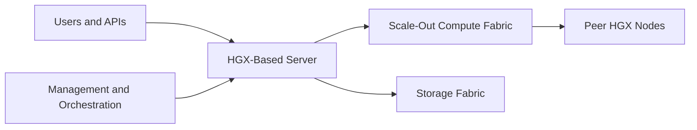
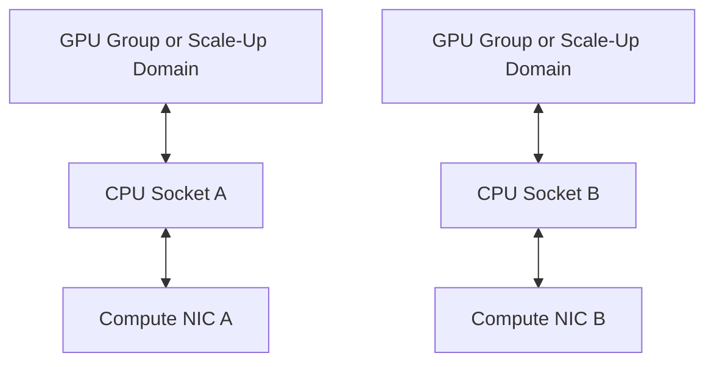

# HGX Networking, Storage, and Cluster Integration

An HGX-based server can be internally well designed and still fail as a cluster building block. The reason is simple: the HGX platform defines the accelerated compute domain, while the OEM system and customer architecture determine how that domain reaches storage, peer nodes, management services, and applications.

Cluster integration must therefore validate the complete path from a GPU process to every external dependency. A topology drawing that stops at the server boundary is not enough.

| Chapter field | Value |
|---|---|
| Difficulty | Advanced |
| Estimated reading time | 40–50 minutes |
| Prerequisites | Chapters 01–05 |
| Primary outcome | Design HGX nodes as repeatable, supportable cluster units |

## Learning Objectives

After completing this chapter, you will be able to:

- define the external networks required by an HGX-based server;
- align GPU, NIC, CPU, and storage topology;
- explain how OEM variation affects cluster standardization;
- build a layered acceptance plan for scale-out communication and data access;
- identify support boundaries during multi-vendor incidents.

## The HGX Node as a Cluster Unit

**Figure 6.6.1 — HGX becomes useful at cluster scale only through external integration.** Management, storage, application, and compute traffic have different objectives and failure modes.

## Network Roles

| Network role | Purpose | Design priority |
|---|---|---|
| Out-of-band management | BMC, firmware, remote recovery | Isolation, availability, security |
| Host management | Provisioning, monitoring, orchestration | Reachability, automation, policy |
| Application | User and service traffic | Availability, segmentation, load balancing |
| Storage | Dataset and checkpoint movement | Throughput, burst handling, locality |
| Compute | Distributed collectives and GPU-to-GPU traffic | Latency, bandwidth, congestion control, topology |

These roles may share physical infrastructure in some architectures, but they should never be treated as indistinguishable traffic.

## GPU-to-NIC Locality

An HGX server may include several high-speed adapters. Their relationship to CPU sockets, PCIe switches, and the GPU fabric determines the cost of moving data off-node.

**Figure 6.6.2 — Adapter placement should align with the server topology.** The actual path depends on the OEM design and must be verified from current platform documentation and runtime discovery.

The scheduler and distributed runtime must preserve this locality. A job can receive the correct number of GPUs and still perform poorly if ranks use remote adapters or cross CPU sockets unnecessarily.

## Storage Integration

HGX clusters often combine:

- local NVMe for scratch and caching;
- shared high-performance filesystems for active datasets;
- object storage for durable datasets and artifacts;
- checkpoint repositories for recovery;
- metadata and control services.

Storage validation must include the actual application access pattern. Large sequential reads, small-file metadata storms, shuffled training data, and synchronized checkpoint writes stress different components.

## OEM Variation and Cluster Standardization

Two systems may both use the same HGX platform while differing in:

- CPU architecture and count;
- memory capacity and channels;
- NIC model, count, and placement;
- local storage layout;
- firmware and BMC implementation;
- cooling method;
- chassis dimensions;
- supported software and lifecycle policy.

For a production cluster, standardize the full bill of materials and firmware baseline. Treat mixed server designs as separate node classes unless validated evidence proves they can share the same workload and operational policy.

## Orchestration and Kubernetes

A Kubernetes-based HGX cluster must expose more than generic GPU count. Scheduling may need to consider:

- GPU topology and partitioning;
- RDMA or DPU resources;
- local storage availability;
- NUMA alignment;
- firmware and driver class;
- cooling or power domain;
- tenant isolation;
- maintenance state.

Node labels, device plugins, runtime classes, admission policies, and topology-aware scheduling should reflect the physical design. Otherwise the abstraction hides constraints that still affect performance.

## Layered Acceptance

1. Verify hardware inventory and firmware baseline.
2. Verify local GPU topology and peer paths.
3. Verify NIC link state, PCIe health, and NUMA mapping.
4. Verify point-to-point host networking.
5. Verify RDMA or accelerated data paths where required.
6. Verify local and shared storage behavior.
7. Verify multi-GPU collectives inside one node.
8. Verify collectives across nodes.
9. Verify the representative application.
10. Test failure, drain, replacement, and rejoin procedures.

This order reduces the fault domain at each step.

## Observability

| Layer | Evidence |
|---|---|
| HGX compute | GPU health, fabric state, memory, power, thermals |
| Host | CPU, NUMA, PCIe, memory pressure, kernel logs |
| Adapter | link, throughput, errors, retries, congestion |
| Switch | port health, utilization, path balance, congestion |
| Storage | latency, throughput, metadata, errors, queue depth |
| Orchestrator | placement, device allocation, evictions, topology decisions |
| Application | step time, queue delay, communication fraction, checkpoint time |

## Production Troubleshooting

### Problem — One node consistently reduces collective performance

**Symptoms**

- cluster benchmark is stable until one node joins;
- the slow node passes basic GPU tests;
- one rail or adapter carries less traffic;
- communication time increases for all ranks.

**Diagnosis**

Compare the node’s firmware, BIOS, driver, NIC firmware, PCIe negotiated state, topology map, interface configuration, cable path, and switch counters against a healthy node. Confirm that the job uses the intended adapters.

**Root cause examples**

- down-trained PCIe link;
- inconsistent firmware;
- incorrect rail mapping;
- bad cable or switch port;
- container missing one RDMA device;
- NUMA or rank placement difference.

**Resolution**

Remove the node from service, correct the differing layer, repeat point-to-point and collective acceptance, then return it to the scheduler.

**Prevention**

Use immutable baselines, automated drift detection, and node qualification gates.

## Support Boundaries

During a cluster incident, responsibility may span:

- NVIDIA GPU and platform software;
- OEM server firmware and chassis integration;
- NIC and switch components;
- storage vendor;
- operating system and orchestrator;
- application framework.

The incident record should preserve exact versions, topology, logs, reproduction steps, and the first failing layer. Evidence is what allows vendors to collaborate without repeatedly redirecting the case.

## Customer Scenario

A customer wants to combine two HGX server models in one training pool because both contain the same GPU generation. The architect should compare CPU, NIC, memory, firmware, cooling, and topology—not only GPUs. The safest initial design is separate node classes with explicit scheduling and benchmark evidence. Consolidation can follow only after equivalent behavior is demonstrated.

## Interview Preparation

### Architecture question

Why is the HGX baseboard not enough information to design a cluster?

Because the final OEM system determines CPU, NIC, storage, firmware, cooling, chassis, and support characteristics that affect every external path.

### Troubleshooting question

One HGX node slows an otherwise healthy cluster. What is your method?

Quarantine it, compare against a known-good node layer by layer, identify the first divergent component or path, repair, and rerun acceptance tests before rejoining.

### Customer question

Can different HGX server vendors share one node pool?

They can only after workload, topology, software, lifecycle, and operational equivalence are validated. Otherwise use separate node classes.

## Key Takeaways

- HGX is the accelerated core of a larger OEM and cluster architecture.
- GPU-to-NIC locality and external fabric design determine scale-out efficiency.
- Storage must be validated with the real access pattern.
- Standardization applies to the complete server bill of materials.
- Layered acceptance and drift detection make heterogeneous incidents manageable.

## Cross References

- [OEM Integration and Support Boundaries](./chapter-03-oem-integration-and-support-boundaries)
- [HGX Topology and Data Paths](./chapter-04-hgx-topology-and-data-paths)
- [HGX Power, Cooling, and Rack Integration](./chapter-05-hgx-power-cooling-and-rack-integration)
- [Lab 02 — Review an HGX Rack Design](./labs/lab-02-review-an-hgx-rack-design)
