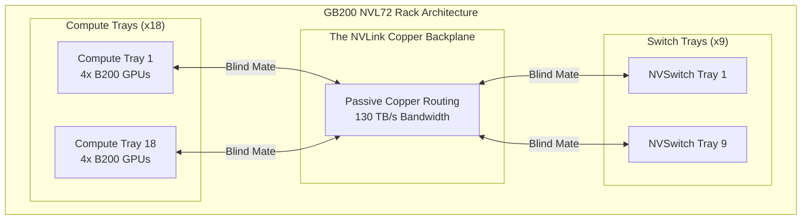

# Chapter 7 — GB200 NVL72: The Rack-Scale Era

| Chapter metadata | Value |
|---|---|
| Volume | 06 — HGX Platforms & OEM Integration |
| Difficulty | Expert |
| Estimated reading time | 30 minutes |
| Primary audience | DevOps, SRE, Platform, Cloud and Infrastructure Engineers |
| Core question | If the HGX baseboard is the ultimate design, why did NVIDIA abandon it for the Blackwell GB200 generation? |

## Introduction

For years, the **HGX Baseboard** was the undisputed king of AI infrastructure. It packed 8 GPUs and 4 NVSwitches into a single 4U server chassis. 

With the release of the **Blackwell (B200)** generation, the math broke.
A single B200 GPU pulls over 1,000 Watts. An 8-GPU chassis would pull over 15 kW and require impossibly dense liquid cooling manifolds inside a standard server box. Furthermore, Large Language Models (LLMs) like GPT-4 became so massive that 8 GPUs connected via NVLink were no longer enough to hold the model weights efficiently.

NVIDIA had to expand the NVLink domain beyond 8 GPUs. But you cannot build an HGX baseboard with 72 GPUs on it; the circuit board would not fit through a data center door. 

To solve this, NVIDIA abandoned the monolithic HGX baseboard for their flagship product. They created the **MGX Architecture** and the **GB200 NVL72**. 

The server is no longer the box. **The Rack is the Server.**

## 1. Deconstructing the HGX: Compute Trays and Switch Trays

In the NVL72 architecture, NVIDIA took the components of the HGX baseboard and separated them into individual, rack-mountable "Trays" (also called sleds).

### 1.1 The Compute Tray
*   Contains the **Grace Blackwell (GB200) Superchips**. 
*   Unlike an HGX server (which has Intel/AMD CPUs and a massive PCIe complex), the Compute Tray is stunningly simple. It contains 2x Grace ARM CPUs and 4x Blackwell GPUs, linked perfectly by NVLink-C2C. 
*   There is no massive NVSwitch chip on this tray. 

### 1.2 The Switch Tray
*   Contains the **NVSwitch** chips. 
*   NVIDIA extracted the routing logic from the baseboard and put it into its own dedicated 1U chassis. 

## 2. The Copper Backplane (The Magic Link)

If the GPUs are in one tray, and the NVSwitches are in another tray, how do they connect?

In a standard data center, you would connect them with fiber optic cables. But fiber optic transceivers (lasers) consume massive amounts of power. Connecting 72 GPUs to switches via fiber would consume 20 kW of electricity just to power the lasers.

NVIDIA solved this by building a massive **Copper Backplane**. 
It is a towering grid of passive copper wires that clicks into the rear of the rack. 

1. You slide 18 Compute Trays into the rack.
2. You slide 9 Switch Trays into the rack.
3. As they slide in, their rear connectors blind-mate (snap directly) into the copper backplane.

The copper backplane physically hard-wires the 72 GPUs to the NVSwitches. 
**The entire rack now operates as a single, massive 72-GPU HGX baseboard.**

## Architectural Diagram: The NVL72 Rack

## 3. The End of the Standard OEM Server

The NVL72 fundamentally changes the OEM relationship. 
In the HGX era, Dell or HPE bought the baseboard and built their own custom server around it. 

In the MGX/NVL72 era, the OEM cannot build a custom chassis. The exact physical dimensions of the trays, the liquid cooling manifolds, and the blind-mate connectors must perfectly align with the Copper Backplane. 

OEMs essentially become integrators. They manufacture the trays to NVIDIA's exact MGX specifications, integrate their proprietary BMCs (like iDRAC), and ship fully assembled, 120 kW liquid-cooled racks to the customer. 

## Customer Scenario (Senior Level)

**The Situation:**
A Fortune 500 company wants to train a proprietary Trillion-parameter model. They plan to buy 9 standard OEM servers, each containing an 8-GPU HGX Blackwell (B200) baseboard, giving them 72 GPUs total. They will connect them via 400G InfiniBand. 

**The Senior Architect Response:**
"If you are training a Trillion-parameter model, using 8-GPU HGX servers connected via InfiniBand is an architectural mistake that will drastically inflate your training time.

A Trillion-parameter model requires extreme 'All-to-All' communication between the GPUs. 
In your proposed design, the NVLink domain (the ultra-fast 1.8 TB/s memory sharing) stops at the boundary of each 8-GPU server. When GPU 1 needs to share a massive tensor with GPU 9 (which is in the next server), the data must drop down to the InfiniBand network. While InfiniBand is fast, it relies on network protocols and is drastically slower than NVLink, creating a massive serialization bottleneck. 

Instead of buying 9 isolated 8-GPU servers, we must purchase a single **GB200 NVL72 Rack**. 
In the NVL72, the NVLink domain does not stop at the server boundary. The NVSwitch trays and the copper backplane extend the NVLink fabric across all 72 GPUs simultaneously. Any GPU in the rack can read the memory of any other GPU at 1.8 TB/s, creating a single 130 TB/s memory domain. This will allow the Trillion-parameter model to execute its All-to-All communications instantly, slashing your training time by months."

## Interview Preparation

**Conceptual:** Why did NVIDIA use a Copper Backplane instead of Fiber Optics to connect the 72 GPUs inside the NVL72 rack? *(Hint: Fiber optic transceivers consume immense amounts of power. Because the GPUs are physically close to each other inside a single rack, passive copper can carry the signal, saving ~20kW of power that can instead be routed to the compute silicon).*

**Architecture:** What is the primary architectural difference between an HGX B200 server and a GB200 NVL72 rack? *(Hint: The HGX limits the NVLink domain to 8 GPUs inside a single chassis. The NVL72 extracts the NVSwitches into separate trays, extending the NVLink domain to all 72 GPUs across the entire rack).*
