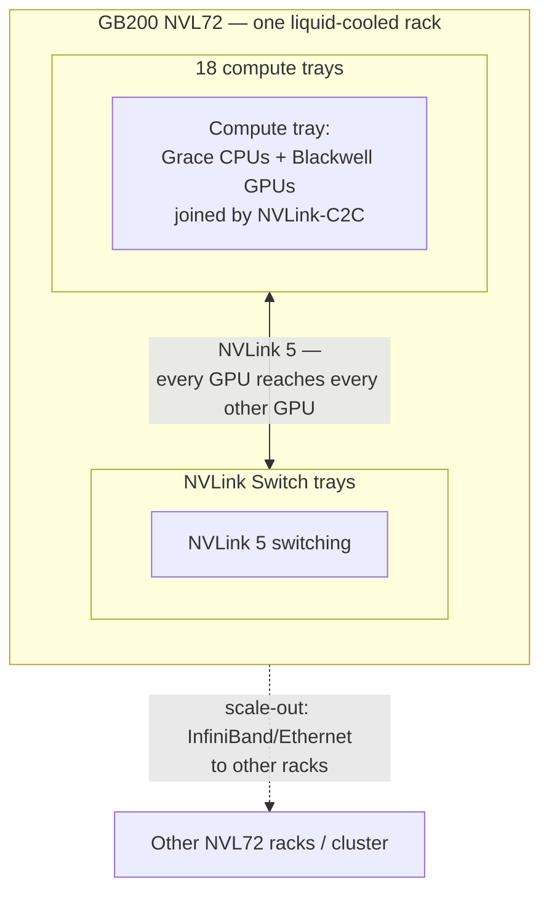

# GB200 NVL72 Rack-Scale Architecture

Chapter 02 of this volume drew the HGX platform boundary as a baseboard inside an OEM-defined server chassis — a set of GPUs and a fabric that NVIDIA standardizes, surrounded by host, I/O, power, cooling, and management that the OEM designs. Chapter 04 traced data paths within that chassis and was explicit that scale-up communication (NVLink/NVSwitch) stays inside the box, while scale-out communication (InfiniBand/Ethernet) is what happens once a workload spans more than one chassis.

GB200 NVL72 requires this volume to draw a new boundary, because the boundary itself moved. NVL72 is not a baseboard that an OEM puts into a chassis. It is a fully defined, liquid-cooled rack containing 72 Blackwell GPUs and 36 Grace CPUs, connected into one NVLink domain, sold and deployed as a single unit. This chapter treats NVL72 with the same rigor this volume has applied to every other platform decision: what is standardized, what is the failure domain, and what does an architect actually have to evaluate before recommending it.

| Chapter field | Value |
|---|---|
| Difficulty | Advanced |
| Estimated reading time | 35–45 minutes |
| Prerequisites | Chapters 01–06, Volume 04 Chapter 07, Volume 05 Chapter 07 |
| Primary outcome | Explain precisely what changes at rack scale, and evaluate when NVL72 is the right platform versus a traditional HGX server fleet |

## Learning Objectives

After completing this chapter, you will be able to:

- describe the physical composition of a GB200 NVL72 rack;
- explain why NVLink 5 switch trays create a single 72-GPU NVLink domain instead of per-tray domains;
- explain why liquid cooling is mandatory at NVL72's power density, not an optional efficiency feature;
- contrast NVL72's failure-domain and maintenance model against the traditional 8-GPU HGX server model from Chapters 02–06;
- evaluate when a traditional HGX server fleet is still the correct choice over NVL72;
- answer interview questions about what specifically changed in the move from server-scale to rack-scale NVLink.

## What NVL72 Physically Is

**Figure 6.7.1 — NVL72 in one rack: 18 compute trays plus dedicated NVLink Switch trays form a single 72-GPU NVLink domain.** Compare this to Figure 6.2.1's HGX platform boundary: there, the accelerator domain was one baseboard inside one OEM chassis. Here, the accelerator domain — the thing NVIDIA fully defines and standardizes — has grown to encompass an entire rack, including the switch fabric between trays and, functionally, the cooling system needed to keep it running.

The composition, using NVIDIA's published NVL72 configuration (verify exact figures against current documentation before quoting them in a customer-facing context, since NVIDIA has described this rack at more than one level of granularity across announcements):

- **18 compute trays**, each built around the Grace-Blackwell superchip pairing described in Volume 04, Chapter 07.
- **72 Blackwell GPUs and 36 Grace CPUs** total across the rack.
- **NVLink Switch trays** interspersed with the compute trays, providing the switching fabric that lets any GPU in the rack reach any other GPU in the rack over NVLink 5 — this is the rack-scale evolution of the NVSwitch role Chapter 04 described inside a single chassis.
- **Liquid cooling**, typically direct-to-chip cold plates, integrated into the rack design rather than added by the customer's facility team afterward.

## Why This Is a Single NVLink Domain, Not 18 Small Ones

The critical architectural claim — and the one worth being able to defend precisely in an interview — is that NVL72 is **one** NVLink domain of 72 GPUs, not 18 independent 4-GPU domains that happen to share a rack. The NVLink Switch trays are what make this true: they provide a switched fabric across the whole rack, the same conceptual role Chapter 04's NVSwitch discussion described inside a single 8-GPU chassis, scaled to rack width.

This is the direct extension of the scale-up/scale-out distinction this volume has used throughout:

| | Traditional HGX server (Ch. 02–06) | GB200 NVL72 |
|---|---|---|
| Scale-up domain (NVLink/NVSwitch) | Up to 8 GPUs, inside one chassis | Up to 72 GPUs, inside one rack |
| Scale-out boundary (InfiniBand/Ethernet begins) | Beyond 8 GPUs | Beyond 72 GPUs |
| What's inside the NVIDIA-standardized boundary | GPU modules + baseboard + intra-chassis NVSwitch | GPU modules + Grace CPUs + intra-rack NVLink Switch trays + liquid-cooling design |
| What's still OEM/customer-defined | CPU, host I/O, chassis, cooling, most facility integration | Facility power feed, liquid-cooling plant connection, rack placement, scale-out network beyond the rack |

The practical consequence, in the same terms Chapter 04 used for topology-aware placement: a tensor-parallel or expert-parallel group that would have been forced to cross InfiniBand past 8 GPUs in a traditional HGX cluster can now be placed across up to 72 GPUs while remaining entirely inside the fast NVLink domain. Placement decisions that Chapter 04 discussed at the scale of "which NIC and which NUMA node" now also include "which rack" as a first-class boundary — crossing out of one NVL72 rack into another is architecturally equivalent to what crossing out of an 8-GPU chassis used to be.

## Liquid Cooling Is a Hard Requirement, Not a Feature

Chapter 05 of this volume treated cooling as one design axis among several that an OEM chooses — air, hybrid, or liquid, based on density and facility capability. NVL72 removes that choice. At 72 Blackwell GPUs plus 36 Grace CPUs in one rack, the power density is high enough that air cooling cannot remove the generated heat; direct-to-chip liquid cooling is designed into the rack from the start, not offered as an upgrade path.

This has a direct facility-readiness consequence, using the same discipline Chapter 05 applied to power and cooling planning generally: before NVL72 is a viable option for a customer, the facility must be able to supply a liquid-cooling loop (typically facility water or a coolant distribution unit) at the rack, not just sufficient air handling and floor loading. A data hall that is a perfectly good home for an air-cooled HGX H100 fleet is not automatically ready for NVL72 — this is now a go/no-go gate in the acceptance process described in Chapter 11, evaluated before the systems are ordered, not discovered during installation.

## Failure Domains and Maintenance at Rack Scale

Chapter 02's failure-domain table scoped every failure category — GPU, fabric, host, network adapter, storage, power, cooling — to a single chassis, with cluster-level resilience built by combining many independent chassis. NVL72 requires rethinking that scoping for at least the fabric and, in practice, several other categories:

- **Fabric failure domain.** A degraded NVLink Switch tray can affect the domain's usable topology across multiple compute trays, not just one — the blast radius of a fabric-level fault is larger than in a chassis-scoped design.
- **Unit of purchase and redundancy.** NVL72 is sold and deployed as a rack. Where a traditional HGX fleet's redundancy model is "N+1 servers," an NVL72 deployment's redundancy model has to be reasoned about partly at the rack level — losing meaningful capacity within one rack is a larger single event than losing one HGX server in a fleet of many.
- **Maintenance procedure.** Servicing a compute tray or a switch tray happens within a live, densely interconected rack-scale fabric. The service procedures, tooling, and safe-replacement sequencing for this are meaningfully different from swapping a component in an independent 8-GPU server, and they should be validated explicitly during acceptance testing (Chapter 11) rather than assumed to carry over from prior DGX/HGX generations.
- **Facility dependency.** Because liquid cooling is integral, a facility-side cooling-loop fault now has a rack-scale blast radius in a way that an air-handling issue in a traditional data hall typically does not.

None of this means NVL72 is less reliable — NVIDIA engineers substantial redundancy into the switch fabric and cooling design. It means the *unit of analysis* for availability planning is the rack, and an architect evaluating NVL72 for a customer needs to ask rack-level redundancy and service questions that simply did not exist at chassis scale.

## When NVL72 Is the Right Answer — and When It Is Not

Consistent with this volume's recurring theme that HGX/rack-scale choice is a workload-driven decision, not a default-to-newest one:

**NVL72 is the right fit when:**
- the workload's tensor-parallel or expert-parallel group needs to exceed 8 GPUs and staying on NVLink for that traffic materially improves step time (very large dense models, large mixture-of-experts models);
- the facility can support liquid cooling and the rack's power draw;
- the deployment can absorb rack-scale procurement, maintenance, and redundancy planning rather than incremental server-by-server scaling.

**A traditional 8-GPU HGX server fleet is still the right fit when:**
- the model's parallelism groups fit comfortably within 8 GPUs, so the scale-out network was never the bottleneck to begin with;
- the facility is air-cooled and not being retrofitted for liquid cooling;
- incremental, server-at-a-time scaling and the mature N+1 redundancy model this volume has described throughout Chapters 02–06 fit the customer's operating model better than a rack-as-unit deployment.

## Interview Preparation

### Architecture question

Draw the difference between an HGX H100 server's fabric boundary and a GB200 NVL72 rack's fabric boundary.

**Model answer:** "I'd draw the HGX server first — one chassis, 8 GPUs, NVSwitch connecting them inside that box, and the moment you need a ninth GPU's worth of communication you're on InfiniBand or Ethernet, the scale-out network, which is slower and adds real step-time cost for latency-sensitive traffic. Then I'd draw NVL72 next to it at the same conceptual level, but the box is now a whole rack: 18 compute trays, each pairing Grace CPUs and Blackwell GPUs, plus dedicated NVLink Switch trays that make all 72 GPUs in the rack reachable from each other over NVLink 5 — one domain, not 18 small ones. The scale-out boundary is still there, it's just moved from 8 GPUs to 72. I'd emphasize that this is the same architectural pattern this whole volume has used for HGX — an NVIDIA-standardized fast-fabric boundary surrounded by facility and integration concerns — just redrawn at rack scale, with liquid cooling folded into the standardized part instead of left to the OEM."

### Scenario question

A customer wants to deploy NVL72 in an existing data hall that currently runs air-cooled HGX H100 servers. What do you need to validate before approving that?

**Model answer:** "The gate I wouldn't skip is liquid cooling capability, full stop — NVL72's power density at 72 GPUs and 36 Grace CPUs in one rack requires direct-to-chip liquid cooling, it's not an option NVIDIA offers, it's how the rack is built. So step one is confirming the facility has, or can add, a cooling-loop connection at the rack — facility water or a coolant distribution unit — because a hall that's perfectly adequate for air-cooled HGX H100 fleet is not automatically ready for this, and that's a fact I want established before anything is ordered, not discovered during installation. After cooling, I'd validate power feed capacity for the rack's draw, floor loading, and then move into the acceptance-testing questions this volume covers generally — service procedures for a live rack-scale fabric, redundancy model at the rack level rather than the per-server level, and confirming the customer's operational team understands that the unit of maintenance and failure analysis has moved from 'one HGX server' to 'one rack.' I wouldn't present NVL72 as a drop-in upgrade to the existing fleet — it's a different facility and operational commitment, and the recommendation has to say that plainly."

### Whiteboard question

Explain why a 128-expert mixture-of-experts model's routing performance would differ meaningfully between a traditional HGX H100 cluster and a GB200 NVL72 deployment.

**Model answer:** "Expert-parallel routing is a chatty, latency-sensitive communication pattern — every token's routing decision means data has to move to wherever its selected expert lives. On an HGX H100 cluster, the fast NVLink domain tops out at 8 GPUs per chassis, so with more experts than that spread across the cluster, a meaningful fraction of routing traffic has to cross InfiniBand or Ethernet between chassis — that's real added latency on the routing hot path, and it grows as the expert count and cluster size grow. On GB200 NVL72, the fast NVLink domain is 72 GPUs, so a much larger share of experts — depending on the exact model and expert-to-GPU mapping — can be reached without ever leaving the rack's NVLink fabric. I'd want the actual expert count and the model's expert-to-GPU placement plan before saying exactly how much of the routing traffic moves off NVLink in either case, but the direction of the effect is unambiguous: more of the routing stays fast on NVL72 simply because the fast domain is nine times larger."

## Key Takeaways

- GB200 NVL72 is a rack — 18 compute trays (72 Blackwell GPUs, 36 Grace CPUs) plus NVLink Switch trays — sold and deployed as one unit, not a baseboard inside an OEM chassis.
- NVLink 5 switch trays create a single 72-GPU NVLink domain, the direct rack-scale evolution of the intra-chassis NVSwitch role from Chapter 04.
- The scale-up/scale-out boundary this volume has used throughout moves from 8 GPUs (traditional HGX) to 72 GPUs (NVL72) — everything past that boundary is still InfiniBand/Ethernet.
- Liquid cooling is architecturally mandatory at NVL72's power density, and facility readiness for it is a go/no-go gate, not a nice-to-have.
- Failure domains, redundancy, and maintenance planning must be reasoned about at the rack level for NVL72, extending Chapter 02's chassis-scoped failure-domain model.
- NVL72 is the right choice when a workload's parallelism groups genuinely need to exceed 8 GPUs on the fast fabric; a traditional HGX fleet remains correct when they do not.

## Cross References

- [Chapter 02 — Inside an HGX Platform](./chapter-02-inside-an-hgx-platform)
- [Chapter 04 — HGX Topology and Data Paths](./chapter-04-hgx-topology-and-data-paths)
- [Chapter 05 — HGX Power, Cooling, and Rack Integration](./chapter-05-hgx-power-cooling-and-rack-integration)
- Volume 04, Chapter 07 — Grace CPU, GH200, and GB200 Superchips
- Volume 05, Chapter 07 — DGX GH200 and GB200 NVL72 Systems
