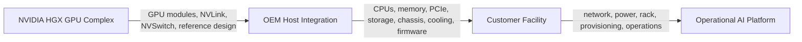

# Volume 06 — HGX Platform

A customer wants the performance characteristics of an NVIDIA scale-up GPU platform but must buy through an established server vendor, integrate with an existing fleet-management standard, and satisfy local requirements for storage, serviceability, power distribution, and support. This is the design space in which HGX matters.

HGX is not simply a less complete DGX. It is a platform building block that combines a validated GPU complex and high-bandwidth scale-up fabric with an OEM-defined host system. The resulting product inherits important NVIDIA topology characteristics while leaving substantial design and lifecycle responsibility to the system manufacturer, integrator, and customer.

| Volume field | Value |
|---|---|
| Difficulty | Advanced |
| Estimated reading time | 12–16 hours |
| Prerequisites | Volumes 01–05 |
| Primary focus | OEM GPU platform architecture and integration |
| Outcome | Evaluate and operate HGX-based systems with clear ownership boundaries |

## The Integration Boundary

**Figure 6.0.1 — HGX divides responsibility across multiple engineering organizations.** Successful deployment requires clarity about which party owns each component, firmware layer, test, and support path.

## Planned Chapter Sequence

1. Why HGX Exists
2. HGX versus DGX
3. Inside the HGX GPU Complex
4. SXM Modules, Baseboards, NVLink, and NVSwitch
5. OEM Host Integration
6. CPU, Memory, PCIe, NIC, and Storage Design
7. Cooling, Power, Chassis, and Serviceability
8. Firmware and Software Ownership Boundaries
9. Comparing OEM Implementations
10. Rack and Cluster Design
11. Acceptance Testing and Benchmarking
12. Lifecycle Operations and Escalation
13. Customer Architecture Scenarios
14. Volume 06 Summary

## Labs

- Build an HGX component-responsibility matrix
- Compare two hypothetical OEM system designs
- Create an acceptance and escalation plan
- Design an HGX rack and network placement model

## Production Perspective

HGX increases architectural choice, but choice creates integration work. Two systems based on the same HGX generation may differ in CPU topology, NIC placement, local storage, firmware tooling, cooling method, service procedure, and validated software matrix. Architects must therefore evaluate the complete server, not infer identical behavior from the GPU baseboard alone.
