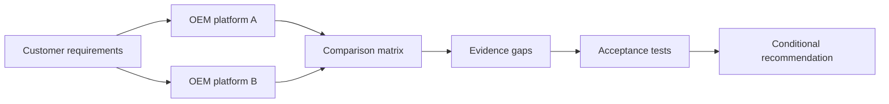
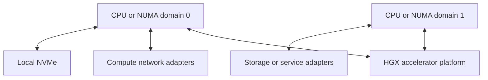
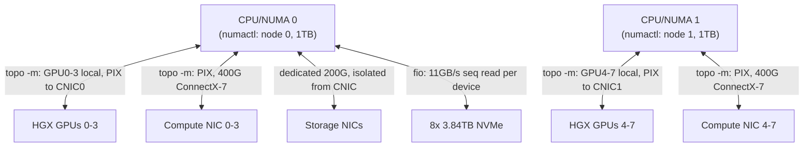

# Compare HGX-Based Server Designs

## Lab metadata

| Field | Value |
|---|---|
| Volume | 06 — HGX Platform |
| Difficulty | Intermediate |
| Estimated time | 75 minutes |
| Lab type | Architecture and platform evaluation |
| Target platform | Documentation and design environment |

## Objective

Compare two HGX-based server proposals as complete production systems rather than treating them as equivalent because they use the same accelerator platform.

## Background

OEM proposals often highlight the accelerator generation first. The surrounding host, network, storage, cooling, management, firmware, and support design may receive less attention even though those differences strongly affect production behavior.

## Learning outcomes

You will be able to:

- define the HGX and OEM integration boundaries;
- compare complete system architectures;
- identify missing or ambiguous proposal data;
- build a validation and acceptance plan;
- document support ownership and operational risk.

## Architecture



## Prerequisites

- Completion of Chapter 02.
- Two OEM proposal documents or anonymized candidate designs.
- Customer workload and facility requirements.
- No physical HGX system is required.

## Environment

Create `hgx-platform-comparison.md` in a version-controlled architecture workspace.

## Step 1 — Write the customer requirement

Use this scenario:

> A research organization needs a multi-node training platform. It expects sustained distributed workloads, shared checkpoint storage, remote operations, and staged firmware maintenance. The data center has strict rack-power and cooling limits.

Record:

```md
## Customer requirements

- Workload type: multi-node LLM pretraining (tensor + pipeline parallel), fine-tuning during off-peak windows
- Scale at launch: 4 nodes (32 GPUs), growth to 16 nodes (128 GPUs) within 12 months
- Growth target: 128 GPUs, single scheduling pool, no re-architecture at 16 nodes
- Host-memory requirement: >=1.5TB per node (host-side dataset staging + activation offload headroom)
- Compute-network requirement: >=400Gb/s per GPU-domain, RDMA-capable, non-blocking within a 32-GPU pod
- Storage requirement: shared parallel filesystem sustaining >=40GB/s aggregate read for sharded checkpoint restart; local NVMe scratch for shuffle
- Availability expectation: single-node failure must not stall other jobs; degrade, not cascade
- Rack-power limit: 18kW per rack (existing facility, no immediate electrical upgrade budget)
- Cooling method: facility supports air cooling today; conditional budget for liquid cooling if density requires it
- Support expectation: 4-hour on-site response for GPU/baseboard faults, single escalation contact for the full stack
```

## Step 2 — Separate platform boundaries

For each proposal, identify:

```md
| Domain | NVIDIA/HGX responsibility | OEM responsibility | Customer responsibility |
|---|---|---|---|
| Accelerator subsystem | GPU/NVSwitch design, NVLink fabric validation, VBIOS releases | Physical integration, thermal solution around the baseboard | Keep VBIOS within OEM-qualified bundle, not "latest" |
| Host CPUs and memory | None — outside HGX scope | CPU/memory selection, NUMA layout, DIMM population | Validate NUMA-to-GPU locality at acceptance (`numactl --hardware`) |
| PCIe and NIC topology | Defines GPU-side PCIe endpoints on the baseboard | Root complex layout, switch placement, NIC slotting | Verify with `nvidia-smi topo -m` before production admission |
| Local storage | None | Device selection, RAID/NVMe layout, firmware | Validate throughput against real access pattern, not vendor peak spec |
| Power and cooling | Publishes GPU TDP and thermal spec per SKU | Complete-system power envelope, cooling implementation | Facility integration, sustained soak testing before go-live |
| BIOS and BMC | N/A | Authors and qualifies BIOS/BMC firmware bundle | Enforce change control; no independent firmware updates |
| Driver and CUDA stack | Publishes driver/CUDA compatibility matrix | Validates driver against their platform, ships qualified image | Pin driver/CUDA version per environment; test before rollout |
| Cluster network | N/A — internal fabric only | NIC selection and placement | Switch fabric, cabling, routing, congestion control design |
| External storage | N/A | N/A unless bundled | Filesystem selection, capacity planning, checkpoint strategy |
```

The purpose is to expose shared responsibility before an incident occurs.

## Step 3 — Build the technical comparison

```md
| Area | Requirement | Platform A | Platform B | Evidence quality |
|---|---|---|---|---|
| Accelerator | 8x H100 80GB SXM, NVLink-connected | 8x H100 80GB, `topo -m` confirms NV18 all-to-all | 8x H100 80GB, vendor spec sheet only, no topo output provided | A: Verified / B: Missing |
| Host | Dual-socket, >=64 cores/socket | 2x 64-core, PCIe Gen5, balanced root ports | 2x 56-core, PCIe Gen5, root port count unconfirmed | A: Verified / B: Partial |
| Memory | >=1.5TB per node | 2TB DDR5, 32 DIMMs, symmetric | 1.5TB DDR5, population pattern not disclosed | A: Verified / B: Partial |
| Compute network | 400G RDMA per GPU-domain, non-blocking | 8x 400G ConnectX-7, 2 GPUs per NIC, `topo -m` shows PIX | 4x 400G, 4 GPUs per NIC, locality unconfirmed | A: Verified / B: Missing |
| Storage network | Isolated from compute fabric | Dedicated 2x 200G storage NICs | Shared with compute fabric, no isolation | A: Verified / B: Verified (fails requirement) |
| Local storage | NVMe scratch, >=15TB/node | 8x 3.84TB NVMe (RAID0 scratch) | 4x 7.68TB NVMe, redundancy mode unstated | A: Verified / B: Partial |
| Management | Redfish-capable BMC, telemetry export | Redfish + vendor telemetry agent, Prometheus exporter available | BMC present, telemetry integration "roadmap" | A: Verified / B: Missing |
| Firmware | Published qualified bundle, staged rollback | Documented bundle + canary/rollback process | Bundle exists, rollback process undocumented | A: Verified / B: Partial |
| Cooling | Air-capable at launch, liquid-ready | Air-cooled, liquid-cooling variant available same chassis family | Air-cooled only, no liquid path | A: Verified / B: Verified (limits growth) |
| Power | Redundant feeds, <=1.9kW/node headroom for 18kW/rack at 8 nodes | Dual 3kW PSUs, N+1, ~7.9kW/node measured design estimate | Dual 3kW PSUs, redundancy mode unconfirmed | A: Verified / B: Partial |
| Service | 4-hour on-site response | Contracted 4-hour SLA, single escalation contact | Best-effort, no contracted SLA yet | A: Verified / B: Missing |
```

Use `Verified`, `Partial`, or `Missing` for evidence quality. Reading this filled-in matrix is the point of the lab: Platform A is not simply "the better GPUs" — it wins because the proposal *included the evidence* (topology output, measured power, a contracted SLA), while Platform B's GPUs may well be identical but its proposal never proved it. Platform B's shared storage/compute fabric (no isolation) is also a concrete requirement failure, not just a missing-evidence gap — flag mandatory-requirement failures separately from evidence-quality gaps, since a `Verified` failure is worse than a `Missing` unknown.

## Step 4 — Draw each topology

Create one topology diagram per candidate. Do not force both into one crowded figure.

Template:



Replace the conceptual links with evidence from each proposal. For Platform A, the evidence-backed version looks like this — every arrow annotated from the vendor's actual `nvidia-smi topo -m` output rather than a generic template:



Platform B's diagram (built from its proposal, which never supplied `topo -m` output) has to be drawn with unlabeled or `unverified` edges instead — visually, that gap is the finding: a diagram that can cite a command for every edge versus one that can't is itself evidence of proposal maturity.

## Step 5 — Evaluate facility fit

```md
| Facility item | Limit | Platform A | Platform B | Status |
|---|---:|---:|---:|---|
| Rack units per node | 42U rack, 4 nodes/rack target | 8U per node (4 nodes = 32U, fits) | 10U per node (4 nodes = 40U, tight) | A: Pass / B: Pass with margin risk |
| Maximum rack power | 18kW/rack (facility limit) | ~7.9kW/node design estimate x4 = ~31.6kW — exceeds limit | ~7.5kW/node x4 = 30kW — also exceeds limit | Both: Fail at 4 nodes/rack, need 2 nodes/rack instead |
| Cooling method | Air today, liquid budget conditional | Air-cooled, liquid variant available if density forces it | Air-cooled only | A: Pass / B: Pass now, no growth path |
| Required water conditions | N/A at launch (air-cooled) | N/A | N/A | Both: N/A |
| Feed redundancy | Dual independent utility feeds | Dual PSU, N+1, feeds traced to separate breakers per vendor doc | Dual PSU, feed independence undocumented | A: Verified / B: Unverified |
| Service clearance | 1m front, 0.8m rear | 1.1m front, 0.9m rear per vendor drawing | Not specified in proposal | A: Pass / B: Request drawing |
```

A platform that fails a mandatory facility requirement is not viable even when its compute design is attractive. Note the power row: both candidates exceed the 18kW/rack limit at 4 nodes per rack once real per-node power (not GPU TDP) is used — the correct resolution is 2 nodes per rack at this facility, doubling the rack count, not picking a "winner" between A and B on this row.

## Step 6 — Evaluate lifecycle and support

Ask both vendors:

- Who publishes the supported firmware bundle?
- Can updates be staged and rolled back?
- Which logs must be collected before escalation?
- Who owns first-line support for accelerator faults?
- Who owns BIOS, BMC, power, and cooling faults?
- What is the field-replacement process?
- Which operating systems and driver branches are validated?
- How long is the platform supported?

Record answers and unresolved ownership gaps.

## Step 7 — Define acceptance tests

```md
| Test | Purpose | Pass criterion | Owner |
|---|---|---|---|
| Hardware inventory | Verify delivered configuration | `nvidia-smi -L` + BOM match approved order, 0 discrepancies | Customer acceptance team |
| Topology inspection | Verify device placement | `nvidia-smi topo -m`: all GPU pairs NV18, all compute NICs PIX to their GPU group | Customer acceptance team |
| GPU diagnostics | Detect component faults | `dcgmi diag -r 3` passes with no failed tests | OEM field engineer, witnessed by customer |
| Network bandwidth | Validate compute path | `ib_write_bw` >=90% of rated line rate per adapter | Network team |
| Storage throughput | Validate data and checkpoint path | `fio` sequential read >=40GB/s aggregate across the pod | Storage team |
| Distributed workload | Validate scale-out behavior | NCCL all-reduce bus bandwidth within 10% of single-node baseline at 4-node scale | Platform/ML infra team |
| Power and thermal soak | Validate facility integration | 60-minute sustained load, 0 throttle events, inlet temp stable within 2C | Facilities + customer |
| Firmware rollback | Validate maintenance safety | Documented rollback to prior qualified bundle completes in <=30 minutes, verified functional | OEM support |
```

Do not invent thresholds. Thresholds must come from the workload, contract, or agreed acceptance plan — the numbers above (90% of line rate, 10% collective-bandwidth tolerance, 60-minute soak) are illustrative starting points for this lab's scenario, not universal constants; substitute your own contract's agreed values when running this for real.

## Validation

The comparison is complete when:

- all mandatory requirements are mapped;
- topology is documented for both platforms;
- missing evidence is visible;
- support ownership is explicit;
- facility fit is reviewed;
- acceptance tests are defined;
- the recommendation includes assumptions and conditions.

## Verification

Ask a reviewer to answer:

1. Are the two proposals truly equivalent?
2. Which difference creates the largest performance risk?
3. Which difference creates the largest operational risk?
4. What evidence is still required?
5. What would cause the recommendation to change?

## Observability

Include platform observability in the comparison:

- BMC sensor coverage;
- GPU telemetry;
- network and PCIe counters;
- firmware inventory APIs;
- event-log export;
- Prometheus or enterprise-monitoring integration;
- remote diagnostic collection.

A system that cannot expose actionable evidence is harder to operate even when it benchmarks well.

## Performance measurements

Prioritize representative measurements:

- host-to-device and device-to-device behavior;
- distributed collective performance;
- storage read and checkpoint write behavior;
- CPU preprocessing headroom;
- sustained thermal and power behavior;
- workload throughput and scaling efficiency.

## Failure injection

### Failure 1 — Remove topology evidence

Mark the NIC placement for Platform A as unknown. Reassess the recommendation. A missing topology should reduce confidence, not be silently assumed equivalent.

### Failure 2 — Change the facility constraint

Reduce allowable rack power or remove liquid-cooling support. Identify which candidate becomes nonviable and why.

## Troubleshooting

### Proposals appear identical

**Cause:** comparison is limited to GPU generation and count.

**Resolution:** expand the matrix to host topology, network placement, storage, facilities, firmware, management, and support.

### Vendor data uses different terminology

**Cause:** proposals describe similar components at different abstraction levels.

**Resolution:** normalize both proposals into the same architectural domains and request diagrams where text is ambiguous.

### No candidate satisfies every preference

**Cause:** architecture involves trade-offs.

**Resolution:** distinguish mandatory gates from weighted preferences and document the operational cost of each compromise.

## Cleanup

Retain the comparison as an architecture decision record. Remove confidential pricing and vendor identifiers before publishing it as a training artifact.

## Summary

You compared HGX-based systems as complete OEM platforms. The exercise exposed topology, facility, lifecycle, observability, and support differences that accelerator specifications alone cannot reveal.

## Challenge exercises

1. Add a third candidate using a different cooling design.
2. Create a rack-level comparison for eight nodes.
3. Add network-fabric and storage costs to the decision.
4. Convert the acceptance tests into an executable commissioning plan.

## Further reading

- [Chapter 02 — Inside an HGX Platform](../chapter-02-inside-an-hgx-platform)
- [Volume 06 introduction](../index)
