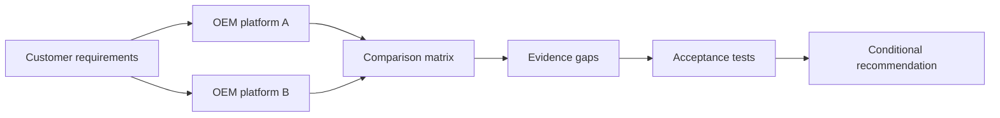
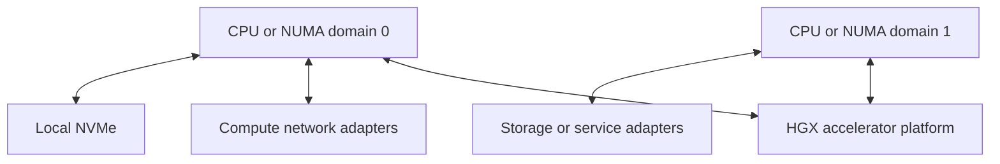

# Compare HGX-Based Server Designs

## Lab metadata

| Field | Value |
|---|---|
| Volume | 06 — HGX Platform |
| Difficulty | Intermediate |
| Estimated time | 75 minutes |
| Lab type | Architecture and platform evaluation |
| Target platform | Documentation and design environment |

## Objective

Compare two HGX-based server proposals as complete production systems rather than treating them as equivalent because they use the same accelerator platform.

## Background

OEM proposals often highlight the accelerator generation first. The surrounding host, network, storage, cooling, management, firmware, and support design may receive less attention even though those differences strongly affect production behavior.

## Learning outcomes

You will be able to:

- define the HGX and OEM integration boundaries;
- compare complete system architectures;
- identify missing or ambiguous proposal data;
- build a validation and acceptance plan;
- document support ownership and operational risk.

## Architecture



## Prerequisites

- Completion of Chapter 02.
- Two OEM proposal documents or anonymized candidate designs.
- Customer workload and facility requirements.
- No physical HGX system is required.

## Environment

Create `hgx-platform-comparison.md` in a version-controlled architecture workspace.

## Step 1 — Write the customer requirement

Use this scenario:

> A research organization needs a multi-node training platform. It expects sustained distributed workloads, shared checkpoint storage, remote operations, and staged firmware maintenance. The data center has strict rack-power and cooling limits.

Record:

```md
## Customer requirements

- Workload type:
- Scale at launch:
- Growth target:
- Host-memory requirement:
- Compute-network requirement:
- Storage requirement:
- Availability expectation:
- Rack-power limit:
- Cooling method:
- Support expectation:
```

## Step 2 — Separate platform boundaries

For each proposal, identify:

```md
| Domain | NVIDIA/HGX responsibility | OEM responsibility | Customer responsibility |
|---|---|---|---|
| Accelerator subsystem |  |  |  |
| Host CPUs and memory |  |  |  |
| PCIe and NIC topology |  |  |  |
| Local storage |  |  |  |
| Power and cooling |  |  |  |
| BIOS and BMC |  |  |  |
| Driver and CUDA stack |  |  |  |
| Cluster network |  |  |  |
| External storage |  |  |  |
```

The purpose is to expose shared responsibility before an incident occurs.

## Step 3 — Build the technical comparison

```md
| Area | Requirement | Platform A | Platform B | Evidence quality |
|---|---|---|---|---|
| Accelerator | Required generation and count |  |  |  |
| Host | CPU architecture and count |  |  |  |
| Memory | Capacity and NUMA layout |  |  |  |
| Compute network | Adapter count, speed, placement |  |  |  |
| Storage network | Adapter design and isolation |  |  |  |
| Local storage | Capacity, endurance, layout |  |  |  |
| Management | BMC, API, telemetry, access model |  |  |  |
| Firmware | Bundle and update process |  |  |  |
| Cooling | Air or liquid, facility requirements |  |  |  |
| Power | Feed, redundancy, rack density |  |  |  |
| Service | Warranty, field replacement, escalation |  |  |  |
```

Use `Verified`, `Partial`, or `Missing` for evidence quality.

## Step 4 — Draw each topology

Create one topology diagram per candidate. Do not force both into one crowded figure.

Template:



Replace the conceptual links with evidence from each proposal.

## Step 5 — Evaluate facility fit

```md
| Facility item | Limit | Platform A | Platform B | Status |
|---|---:|---:|---:|---|
| Rack units per node |  |  |  |  |
| Maximum rack power |  |  |  |  |
| Cooling method |  |  |  |  |
| Required water conditions |  |  |  |  |
| Feed redundancy |  |  |  |  |
| Service clearance |  |  |  |  |
```

A platform that fails a mandatory facility requirement is not viable even when its compute design is attractive.

## Step 6 — Evaluate lifecycle and support

Ask both vendors:

- Who publishes the supported firmware bundle?
- Can updates be staged and rolled back?
- Which logs must be collected before escalation?
- Who owns first-line support for accelerator faults?
- Who owns BIOS, BMC, power, and cooling faults?
- What is the field-replacement process?
- Which operating systems and driver branches are validated?
- How long is the platform supported?

Record answers and unresolved ownership gaps.

## Step 7 — Define acceptance tests

```md
| Test | Purpose | Pass criterion | Owner |
|---|---|---|---|
| Hardware inventory | Verify delivered configuration | Matches approved BOM |  |
| Topology inspection | Verify device placement | Matches approved diagram |  |
| GPU diagnostics | Detect component faults | Approved diagnostic passes |  |
| Network bandwidth | Validate compute path | Meets agreed threshold |  |
| Storage throughput | Validate data and checkpoint path | Meets workload target |  |
| Distributed workload | Validate scale-out behavior | Meets agreed efficiency |  |
| Power and thermal soak | Validate facility integration | No throttling or alarms |  |
| Firmware rollback | Validate maintenance safety | Documented recovery succeeds |  |
```

Do not invent thresholds. Thresholds must come from the workload, contract, or agreed acceptance plan.

## Validation

The comparison is complete when:

- all mandatory requirements are mapped;
- topology is documented for both platforms;
- missing evidence is visible;
- support ownership is explicit;
- facility fit is reviewed;
- acceptance tests are defined;
- the recommendation includes assumptions and conditions.

## Verification

Ask a reviewer to answer:

1. Are the two proposals truly equivalent?
2. Which difference creates the largest performance risk?
3. Which difference creates the largest operational risk?
4. What evidence is still required?
5. What would cause the recommendation to change?

## Observability

Include platform observability in the comparison:

- BMC sensor coverage;
- GPU telemetry;
- network and PCIe counters;
- firmware inventory APIs;
- event-log export;
- Prometheus or enterprise-monitoring integration;
- remote diagnostic collection.

A system that cannot expose actionable evidence is harder to operate even when it benchmarks well.

## Performance measurements

Prioritize representative measurements:

- host-to-device and device-to-device behavior;
- distributed collective performance;
- storage read and checkpoint write behavior;
- CPU preprocessing headroom;
- sustained thermal and power behavior;
- workload throughput and scaling efficiency.

## Failure injection

### Failure 1 — Remove topology evidence

Mark the NIC placement for Platform A as unknown. Reassess the recommendation. A missing topology should reduce confidence, not be silently assumed equivalent.

### Failure 2 — Change the facility constraint

Reduce allowable rack power or remove liquid-cooling support. Identify which candidate becomes nonviable and why.

## Troubleshooting

### Proposals appear identical

**Cause:** comparison is limited to GPU generation and count.

**Resolution:** expand the matrix to host topology, network placement, storage, facilities, firmware, management, and support.

### Vendor data uses different terminology

**Cause:** proposals describe similar components at different abstraction levels.

**Resolution:** normalize both proposals into the same architectural domains and request diagrams where text is ambiguous.

### No candidate satisfies every preference

**Cause:** architecture involves trade-offs.

**Resolution:** distinguish mandatory gates from weighted preferences and document the operational cost of each compromise.

## Cleanup

Retain the comparison as an architecture decision record. Remove confidential pricing and vendor identifiers before publishing it as a training artifact.

## Summary

You compared HGX-based systems as complete OEM platforms. The exercise exposed topology, facility, lifecycle, observability, and support differences that accelerator specifications alone cannot reveal.

## Challenge exercises

1. Add a third candidate using a different cooling design.
2. Create a rack-level comparison for eight nodes.
3. Add network-fabric and storage costs to the decision.
4. Convert the acceptance tests into an executable commissioning plan.

## Further reading

- [Chapter 02 — Inside an HGX Platform](../chapter-02-inside-an-hgx-platform)
- [Volume 06 introduction](../index)
