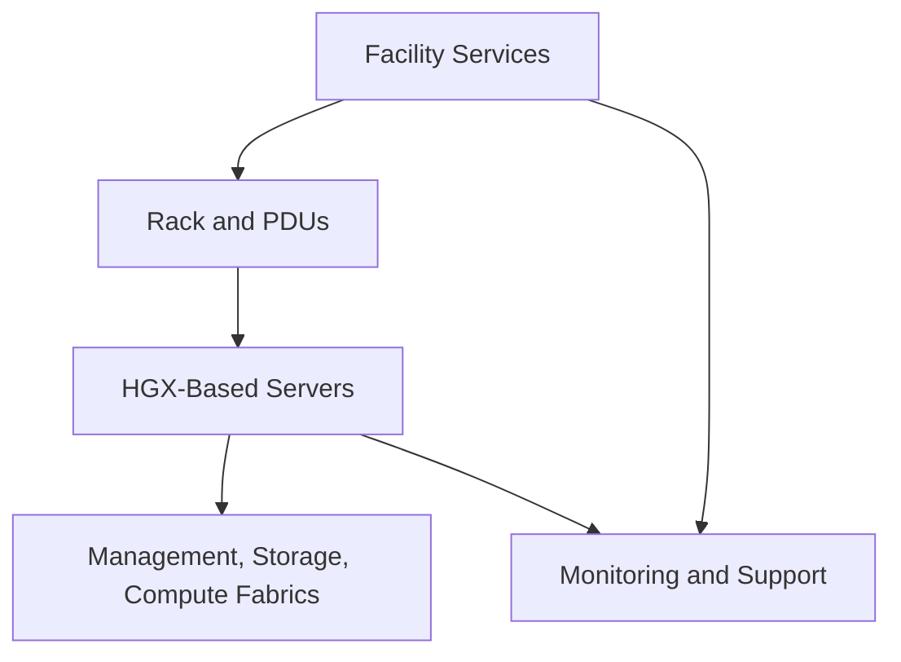

# Lab 02 — Review an HGX Rack Design

## Lab Metadata

| Field | Value |
|---|---|
| Volume | 06 |
| Difficulty | Advanced |
| Estimated time | 120 minutes |
| Target platform | Design exercise using a selected OEM HGX system |
| Lab type | Architecture review |

## 1. Objective

Produce a rack-readiness decision for a proposed HGX deployment. The review must cover complete-system power, thermal design, rack weight, service clearances, network fabrics, cabling, redundancy, commissioning, and support ownership.

## 2. Background

A server can be technically compatible with HGX and still be unsuitable for a particular facility. Rack architecture is where compute design meets electrical, mechanical, network, and operational constraints. This lab develops the habit of requiring evidence before approving a deployment.

## 3. Learning Outcomes

After completing this lab, you will be able to:

- translate OEM planning information into a rack elevation;
- calculate safe power and cooling requirements;
- identify hidden single points of failure;
- review network and cable density;
- define commissioning and rollback criteria;
- present a customer-ready go, conditional-go, or no-go recommendation.

## 4. Architecture



## 5. Prerequisites

Collect the current OEM documents for the exact server configuration:

- technical specifications;
- site-planning or installation guide;
- power and connector requirements;
- cooling requirements;
- dimensions and weight;
- supported rack and rail information;
- network adapter configuration;
- service-clearance guidance;
- firmware and support matrix.

Do not substitute a generic HGX specification for the final server documentation.

## 6. Environment

Create a design manifest:

```yaml
server_vendor: replace-me
server_model: replace-me
hgx_platform: replace-me
server_count: 0
rack_type: replace-me
power_feed_a: replace-me
power_feed_b: replace-me
cooling_type: air-or-liquid
compute_fabric: replace-me
storage_fabric: replace-me
management_network: replace-me
```

## 7. Components

| Component | Review question |
|---|---|
| Server | What is the validated maximum and expected workload envelope? |
| Rack | Can it support dimensions, weight, rails, and service access? |
| PDU and feeds | Are connectors, branch limits, phase balance, and redundancy correct? |
| Cooling | Can heat be removed continuously at the proposed density? |
| Networks | Are management, storage, and compute paths complete and supportable? |
| Operations | Who monitors, patches, repairs, and escalates each layer? |

## 8. Deployment Steps

### Step 1 — Build the rack elevation

Record each device, rack-unit position, weight, airflow direction, cable exit, and service clearance. Place heavy equipment low unless the vendor and rack design specify otherwise.

| RU range | Device | Weight | Power feeds | Network ports | Notes |
|---|---|---:|---|---:|---|
| | | | | | |

### Step 2 — Calculate power

For each server, record:

- maximum input requirement;
- expected workload power;
- number and type of power supplies;
- connector type;
- feed assignment;
- redundancy mode.

Calculate per-feed load and confirm that the design remains within approved continuous limits after one feed fails.

### Step 3 — Calculate thermal load

Use the approved facility conversion and OEM planning values. Confirm that the cooling design supports the rack under sustained operation, not only average room conditions.

For liquid-cooled systems, include:

- coolant supply and return temperature;
- required flow;
- pressure range;
- CDU capacity;
- redundant pumps;
- leak detection;
- ownership of water quality and maintenance.

### Step 4 — Review weight and logistics

Validate:

- rack static and dynamic load;
- floor loading;
- delivery route;
- freight elevator and doorway limits;
- lifting equipment;
- installation sequence;
- removal path for failed components.

### Step 5 — Review network fabrics

Document management, storage, application, and compute interfaces. Map every server port to a switch port and fabric role.

| Server port | Fabric | Switch | Speed | Redundant path | Cable type |
|---|---|---|---|---|---|
| | | | | | |

### Step 6 — Trace failure domains

For each dependency, ask what happens when it fails:

- one power feed;
- one PDU;
- one top-of-rack switch;
- one coolant pump;
- one storage path;
- one management switch;
- one server;
- one rack.

A component labeled “redundant” is not enough. Trace the upstream path.

### Step 7 — Define commissioning tests

At minimum include:

1. inventory and firmware verification;
2. out-of-band management access;
3. power-feed failover where safe and approved;
4. cooling and alarm verification;
5. GPU and local-fabric health;
6. NIC and switch validation;
7. storage-path validation;
8. local and multi-node collective tests;
9. sustained thermal load;
10. drain, repair, and rejoin workflow.

## 9. Validation

A design passes only if:

- all values come from current system and facility documentation;
- no branch circuit or cooling loop exceeds approved limits;
- redundant paths are genuinely independent;
- rack and floor weight limits are respected;
- cable and service access are practical;
- monitoring and escalation owners are named;
- commissioning has measurable pass/fail criteria.

## 10. Verification

Produce a decision table:

| Domain | Status | Evidence | Risk | Required action |
|---|---|---|---|---|
| Power | | | | |
| Cooling | | | | |
| Weight | | | | |
| Networking | | | | |
| Storage | | | | |
| Serviceability | | | | |
| Operations | | | | |

Conclude with one decision:

- **Go** — all mandatory requirements are satisfied;
- **Conditional go** — listed actions must close before delivery or energization;
- **No-go** — the facility or design cannot safely support the proposed configuration.

## 11. Observability

Define the monitoring source and owner for:

- server inlet temperature;
- GPU power, clocks, and throttling;
- PSU state;
- PDU current and branch alarms;
- coolant flow, pressure, and leak detection;
- switch port errors and congestion;
- storage latency;
- BMC and firmware alerts.

## 12. Performance Measurements

The commissioning plan should capture:

- idle and sustained rack power;
- per-feed balance;
- inlet and outlet temperature;
- coolant delta and flow where applicable;
- GPU clock stability;
- collective performance;
- storage throughput;
- network error counters before and after load.

## 13. Failure Injection

In a safe lab or approved commissioning window, simulate one non-destructive failure such as:

- disabling a redundant management path;
- removing one test network path;
- generating a monitoring alarm;
- draining one server from the scheduler;
- testing one power feed with facilities approval.

Never perform electrical or cooling failure injection without the responsible facilities team and an approved method of procedure.

## 14. Troubleshooting

### Rack passes power review but overheats

Check sustained rather than average load, airflow recirculation, containment, blanking panels, cable obstruction, fan or pump state, neighboring racks, and facility sensor placement.

### Redundant feed test shuts down servers

Trace PSU-to-PDU mapping and upstream circuits. Both logical feeds may terminate on one physical dependency.

### Collective tests underperform

Review NIC placement, switch paths, firmware, PCIe state, cable health, interface selection, and rank topology.

## 15. Cleanup

Restore any test paths, remove temporary load tools, archive all manifests and results, and update the design record with final deviations.

## 16. Summary

You reviewed an HGX rack as an integrated production system. The final recommendation should be understandable to compute, network, storage, facilities, security, operations, procurement, and support teams.

## 17. Challenge Exercises

- Compare air-cooled and liquid-cooled rack options.
- Redesign the rack to survive one PDU or switch failure.
- Model a second rack and identify shared upstream dependencies.
- Create a responsibility matrix across NVIDIA, OEM, network, storage, and facilities teams.

## 18. Further Reading

- [HGX Power, Cooling, and Rack Integration](../chapter-05-hgx-power-cooling-and-rack-integration)
- [HGX Networking, Storage, and Cluster Integration](../chapter-06-hgx-networking-storage-and-cluster-integration)
- Current OEM site-planning and support documentation for the selected system
