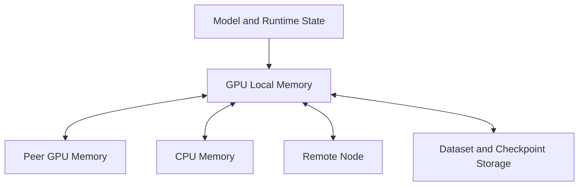
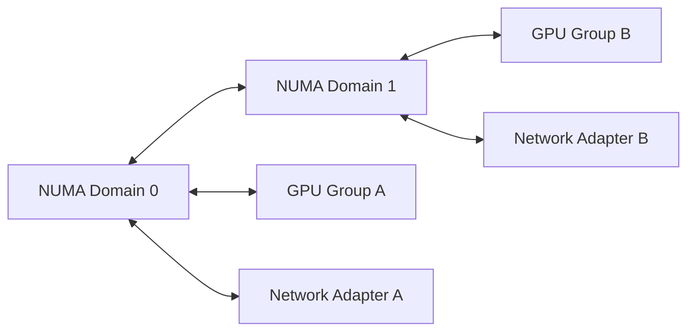

# Why GPU Networking Exists

A customer installs eight high-end GPUs in a server and expects an eightfold improvement. The application improves, but nowhere near the expected amount. Device utilization rises and falls in waves. Some GPUs wait while others communicate. Moving to a second node makes the result worse.

The accelerators are not necessarily defective. The application has crossed a boundary: computation is no longer the only scarce resource. Data movement has become part of the algorithm.

## Learning Objectives

After completing this chapter, you will be able to:

- explain why GPU systems require specialized communication paths;
- distinguish scale-up communication from scale-out communication;
- identify the major data paths in an accelerator server;
- explain why bandwidth, latency, topology, and synchronization must be evaluated together;
- recognize symptoms caused by data movement rather than insufficient compute;
- structure a customer discovery conversation for multi-GPU workloads.

## From One Device to a System

A single GPU executes work against its local memory. As workloads grow, model state, activations, gradients, datasets, and checkpoints cross device boundaries.

**Figure 7.1.1 — A distributed workload depends on several memory and communication domains.** Every required transfer consumes time and competes for a physical path.

The important question is not merely how fast each link can operate. It is which links the software actually uses, how often it uses them, and whether several flows share the same bottleneck.

## Why Traditional Host I/O Was Not Enough

PCI Express provides a general-purpose fabric for connecting processors, accelerators, network adapters, and storage devices. It is flexible and essential, but large GPU workloads exposed several limitations.

First, peer communication may traverse switches or host root complexes that were designed for general I/O rather than dense tensor exchange. Second, host staging can require data to move from GPU memory into CPU memory and then back toward another device. Third, several accelerators may contend for the same upstream path. Finally, a topology that is invisible at the application level can still determine performance.

These pressures led to technologies and designs that place high-bandwidth paths closer to the accelerators, enable peer access, reduce unnecessary copies, and connect device memory more directly to network and storage endpoints.

## Scale-Up and Scale-Out

GPU networking operates at two related scales.

| Domain | Boundary | Typical technologies | Architectural purpose |
|---|---|---|---|
| Scale-up | Inside one server or tightly integrated system | PCIe, NVLink, NVSwitch | Make several GPUs cooperate as a local compute complex |
| Scale-out | Between servers and racks | InfiniBand, Ethernet, RDMA | Extend distributed execution across nodes |

Scale-up improves communication among accelerators inside a system. Scale-out connects those systems into a cluster. A large training job usually depends on both.

A fast scale-out fabric cannot compensate for poor adapter locality inside the node. A strong internal GPU fabric cannot compensate for a congested network between nodes. The full path must be evaluated end to end.

## The Cost of Moving Data

Data movement introduces several forms of cost:

- **Serialization time:** bytes must cross a finite-bandwidth link.
- **Propagation and processing latency:** switches, adapters, protocols, and software add delay.
- **Synchronization delay:** one participant may wait for the slowest peer.
- **Contention:** unrelated flows may share links, queues, or root complexes.
- **Copy overhead:** intermediate staging consumes memory bandwidth and CPU resources.
- **Topology penalties:** a logically valid route may be physically indirect.

For synchronized workloads, communication time is not isolated. One slow rank can extend the duration of a collective operation for the entire job.

## Locality Is an Architectural Property

Consider two GPUs and two network adapters. The operating system may expose all four devices successfully. Yet each adapter may be closer to one GPU group than the other because of PCIe and NUMA placement.

A process using GPU Group A and Network Adapter B may cross the inter-socket path. Nothing is functionally broken, but effective bandwidth and latency may degrade. This is why topology-aware process placement matters.

## When GPU Networking Becomes Necessary

Specialized GPU communication becomes increasingly important when:

- a model spans more than one GPU;
- training uses data, tensor, pipeline, or expert parallelism;
- inference shards a model across accelerators;
- collective operations occupy a significant part of iteration time;
- datasets or checkpoints must move at high sustained rates;
- many accelerators share a host I/O hierarchy;
- service objectives depend on predictable tail latency.

It is less critical for small, independent workloads that fit on one device and exchange little data. Architecture should match the communication pattern rather than assume every GPU deployment needs the most complex fabric.

## Production Scenario

A platform team deploys sixteen nodes for distributed training. Each node passes GPU diagnostics, and every network link reports its expected line rate. The application still scales poorly.

The investigation separates the path into layers:

1. intra-GPU memory behavior;
2. peer communication inside the node;
3. GPU-to-network-adapter locality;
4. network fabric behavior;
5. collective algorithm and process placement;
6. storage and checkpoint interference.

The team discovers that processes are paired with remote NUMA-domain adapters. Rebinding ranks to local GPU and adapter groups improves consistency without replacing hardware.

The lesson is that healthy components do not prove a healthy data path.

## Troubleshooting Framework

**Symptoms**

- multi-GPU performance is far below single-GPU efficiency;
- utilization drops during collective operations;
- identical nodes show different throughput;
- CPU usage rises during large transfers;
- network links are underused while jobs wait;
- performance changes when process placement changes.

**Diagnosis**

1. Draw the expected path for the data.
2. Inspect PCIe, NUMA, GPU, and adapter topology.
3. Measure each segment separately.
4. Confirm peer access and direct-memory capabilities.
5. Compare process and interrupt affinity with device locality.
6. Correlate application stalls with transport and hardware counters.

**Root cause pattern**

The workload is using an indirect, contended, or slower path than the architecture assumed.

**Prevention**

Capture topology as part of node acceptance, standardize placement policies, and benchmark communication paths before application onboarding.

## Customer Perspective

When a customer asks for “faster networking,” the architect should first determine:

- which tensors move;
- how much data moves per iteration or request;
- whether communication is inside or between nodes;
- whether the workload synchronizes globally;
- which paths are currently used;
- whether the bottleneck is bandwidth, latency, contention, or software placement.

Only then should the discussion move to NVLink, NVSwitch, RDMA, InfiniBand, Ethernet, or GPUDirect.

## Interview Preparation

### Architecture question

Why can eight GPUs deliver less than eight times the performance of one GPU?

A strong answer covers serial work, communication volume, synchronization, topology, memory bandwidth, CPU and storage feeding, collective efficiency, and load imbalance.

### Troubleshooting question

All links report healthy status, but distributed training is slow. What do you inspect next?

Explain the end-to-end path: rank placement, NUMA locality, PCIe topology, peer access, adapter affinity, collective traces, queue and congestion counters, and storage interference.

## Key Takeaways

- Multi-GPU performance depends on communication as well as compute.
- Scale-up and scale-out paths solve different parts of the problem.
- A valid route is not necessarily an efficient route.
- Topology, locality, synchronization, and contention determine delivered performance.
- Troubleshooting must follow the data path rather than inspect components in isolation.

## Cross References

- [Volume 07 Introduction](./index)
- [Volume 02 — GPU Topology](../volume-02/chapter-10-gpu-topology-peer-access-and-data-paths)
- [Volume 06 — HGX Topology](../volume-06/chapter-04-hgx-topology-and-data-paths)
