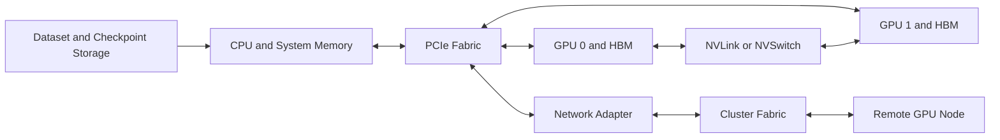
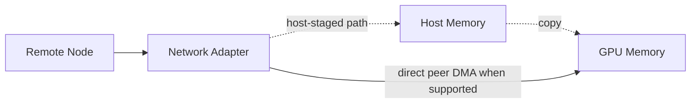
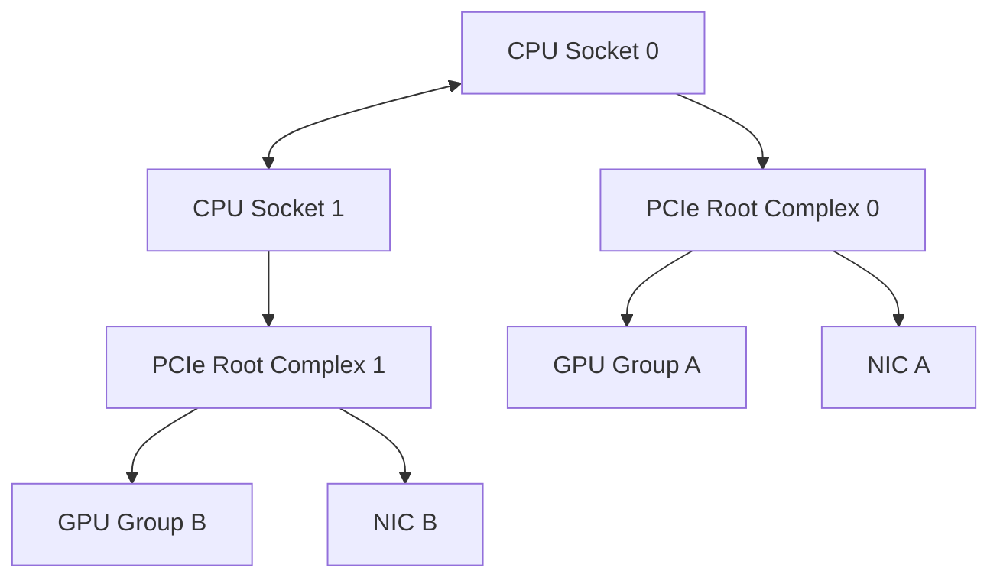
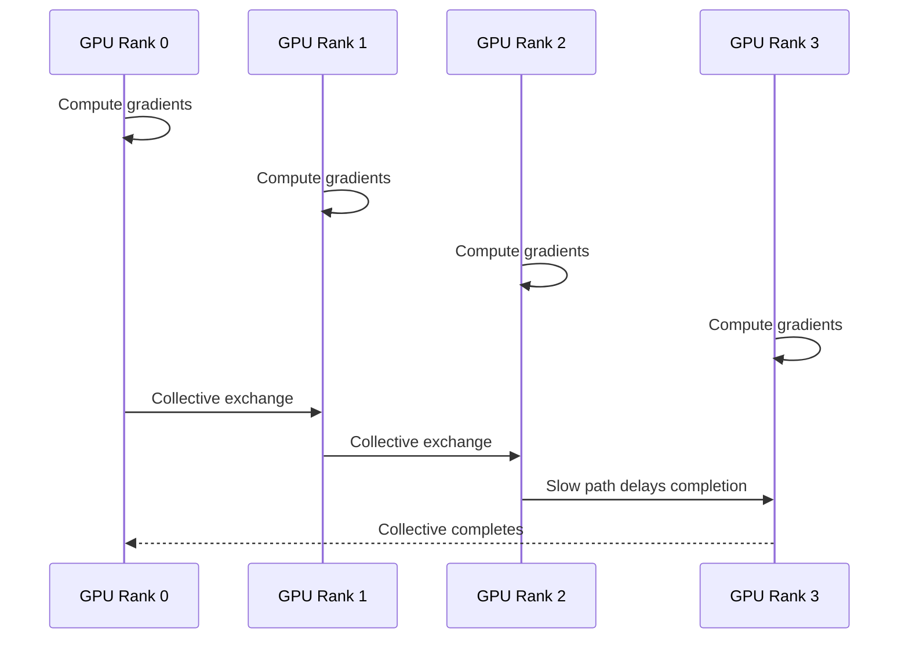

# Why GPU Networking Exists

## Introduction

An accelerator does not operate in isolation. It consumes data from storage, receives instructions from a CPU, exchanges tensors with peer GPUs, communicates with remote nodes, and periodically writes checkpoints back to persistent storage.

As long as a workload fits on one GPU and performs enough computation for every byte it moves, communication remains secondary. That assumption breaks when models, batches, optimizer states, and datasets grow beyond a single device. The system then spends a meaningful part of its time moving data and waiting for other participants.

This is the problem GPU networking exists to solve.

GPU networking is not one product or one cable. It is the complete set of data paths that connect GPU memory to peer GPUs, host memory, network adapters, storage devices, and remote accelerators. It includes PCI Express, Non-Uniform Memory Access locality, NVLink, NVSwitch, Direct Memory Access, Remote Direct Memory Access, GPUDirect technologies, adapter placement, and collective communication behavior.

A platform engineer who sees only GPU count sees capacity. An architect must also see paths, contention domains, synchronization boundaries, and failure domains.

| Chapter field | Value |
|---|---|
| Volume | 07 — GPU Networking |
| Difficulty | Advanced |
| Estimated reading time | 45–60 minutes |
| Primary focus | Why data movement becomes an architectural constraint |
| Previous | Volume 06 — HGX Platform |
| Next | PCIe, NUMA, and Host Data Paths |

## Story: Eight GPUs, Two Very Different Results

A customer purchases an eight-GPU server for distributed model training. The first test uses one GPU and completes in eight hours. The customer expects eight GPUs to finish in approximately one hour.

The job completes in three hours and forty minutes.

Every GPU passes diagnostics. Temperatures are normal. No link is down. The software framework sees all eight devices. The customer concludes that the GPUs are underperforming.

A closer investigation shows a different story.

The model is split across GPUs. Every training step includes several communication phases. Gradients are reduced across devices. Activations cross GPU boundaries. Checkpoints compete with training traffic. CPU workers are bound to remote NUMA nodes. Two network adapters are physically close to one GPU group, while the processes using them run on another socket.

The GPUs are fast. The system around them is forcing them to wait.

This scenario captures the central lesson of GPU infrastructure:

> Compute capacity is useful only when data arrives at the right device, at the right time, through the right path.

## Learning Objectives

After completing this chapter, you will be able to:

- Explain why multi-GPU systems require specialized communication paths.
- Distinguish scale-up communication from scale-out communication.
- Identify the major data paths inside an accelerator server and across a cluster.
- Explain why bandwidth, latency, synchronization, topology, and contention must be evaluated together.
- Recognize symptoms caused by data movement rather than insufficient compute.
- Describe why healthy components can still form an inefficient end-to-end path.
- Structure a customer discovery conversation for multi-GPU training and inference.

## Big Picture



**Figure 7.1.1 — The GPU data path spans several subsystems.** A workload may depend on storage, host memory, PCIe, local GPU interconnects, network adapters, and the cluster fabric during a single iteration.

The diagram is intentionally simplified. Real systems may include multiple CPU sockets, several PCIe switches, multiple NICs, local NVMe, DPUs, NVSwitch fabrics, storage adapters, and separate management and compute networks.

## Why Compute Stopped Being the Only Constraint

Early accelerator adoption often focused on arithmetic throughput. This made sense when the working set fit on one device and the workload spent most of its time executing kernels.

Modern AI systems changed the balance.

Large models may require multiple GPUs simply to hold parameters and runtime state. Distributed training exchanges gradients and optimizer information. Tensor parallelism moves partial results between devices during nearly every layer. Pipeline parallelism passes activations between stages. Expert parallelism routes tokens dynamically. Inference systems exchange KV-cache state, shard models, and stream responses under strict latency targets.

The result is that communication is no longer an occasional overhead. For many workloads, communication is part of the algorithm itself.

A useful mental model is:

```text
Iteration time = compute time + communication time + synchronization time + input/output time
```

The terms overlap in well-designed systems, but the relationship remains useful. Adding more GPUs reduces only the portion of work that can be parallelized. It may increase communication and synchronization at the same time.

## The Data-Movement Tax

Moving data introduces several distinct costs.

| Cost | What it means | Typical symptom |
|---|---|---|
| Serialization | Bytes must cross a finite-bandwidth link | Throughput plateaus as message size grows |
| Latency | Every operation has setup and transit delay | Small-message collectives perform poorly |
| Synchronization | Faster participants wait for the slowest | GPU utilization rises and falls in waves |
| Contention | Multiple flows share links, queues, or switches | Performance changes with neighboring jobs |
| Copy overhead | Intermediate staging consumes CPU and memory bandwidth | High CPU usage during transfers |
| Topology penalty | Traffic follows an indirect path | One GPU pair performs worse than another |
| Protocol overhead | Software and transport processing consume time | Line rate is available but not delivered |

These costs interact. A topology problem may look like a bandwidth problem. A synchronization problem may look like low GPU utilization. CPU staging may make the network appear slow even when the network is healthy.

## Scale-Up and Scale-Out

GPU communication operates across two architectural domains.

### Scale-up

Scale-up connects accelerators inside one server or tightly integrated system.

Typical technologies include:

- PCI Express
- GPU peer-to-peer access
- NVLink
- NVSwitch
- shared host memory paths

Scale-up communication supports local collectives, tensor exchange, peer memory copies, and model-parallel execution.

### Scale-out

Scale-out connects GPU systems across nodes, racks, or sites.

Typical technologies include:

- InfiniBand
- Ethernet
- RDMA
- RoCE
- ConnectX adapters
- fabric switches and routing

Scale-out communication supports distributed training, multi-node inference, remote storage access, and cluster-wide collectives.

| Domain | Boundary | Primary design question |
|---|---|---|
| Scale-up | Inside one system | How efficiently can local GPUs exchange data? |
| Scale-out | Between systems | How efficiently can remote GPUs coordinate? |

The distinction matters because a strong scale-out fabric cannot compensate for poor GPU-to-NIC locality inside the node. Likewise, an excellent NVSwitch fabric cannot compensate for a congested or oversubscribed inter-node network.

## Why PCIe Alone Was Not Always Sufficient

PCI Express is the general-purpose I/O backbone of modern servers. It connects GPUs, NICs, storage devices, and other endpoints to the CPU complex.

PCIe remains essential, but dense AI workloads exposed several limitations:

1. Several high-bandwidth devices may share one upstream path.
2. Peer traffic may cross multiple switches or root complexes.
3. Some transfers require staging through host memory.
4. Device locality depends on physical placement.
5. Communication-heavy workloads may exceed the practical bandwidth of the host I/O hierarchy.

These limitations do not make PCIe unsuitable. They explain why architects must understand where PCIe is sufficient and where additional accelerator-specific paths are justified.

## Why NVLink and NVSwitch Exist

NVLink provides a high-bandwidth path designed for GPU-to-GPU and supported CPU-to-GPU communication. NVSwitch extends that concept by creating a switched scale-up fabric when direct point-to-point links are insufficient for the required GPU count or connectivity pattern.

The engineering objective is not simply “more bandwidth.” It is to reduce dependence on indirect host-mediated paths for communication-heavy workloads.

Typical beneficiaries include:

- tensor parallel training;
- model sharding;
- large peer memory copies;
- local collective communication;
- workloads that treat several GPUs as one tightly coupled compute complex.

NVLink and NVSwitch do not eliminate the need for PCIe. PCIe still participates in device discovery, control, I/O, NIC attachment, and many host interactions. The architecture contains multiple complementary fabrics.

## Why DMA and RDMA Matter

A traditional data transfer may involve the CPU copying bytes between buffers. This consumes CPU cycles and host memory bandwidth.

Direct Memory Access allows devices to move data without requiring the CPU to copy every byte. Remote Direct Memory Access extends the concept across a network, allowing a remote system to access registered memory with reduced software involvement.

For GPU systems, the important question is whether a network or storage device can exchange data directly with GPU memory through a supported peer path.



**Figure 7.1.2 — Host-staged and direct peer data paths.** A direct path can avoid a host bounce buffer, but only when hardware, topology, firmware, drivers, and software support the operation.

GPUDirect RDMA enables direct data exchange between GPU memory and supported third-party peer devices over PCIe. GPUDirect Storage enables supported storage paths to transfer data directly to or from GPU memory while avoiding a CPU bounce buffer. These technologies reduce unnecessary data movement; they do not remove the need to validate topology, compatibility, and fallback behavior.

## Locality Is a First-Class Property

Servers expose devices through logical identifiers, but performance follows physical paths.

Consider a two-socket server:



**Figure 7.1.3 — Device locality in a two-socket server.** A process using GPU Group A and NIC B may force traffic across the inter-socket path.

The operating system may report all devices as healthy. The application may run successfully. Yet a remote path can add latency, consume inter-socket bandwidth, and reduce effective throughput.

This is why topology-aware placement aligns:

- GPU selection;
- CPU affinity;
- memory allocation;
- NIC selection;
- interrupt placement;
- process ranks;
- collective communication paths.

## Synchronization Amplifies Small Problems

Distributed AI workloads often synchronize.

During an AllReduce operation, every rank contributes data and waits for the collective to complete. If one rank is slow because it uses a remote NIC, a down-trained PCIe link, a congested switch path, or an overloaded CPU, the entire job may wait.



**Figure 7.1.4 — One slow participant can extend the synchronization window.** Component-level health does not reveal rank-level imbalance.

This explains a common production pattern: all GPUs appear underutilized even though only one path is actually slow.

## When Specialized GPU Networking Becomes Necessary

Specialized communication becomes increasingly important when:

- a model spans multiple GPUs;
- training uses data, tensor, pipeline, or expert parallelism;
- inference shards a model across accelerators;
- collective communication consumes a significant fraction of iteration time;
- checkpoints must be written frequently;
- datasets must be streamed at high sustained rates;
- many accelerators share one host I/O hierarchy;
- service objectives depend on predictable tail latency;
- the platform must scale from one server to many racks.

It may be unnecessary when workloads are independent, fit on one GPU, exchange little data, and tolerate modest transfer latency. Architecture should follow workload behavior, not product fashion.

## Architecture Trade-offs

### Bandwidth versus cost

Higher-bandwidth fabrics and denser switching increase hardware cost, power consumption, cooling demand, and operational complexity.

### Locality versus scheduler flexibility

Preserving topology groups can improve performance but reduce placement flexibility. A scheduler may leave capacity idle to avoid fragmenting a strong GPU group.

### Direct paths versus compatibility

Direct data paths can reduce copies, but they require validated hardware, firmware, drivers, filesystems, kernels, and topology. Fallback paths must remain understood and observable.

### Shared fabrics versus isolation

A shared high-speed fabric improves connectivity but creates contention domains. Multi-tenant clusters need admission control, telemetry, and capacity policies.

### Peak throughput versus reliability

The fastest path is not useful if it is fragile, poorly supported, or difficult to recover. Production designs must value repeatability and supportability.

## Production Deployment Mindset

A production GPU networking design should include:

- an approved physical topology;
- stable device identities and PCI addresses;
- GPU-to-NIC affinity maps;
- NUMA-aware CPU and memory policies;
- baseline PCIe, NVLink, and network measurements;
- documented direct-path prerequisites;
- fallback behavior and performance expectations;
- monitoring for link state, errors, congestion, and topology drift;
- change-control procedures for firmware, BIOS, drivers, and kernels;
- workload placement policies aligned with communication patterns.

Node acceptance should validate not only that devices exist, but that they are connected as designed.

:::warning Production mistake
A successful `nvidia-smi` or link-state check proves visibility and basic health. It does not prove that the workload is using the intended path or achieving the expected bandwidth.
:::

## Hands-on Preview

Later labs in this volume will ask you to:

1. inspect PCIe and NUMA topology;
2. validate GPU peer-access relationships;
3. measure local and remote transfer paths;
4. benchmark RDMA or GPUDirect-capable paths where available;
5. create a topology-aware workload placement plan;
6. inject failures and compare healthy and broken behavior.

The lab philosophy is simple: draw the expected path, measure each segment, then verify the application uses that path.

## Production Troubleshooting

### Scenario 1: Eight GPUs scale poorly

**Symptoms**

- one-GPU performance is healthy;
- communication time grows with GPU count;
- utilization drops during collective phases;
- no device errors are reported.

**Diagnosis**

- inspect the GPU topology matrix;
- compare selected GPUs with direct-link groups;
- verify rank placement and CPU affinity;
- inspect GPU-to-NIC locality;
- benchmark peer transfers independently;
- correlate collective traces with hardware counters.

**Likely root causes**

- the scheduler fragmented a strong topology group;
- ranks use remote NUMA resources;
- peer access is unavailable or falling back;
- multiple flows share an oversubscribed PCIe path;
- one rank uses a weaker network path.

**Resolution**

Realign GPU, CPU, and NIC placement; preserve strong topology groups; correct runtime affinity; or redesign the allocation policy.

### Scenario 2: Network links are underused while jobs wait

**Symptoms**

- fabric ports show low utilization;
- collective latency is high;
- CPU usage is elevated;
- GPU utilization oscillates.

**Diagnosis**

Determine whether data is staged through host memory, whether the application is issuing sufficiently large transfers, and whether synchronization or software processing is limiting the path before the network becomes busy.

### Scenario 3: Performance changes after firmware maintenance

**Symptoms**

- devices remain visible;
- one node class becomes slower;
- peer bandwidth or NIC throughput changes.

**Possible causes**

- PCIe link width or speed changed;
- device enumeration changed;
- IOMMU or ACS behavior changed;
- NUMA affinity changed;
- BIOS settings reverted;
- interrupt placement changed.

### Prevention

Capture topology and bandwidth baselines during commissioning. Re-run them after firmware, BIOS, kernel, driver, or hardware changes.

## Customer Perspective

When a customer asks for “faster GPU networking,” do not begin with a product recommendation.

Begin with discovery:

1. What workload is running?
2. Which tensors move between devices?
3. How much data moves per iteration or request?
4. Is communication mostly inside one node or between nodes?
5. Does the workload synchronize globally?
6. Which GPU, NIC, and storage paths are currently used?
7. Is the problem bandwidth, latency, contention, software overhead, or placement?
8. What growth is expected over the next three years?
9. What operational complexity can the customer support?
10. What failure and upgrade model is acceptable?

Only then should the design discussion move to NVLink, NVSwitch, InfiniBand, Ethernet, RDMA, or GPUDirect.

### Example customer statement

> “We purchased eight DGX or HGX-based systems. Training is slower than expected. Should we buy a faster network?”

A strong architect first separates:

- intra-node communication;
- GPU-to-NIC locality;
- inter-node fabric behavior;
- collective algorithm behavior;
- storage interference;
- software placement.

The network may be the bottleneck. It is not the only plausible bottleneck.

## Interview Preparation

### Knowledge Questions

1. Why does adding GPUs increase communication demand?
2. What is the difference between scale-up and scale-out communication?
3. Why is PCIe topology relevant even when NVLink is present?
4. What problem does RDMA solve?
5. Why can direct peer access still perform poorly?

### Architecture Questions

1. Draw the end-to-end path for a tensor moving from storage to a remote GPU.
2. Design a two-socket, eight-GPU server placement policy.
3. Explain how GPU-to-NIC locality affects distributed training.
4. Compare a topology-aware scheduler with a count-only scheduler.

### Scenario Questions

1. A job is fast on GPUs 0 and 1 but slow on GPUs 1 and 2. What do you inspect?
2. All links are up, but collective latency doubled after maintenance. What could have changed?
3. The network is only 30 percent utilized while GPUs wait. Why might the network not be the bottleneck?
4. One rank consistently finishes communication later than the others. How do you isolate the cause?

### Customer Questions

1. When should a customer invest in NVSwitch?
2. When is InfiniBand appropriate, and when is Ethernet sufficient?
3. What evidence is required before recommending GPUDirect Storage?
4. How would you explain the cost of topology-aware scheduling to a customer focused on utilization?

### Whiteboard Exercise

Draw a two-node training system with:

- four GPUs per node;
- two CPU sockets;
- two NICs;
- one storage path;
- local GPU interconnects;
- an inter-node fabric.

Mark strong and weak paths. Explain where you would place processes and why.

## Summary

GPU networking exists because modern AI workloads are distributed across memory domains, devices, and systems. As workloads scale, data movement and synchronization become part of the execution model rather than background overhead.

The important architecture is the full path: storage, CPU memory, PCIe, GPU memory, local GPU interconnects, network adapters, and the cluster fabric. A system can contain healthy components and still deliver poor performance when software placement does not match physical topology.

The rest of this volume develops the tools required to inspect, benchmark, design, and troubleshoot these paths.

## Key Takeaways

- GPU count alone does not describe system capability.
- Communication is part of the algorithm for distributed AI workloads.
- Scale-up and scale-out solve different communication problems.
- Bandwidth, latency, synchronization, contention, and topology must be evaluated together.
- Direct paths reduce unnecessary copies but require validated support and observability.
- Healthy components do not guarantee an efficient end-to-end data path.
- Customer recommendations must begin with workload discovery.

## Quick Revision Sheet

| Question | Revision answer |
|---|---|
| Why does GPU networking exist? | To move data efficiently across GPU, host, storage, and remote-node boundaries. |
| What is scale-up? | Communication among accelerators inside one tightly coupled system. |
| What is scale-out? | Communication between GPU systems across a cluster fabric. |
| Why does locality matter? | Physical path length and contention affect delivered latency and bandwidth. |
| Why is synchronization dangerous? | One slow participant can delay the entire distributed operation. |
| What should be measured? | Every required segment of the end-to-end data path. |

## Lab Checklist

Before moving to the next chapter, confirm that you can:

- draw the path from storage to GPU memory;
- distinguish local peer traffic from inter-node traffic;
- explain why NUMA and NIC affinity matter;
- identify at least three reasons healthy GPUs can still scale poorly;
- describe the difference between component health and path health.

## Cross References

- [Volume 07 Introduction](./index)
- Next: [PCIe, NUMA, and Host Data Paths](./chapter-02-pcie-numa-and-host-data-paths)
- Related: [GPU Topology, Peer Access, and Data Paths](../volume-02/chapter-10-gpu-topology-peer-access-and-data-paths)
- Related: [HGX Topology and Data Paths](../volume-06/chapter-04-hgx-topology-and-data-paths)
- Related lab: [Inspect PCIe, NUMA, and GPU Topology](./labs/lab-01-inspect-pcie-numa-and-gpu-topology)

## Further Reading

- NVIDIA GPUDirect RDMA Documentation
- NVIDIA GPUDirect Storage Overview Guide
- NVIDIA DCGM Topology and NVLink Documentation
- PCI Express Base Architecture documentation from PCI-SIG
- NCCL documentation and topology guidance
