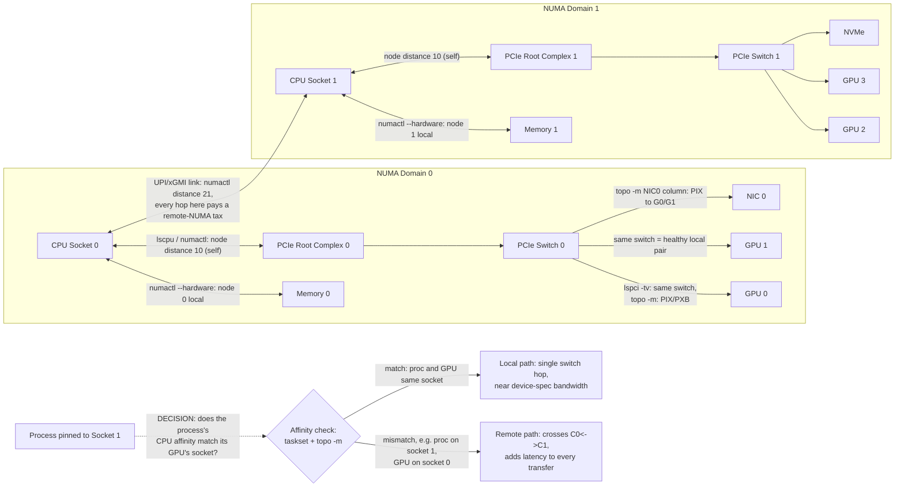
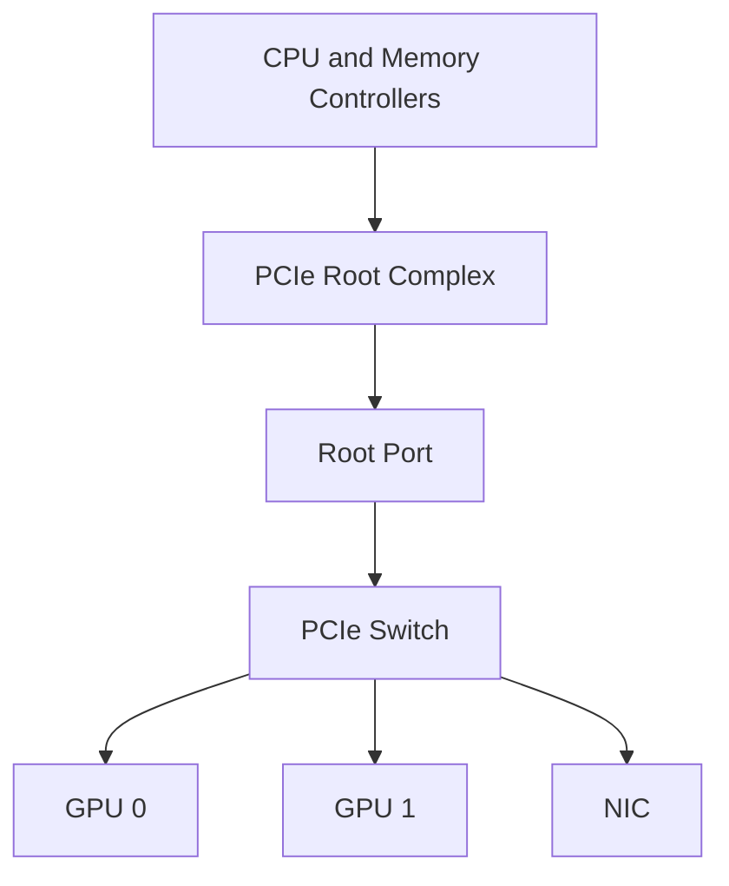
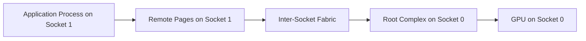
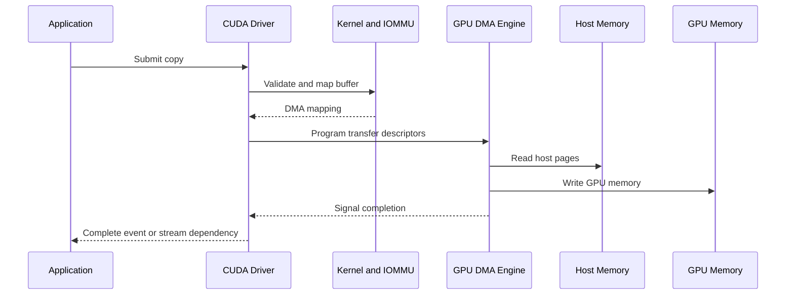

# PCIe, NUMA, and Host Data Paths

## Introduction

A server can contain eight identical GPUs and still behave like several different machines depending on which devices a workload selects. One GPU may share a PCIe switch with a network adapter. Another may sit behind a different root complex. A third may be physically close to the process that prepares its input, while a fourth requires traffic to cross the inter-socket fabric before reaching host memory.

Nothing in a simple inventory exposes these differences. `nvidia-smi` may show every GPU as healthy. Kubernetes may advertise the correct resource count. The application may still lose throughput because the software path does not match the physical path.

PCI Express and Non-Uniform Memory Access form the host-side foundation of almost every discrete-GPU server. Before discussing NVLink, RDMA, or GPUDirect, an infrastructure engineer must understand how bytes travel through the CPU and I/O hierarchy.

| Chapter field | Value |
|---|---|
| Volume | 07 — GPU Networking |
| Difficulty | Advanced |
| Estimated reading time | 55–70 minutes |
| Primary focus | Host-side locality and I/O topology |
| Previous | Why GPU Networking Exists |
| Next | NVLink and NVSwitch |

## Story: The Healthy Node That Was 30 Percent Slower

A platform team commissions sixteen nominally identical eight-GPU servers. Fifteen nodes complete a data-loading benchmark within a narrow range. One node is consistently slower.

Hardware diagnostics pass. The GPUs report no errors. The NIC is at the expected link speed. Storage latency looks normal. The team initially suspects a defective accelerator.

A topology comparison reveals a different cause. On the slow node, the benchmark process runs on CPU socket 1, allocates most host pages from socket 1, but drives a GPU and NIC attached to socket 0. Every input batch crosses the CPU interconnect before entering the local PCIe root complex. The node is healthy, but the process is remote from the devices it uses.

After binding the process and memory to the local NUMA domain, performance returns to the cluster baseline.

The incident demonstrates a central principle:

> Device health does not prove path efficiency.

## Learning Objectives

After completing this chapter, you will be able to:

- explain the PCIe hierarchy from endpoint to root complex;
- distinguish PCIe generation, link width, and delivered throughput;
- explain why NUMA affects host memory and I/O access;
- trace CPU-to-GPU, GPU-to-NIC, and storage-to-GPU paths;
- identify shared uplinks and contention domains;
- interpret common topology and affinity commands;
- design a topology-aware placement policy;
- troubleshoot remote-memory and degraded-link symptoms.

## Big Picture



**Figure 7.2.1 — Host-side topology of a two-socket GPU server, with the evidence for each hop and the affinity decision that separates a healthy path from the Story's slow node.** A logically valid path may cross a PCIe switch, a root complex, and the CPU interconnect before reaching its destination. The right-hand branch is literally the check the platform team ran in the Story above: confirm whether the benchmark process's CPU affinity and memory allocation matched the socket of the GPU and NIC it was actually driving.

## Why PCIe Exists

PCI Express is the general-purpose I/O fabric used to attach accelerators, network adapters, storage controllers, and other devices to a host. It replaced older shared-bus designs with point-to-point serial links and a switched hierarchy.

PCIe was not designed only for GPUs. Its strength is interoperability. A server vendor can connect many device classes through a common enumeration, configuration, and transaction model.

That flexibility also explains why GPU workloads can expose limitations. A tree that works well for independent devices may become a contention domain when several accelerators exchange large buffers or simultaneously drive NIC and storage traffic.

## The PCIe Hierarchy

A PCIe path contains several possible elements:

- **Endpoint:** The GPU, NIC, NVMe controller, or another attached device.
- **Link:** A point-to-point connection with a negotiated generation and width.
- **Switch:** A fan-out device connecting several endpoints to an upstream port.
- **Root port:** The host-facing entry into the PCIe hierarchy.
- **Root complex:** The CPU or chipset logic connecting PCIe transactions to host memory and processors.



**Figure 7.2.2 — A simplified PCIe tree.** Several high-bandwidth endpoints may share one upstream switch link even when every endpoint has a wide downstream connection.

### Generation and width

A PCIe link is commonly described by generation and lane count, such as Gen4 x16 or Gen5 x16. These values describe signaling capability, not guaranteed application throughput.

Delivered throughput depends on:

- negotiated generation and width;
- encoding and protocol overhead;
- transaction size;
- read versus write behavior;
- switch implementation;
- CPU and chipset design;
- IOMMU behavior;
- contention from other devices;
- application concurrency.

A GPU that supports a newer generation can still operate at a lower speed when the slot, riser, BIOS policy, retimer, or root port negotiates a weaker link.

### Shared upstream bandwidth

Suppose two GPUs and one NIC each have x16 downstream links to the same PCIe switch, while the switch has one x16 uplink to the root complex. The endpoints do not receive three independent x16 paths to host memory. They share the uplink.

This matters when:

- both GPUs ingest data from host memory;
- one GPU sends through the NIC while another reads storage;
- collectives and checkpointing overlap;
- several tenants use devices behind the same switch.

A device-level specification can therefore overstate what the complete path can deliver under concurrency.

## NUMA: Memory Is Not Equally Near

NUMA means that a CPU core accesses some memory and I/O resources more directly than others. In a multi-socket server, each socket usually has local memory controllers and local PCIe roots. The sockets communicate through a processor interconnect.

A process can run on one socket while its memory pages reside on another. It can also drive devices connected to the remote socket.



**Figure 7.2.3 — Remote NUMA path.** A host-to-device transfer may traverse the processor interconnect before reaching PCIe.

The penalty varies by platform and workload. It can be negligible for infrequent control traffic but significant for:

- repeated host-to-device copies;
- CPU preprocessing pipelines;
- tokenization-heavy inference;
- network receive paths;
- storage staging;
- many small latency-sensitive transfers.

## Tracing Common Data Paths

### CPU memory to GPU

A typical staged input path is:

```text
Application thread
  → host memory
  → CPU memory controller
  → PCIe root complex
  → optional PCIe switch
  → GPU DMA engine
  → GPU memory
```

When the process and pages are remote, the path adds an inter-socket hop.

### GPU to NIC

A GPU-to-NIC path may be direct peer DMA when supported, or it may stage through host memory. Even with direct DMA, the physical path can cross one or more PCIe switches and root complexes.

The best pairing is often a GPU and NIC that share the shortest validated path. This relationship is called **GPU-to-NIC affinity**.

### Storage to GPU

Storage traffic may use:

- storage → host memory → GPU;
- storage → page cache → host memory → GPU;
- storage → GPU direct path when supported by the complete stack.

The storage device, NIC, and GPU can still contend for shared PCIe resources even when software removes an intermediate copy.

## Reading the Topology

No single command provides a complete architectural truth. Use several evidence sources.

### `nvidia-smi topo -m`

**Purpose:** Display GPU, NIC, and CPU-affinity relationships known to the NVIDIA stack.

```bash
nvidia-smi topo -m
```

**Representative output** (four-GPU, single NIC-per-pair, two-socket node):

```text
        GPU0  GPU1  GPU2  GPU3  NIC0  NIC1  CPU Affinity  NUMA Affinity
GPU0     X    NV12  SYS   SYS   PIX   SYS   0-15,32-47    0
GPU1    NV12   X    SYS   SYS   PIX   SYS   0-15,32-47    0
GPU2    SYS   SYS    X    NV12  SYS   PIX   16-31,48-63   1
GPU3    SYS   SYS   NV12   X    SYS   PIX   16-31,48-63   1
```

**Interpretation:** Read this left to right, then top to bottom. `NV12` between GPU0/GPU1 and GPU2/GPU3 means those pairs have a direct NVLink connection (12 links) — a healthy scale-up path. `SYS` between GPU0/GPU1 and GPU2/GPU3 means those pairs have no direct link and must traverse PCIe *and* the inter-socket interconnect — the weakest class shown here. The `NIC0`/`NIC1` columns show `PIX` (shares a nearby PCIe bridge — local) for the matching GPU pair and `SYS` for the other pair, which is the GPU-to-NIC affinity map: GPU0/GPU1 should send their network traffic through NIC0, not NIC1. `CPU Affinity` and `NUMA Affinity` give the CPU core ranges and NUMA node each GPU is local to — this is what a launcher should use to pin processes.

**Common problems:**

- NIC columns may be absent when interface mapping is unavailable.
- Container restrictions may hide host topology.
- Device numbering can differ between nodes.

### `lspci -tv`

**Purpose:** Display the PCIe tree.

```bash
lspci -tv
```

**Representative output:**

```text
-[0000:00]-+-01.0-[01]----00.0  NVIDIA H100 (GPU0)
           +-02.0-[02]--+-00.0  PLX/Switch upstream
           |            +-01.0-[03]----00.0  NVIDIA H100 (GPU1)
           |            \-02.0-[04]----00.0  Mellanox ConnectX-7 (NIC0)
           \-1e.0-[1e]----00.0  NVMe controller
```

Read the indentation as the tree, not the bus numbers as meaningful values by themselves: GPU1 and NIC0 both hang off the same switch (`02.0`) as siblings, which is exactly the `PIX` relationship reported by `nvidia-smi topo -m` above — this is the command that lets you *see* why the topology matrix said what it said, rather than taking it on faith. GPU0 sits behind a separate root port (`01.0`) with no shared switch, consistent with a `SYS`-class relationship to devices on the other branch.

### `lspci -vv`

**Purpose:** Inspect negotiated PCIe link state.

```bash
sudo lspci -s 03:00.0 -vv | grep -E 'LnkCap|LnkSta'
```

**Representative output:**

```text
        LnkCap: Port #0, Speed 32GT/s, Width x16, ASPM not supported
        LnkSta: Speed 32GT/s (ok), Width x16 (ok)
```

`LnkCap` is the maximum the slot and device support; `LnkSta` is what actually negotiated. Here they match — `32GT/s x16` (PCIe Gen5) on both lines, both explicitly flagged `(ok)` — this device is running at full capability. If `LnkSta` showed a lower speed (e.g. `8GT/s`) or narrower width (e.g. `x8`) than `LnkCap`, that gap is the signal: a speed-only mismatch usually points to a BIOS/firmware link-training policy or a marginal retimer, while a width mismatch more often points to a physical seating, riser, or bifurcation-configuration problem.

### `numactl --hardware`

**Purpose:** Display NUMA nodes, CPU membership, memory capacity, and distance.

```bash
numactl --hardware
```

**Representative output:**

```text
available: 2 nodes (0-1)
node 0 cpus: 0 1 2 3 4 5 6 7 32 33 34 35 36 37 38 39
node 0 size: 515633 MB
node 0 free: 481200 MB
node 1 cpus: 8 9 10 11 12 13 14 15 40 41 42 43 44 45 46 47
node 1 size: 515897 MB
node 1 free: 502110 MB
node distances:
node   0    1
  0:  10   21
  1:  21   10
```

The `node distances` matrix is the number that matters most operationally: distance `10` is a node accessing its own local memory (the baseline), and `21` is roughly a 2.1x relative cost to reach the other socket's memory. That is not a hard latency figure in nanoseconds — it is a normalized, platform-reported ratio — but it is exactly the number that explains why the Story's slow node recovered after the process and its memory were bound to the correct node: every remote allocation was paying that ~2.1x tax on top of the PCIe hop.

### Process affinity

```bash
ps -eo pid,psr,comm | grep train
taskset -cp 48213
```

**Representative output:**

```text
$ ps -eo pid,psr,comm | grep train
  48213    9 python

$ taskset -cp 48213
pid 48213's current affinity list: 8-15,40-47
```

`psr` in the `ps` output is the CPU the process is *currently* running on (core 9, which is in node 1's range) — a live snapshot, not a pinned guarantee. `taskset -cp` shows the actual allowed CPU set for that PID: `8-15,40-47`, which matches node 1 from the `numactl --hardware` output above. If this process were driving a GPU that `nvidia-smi topo -m` reports as NUMA Affinity `0`, that mismatch — CPU set on node 1, GPU on node 0 — is precisely the remote-NUMA condition from Figure 7.2.1's decision branch, and it is verifiable with these two commands alone, no benchmark required.

`numactl -p &lt;pid&gt;` may not be available in every distribution; use `/proc/&lt;pid&gt;/numa_maps` when necessary to see the actual NUMA node each mapped page currently lives on.

## Internal Working: A Host-to-GPU Transfer

A simplified transfer sequence looks like this:



**Figure 7.2.4 — Simplified host-to-GPU DMA sequence.** The CPU configures and coordinates the transfer, while the device DMA engine moves the payload.

The exact implementation differs across systems and APIs, but several principles remain:

- mappings must be valid;
- buffers must remain available during DMA;
- ordering must be coordinated;
- the physical path determines transfer cost;
- completion does not occur until the required visibility guarantees are satisfied.

## Architecture Design

### Performance

Evaluate the whole path, not only endpoint capabilities. Baseline:

- host-to-device and device-to-host bandwidth;
- GPU-to-GPU peer bandwidth;
- GPU-to-NIC throughput;
- NUMA-local versus remote behavior;
- concurrent-device contention.

### Scalability

Adding devices behind the same switch may increase endpoint count without increasing upstream capacity. Scale planning must include the oversubscription of internal I/O paths.

### Availability

PCIe switches, risers, retimers, and root ports are failure domains. A switch failure can affect several devices simultaneously. Monitoring should correlate device loss by shared topology.

### Security

DMA-capable devices can access mapped memory. IOMMU policy, driver isolation, virtualization boundaries, and trusted firmware are part of the architecture. Disabling protections for benchmark gains can create unacceptable risk.

### Operability

Standardize:

- BIOS and firmware settings;
- slot population;
- risers and adapters;
- operating-system NUMA policy;
- device naming and inventory;
- benchmark methodology.

## Production Deployment Pattern

A topology-aware platform should maintain a node-class record containing:

| Inventory item | Why it matters |
|---|---|
| GPU UUID and PCI address | Stable device identity |
| NUMA node and CPU affinity | Process and memory placement |
| NIC PCI address and affinity | Distributed workload placement |
| Storage-controller path | Data-loading and checkpoint path |
| PCIe generation and width | Link validation |
| Shared switch groups | Contention awareness |
| Baseline bandwidth | Regression detection |

Schedulers can expose locality through labels, topology managers, node pools, or workload launch logic. The exact mechanism matters less than preserving the relationship between CPU, memory, GPU, NIC, and storage.

## Production Troubleshooting

### Scenario 1 — One rank is consistently slower

**Symptoms**

- one process reports longer data-transfer time;
- GPU compute time is similar across ranks;
- network or collective completion waits for one participant.

**Diagnosis**

1. Map rank to GPU UUID.
2. Check process CPU affinity.
3. Inspect memory placement.
4. Compare GPU-to-NIC locality.
5. Compare PCIe link state with healthy ranks.

**Likely root cause**

Remote NUMA placement or a weaker PCIe path.

**Resolution**

Bind the rank, memory policy, GPU, and NIC to the same locality group where possible.

**Prevention**

Make affinity part of the launcher or scheduler policy rather than a manual tuning step.

**Worked evidence for this exact scenario — a paired snapshot.** This is the two-command combination that diagnosed the Story's slow node: first confirm which NUMA node the process is actually bound to, then confirm which node the GPU it drives belongs to.

```text
$ taskset -cp 48213
pid 48213's current affinity list: 8-15,40-47

$ nvidia-smi topo -m | head -1; nvidia-smi topo -m | grep GPU0
        GPU0  GPU1  GPU2  GPU3  NIC0  NIC1  CPU Affinity  NUMA Affinity
GPU0     X    NV12  SYS   SYS   PIX   SYS   0-15,32-47    0
```

The process's affinity list (`8-15,40-47`) falls in node 1's CPU range, but GPU0's `CPU Affinity` column says it belongs to `0-15,32-47` — node 0. The process is bound to the wrong socket relative to the GPU it is feeding. Every host-to-device copy for this rank now crosses the inter-socket interconnect (distance `21` from the `numactl --hardware` example above) before it even reaches the local PCIe root complex. Rebinding the process with `numactl --cpunodebind=0 --membind=0` (or the launcher's equivalent affinity flag) and re-running the same two commands to confirm the ranges now match is the fix — no hardware change required, which is exactly why the original diagnostics ("GPUs pass, NIC at expected speed, storage latency normal") never caught it.

### Scenario 2 — A GPU negotiates a reduced link

**Symptoms**

- lower host-to-device bandwidth;
- `LnkCap` is stronger than `LnkSta`;
- the affected device may retrain after reboot.

**Diagnosis**

Inspect BIOS settings, slot capabilities, risers, retimers, firmware, and hardware logs. Compare with an identical node.

**Root cause examples**

- unsupported slot population;
- signal-integrity problem;
- faulty riser or retimer;
- firmware policy;
- platform power or thermal issue.

**Resolution**

Restore the validated hardware and firmware configuration. Do not mask the issue by reducing expectations without an approved design change.

### Scenario 3 — GPU-to-NIC throughput collapses under concurrency

**Symptoms**

- single-flow tests pass;
- throughput drops when multiple GPUs communicate;
- PCIe or switch counters show saturation.

**Root cause**

Several endpoints share an upstream link or root-complex resource.

**Resolution**

Spread traffic across locality groups, use multiple NICs appropriately, or select a platform with a stronger internal I/O design.

**Worked evidence for this scenario.** This is the case referenced earlier in "Shared upstream bandwidth" — two GPUs and one NIC behind a single switch with one x16 uplink to the root complex. A single-flow test looks perfect; the problem only appears under concurrency:

```text
$ # single GPU streaming host-to-device, alone
$ ./bandwidthTest --device=0 --memory=pinned --mode=range
 H2D Bandwidth: 25.8 GB/s

$ # same test on GPU0 and GPU1 simultaneously, both behind the same switch
$ ./bandwidthTest --device=0 --memory=pinned --mode=range &
$ ./bandwidthTest --device=1 --memory=pinned --mode=range &
 GPU0 H2D Bandwidth: 13.1 GB/s
 GPU1 H2D Bandwidth: 12.9 GB/s
```

Individually each GPU reaches ~25.8 GB/s, close to a practical ceiling for a Gen4 x16 downstream link. Run together, each drops to ~13 GB/s — the combined ~26 GB/s is almost exactly what one shared x16 uplink can deliver, split roughly evenly between the two flows. Neither GPU is faulty and neither link individually shows an error; the arithmetic itself (13 + 13 ≈ 26, not 2×25.8 ≈ 52) is the proof that the constraint is the shared upstream port, not either device's own downstream link. This is the evidence that justifies the resolution — spreading GPU0 and GPU1 onto separate upstream switches or NICs, rather than troubleshooting either GPU individually.

## Customer Scenario

A customer asks for servers with eight GPUs and two high-speed NICs. The proposed bill of materials appears sufficient, but the topology drawing places both NICs behind one CPU socket while half the GPUs are attached to the other.

The architect asks:

- Which GPUs will each NIC serve?
- Will workloads span all eight GPUs?
- Are CPU preprocessing threads pinned?
- Does the platform support the intended peer path?
- What happens when both NICs and storage are active?

The final design distributes NIC locality across the GPU groups and includes a commissioning test that compares local and remote paths. The customer buys the same number of GPUs and NICs, but receives a materially better architecture because the relationships were designed.

## Interview Preparation

### Knowledge Questions

1. What is the difference between a PCIe endpoint, switch, root port, and root complex?

   > "An endpoint is the device itself — a GPU, a NIC, an NVMe controller. A switch fans out one upstream link to several downstream endpoints, the way a network switch fans out one uplink to many ports. A root port is where the host side of the hierarchy begins, and the root complex is the CPU or chipset logic that actually connects those PCIe transactions to memory and to the processor. When I'm reading an `lspci -tv` tree, I'm really asking which endpoints share a switch, because that tells me who's competing for the same upstream bandwidth."

2. Why can a Gen5-capable device operate below Gen5 x16?

   > "Because the spec on the box is a capability, not a guarantee — the actual negotiated state depends on the slot, the riser, the BIOS link-training policy, signal integrity, and sometimes a retimer in the path. I always check `LnkCap` against `LnkSta` with `lspci -vv` before trusting a device's rated speed; if capability says 32GT/s x16 and status says 16GT/s x16, the width is fine but something in speed negotiation — usually firmware policy or signal quality — is holding it back."

3. What does NUMA mean for I/O devices?

   > "It means a PCIe device is physically attached to one CPU socket's root complex, not to the server as a whole. If the process using that device is running on the other socket, every transfer has to cross the inter-socket interconnect first. `numactl --hardware` gives me the actual distance ratio — something like 10 for local and 21 for remote — so I'm not guessing about the penalty, I have a number for it."

### Architecture Questions

1. Draw a two-socket server with four GPUs and two NICs. Show strong and weak affinity pairs.

   > "I'd draw two boxes, one per socket, each with two GPUs and one NIC hanging off that socket's local PCIe switch. The GPU-to-NIC pairs within the same box I'd mark as strong — same switch, `PIX` in `nvidia-smi topo -m` terms. Any pairing that crosses from one box to the other — say GPU2 talking to NIC0 — I'd mark as weak, because that traffic has to cross the CPU interconnect before it even reaches PCIe on the other side."

2. Explain how shared switch uplinks create internal oversubscription.

   > "If two GPUs each have a full x16 downstream link to the same switch, but that switch only has one x16 uplink to the root complex, those two GPUs don't get two independent x16 paths to host memory — they're splitting one. I saw this directly in a bandwidth test: each GPU alone hit about 26 GB/s, but running together they each dropped to about 13 GB/s, and 13 plus 13 is almost exactly what the single shared uplink can deliver. The device spec sheet describes the downstream link, not what the path can sustain under concurrency."

3. Design a node acceptance test for PCIe and NUMA locality.

   > "I'd capture four things at commissioning: the full `lspci -tv` tree, `nvidia-smi topo -m` for the GPU/NIC/CPU affinity matrix, `numactl --hardware` for the distance table, and then a pairwise bandwidth test for every GPU against every other GPU and against its assigned NIC — both isolated and under concurrency. I'd store all four as the node's baseline and re-run the same four after any firmware, BIOS, or hardware change, diffing against that baseline rather than trusting a single point-in-time health check."

### Scenario Questions

1. A GPU is healthy but host-to-device bandwidth is half the cluster baseline. What do you inspect?

   > "First `lspci -vv` on that device to compare `LnkCap` against `LnkSta` — if status shows a lower speed or width than capability, that's the answer right there. If the link itself looks fine, I'd check NUMA placement next — is the process actually pinned to the same socket as this GPU, using `taskset -cp` and comparing against the GPU's `NUMA Affinity` column in `nvidia-smi topo -m`."

2. Single-GPU tests pass, but concurrent I/O collapses. What topology condition could explain it?

   > "That's the signature of a shared upstream link — multiple endpoints with full-width downstream connections all funneling into one smaller uplink to the root complex. Individually each device gets the full path because it's not competing with anyone; run them together and they split the shared segment. I'd check `lspci -tv` for which endpoints sit behind the same switch before I'd suspect any single device."

3. A process uses a local GPU and remote host memory. Where does the traffic travel?

   > "The transfer has to leave the remote socket's memory, cross the inter-socket interconnect, then enter the local socket's PCIe root complex before it ever reaches the GPU's DMA engine. That's an extra hop that wouldn't exist if the memory had been allocated on the GPU's own NUMA node — it's exactly the kind of remote-memory case `numactl --hardware`'s distance table quantifies."

### Customer Questions

1. Why is "eight GPUs per node" an incomplete requirement?

   > "Because GPU count says nothing about the internal topology. Two eight-GPU servers can have completely different PCIe trees, NIC placement, and NUMA layouts — one might give you eight GPUs with clean, local NIC affinity, and another might bury half the NICs behind the wrong socket. I always ask for the topology diagram, not just the parts list."

2. When is strict NUMA pinning worth the operational complexity?

   > "When the workload does frequent host-to-device transfers or CPU-heavy preprocessing that feeds the GPU continuously — tokenization-heavy inference, data-loading-bound training. If the workload barely touches host memory once data is resident on the GPU, the remote-NUMA penalty matters a lot less, and I wouldn't pay the operational cost of strict pinning for a marginal gain."

3. How would you explain PCIe oversubscription without relying on benchmark marketing?

   > "I'd show them the arithmetic from an actual test, not a spec sheet: two devices that individually hit 26 GB/s each, dropping to 13 GB/s each the moment they run concurrently, because they share one uplink. That's a number they can reproduce themselves on their own hardware — it's a lot more convincing than a vendor's peak-bandwidth claim."

### Whiteboard Question

Draw the end-to-end path from an NVMe device to GPU memory in both a staged design and a direct-storage design. Mark every shared PCIe resource and protection boundary.

> "In the staged design, I'd draw NVMe to the page cache, page cache to a host-memory bounce buffer, then bounce buffer to GPU memory over PCIe — three copies. In the direct-storage design, I'd draw NVMe straight to GPU memory over PCIe, no host bounce buffer, but I'd still mark the shared switch if the NVMe controller and the GPU sit behind the same one, because removing the copy doesn't remove the shared-bandwidth constraint — that's still there in both designs. I'd also flag the IOMMU as the protection boundary in both cases, since DMA-capable devices need their memory mappings validated regardless of which path is used."

## Summary

PCIe and NUMA determine how host-side data reaches GPUs, NICs, and storage. The endpoint model alone is insufficient. Link negotiation, switch fan-out, shared uplinks, root-complex placement, CPU affinity, and host-memory locality all shape delivered performance.

A production GPU platform must inventory and validate these relationships. A healthy device attached through the wrong path can create a slow system with no obvious hardware fault.

## Key Takeaways

- PCIe bandwidth belongs to a complete path, not an isolated endpoint.
- NUMA affects both memory access and device locality.
- Wide downstream links can share a constrained upstream link.
- GPU, NIC, storage, CPU, and memory placement must be designed together.
- Topology baselines are essential for commissioning and incident response.

## Quick Revision Sheet

| Concept | Remember |
|---|---|
| PCIe root complex | Host entry point for an I/O hierarchy |
| PCIe switch | Fan-out and shared-bandwidth domain |
| NUMA locality | CPU, memory, and I/O cost depends on physical placement |
| Link capability | Maximum supported state |
| Link status | Currently negotiated state |
| Affinity | Preferred relationship among process, memory, GPU, NIC, and storage |

## Lab Checklist

Before moving on, confirm that you can:

- run `nvidia-smi topo -m`;
- draw the PCIe tree from `lspci -tv`;
- compare `LnkCap` and `LnkSta`;
- identify NUMA-local CPU sets;
- explain which endpoints share an upstream path.

## Cross References

- Previous: [Why GPU Networking Exists](./chapter-01-why-gpu-networking-exists)
- Next: [NVLink and NVSwitch](./chapter-03-nvlink-and-nvswitch)
- Related foundation: [GPU Topology, Peer Access, and Data Paths](../volume-02/chapter-10-gpu-topology-peer-access-and-data-paths)
- Related lab: [Inspect PCIe, NUMA, and GPU Topology](./labs/lab-01-inspect-pcie-numa-and-gpu-topology)

## Further Reading

Use the current documentation for the exact server, CPU platform, GPU, NIC, firmware, and driver combination. PCIe lane allocation and topology are platform-specific and should never be inferred from a different server model.