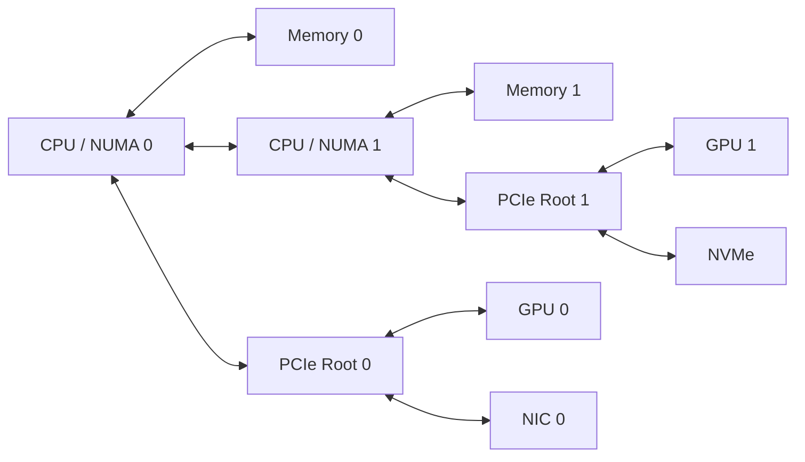

# PCIe, NUMA, and Host Data Paths

A server can contain identical GPUs and still deliver different performance depending on where processes run, which CPU owns the memory pages, and which PCIe root complex connects the target device. This is why topology must be treated as part of application placement rather than as a hardware inventory detail.

## Learning Objectives

After this chapter, you will be able to explain PCIe and NUMA locality, trace a host-to-GPU path, identify shared upstream links, and diagnose placement-related performance loss.

## Big Picture

**Figure 7.2.1 — Local and remote host data paths.** A transfer that crosses CPU sockets or shared PCIe uplinks consumes additional resources and usually adds latency.

## How the Path Works

PCI Express is a switched, point-to-point I/O fabric. Devices attach through root complexes and optional PCIe switches. A link has a negotiated generation and width, but useful throughput also depends on protocol overhead, chipset design, contention, and transfer size.

NUMA (Non-Uniform Memory Access) means memory access cost depends on location. A process running on one CPU socket may allocate pages from another socket. If that process drives a GPU attached to the remote socket, data can cross the inter-socket fabric before reaching PCIe. The GPU may be healthy while the end-to-end path is inefficient.

| Question | Evidence |
|---|---|
| Which CPU is closest to a GPU? | `lspci -tv`, `nvidia-smi topo -m`, firmware topology |
| Where is the process running? | `taskset`, `ps`, scheduler placement |
| Where are pages allocated? | `numactl --hardware`, NUMA counters |
| Is the PCIe link degraded? | `lspci -vv`, device telemetry |
| Is an uplink shared? | PCIe tree and switch documentation |

## Production Design

Topology-aware design aligns CPU affinity, memory allocation, GPU selection, NIC selection, and storage placement. This matters most for high-rate data ingestion, GPU Direct paths, distributed collectives, and workloads that repeatedly stage tensors through host memory.

A sound placement policy does not hard-code device numbers globally. Device numbering can change across firmware or hardware revisions. Instead, discover locality and express policy through topology labels, scheduler constraints, or workload launch logic.

## Troubleshooting Scenario

**Symptom:** one rank in a distributed job transfers data more slowly than the others.

**Diagnosis:** compare rank-to-GPU binding, CPU affinity, memory locality, PCIe link status, and NIC affinity. A common root cause is a rank using a GPU and NIC on different NUMA domains.

**Resolution:** bind the process and memory to the nearest CPU domain, pair the rank with the local NIC, and remeasure. If the topology is inherently asymmetric, document the expected difference and place communication-heavy ranks accordingly.

## Customer Perspective

A customer asking for “eight GPUs per node” has not specified a complete architecture. Ask how those GPUs connect to CPUs, network adapters, storage, and one another. The topology determines whether the node behaves like eight coordinated accelerators or eight devices competing through constrained host paths.

## Interview Preparation

**Question:** Why can CPU affinity affect a GPU-heavy workload?

A strong answer explains kernel launch, data preparation, host memory allocation, interrupt handling, NIC locality, PCIe roots, and inter-socket traffic.

## Key Takeaways

- PCIe bandwidth is a path property, not just a device specification.
- NUMA placement affects host memory and I/O latency.
- Shared upstream links create contention domains.
- CPU, memory, GPU, NIC, and storage placement must be designed together.

## Cross References

- [Volume 07 Introduction](./index)
- [GPU Topology](../volume-02/chapter-10-gpu-topology-peer-access-and-data-paths)
- [Next: NVLink and NVSwitch](./chapter-03-nvlink-and-nvswitch)
