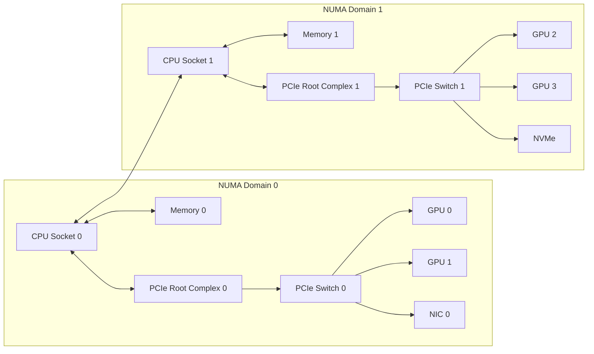
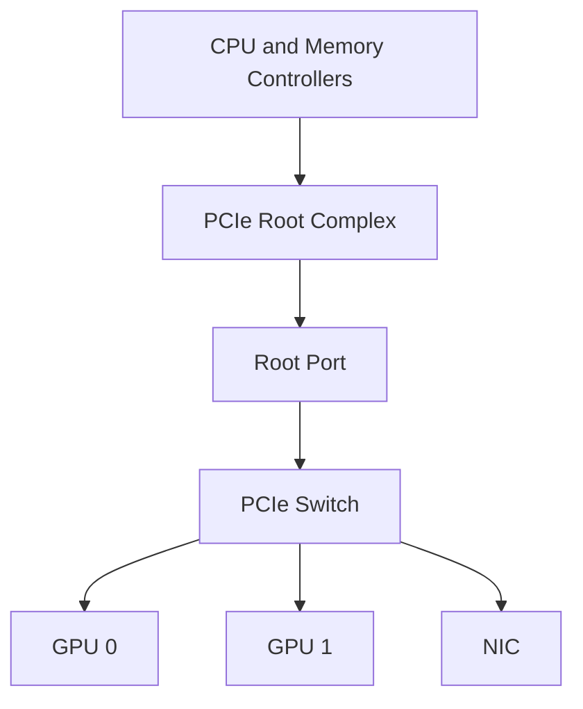
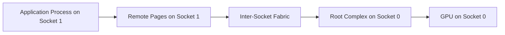
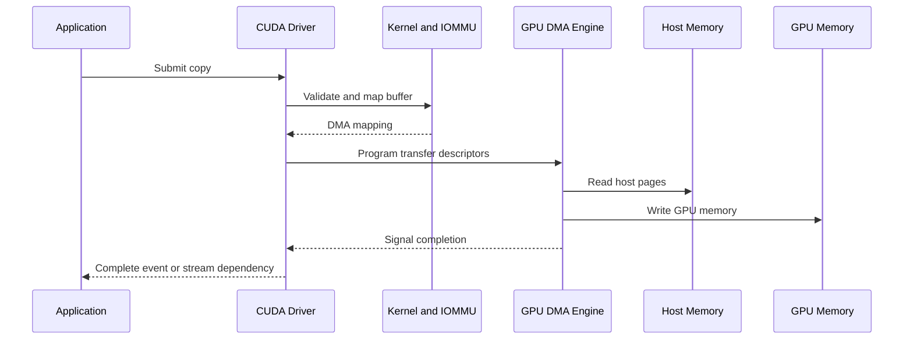

# PCIe, NUMA, and Host Data Paths

## Introduction

A server can contain eight identical GPUs and still behave like several different machines depending on which devices a workload selects. One GPU may share a PCIe switch with a network adapter. Another may sit behind a different root complex. A third may be physically close to the process that prepares its input, while a fourth requires traffic to cross the inter-socket fabric before reaching host memory.

Nothing in a simple inventory exposes these differences. `nvidia-smi` may show every GPU as healthy. Kubernetes may advertise the correct resource count. The application may still lose throughput because the software path does not match the physical path.

PCI Express and Non-Uniform Memory Access form the host-side foundation of almost every discrete-GPU server. Before discussing NVLink, RDMA, or GPUDirect, an infrastructure engineer must understand how bytes travel through the CPU and I/O hierarchy.

| Chapter field | Value |
|---|---|
| Volume | 07 — GPU Networking |
| Difficulty | Advanced |
| Estimated reading time | 55–70 minutes |
| Primary focus | Host-side locality and I/O topology |
| Previous | Why GPU Networking Exists |
| Next | NVLink and NVSwitch |

## Story: The Healthy Node That Was 30 Percent Slower

A platform team commissions sixteen nominally identical eight-GPU servers. Fifteen nodes complete a data-loading benchmark within a narrow range. One node is consistently slower.

Hardware diagnostics pass. The GPUs report no errors. The NIC is at the expected link speed. Storage latency looks normal. The team initially suspects a defective accelerator.

A topology comparison reveals a different cause. On the slow node, the benchmark process runs on CPU socket 1, allocates most host pages from socket 1, but drives a GPU and NIC attached to socket 0. Every input batch crosses the CPU interconnect before entering the local PCIe root complex. The node is healthy, but the process is remote from the devices it uses.

After binding the process and memory to the local NUMA domain, performance returns to the cluster baseline.

The incident demonstrates a central principle:

> Device health does not prove path efficiency.

## Learning Objectives

After completing this chapter, you will be able to:

- explain the PCIe hierarchy from endpoint to root complex;
- distinguish PCIe generation, link width, and delivered throughput;
- explain why NUMA affects host memory and I/O access;
- trace CPU-to-GPU, GPU-to-NIC, and storage-to-GPU paths;
- identify shared uplinks and contention domains;
- interpret common topology and affinity commands;
- design a topology-aware placement policy;
- troubleshoot remote-memory and degraded-link symptoms.

## Big Picture



**Figure 7.2.1 — Host-side topology of a two-socket GPU server.** A logically valid path may cross a PCIe switch, a root complex, and the CPU interconnect before reaching its destination.

## Why PCIe Exists

PCI Express is the general-purpose I/O fabric used to attach accelerators, network adapters, storage controllers, and other devices to a host. It replaced older shared-bus designs with point-to-point serial links and a switched hierarchy.

PCIe was not designed only for GPUs. Its strength is interoperability. A server vendor can connect many device classes through a common enumeration, configuration, and transaction model.

That flexibility also explains why GPU workloads can expose limitations. A tree that works well for independent devices may become a contention domain when several accelerators exchange large buffers or simultaneously drive NIC and storage traffic.

## The PCIe Hierarchy

A PCIe path contains several possible elements:

- **Endpoint:** The GPU, NIC, NVMe controller, or another attached device.
- **Link:** A point-to-point connection with a negotiated generation and width.
- **Switch:** A fan-out device connecting several endpoints to an upstream port.
- **Root port:** The host-facing entry into the PCIe hierarchy.
- **Root complex:** The CPU or chipset logic connecting PCIe transactions to host memory and processors.



**Figure 7.2.2 — A simplified PCIe tree.** Several high-bandwidth endpoints may share one upstream switch link even when every endpoint has a wide downstream connection.

### Generation and width

A PCIe link is commonly described by generation and lane count, such as Gen4 x16 or Gen5 x16. These values describe signaling capability, not guaranteed application throughput.

Delivered throughput depends on:

- negotiated generation and width;
- encoding and protocol overhead;
- transaction size;
- read versus write behavior;
- switch implementation;
- CPU and chipset design;
- IOMMU behavior;
- contention from other devices;
- application concurrency.

A GPU that supports a newer generation can still operate at a lower speed when the slot, riser, BIOS policy, retimer, or root port negotiates a weaker link.

### Shared upstream bandwidth

Suppose two GPUs and one NIC each have x16 downstream links to the same PCIe switch, while the switch has one x16 uplink to the root complex. The endpoints do not receive three independent x16 paths to host memory. They share the uplink.

This matters when:

- both GPUs ingest data from host memory;
- one GPU sends through the NIC while another reads storage;
- collectives and checkpointing overlap;
- several tenants use devices behind the same switch.

A device-level specification can therefore overstate what the complete path can deliver under concurrency.

## NUMA: Memory Is Not Equally Near

NUMA means that a CPU core accesses some memory and I/O resources more directly than others. In a multi-socket server, each socket usually has local memory controllers and local PCIe roots. The sockets communicate through a processor interconnect.

A process can run on one socket while its memory pages reside on another. It can also drive devices connected to the remote socket.



**Figure 7.2.3 — Remote NUMA path.** A host-to-device transfer may traverse the processor interconnect before reaching PCIe.

The penalty varies by platform and workload. It can be negligible for infrequent control traffic but significant for:

- repeated host-to-device copies;
- CPU preprocessing pipelines;
- tokenization-heavy inference;
- network receive paths;
- storage staging;
- many small latency-sensitive transfers.

## Tracing Common Data Paths

### CPU memory to GPU

A typical staged input path is:

```text
Application thread
  → host memory
  → CPU memory controller
  → PCIe root complex
  → optional PCIe switch
  → GPU DMA engine
  → GPU memory
```

When the process and pages are remote, the path adds an inter-socket hop.

### GPU to NIC

A GPU-to-NIC path may be direct peer DMA when supported, or it may stage through host memory. Even with direct DMA, the physical path can cross one or more PCIe switches and root complexes.

The best pairing is often a GPU and NIC that share the shortest validated path. This relationship is called **GPU-to-NIC affinity**.

### Storage to GPU

Storage traffic may use:

- storage → host memory → GPU;
- storage → page cache → host memory → GPU;
- storage → GPU direct path when supported by the complete stack.

The storage device, NIC, and GPU can still contend for shared PCIe resources even when software removes an intermediate copy.

## Reading the Topology

No single command provides a complete architectural truth. Use several evidence sources.

### `nvidia-smi topo -m`

**Purpose:** Display GPU, NIC, and CPU-affinity relationships known to the NVIDIA stack.

```bash
nvidia-smi topo -m
```

**Expected output:** A matrix showing path classes between GPUs and, where supported, network interfaces, plus CPU and NUMA affinity.

**Interpretation:** Shorter or direct path classes usually indicate stronger locality. Exact labels vary by system and driver generation. Compare against platform documentation rather than assuming every label has the same performance meaning on every server.

**Common problems:**

- NIC columns may be absent when interface mapping is unavailable.
- Container restrictions may hide host topology.
- Device numbering can differ between nodes.

### `lspci -tv`

**Purpose:** Display the PCIe tree.

```bash
lspci -tv
```

Use it to identify endpoints sharing switches and root ports.

### `lspci -vv`

**Purpose:** Inspect negotiated PCIe link state.

```bash
sudo lspci -s <bus-address> -vv | grep -E 'LnkCap|LnkSta'
```

Compare capability with actual status. A lower negotiated speed or width may indicate platform configuration, signal-integrity, slot, riser, or hardware problems.

### `numactl --hardware`

**Purpose:** Display NUMA nodes, CPU membership, memory capacity, and distance.

```bash
numactl --hardware
```

### Process affinity

```bash
ps -eo pid,psr,comm | grep <process-name>
taskset -cp <pid>
numactl -p <pid>
```

The last command may not be available in every distribution; use `/proc/<pid>/numa_maps` when necessary.

## Internal Working: A Host-to-GPU Transfer

A simplified transfer sequence looks like this:



**Figure 7.2.4 — Simplified host-to-GPU DMA sequence.** The CPU configures and coordinates the transfer, while the device DMA engine moves the payload.

The exact implementation differs across systems and APIs, but several principles remain:

- mappings must be valid;
- buffers must remain available during DMA;
- ordering must be coordinated;
- the physical path determines transfer cost;
- completion does not occur until the required visibility guarantees are satisfied.

## Architecture Design

### Performance

Evaluate the whole path, not only endpoint capabilities. Baseline:

- host-to-device and device-to-host bandwidth;
- GPU-to-GPU peer bandwidth;
- GPU-to-NIC throughput;
- NUMA-local versus remote behavior;
- concurrent-device contention.

### Scalability

Adding devices behind the same switch may increase endpoint count without increasing upstream capacity. Scale planning must include the oversubscription of internal I/O paths.

### Availability

PCIe switches, risers, retimers, and root ports are failure domains. A switch failure can affect several devices simultaneously. Monitoring should correlate device loss by shared topology.

### Security

DMA-capable devices can access mapped memory. IOMMU policy, driver isolation, virtualization boundaries, and trusted firmware are part of the architecture. Disabling protections for benchmark gains can create unacceptable risk.

### Operability

Standardize:

- BIOS and firmware settings;
- slot population;
- risers and adapters;
- operating-system NUMA policy;
- device naming and inventory;
- benchmark methodology.

## Production Deployment Pattern

A topology-aware platform should maintain a node-class record containing:

| Inventory item | Why it matters |
|---|---|
| GPU UUID and PCI address | Stable device identity |
| NUMA node and CPU affinity | Process and memory placement |
| NIC PCI address and affinity | Distributed workload placement |
| Storage-controller path | Data-loading and checkpoint path |
| PCIe generation and width | Link validation |
| Shared switch groups | Contention awareness |
| Baseline bandwidth | Regression detection |

Schedulers can expose locality through labels, topology managers, node pools, or workload launch logic. The exact mechanism matters less than preserving the relationship between CPU, memory, GPU, NIC, and storage.

## Production Troubleshooting

### Scenario 1 — One rank is consistently slower

**Symptoms**

- one process reports longer data-transfer time;
- GPU compute time is similar across ranks;
- network or collective completion waits for one participant.

**Diagnosis**

1. Map rank to GPU UUID.
2. Check process CPU affinity.
3. Inspect memory placement.
4. Compare GPU-to-NIC locality.
5. Compare PCIe link state with healthy ranks.

**Likely root cause**

Remote NUMA placement or a weaker PCIe path.

**Resolution**

Bind the rank, memory policy, GPU, and NIC to the same locality group where possible.

**Prevention**

Make affinity part of the launcher or scheduler policy rather than a manual tuning step.

### Scenario 2 — A GPU negotiates a reduced link

**Symptoms**

- lower host-to-device bandwidth;
- `LnkCap` is stronger than `LnkSta`;
- the affected device may retrain after reboot.

**Diagnosis**

Inspect BIOS settings, slot capabilities, risers, retimers, firmware, and hardware logs. Compare with an identical node.

**Root cause examples**

- unsupported slot population;
- signal-integrity problem;
- faulty riser or retimer;
- firmware policy;
- platform power or thermal issue.

**Resolution**

Restore the validated hardware and firmware configuration. Do not mask the issue by reducing expectations without an approved design change.

### Scenario 3 — GPU-to-NIC throughput collapses under concurrency

**Symptoms**

- single-flow tests pass;
- throughput drops when multiple GPUs communicate;
- PCIe or switch counters show saturation.

**Root cause**

Several endpoints share an upstream link or root-complex resource.

**Resolution**

Spread traffic across locality groups, use multiple NICs appropriately, or select a platform with a stronger internal I/O design.

## Customer Scenario

A customer asks for servers with eight GPUs and two high-speed NICs. The proposed bill of materials appears sufficient, but the topology drawing places both NICs behind one CPU socket while half the GPUs are attached to the other.

The architect asks:

- Which GPUs will each NIC serve?
- Will workloads span all eight GPUs?
- Are CPU preprocessing threads pinned?
- Does the platform support the intended peer path?
- What happens when both NICs and storage are active?

The final design distributes NIC locality across the GPU groups and includes a commissioning test that compares local and remote paths. The customer buys the same number of GPUs and NICs, but receives a materially better architecture because the relationships were designed.

## Interview Preparation

### Knowledge Questions

1. What is the difference between a PCIe endpoint, switch, root port, and root complex?
2. Why can a Gen5-capable device operate below Gen5 x16?
3. What does NUMA mean for I/O devices?

### Architecture Questions

1. Draw a two-socket server with four GPUs and two NICs. Show strong and weak affinity pairs.
2. Explain how shared switch uplinks create internal oversubscription.
3. Design a node acceptance test for PCIe and NUMA locality.

### Scenario Questions

1. A GPU is healthy but host-to-device bandwidth is half the cluster baseline. What do you inspect?
2. Single-GPU tests pass, but concurrent I/O collapses. What topology condition could explain it?
3. A process uses a local GPU and remote host memory. Where does the traffic travel?

### Customer Questions

1. Why is “eight GPUs per node” an incomplete requirement?
2. When is strict NUMA pinning worth the operational complexity?
3. How would you explain PCIe oversubscription without relying on benchmark marketing?

### Whiteboard Question

Draw the end-to-end path from an NVMe device to GPU memory in both a staged design and a direct-storage design. Mark every shared PCIe resource and protection boundary.

## Summary

PCIe and NUMA determine how host-side data reaches GPUs, NICs, and storage. The endpoint model alone is insufficient. Link negotiation, switch fan-out, shared uplinks, root-complex placement, CPU affinity, and host-memory locality all shape delivered performance.

A production GPU platform must inventory and validate these relationships. A healthy device attached through the wrong path can create a slow system with no obvious hardware fault.

## Key Takeaways

- PCIe bandwidth belongs to a complete path, not an isolated endpoint.
- NUMA affects both memory access and device locality.
- Wide downstream links can share a constrained upstream link.
- GPU, NIC, storage, CPU, and memory placement must be designed together.
- Topology baselines are essential for commissioning and incident response.

## Quick Revision Sheet

| Concept | Remember |
|---|---|
| PCIe root complex | Host entry point for an I/O hierarchy |
| PCIe switch | Fan-out and shared-bandwidth domain |
| NUMA locality | CPU, memory, and I/O cost depends on physical placement |
| Link capability | Maximum supported state |
| Link status | Currently negotiated state |
| Affinity | Preferred relationship among process, memory, GPU, NIC, and storage |

## Lab Checklist

Before moving on, confirm that you can:

- run `nvidia-smi topo -m`;
- draw the PCIe tree from `lspci -tv`;
- compare `LnkCap` and `LnkSta`;
- identify NUMA-local CPU sets;
- explain which endpoints share an upstream path.

## Cross References

- Previous: [Why GPU Networking Exists](./chapter-01-why-gpu-networking-exists)
- Next: [NVLink and NVSwitch](./chapter-03-nvlink-and-nvswitch)
- Related foundation: [GPU Topology, Peer Access, and Data Paths](../volume-02/chapter-10-gpu-topology-peer-access-and-data-paths)
- Related lab: [Inspect PCIe, NUMA, and GPU Topology](./labs/lab-01-inspect-pcie-numa-and-gpu-topology)

## Further Reading

Use the current documentation for the exact server, CPU platform, GPU, NIC, firmware, and driver combination. PCIe lane allocation and topology are platform-specific and should never be inferred from a different server model.