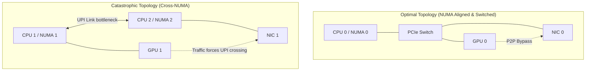

# Chapter 2 — PCIe, NUMA, and Host Data Paths

| Chapter metadata | Value |
|---|---|
| Volume | 07 — GPU Networking and Data Paths |
| Difficulty | Expert |
| Estimated reading time | 35 minutes |
| Primary audience | DevOps, SRE, Platform, Cloud and Infrastructure Engineers |
| Core question | Before data ever reaches the network cable, it must escape the motherboard. Where does it get stuck? |

## Introduction

An AI factory is only as fast as its slowest wire. 

Many infrastructure engineers focus entirely on the external network—the shiny 400G optical cables and the InfiniBand switches. However, before a packet can enter an optical cable, it must physically exit the GPU, traverse the server motherboard, and enter the Network Interface Card (NIC). 

This internal journey is paved with catastrophic bottlenecks. If you do not understand **PCIe Root Complexes, PCIe Switches, and NUMA Boundaries**, your 400G network will sit empty, starved by poor motherboard topology.

## 1. The PCIe Gen5 Bottleneck

The **Peripheral Component Interconnect Express (PCIe)** bus is the internal highway of a server. GPUs, NICs, and NVMe drives all plug into PCIe slots.

*   **Lanes:** PCIe devices use "lanes" to communicate. A top-tier GPU or NIC uses 16 lanes (x16).
*   **Generations:** PCIe Gen4 (common in Ampere A100 servers) provides roughly **32 GB/s** of bidirectional bandwidth. PCIe Gen5 (Hopper H100 servers) doubles this to roughly **64 GB/s**.

**The Mathematical Reality:**
An H100 GPU has internal memory bandwidth of 3,350 GB/s. 
When the H100 needs to push data out of the server, it hits the 64 GB/s PCIe Gen5 bottleneck. You are throttling a firehose through a drinking straw. 
If the motherboard design forces that data to take inefficient routes through the PCIe bus, the bottleneck becomes even tighter.

## 2. The CPU Root Complex vs. PCIe Switches

There are two primary ways an OEM can wire a motherboard. 

### Bad Design: Direct CPU Attachment
In a cheap server, the PCIe slots are wired directly into the CPU. This is called the **PCIe Root Complex**. 
If GPU 0 needs to send data to NIC 0:
1. Data leaves GPU 0 and travels up the PCIe bus to the CPU.
2. The CPU processes the memory transfer.
3. The CPU sends the data down another PCIe bus to NIC 0.

This clogs the CPU, consumes massive CPU memory bandwidth, and adds high latency.

### Good Design: PCIe Switches (PLX/Broadcom chips)
In a high-end AI server, the OEM solders **PCIe Switches** onto the motherboard between the CPU and the devices.
GPU 0 and NIC 0 plug into the same PCIe Switch. 
If GPU 0 needs to send data to NIC 0, it pushes the data into the switch, which bounces it instantly to the NIC. The data never reaches the CPU. This enables **Peer-to-Peer (P2P)** communication.

## 3. The Deadliest Bottleneck: NUMA Boundaries

Servers that hold 8 GPUs typically require two physical CPUs (e.g., dual Intel Xeon). 

When you have two CPUs, the system is split into **Non-Uniform Memory Access (NUMA)** domains. 
*   **NUMA Node 0:** CPU 0, half the system RAM, and the PCIe slots wired to CPU 0.
*   **NUMA Node 1:** CPU 1, half the system RAM, and the PCIe slots wired to CPU 1.

The two CPUs are connected by a physical wire on the motherboard (Intel calls this **UPI**; AMD calls it **xGMI**). 

### The Cross-NUMA Penalty
If GPU 0 is plugged into NUMA 0, but the Network Card (NIC) is plugged into NUMA 1, the data path is a disaster. 
1. GPU 0 sends data to CPU 0.
2. CPU 0 pushes the data across the slow UPI link to CPU 1.
3. CPU 1 pushes the data down to the NIC.

The UPI link is not designed for hundreds of gigabytes per second of AI tensor traffic. It will immediately saturate, dropping performance by 50% to 80%.

## Architectural Diagram: Internal Topology

## 4. Verifying Topology (`nvidia-smi topo -m`)

Senior SREs never trust documentation. They verify the physical wires using `nvidia-smi topo -m`.

*   **PIX / PXB:** The GPU and NIC share a PCIe switch. (Excellent. P2P is active).
*   **NODE:** The GPU and NIC are connected to the same CPU without a switch. (Okay, but data hits the CPU).
*   **SYS:** The GPU and NIC are on different CPUs. (Catastrophic. Cross-NUMA UPI boundary).

## Customer Scenario (Senior Level)

**The Situation:**
A Kubernetes cluster administrator reports that PyTorch distributed training jobs are inconsistently slow. "If the job runs on Node A, it's fast. If it runs on Node B, it takes twice as long. The nodes have identical hardware: dual CPUs, 4x GPUs, and 1x 400G NIC."

**The Senior Architect Response:**
"The hardware is identical, but the PCIe slot populations are not. We are dealing with a NUMA alignment violation. 

In a dual-CPU server with only one 400G NIC, the NIC is physically wired to either CPU 0 or CPU 1. Let's assume it is in the CPU 0 riser slot. 
When the Kubernetes scheduler assigns Pods, it is completely unaware of PCIe topology by default. 

On Node A, Kubernetes randomly assigned the PyTorch job to GPUs 0 and 1, which are physically wired to CPU 0. When they send network traffic, they use the local NIC, keeping the traffic inside NUMA 0. This is fast. 

On Node B, Kubernetes randomly assigned the PyTorch job to GPUs 2 and 3, which are physically wired to CPU 1. When these GPUs attempt to send network traffic, the data must traverse the Intel UPI link to reach the NIC attached to CPU 0. The UPI link bottlenecks, causing the 50% performance drop. 

To fix this cluster permanently, we must enable the **Kubernetes Topology Manager**. We configure the Kubelet with `--topology-manager-policy=single-numa-node`. This forces the Kubernetes scheduler to align the requested GPUs, CPUs, and Network Cards to the exact same physical NUMA boundary before allowing the Pod to start, ensuring deterministic hardware data paths."

## Interview Preparation

**Conceptual:** What is a NUMA boundary, and why is crossing it detrimental to AI performance? *(Hint: Non-Uniform Memory Access. Multi-socket servers have separate CPUs with separate PCIe lanes. Crossing from CPU 0 to CPU 1 requires traversing the UPI link, which is easily saturated by massive GPU data transfers, creating extreme latency).*

**Architecture:** Explain the difference between a GPU connected to a NIC via the `NODE` path versus the `PIX` path. *(Hint: NODE means they connect at the CPU root complex, forcing data to bounce through the CPU. PIX means they share a dedicated PCIe Switch, enabling direct Peer-to-Peer (P2P) hardware data transfers that bypass the CPU).*
