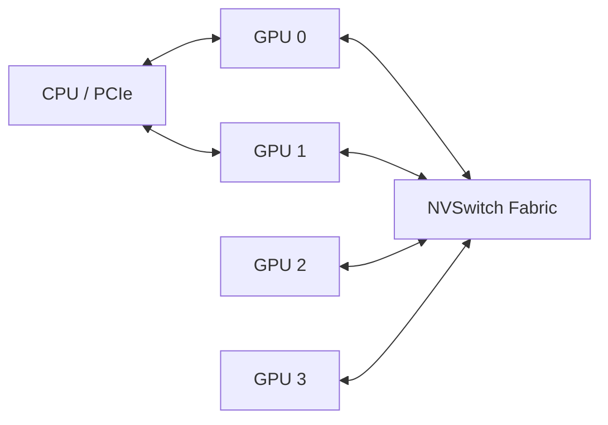

# NVLink and NVSwitch

PCIe is a general-purpose I/O fabric. It connects many device types and preserves broad compatibility, but large synchronized GPU workloads need more peer bandwidth and more predictable all-to-all communication than a host-oriented tree can always provide. NVLink was created to provide high-bandwidth point-to-point GPU communication. NVSwitch extends that idea into a switched scale-up fabric.

## Learning Objectives

You will be able to distinguish PCIe and NVLink roles, explain NVSwitch, reason about peer paths, and troubleshoot degraded scale-up communication.

## Architecture

**Figure 7.3.1 — Scale-up and host I/O are separate concerns.** NVLink/NVSwitch accelerates GPU peer communication while PCIe continues to serve host and external I/O paths.

## Why PCIe Alone Can Become Insufficient

Distributed training and large-model inference repeatedly exchange gradients, activations, parameters, or cache state. When peer traffic is forced through a constrained PCIe tree, communication can contend with network and storage I/O. Some paths may also require host staging.

NVLink provides direct high-bandwidth links between supported endpoints. The exact link count, signaling rate, and topology depend on the platform generation; architects should use the specific system documentation instead of transferring numbers from another product.

NVSwitch connects multiple NVLink endpoints through a switching layer. This can provide more uniform peer reachability and reduce the application’s dependence on a sparse point-to-point graph.

| Fabric | Primary role | Strength | Limitation |
|---|---|---|---|
| PCIe | General host and device I/O | Compatibility and broad ecosystem | Tree contention and lower peer bandwidth |
| Direct NVLink | GPU peer communication | Fast direct paths | Connectivity depends on link topology |
| NVSwitch fabric | Multi-GPU scale-up | High-bandwidth switched reachability | Platform-specific, power and integration cost |

## Software View

Applications generally reach the fabric through CUDA peer access, framework communication libraries, and NCCL collectives. A fast physical fabric is useful only when:

- peer access is enabled and supported;
- process-to-GPU binding matches topology;
- the collective library selects the intended path;
- links are healthy and negotiated correctly;
- workload communication is large enough to amortize launch overhead.

`nvidia-smi topo -m`, NVLink status telemetry, NCCL debug output, and collective benchmarks provide different evidence. No single command proves end-to-end performance.

## Production Architecture

Treat the scale-up fabric as a failure and maintenance domain. Monitor link health, error counters, firmware compatibility, thermals, and topology consistency across nodes. A cluster containing nominally identical systems can exhibit stragglers when one node has a degraded link or different firmware.

Scale-up does not remove the need for scale-out networking. Once work crosses a system boundary, NIC locality, RDMA, switch fabrics, and routing behavior become critical.

## Troubleshooting

**Symptoms:** poor all-reduce performance inside one node, asymmetric peer bandwidth, NCCL selecting unexpected paths, or a topology matrix showing a weaker connection than the platform design.

**Diagnosis:** capture topology, link state, error counters, firmware inventory, and a controlled peer-bandwidth benchmark. Compare against a known-good node of the same model.

**Root causes:** failed or disabled links, firmware mismatch, thermal or power constraints, incorrect process binding, unsupported peer access, or benchmark methodology that measures host staging instead of peer transfer.

**Resolution:** restore the validated firmware and hardware state, correct placement, rerun diagnostics, and verify both link telemetry and application-level collectives.

## Customer Scenario

A customer asks whether eight PCIe GPUs are equivalent to an eight-GPU NVSwitch system. The answer depends on workload communication. Independent inference replicas may not benefit materially from scale-up fabric. A tightly coupled model-parallel workload can depend on it. The architect must quantify peer traffic before recommending the more integrated platform.

## Interview Preparation

**Question:** Does NVLink replace PCIe?

No. NVLink accelerates supported peer paths. PCIe remains important for enumeration, host communication, NICs, storage, and other devices. A complete system uses multiple fabrics for different responsibilities.

## Key Takeaways

- NVLink addresses high-bandwidth peer communication.
- NVSwitch builds a switched scale-up domain.
- Physical fabric, software path selection, and placement must align.
- Scale-up and scale-out networking solve different problems.

## Cross References

- [PCIe and NUMA](./chapter-02-pcie-numa-and-host-data-paths)
- [Next: DMA, RDMA, and Peer-to-Peer](./chapter-04-dma-rdma-and-peer-to-peer)
