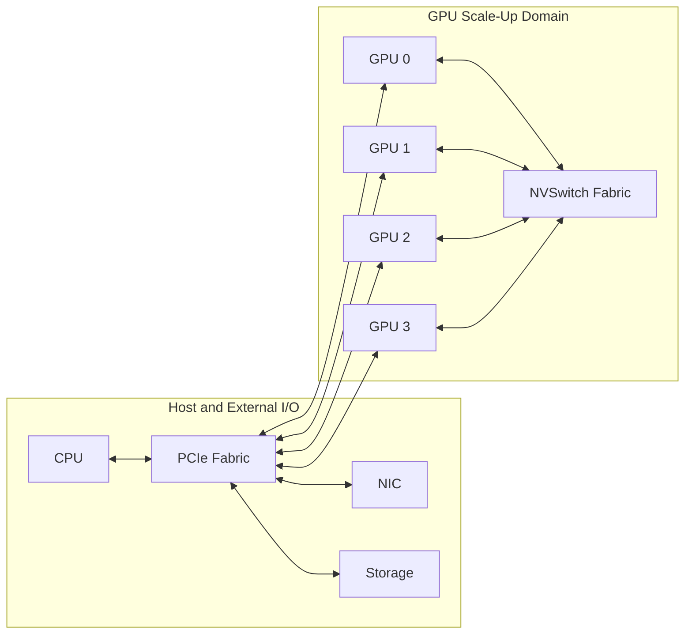
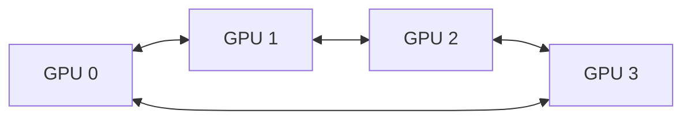
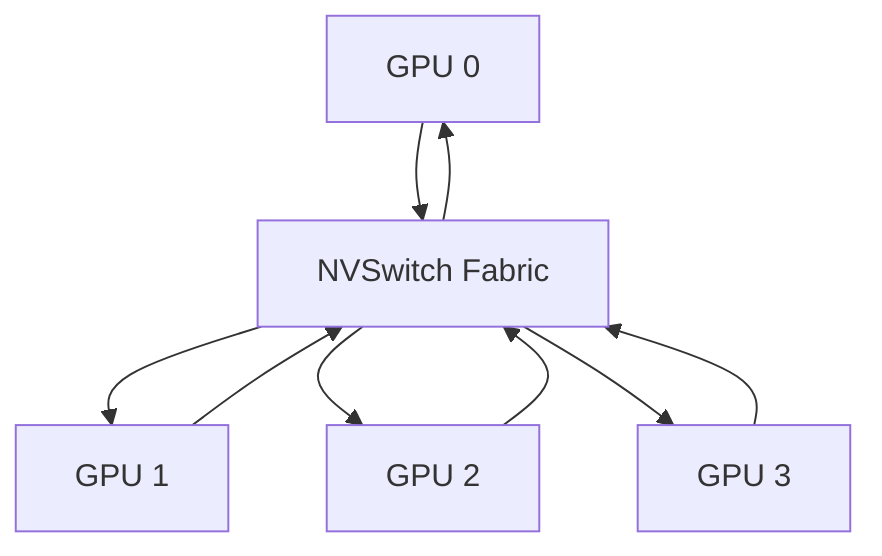
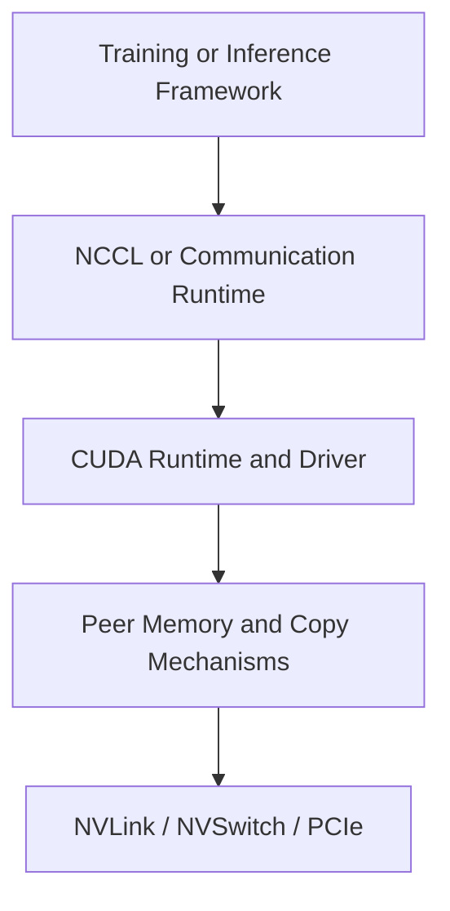
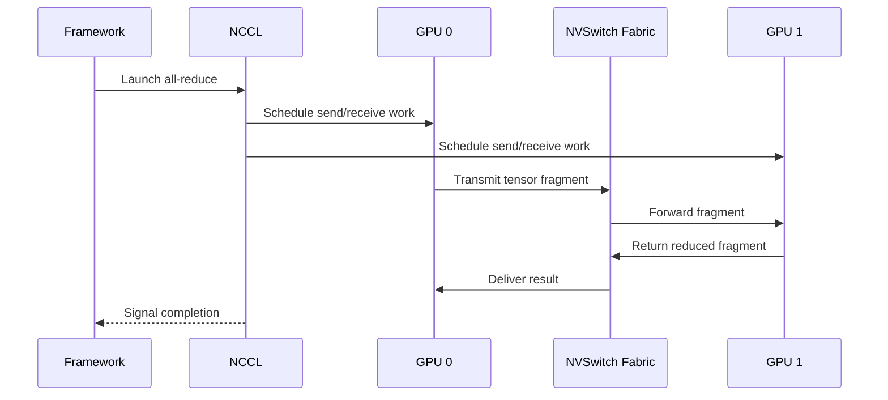

# NVLink and NVSwitch

## Introduction

PCI Express made accelerators practical by giving servers a common I/O fabric. It is flexible, widely supported, and essential for device discovery, host communication, storage, and network adapters. But tightly coupled GPU workloads ask a different question:

> How can several accelerators exchange large amounts of data repeatedly without forcing every peer interaction through a host-oriented I/O tree?

NVLink addresses that problem by providing high-bandwidth links for supported accelerator and processor endpoints. NVSwitch extends those links into a switched scale-up fabric so multiple GPUs can communicate through a more uniform local topology.

These technologies do not make communication free. They do not replace PCIe, eliminate synchronization, or guarantee application scaling. They change the available paths. Software, placement, collective algorithms, firmware, and workload behavior still determine whether those paths are used effectively.

| Chapter field | Value |
|---|---|
| Volume | 07 — GPU Networking |
| Difficulty | Advanced |
| Estimated reading time | 60–75 minutes |
| Primary focus | Intra-system GPU scale-up communication |
| Previous | PCIe, NUMA, and Host Data Paths |
| Next | DMA, RDMA, and Peer-to-Peer |

## Story: Eight GPUs, Two Very Different Systems

A customer compares two eight-GPU servers. Both expose the same accelerator model and memory capacity. One uses independent PCIe-attached GPUs. The other integrates the GPUs through an NVSwitch-based fabric.

The procurement team asks why the second platform costs more when the GPU count is identical.

The answer depends on the workload. Eight independent inference replicas may exchange little data and gain limited value from a dense scale-up fabric. A model-parallel workload may exchange activations on every layer boundary. A training job may perform collective reductions during every iteration. For those workloads, the communication architecture is part of the compute architecture.

The correct comparison is therefore not:

```text
8 GPUs versus 8 GPUs
```

It is:

```text
8 endpoints behind a general I/O hierarchy
versus
8 accelerators participating in a high-bandwidth scale-up domain
```

## Learning Objectives

After completing this chapter, you will be able to:

- explain why PCIe alone can limit communication-heavy workloads;
- distinguish NVLink from NVSwitch;
- describe direct-link and switched scale-up topologies;
- explain how CUDA and NCCL use available peer paths;
- identify workloads that benefit from scale-up fabrics;
- describe operational and failure-domain considerations;
- troubleshoot degraded or asymmetric peer communication;
- explain the customer trade-off between integrated scale-up and independent GPUs.

## Big Picture



**Figure 7.3.1 — Host I/O and scale-up communication coexist.** PCIe remains essential while NVLink and NVSwitch provide accelerator-oriented peer paths.

## Why PCIe Alone Can Become Insufficient

PCIe is a tree. Large peer flows may traverse switches, root complexes, and shared upstream links. The path is highly capable, but it is shared with host memory, NICs, and storage.

Communication-heavy AI workloads create several pressures:

- gradients must be reduced across GPUs;
- model partitions exchange activations;
- expert-parallel workloads route tokens between devices;
- inference shards synchronize intermediate state;
- peer copies compete with host and network I/O;
- synchronization amplifies the cost of a slow path.

A general I/O fabric is not necessarily the wrong design. It may be entirely appropriate for independent workloads. The problem appears when application performance depends on repeated, high-volume, low-latency peer exchange.

## What NVLink Is

NVLink is a high-bandwidth interconnect designed for supported NVIDIA GPU and processor communication. The exact endpoint support, link count, aggregate bandwidth, coherency behavior, and topology vary by product generation and platform.

The stable architectural idea is more important than any single generation number:

- create a stronger path between accelerator endpoints;
- reduce dependence on host-mediated peer traffic;
- support larger communication domains;
- expose the path to CUDA and communication libraries.

A direct-link topology may connect selected GPU pairs or groups. In such systems, not every pair is necessarily equivalent.



**Figure 7.3.2 — Simplified direct-link topology.** Software may need to account for which peers are directly connected and which require multi-hop or alternate paths.

## What NVSwitch Adds

NVSwitch provides a switching layer for NVLink-connected endpoints. Instead of relying only on a sparse graph of direct GPU-to-GPU links, endpoints connect into a switched fabric.

The architectural goal is to improve peer reachability and make more GPU pairs communicate through a strong scale-up path.



**Figure 7.3.3 — Simplified switched scale-up fabric.** The switch fabric creates a more uniform communication domain than a sparse direct-link graph.

A switched fabric introduces its own engineering concerns:

- switch silicon and firmware;
- fabric initialization;
- routing and partitioning behavior;
- telemetry and error handling;
- thermal and power requirements;
- platform-specific service procedures.

## PCIe, Direct NVLink, and NVSwitch

| Characteristic | PCIe | Direct NVLink | NVSwitch Fabric |
|---|---|---|---|
| Primary purpose | General host and device I/O | High-bandwidth peer links | Switched multi-GPU scale-up |
| Topology | Tree | Platform-specific graph | Switched domain |
| Host communication | Native role | Not a replacement for host I/O | Not a replacement for host I/O |
| Peer uniformity | Depends on PCIe hierarchy | Depends on direct links | Usually more uniform within the fabric |
| Operational complexity | Broadly understood | Platform-specific | Higher integration and validation burden |
| Best fit | Independent or moderately communicating devices | Strong peer neighborhoods | Tightly coupled multi-GPU workloads |

No row identifies a universal winner. The workload communication pattern determines whether scale-up fabric creates measurable value.

## Software View

Applications do not usually program raw fabric links. They interact through layers such as:



**Figure 7.3.4 — Software consumes the scale-up fabric through runtime and communication layers.** The fastest physical path is useful only when the stack selects and uses it correctly.

### CUDA peer access

CUDA can expose peer memory access between supported devices. The availability and quality of the path depend on the platform topology and software stack.

### NCCL path selection

NCCL discovers topology and constructs communication paths for collective operations. It may use direct peer links, shared memory, PCIe, or network transports depending on the environment.

NCCL debug output is valuable, but it must be interpreted alongside:

- `nvidia-smi topo -m`;
- link and switch telemetry;
- process-to-GPU binding;
- controlled collective benchmarks;
- known-good node baselines.

## Internal Working: A Collective on a Scale-Up Fabric

Consider a simplified all-reduce step:



**Figure 7.3.5 — Simplified collective step.** Fabric bandwidth matters, but ordering, synchronization, chunking, and algorithm selection also affect completion time.

The collective may use rings, trees, hierarchical methods, or other algorithms. The best method depends on message size, topology, number of participants, and software version.

## When Scale-Up Fabric Matters

Scale-up fabric is especially relevant when:

- a model does not fit on one GPU;
- tensor or pipeline parallel stages exchange data frequently;
- all-reduce occupies a large fraction of iteration time;
- the workload requires predictable peer latency;
- several GPUs share one large working set;
- intra-node communication must remain faster than scale-out communication.

It may provide limited value when:

- workloads are independent;
- each GPU serves separate requests;
- peer exchange is rare or small;
- the bottleneck is storage, CPU preprocessing, or network ingress;
- scheduler fragmentation prevents workloads from using the full scale-up group.

## Architecture Considerations

### Performance

Measure:

- peer bandwidth by GPU pair;
- collective bandwidth and latency;
- message-size sensitivity;
- simultaneous communication and compute;
- cross-node performance after local aggregation.

### Scalability

Scale-up improves the local communication domain but has a finite boundary. Beyond that boundary, scale-out networking becomes responsible. Distributed architectures often use hierarchical collectives that first communicate locally, then across nodes.

### Availability

A degraded link or switch can affect multiple GPUs. Define whether the platform:

- removes one link from service;
- degrades the entire local fabric;
- requires a node reboot;
- quarantines the system;
- exposes health through DCGM, BMC, or platform tooling.

### Reliability

Fabric errors may be intermittent and workload-dependent. A node can pass idle diagnostics but fail during sustained peer traffic. Commissioning should include load-based communication tests.

### Security and isolation

Peer access expands the importance of device isolation and memory protection. Multi-tenant platforms must understand which sharing modes preserve hardware isolation and which expose a shared execution or communication domain.

### Cost and operations

NVSwitch-based systems require more integrated hardware, power, cooling, firmware coordination, and support procedures. The value must be justified by workload communication, not by GPU count alone.

## Production Deployment

A production scale-up baseline should capture:

- GPU UUID and physical position;
- expected peer topology;
- link state and error counters;
- switch inventory and firmware;
- peer-access matrix;
- NCCL topology discovery;
- pairwise bandwidth;
- collective benchmark results;
- thermal and power state during load.

Use the exact platform documentation. Do not transfer topology assumptions or bandwidth numbers from another GPU generation or server model.

## Production Troubleshooting

### Scenario 1 — All-reduce is slow inside one node

**Symptoms**

- compute kernels are healthy;
- communication time dominates;
- multi-node networking is not involved;
- one node is slower than identical peers.

**Diagnosis**

1. Capture `nvidia-smi topo -m`.
2. Check link and switch health.
3. Run pairwise peer tests.
4. Run NCCL tests by message size.
5. Compare firmware and driver inventory.
6. Verify process binding.

**Root causes**

- degraded or disabled link;
- unexpected PCIe fallback;
- firmware mismatch;
- incorrect rank placement;
- thermal or power throttling;
- software path-selection issue.

**Resolution**

Restore the approved hardware and software state, validate the fabric, and rerun both microbenchmarks and the application.

### Scenario 2 — One GPU pair is slower than the others

**Symptoms**

- asymmetric pairwise bandwidth;
- topology matrix differs from the expected design;
- collectives become sensitive to rank order.

**Root cause**

The pair uses a weaker or multi-hop path, or a direct link is unavailable.

**Resolution**

Correct hardware or firmware issues, or adjust rank placement when the topology is intentionally asymmetric.

### Scenario 3 — NVLink is healthy, but the application does not improve

**Symptoms**

- fabric diagnostics pass;
- peer benchmark is strong;
- application scaling remains weak.

**Likely causes**

- workload has little peer communication;
- synchronization or imbalance dominates;
- communication is too small to amortize overhead;
- storage or CPU feeding limits the pipeline;
- application is not using the intended communication path.

**Production advice**

Do not assume a high-bandwidth fabric will improve an application that is not communication-bound.

## Customer Scenario

A customer wants to standardize on one eight-GPU node type for both independent inference and model-parallel training.

The architect presents two options:

1. a lower-cost design optimized for independent GPU use;
2. an integrated scale-up design optimized for tightly coupled workloads.

The decision is made from measured communication patterns:

- percentage of time in collectives;
- required model partitioning;
- peer message sizes;
- service-latency objectives;
- scheduler ability to allocate complete GPU groups;
- cost of idle scale-up capacity for independent workloads.

The final recommendation may use separate node pools. Standardization is valuable, but not when it forces every workload to pay for an interconnect it does not use.

## Interview Preparation

### Knowledge Questions

1. Why does NVLink exist when PCIe already connects GPUs?
2. What problem does NVSwitch solve beyond direct NVLink connections?
3. Does NVLink replace PCIe?
4. Why can a healthy NVLink fabric still produce poor application scaling?

### Architecture Questions

1. Compare an eight-GPU PCIe node with an eight-GPU NVSwitch node.
2. Draw a hierarchical collective using scale-up inside nodes and scale-out between nodes.
3. Explain the failure domain introduced by a switched scale-up fabric.

### Scenario Questions

1. One GPU pair has lower bandwidth than all others. What evidence do you collect?
2. NCCL appears to use PCIe instead of the expected peer path. What could cause this?
3. A customer runs independent inference replicas. How do you determine whether NVSwitch is worth the cost?

### Customer Questions

1. Why should a customer buy a scale-up platform?
2. When should they not buy one?
3. How would you prove the benefit before procurement?

### Whiteboard Question

Draw an eight-GPU node and show the roles of PCIe, NVLink, NVSwitch, NICs, and storage. Explain which fabric handles each traffic class.

## Summary

NVLink provides accelerator-oriented peer links. NVSwitch turns those links into a switched scale-up fabric. Together, they can reduce dependence on host-oriented PCIe paths for communication-heavy workloads.

They do not replace PCIe, eliminate synchronization, or guarantee scaling. Their value appears when the workload performs enough peer communication for the stronger local fabric to matter.

## Key Takeaways

- PCIe and NVLink solve different communication problems.
- NVSwitch creates a more uniform multi-GPU scale-up domain.
- Software topology discovery and placement must align with hardware.
- Scale-up fabric should be justified by workload communication.
- Commissioning must validate both telemetry and sustained collective behavior.

## Quick Revision Sheet

| Concept | Remember |
|---|---|
| NVLink | High-bandwidth supported endpoint interconnect |
| NVSwitch | Switching layer for a larger NVLink scale-up domain |
| Scale-up | Communication inside a tightly integrated system |
| Scale-out | Communication between systems or racks |
| Peer access | Software-visible ability to access peer memory |
| Collective | Coordinated communication among multiple ranks |

## Lab Checklist

Before moving on, confirm that you can:

- interpret `nvidia-smi topo -m`;
- describe the expected peer topology;
- compare pairwise and collective benchmarks;
- explain why a fabric can be healthy while an application is slow;
- identify when a PCIe-only design is sufficient.

## Cross References

- Previous: [PCIe, NUMA, and Host Data Paths](./chapter-02-pcie-numa-and-host-data-paths)
- Next: [DMA, RDMA, and Peer-to-Peer](./chapter-04-dma-rdma-and-peer-to-peer)
- Related hardware: [HGX Topology and Data Paths](../volume-06/chapter-04-hgx-topology-and-data-paths)
- Related lab: [Validate Peer Access and NVLink](./labs/lab-02-validate-peer-access-and-nvlink)

## Further Reading

Use the current NVIDIA documentation for the exact GPU and platform generation. Link counts, aggregate bandwidth, topology, switch design, and service procedures are platform-specific.