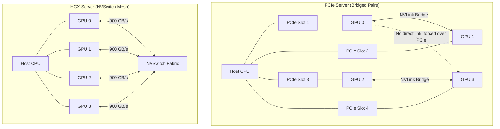

# Chapter 3 — NVLink and NVSwitch

| Chapter metadata | Value |
|---|---|
| Volume | 07 — GPU Networking and Data Paths |
| Difficulty | Advanced |
| Estimated reading time | 30 minutes |
| Primary audience | DevOps, SRE, Platform, Cloud and Infrastructure Engineers |
| Core question | If PCIe Gen5 is capped at 64 GB/s, how do 8 GPUs inside a single server synchronize a 70B parameter model at 900 GB/s? |

## Introduction

In Chapter 2, we learned that the PCIe Gen5 bus is a massive bottleneck (64 GB/s). While PCIe is fine for sending final results to a Network Card, it is fatally slow for intra-node GPU communication. 

During the training of a Large Language Model using Tensor Parallelism, GPU 0 and GPU 1 must exchange massive intermediate matrices thousands of times a second. If they attempt this over PCIe, the GPUs will stall immediately.

NVIDIA's solution to this physical limit is a proprietary, out-of-band communication fabric called **NVLink**. 

## 1. NVLink: The Point-to-Point Wire

**NVLink** is not a network protocol like Ethernet or TCP/IP. It is a direct, point-to-point physical wire connecting GPU silicon to GPU silicon. 

### The Generational Leap
*   **NVLink 1.0 (Pascal P100):** 160 GB/s bidirectional bandwidth per GPU.
*   **NVLink 2.0 (Volta V100):** 300 GB/s.
*   **NVLink 3.0 (Ampere A100):** 600 GB/s.
*   **NVLink 4.0 (Hopper H100):** 900 GB/s.
*   **NVLink 5.0 (Blackwell B200):** 1.8 TB/s.

When two GPUs are connected via NVLink, they can read each other's High-Bandwidth Memory (HBM) natively. To the software, accessing memory on a peer GPU over NVLink feels like an incredibly fast local memory access, utilizing **NVLink Memory Semantics** (Load/Store operations rather than complex network Send/Receive operations).

### The Physical Implementation (NVLink Bridges)
If you buy standard PCIe GPUs (like the PCIe H100 or RTX Ada), the motherboards do not support NVLink routing. You must buy an **NVLink Bridge**—a physical hardware clip that snaps onto the top edge of two adjacent PCIe GPUs, bridging them together. 

*Limitation:* Bridges only connect GPUs in pairs or very limited meshes. If GPU 0 needs to talk to GPU 3, but is only bridged to GPU 1, the data must bounce through the PCIe bus.

## 2. NVSwitch: The Non-Blocking Fabric

As servers expanded to 8 GPUs, using physical bridge clips became mathematically impossible. To fully connect 8 GPUs, you would need to route dozens of crossing cables over the top of the cards.

NVIDIA solved this by inventing the **NVSwitch**. 
An NVSwitch is an ASIC (Application-Specific Integrated Circuit) dedicated purely to routing NVLink traffic. 

### The HGX Baseboard Architecture
In an 8-GPU HGX H100 baseboard (the heart of the DGX), there are 4 NVSwitches soldered directly onto the PCB. 

*   Every H100 GPU has 18 NVLink connections.
*   The PCB traces route these 18 connections down into the 4 NVSwitches.
*   The NVSwitches create a **fully non-blocking, all-to-all mesh**.

**The Result:** GPU 0 can talk to GPU 7 at the exact same 900 GB/s speed that it can talk to GPU 1. There are no hops, no PCIe transfers, and no CPU involvement. The 8 GPUs effectively operate as a single, massive 640GB GPU.

## Architectural Diagram: PCIe vs NVSwitch

## 3. NVLink C2C (Chip-to-Chip)

With the introduction of the Grace CPU, NVLink expanded beyond GPU-to-GPU traffic. 
**NVLink-C2C** physically fuses the Grace ARM CPU and the Hopper GPU together, allowing 900 GB/s communication between the host processor and the accelerator. This allows the GPU to read massive data structures (like 500GB recommendation engine embedding tables) stored in the CPU's LPDDR5X RAM, effectively destroying the historical PCIe memory wall.

## Customer Scenario (Senior Level)

**The Situation:**
A research team purchased four top-of-the-line NVIDIA L40S PCIe GPUs and placed them in a standard server. They deployed a 70B parameter model using Tensor Parallelism across all four cards. They complain: "The L40S has excellent FP8 compute, but inference latency is wildly unacceptable. We must have misconfigured PyTorch."

**The Senior Architect Response:**
"PyTorch is configured correctly, but you have placed a multi-GPU synchronized workload onto an architecture that physically lacks a fast intra-node interconnect.

The NVIDIA L40S is an incredibly powerful PCIe inference card, but it fundamentally lacks NVLink connectors. It cannot use an NVLink Bridge, nor can it interface with an NVSwitch. 

Because you are using Tensor Parallelism to split the 70B model across four cards, the GPUs must synchronize their matrices over the motherboard's PCIe Gen4 bus. The PCIe bus provides roughly 32 GB/s to 64 GB/s of bandwidth, whereas Tensor Parallelism dictates hundreds of gigabytes per second of exchange. Your Tensor Cores are finishing their calculations instantly, and then sitting completely idle waiting for data to crawl across the PCIe bus.

To fix this, we must either redesign the architecture by using a smaller model that fits on a single L40S (eliminating the need for cross-GPU communication), or we must migrate this 70B model to an HGX H100 or H200 system where the NVSwitch fabric can handle the massive inter-GPU synchronization bandwidth at 900 GB/s."

## Interview Preparation

**Conceptual:** What is the primary difference in intra-node communication between a 4-GPU server using PCIe cards and an 8-GPU DGX system? *(Hint: PCIe cards must communicate over the slow PCIe bus or limited NVLink Bridges. A DGX system uses NVSwitches to create a fully non-blocking, high-speed mesh between all GPUs, completely bypassing the PCIe bottlenecks).*

**Architecture:** Why is NVLink necessary if the motherboard already has PCIe Gen5? *(Hint: Bandwidth magnitude. PCIe Gen5 maxes out at ~64 GB/s. Hopper NVLink 4.0 provides 900 GB/s per GPU. Distributing large models requires bandwidth that PCIe physically cannot provide).*
